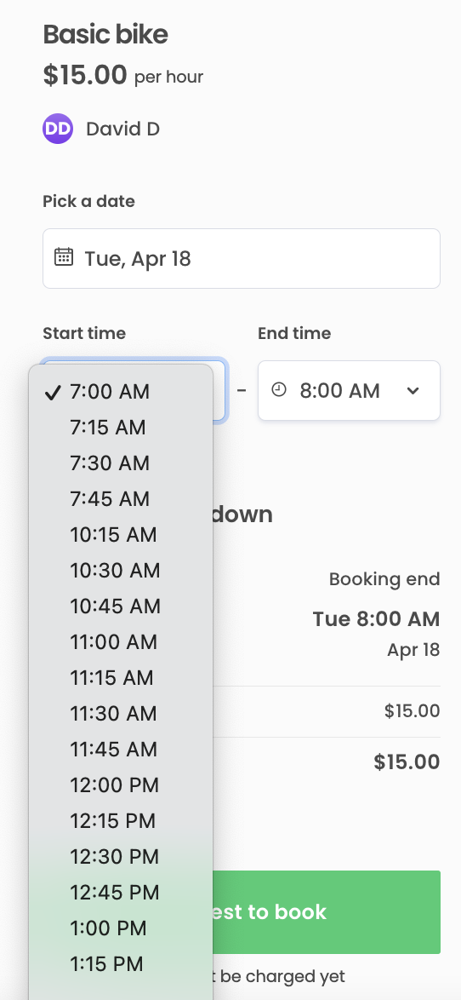

For some services booked by the hour, the provider may want to reserve a
buffer time between bookings. For instance a bike rental agency may want
to check their bikes between rentals, or a massage therapist may need to
clear up and restock their therapy space before the next customer
arrives. You can set your marketplace to add these kinds of buffers by
default, so providers do not need to add availability exceptions
manually.

## Add a 15 minute buffer between one hour bookings

The simplest use case for buffered bookings is having one hour slots
that are bookable at the top of the hour, and adding 15 minutes of
unbookable time after each slot. To achieve that, we will use the
booking's display time attribute.

First, we will add a helper function in _src/util/dates.js_ file to add
the correct buffer time.

```shell
└── src
    └── util
        └── dates.js
```

```diff
+ const bufferMinutes = 15;

+ export const addBuffer = (date) => moment(date).add(bufferMinutes, 'minutes').toDate();
```

### Add display end time handling

The user can select one hour booking slots on the listing page. When an
order gets initiated, we want to set the selected end time as the
display time, and a new buffered end time as the actual booking time.
This way, the booking extends over both the customer's booking time and
the buffer, so that other customers can not book over the buffer. We use
the newly created _addBuffer_ function to extend the display end time.

```shell
└── src
    └── containers
        └── CheckoutPage
            └── CheckoutPage.duck.js
```

```diff
+ import { addBuffer } from '../../util/dates';
 ...

export const initiateOrder = (orderParams, transactionId) => (dispatch, getState, sdk) => {
   dispatch(initiateOrderRequest());
 ...
  const quantityMaybe = quantity ? { stockReservationQuantity: quantity } : {};

- const bookingParamsMaybe = bookingDates || {};
+ let bookingParamsMaybe = {};
+
+ if (bookingDates) {
+   bookingParamsMaybe = {
+     ...bookingDates,
+     bookingEnd: addBuffer(bookingDates.bookingEnd),
+     bookingDisplayEnd: bookingDates.bookingEnd,
+     bookingDisplayStart: bookingDates.bookingStart,
+   }
+ }

  // Parameters only for client app's server
  const orderData = deliveryMethod ? { deliveryMethod } : {};
...
```

We also need to modify line item calculation. By default, the
transaction's price is calculated based on the booking's start and end
moments, however in this case we want to use the display end attribute
for the price calculation.

```shell
└── server
    └── api-util
        └── lineItems.js
```

We have already passed _displayEnd_ in _bookingData_, so we just need to
add handling for it in _lineItems.js_. Since the function is used both
with and without display end time, e.g. when calling
_api/transaction-line-items_, we need to accommodate both use cases.

The _lineItems.js_ file has a helper function for calculating hourly
booking quantity, so we can modify it directly.

```diff
const getHourQuantityAndLineItems = orderData => {
- const { bookingStart, bookingEnd } = orderData || {};
+ const { bookingStart, bookingEnd, bookingDisplayEnd } = orderData || {};
+ const end = bookingDisplayEnd ?? bookingEnd;
  const quantity =
-   bookingStart && bookingEnd ? calculateQuantityFromHours(bookingStart, bookingEnd) : null;
+   bookingStart && end ? calculateQuantityFromHours(bookingStart, end) : null;

  return { quantity, extraLineItems: [] };
};
```

### Set getStartHours to return correct available start times

Finally, we need to make sure that the start time slots only show valid
start times including the buffer – if someone has booked 6pm to 7pm,
then another customer cannot book 5pm to 6pm because there is not enough
availability for both the time slot and the buffer.

```shell
└── src
    └── util
        └── dates.js
```

First, add a constant for a full hour in addition to the buffer time.

```diff
  const bufferMinutes = 15;
+ const hourMinutes = 60;
```

Then, fix _getStartHours_ handling. By default, start hours and end
hours are determined from the same list, so _getStartHours_ removes the
final list item to allow for a single hour between the final start and
end times.

However, when the actual booking slot is longer than the displayed one,
we need to make sure that the interval between the final start and end
times can fit a buffered booking. Therefore, instead of removing a
single start time to fit a one hour booking slot, we remove as many
start times as it takes to fit a buffered hour before the final end
time.

```diff
export const getStartHours = (intl, timeZone, startTime, endTime) => {
  const hours = getSharpHours(intl, timeZone, startTime, endTime);
- return hours.length < 2 ? hours : hours.slice(0, -1);
+ const removeCount = Math.ceil((hourMinutes + bufferMinutes) / hourMinutes);
+ return hours.length < removeCount ? [] : hours.slice(0, -removeCount);
};
```

## Allow users to book buffered appointments at non-sharp hours

Having this kind of setup then means that the slots are, in practice,
bookable every two hours. If we do not want to leave extra gaps between
bookings beyond the buffer, we can set start times to repeat on the
buffer time cadence instead of hourly. That way, if someone books the 8
AM - 9 AM slot, the next available start time is 9.15 AM i.e. right
after the buffer.

In other words, we need to have start and end times at a different
cycle:

- start times at 15 minute increments i.e. a customer can start their
  booking at any quarter hour, instead of at the top of the hour only
- end times at one hour increments, i.e. the customer can book one or
  more full hours only.

Time slot handling is done using a few helper functions in
src/util/dates.js

```shell
└── src
    └── util
        └── dates.js
```

- _getStartHours_ and _getEndHours_ return a list of timepoints that are
  displayed as the booking's possible start and end moments,
  respectively. They both use the same helper function _getSharpHours_
- _getSharpHours_ retrieves the sharp hours that exist within the
  availability time slot. It uses the _findBookingUnitBoundaries_
  function.
- _findBookingUnitBoundaries_ is a recursive function that checks
  whether the current boundary (e.g. sharp hour) passed to it falls
  within the availability time slot.
  - If the current boundary is within the availability time slot, the
    function calls itself with the next boundary and cumulates the
    boundary results into an array.
  - If the current boundary does not fall within the availability time
    slot, the function returns the cumulated results from the previous
    iterations.
  - _findBookingUnitBoundaries_ takes a _nextBoundaryFn_ parameter that
    it uses to determine the next boundary value to pass to itself.
- the function passed as _nextBoundaryFn_ by default is
  _findNextBoundary_. The _findNextBoundary_ function increments the
  current boundary by a predefined value.

```js
export const findNextBoundary = (timeZone, currentMomentOrDate) =>
  moment(currentMomentOrDate)
    .clone()
    .tz(timeZone)
    .add(1, 'hour') // The default handling uses hours
    .startOf('hour') // By default, the time slot is rounded to the start of the hour
    .toDate();
```

In addition to _findBookingUnitBoundaries_, the template uses
_findNextBoundary_ to handle other time increment boundaries. That is
why, instead of modifying _findNextBoundary_ directly, we will create a
similar function called _findNextCustomBoundary_ to be used in
_findBookingUnitBoundaries_, so we do not need to worry about side
effects.

### Add a custom rounding function for moment.js

The template hourly listing handling uses the
[moment-timezone](https://momentjs.com/timezone/) library to modify
times and dates and convert them between the listing's time zone and the
user's time zone.

By default, the _findNextBoundary_ function uses
_moment.startOf('hour')_ to round the booking slots to the top of each
hour. For _findNextCustomBoundary_ – since we are now dealing with
minutes – we need to create a custom rounding function to replace the
_startOf('hour')_ function call. When we add it to _moment.js_ using the
prototype exposed through _moment.fn_, we can chain it in the same place
as the default _startOf('hour')_ function.

This rounding function rounds to sharp hours when the buffer minutes
value is a factor of an hour, e.g. 15, 20 or 30 minutes.

```js
/**
 * Rounding function for moment.js. Rounds the Moment provided by the context
 * to the start of the specified time value in the specified units.
 * @param {*} value the rounding value
 * @param {*} timeUnit time units to specify the value
 * @returns Moment rounded to the start of the specified time value
 */
moment.fn.startOfDuration = function(value, timeUnit) {
  const getMs = (val, unit) => moment.duration(val, unit)._milliseconds;
  const ms = getMs(value, timeUnit);

  // Get UTC offset to account for potential time zone difference between
  // customer and listing
  const offsetMs = this._isUTC ? 0 : getMs(this.utcOffset(), 'minute');
  return moment(Math.floor((this.valueOf() + offsetMs) / ms) * ms);
};
```

### Add a custom boundary function

We will create a new _findNextCustomBoundary_ function to replace the
default usage. We will use the new rounding function to replace the
built-in _startOf()_ function in our function.

We also need to calculate the increment of time to add to each time
boundary, i.e. how long are the stretches of time delineated by the
boundaries. To do that, we need an _isStart_ attribute, i.e. whether
we're dealing with start times or end times.

In addition we need an _isFirst_ attribute indicating whether the
boundary in question is the very first one in the list. Since we're
rounding to the buffer time (here: 15 minutes), we'll need to manually
set the first time slot to correspond to the start of the available time
slot.

```jsx
export const findNextCustomBoundary = (
  currentMomentOrDate,
  timeUnit,
  timeZone,
  isFirst,
  isStart
) => {
  // For end time slots (i.e. not start slots), add a full hour.
  // For the first start slot, use the actual start time.
  // For other start slots, use the buffer time.
  const increment = !isStart
    ? hourMinutes
    : isFirst
    ? 0
    : bufferMinutes;

  return moment(currentMomentOrDate)
    .clone()
    .tz(timeZone)
    .add(increment, timeUnit)
    .startOf(bufferMinutes, timeUnit)
    .toDate();
};
```

### Use new boundary function in helper functions

The default _findNextBoundary_ function is called from the
_findBookingUnitBoundaries_ function, so we need to replace it with the
_findNextCustomBoundary_ function and make sure the _isStart_ and
_isFirst_ parameters are passed correctly. The function gets
_findNextBoundary_ function as the _nextBoundaryFn_ parameter.

```diff
const findBookingUnitBoundaries = params => {
  const {
    cumulatedResults,
    currentBoundary,
    startMoment,
    endMoment,
    nextBoundaryFn,
    intl,
    timeZone,
+   isStart,
    timeUnit = 'hour',
  } = params;

  if (moment(currentBoundary).isBetween(startMoment, endMoment, null, '[]')) {
    const timeOfDay = formatDateIntoPartials(currentBoundary, intl, { timeZone })?.time;

+   // The nextBoundaryFn by definition cannot determine the first timepoint, since it
+   // is always based on a previous boundary, we pass 'false' as the 'isFirst' param
+   const isFirst = false;


    // Choose the previous (aka first) sharp hour boundary,
    // if daylight saving time (DST) creates the same time of day two times.
    const newBoundary =
      cumulatedResults &&
      cumulatedResults.length > 0 &&
      cumulatedResults.slice(-1)[0].timeOfDay === timeOfDay
        ? []
        : [
            {
              timestamp: currentBoundary.valueOf(),
              timeOfDay,
            },
          ];

    return findBookingUnitBoundaries({
      ...params,
      cumulatedResults: [...cumulatedResults, ...newBoundary],
-     currentBoundary: moment(nextBoundaryFn(currentBoundary, timeUnit, timeZone)),
+     currentBoundary: moment(nextBoundaryFn(currentBoundary, timeUnit, timeZone, isFirst, isStart)),
    });
  }
  return cumulatedResults;
};
```

The _findBookingUnitBoundaries_, in turn, is called from
_getSharpHours_. We need to use _findNextCustomBoundary_ for
_findBookingUnitBoundaries_, pass the _isStart_ and _isFirst_ parameters
with the first currentBoundary definition, as well as add the _isStart_
parameter to the _findBookingUnitBoundaries_ function call.

In addition, we need to use the actual start time instead of the one
millisecond before, which is used by default. This is necessary because
instead of adding an hour and rounding off an hour as in the default
implementation, we are now manually setting the start time to the
beginning of the available time slot.

```diff
- export const getSharpHours = (startTime, endTime, timeZone, intl) => {
+ export const getSharpHours = (startTime, endTime, timeZone, intl, isStart = false) => {
    if (!moment.tz.zone(timeZone)) {
      throw new Error(
        'Time zones are not loaded into moment-timezone. "getSharpHours" function uses time zones.'
      );
    }
+   const isFirst = true;
+
    // Select a moment before startTime to find next possible sharp hour.
    // I.e. startTime might be a sharp hour.
    const millisecondBeforeStartTime = new Date(startTime.getTime() - 1);
    return findBookingUnitBoundaries({
-     currentBoundary: findNextBoundary(millisecondBeforeStartTime, 'hour', timeZone),
+     currentBoundary: findNextCustomBoundary(startTime, 'minutes', timeZone, isFirst, isStart),
      startMoment: moment(startTime),
      endMoment: moment(endTime),
-     nextBoundaryFn: findNextBoundary,
+     nextBoundaryFn: findNextCustomBoundary,
      cumulatedResults: [],
      intl,
      timeZone,
-     timeUnit: 'hour',
+     isStart,
+     timeUnit: 'minutes',
    });
  };

```

### Fix getStartHours and getEndHours handling

To get correct start times, we need to first pass _true_ as the
_isStart_ parameter from _getStartHours_ to _getSharpHours_.

In addition, we again need to make sure that even when selecting the
last start time, there is enough availability for the first timeslot.
Since the first time slots are now set at the buffer minute interval, we
divide the full booking time by _bufferMinutes_ to get the correct
_removeCount_ value.

```diff
export const getStartHours = (intl, timeZone, startTime, endTime) => {
- const hours = getSharpHours(intl, timeZone, startTime, endTime);
- const removeCount = Math.ceil((hourMinutes + bufferMinutes) / hourMinutes)
+ const hours = getSharpHours(intl, timeZone, startTime, endTime, true);
+ const removeCount = Math.ceil((hourMinutes + bufferMinutes) / bufferMinutes)
  return hours.length < removeCount ? [] : hours.slice(0, -removeCount);
};
```

Finally, we can simplify the end hour handling. Since the first entry is
determined in the _findNextBoundary_ function, we do not need to remove
it. Instead, we can just return the full list from _getSharpHours_.

```diff
  export const getEndHours = (intl, timeZone, startTime, endTime) => {
-   const hours = getSharpHours(intl, timeZone, startTime, endTime);
-   return hours.length < 2 ? [] : hours.slice(1);
+   return getSharpHours(intl, timeZone, startTime, endTime);
  };
```

Now, if we have a booking from 9 AM to 10 AM with a 15 minute buffer at
the end, the next customer can start their booking at 10:15 AM.
Conversely, the previous booking can begin 7:45 AM and no later, so that
the buffered time slot can fit in before the already booked session.


