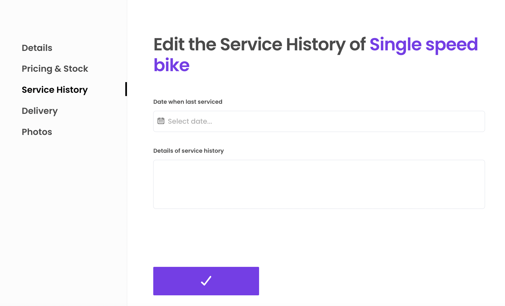
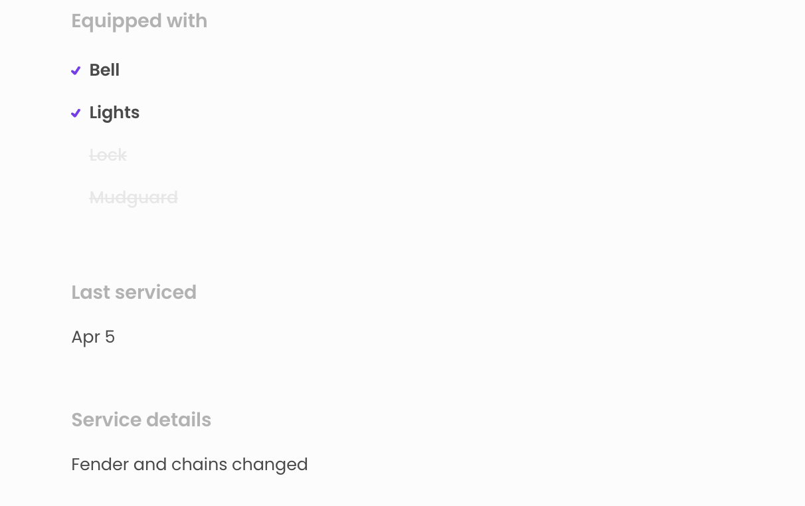

This guide shows you two different approaches to expanding the listing
data model in your marketplace. We'll have a look on how the listing can
be configured so that the data gets added, and how it can then be
presented and used to filter searches. In addition, you will learn how
to add complex JSON attributes directly in the Edit Listing Wizard.

Adding new attributes to the data model relies on
[extended data](/references/extended-data/). In Sharetribe Web Template,
top-level listing extended data is configured in the
[configListing.js](https://github.com/sharetribe/web-template/blob/main/src/config/configListing.js)
file.

```shell
└── src
    └── config
        └── configListing.js
```

<info>

Settings configured in local configurations files are overridden by any
fetched via the Asset Delivery API. You can refer to
[this article](/template/hosted-and-local-configurations/) to modify the
way your template merges local and hosted configurations.

</info>

Configuring the listing data this way allows you to

- declare the attribute and its possible values
- show the attribute selection inputs in the listing editing wizard
- optionally show the attribute values on the listing page and
- optionally use the attribute as a search filter.

If you want to configure a complex extended data attribute, e.g. a JSON
object, it is good to note that Sharetribe only allows searching and
filtering top-level attributes. In other words, complex attributes
cannot be used to filter listings. However, they can be useful in
storing other relevant listing data.

For a more complex attribute, you will need to follow the instructions
for adding extended data directly to a listing. You will also need to
make custom changes to your listing page, if you want to show the
attribute there.

In this article, we will first extend top-level data using
**configListing.js**. Then, we will add a JSON attribute in extended
data.

## Add a new top-level attribute

Let's extend the default bike related listing data by adding an
attribute 'accessories' to show what accessories are included. The full
configuration looks like this:

```js
  {
    key: 'accessories',
    scope: 'public',
    schemaType: 'multi-enum',
    enumOptions: [
      { option: 'bell', label: 'Bell' },
      { option: 'lights', label: 'Lights' },
      { option: 'lock', label: 'Lock' },
      { option: 'mudguard', label: 'Mudguard' },
    ],
    saveConfig: {
      label: 'Accessories',
      placeholderMessage: 'Select an option…',
      isRequired: false,
    },
    filterConfig: {
      indexForSearch: true,
      label: 'Accessories',
      searchMode: 'has_any',
      group: 'secondary',
    },
    showConfig: {
      label: 'Accessories',
    },
  },
```

### Declaring the attribute and its possible values

Extended data attributes in the _configListing.js_ file need to be
defined, at minimum, by **key**, by **scope**, and by **schemaType**.

```js
key: 'accessories',
scope: 'public',
schemaType: 'multi-enum',
enumOptions: [
  { option: 'bell', label: 'Bell' },
  { option: 'lights', label: 'Lights' },
  { option: 'lock', label: 'Lock' },
  { option: 'mudguard', label: 'Mudguard' },
],
// If you have multiple listing types, you can define the types that should have this field
// limitToListingTypeIds: [...],
```

This attribute is defined as **public**, so it will be saved into the
listing as **publicData.accessories**. The **schemaType** attribute
determines the shape of the data being saved:

- **enum** attributes are saved as a single string value from a list of
  predefined options
- **multi-enum** attributes are saved as an array of string values from
  a list of predefined options
- **boolean** attributes are saved as **true** or **false** boolean
  values
- **long** attributes are saved as long i.e. as an 8-byte whole number
- **text** attributes are saved as a single text entry

If the schema type is **enum** or **multi-enum**, you will need to
define an array of **enumOptions** for the attribute. This allows the
listing editing wizard to show the options when your user creates the
listing, and it also provides the options for the search filters.

If your marketplace uses multiple listing types, you can optionally
define an attribute **limitToListingTypeIds**. This attribute is an
array of the listing types that should have this field. If this
attribute is not set, then the field is included in all listing types.

<info>

Note that if you limit a listing field to specific listing types, the
filters for that field will only show up on the search page if the
listing type in question is selected as a filtering parameter. If you
want a filter to always show up on the search page, don't limit it to
listing types.

</info>

### Configuring the listing detail editing page

The _EditListingDetailsPanel_ is configured to show specific inputs for
specific schema types. This means that you only need to configure how
the attribute shows up in the panel.

You can separately determine the label for edit listing page and the
other contexts where the attribute shows up. You can also set the
attribute as required, and determine the error message to show if the
attribute is missing.

```js
saveConfig: {
  label: 'Accessories',
  placeholderMessage: 'Select an option…',
  isRequired: false,
},
```

### Configuring search

Top-level attributes can be set as searchable, but you might have
listing attributes you do not want to use for filtering listings. For
instance, you may have private data text fields that the provider can
use for listing-specific notes.

For searchable attributes, you will need to include the **filterConfig**
attribute to your listing configuration. In addition, you will need to
[define a search schema](/how-to/manage-search-schemas-with-sharetribe-cli/).
Make sure you define the search schema **type** according to the listing
configuration **schemaType**.

For multi-enum attributes, you can use **searchMode** to define whether
you want to show

- listings with all the query attributes (_has_all_), or
- listings with any of the query attributes(_has_any_).

If searchMode is not defined, or if you define a listing field in
Console, the default is _has_all_. To define a multi-enum listing field
with _has_any_ search logic, you will need to define the field in your
local code.

```js
filterConfig: {
  indexForSearch: true,
  label: 'Accessories',
  searchMode: 'has_any',
  group: 'secondary',
},
```

### Configuring the listing page

The configuration for showing top-level extended data on the listing
page is straightforward. In addition to the label, you can determine
whether to show specific attribute values on the listing page.

By default, all listing config attributes with a **showConfig.label**
are shown on the listing page, but by setting **isDetail** to **false**
on an attribute with schema type _enum_, _long_, or _boolean_, you can
hide the attribute from the Details section on the listing page.

```js
showConfig: {
  label: 'Accessories',
},
```

And that is it! With this configuration, the attribute can be added to
the listing, used for search, and shown on the listing page. Next, we
will add a complex JSON attribute that is not used for filtering.

## Add a new complex attribute

You may want to add more complex attributes as well. We will add an
attribute **lastServiced**, which will be included in a listing selling
the bike, and it will include the date of the last service of the bike
as well as a description of what was serviced.

<extrainfo title="Marketplace texts used in this guide">

You can paste the marketplace text strings used in this guide in your
Sharetribe Console, under Build > Content > Marketplace texts, or your
translation file.

```js
  "EditListingServiceHistoryForm.lastServiced": "Date when last serviced",
  "EditListingServiceHistoryForm.serviceDetails": "Details of service history",
  "EditListingServiceHistoryPanel.createListingTitle": "Service History",
  "EditListingServiceHistoryPanel.title": "Edit the Service History of {listingTitle}",
  "EditListingWizard.default-buying-products.new.savePricingAndStock": "Next: Service History",
  "EditListingWizard.default-buying-products.new.saveServiceHistory": "Next: Delivery",
  "EditListingWizard.edit.saveServiceHistory": "Save",
  "EditListingWizard.tabLabelServiceHistory": "Service History",
  "FieldDateInput.placeholder": "Select date...",
  "SectionServiceHistoryMaybe.lastServicedHeading": "Last serviced",
  "SectionServiceHistoryMaybe.serviceDetailsHeading": "Service details",
```

</extrainfo>

### Edit the listing wizard

The first step is to add means for modifying the attribute data in
listings. This is achieved by adding proper inputs to the
**EditListingWizard**. It could probably make sense to add the input to
the _details_ tab to also include service history, but for the sake of
clarity let's add a new tab to the wizard.

First lets declare the tab in **EditListingWizardTab**:

```shell
└── src
    └── containers
        └── EditListingPage
            └── EditListingWizard
                └── EditListingWizardTab.js
```

The new tab will be placed between the _pricing-and-stock_ and
_delivery_ tabs.

```js
export const DETAILS = 'details';
export const PRICING = 'pricing';
export const PRICING_AND_STOCK = 'pricing-and-stock';
export const SERVICE_HISTORY = 'service-history';
export const DELIVERY = 'delivery';
export const LOCATION = 'location';
export const AVAILABILITY = 'availability';
export const PHOTOS = 'photos';

// EditListingWizardTab component supports these tabs
export const SUPPORTED_TABS = [
  DETAILS,
  PRICING,
  PRICING_AND_STOCK,
  SERVICE_HISTORY,
  DELIVERY,
  LOCATION,
  AVAILABILITY,
  PHOTOS,
];
```

Now in **EditListingWizard** we can take that tab declaration into use.
_Import_ the tab name variable (_SERVICE_HISTORY_) from
**EditListingWizardTab** and add it to the `TABS_PRODUCT` array.

```js
// You can reorder these panels.
// Note 1: You need to change save button translations for new listing flow
// Note 2: Ensure that draft listing is created after the first panel
// and listing publishing happens after last panel.
const TABS_DETAILS_ONLY = [DETAILS];
const TABS_PRODUCT = [
  DETAILS,
  PRICING_AND_STOCK,
  SERVICE_HISTORY,
  DELIVERY,
  PHOTOS,
];
const TABS_BOOKING = [DETAILS, LOCATION, PRICING, AVAILABILITY, PHOTOS];
const TABS_ALL = [...TABS_PRODUCT, ...TABS_BOOKING];
```

Also remember to add a label for the tab in the `tabLabelAndSubmit`
function:

```js
const tabLabelAndSubmit = (
  intl,
  tab,
  isNewListingFlow,
  processName
) => {
  const processNameString = isNewListingFlow ? `${processName}.` : '';
  const newOrEdit = isNewListingFlow ? 'new' : 'edit';

  let labelKey = null;
  let submitButtonKey = null;
  if (tab === DETAILS) {
    labelKey = 'EditListingWizard.tabLabelDetails';
    submitButtonKey = `EditListingWizard.${processNameString}${newOrEdit}.saveDetails`;
  } else if (tab === PRICING) {
    labelKey = 'EditListingWizard.tabLabelPricing';
    submitButtonKey = `EditListingWizard.${processNameString}${newOrEdit}.savePricing`;
  } else if (tab === PRICING_AND_STOCK) {
    labelKey = 'EditListingWizard.tabLabelPricingAndStock';
    submitButtonKey = `EditListingWizard.${processNameString}${newOrEdit}.savePricingAndStock`;
  } else if (tab === SERVICE_HISTORY) {
    labelKey = 'EditListingWizard.tabLabelServiceHistory';
    submitButtonKey = `EditListingWizard.${processNameString}${newOrEdit}.saveServiceHistory`;
  } else if (tab === DELIVERY) {
    labelKey = 'EditListingWizard.tabLabelDelivery';
    submitButtonKey = `EditListingWizard.${processNameString}${newOrEdit}.saveDelivery`;
  } else if (tab === LOCATION) {
    labelKey = 'EditListingWizard.tabLabelLocation';
    submitButtonKey = `EditListingWizard.${processNameString}${newOrEdit}.saveLocation`;
  } else if (tab === AVAILABILITY) {
    labelKey = 'EditListingWizard.tabLabelAvailability';
    submitButtonKey = `EditListingWizard.${processNameString}${newOrEdit}.saveAvailability`;
  } else if (tab === PHOTOS) {
    labelKey = 'EditListingWizard.tabLabelPhotos';
    submitButtonKey = `EditListingWizard.${processNameString}${newOrEdit}.savePhotos`;
  }

  return {
    label: intl.formatMessage({ id: labelKey }),
    submitButton: intl.formatMessage({ id: submitButtonKey }),
  };
};
```

The `tabCompleted` function keeps track of which data the user has
already provided in order to tell which tabs are completed. As we will
be storing the service history information in the listing's _public
data_ property (see the [Extended data](/references/extended-data/)
reference for more info on different extended data types) we shall look
into that property when resolving whether the capacity tab has already
been completed or not:

```js
/**
 * Check if a wizard tab is completed.
 *
 * @param tab wizard's tab
 * @param listing is contains some specific data if tab is completed
 *
 * @return true if tab / step is completed.
 */
const tabCompleted = (tab, listing, config) => {
  const {
    availabilityPlan,
    description,
    geolocation,
    price,
    title,
    publicData,
    privateData,
  } = listing.attributes;
  const images = listing.images;

  const {
    transactionType,
    transactionProcessAlias,
    unitType,
    serviceHistory,
    shippingEnabled,
    pickupEnabled,
  } = publicData || {};

  const deliveryOptionPicked =
    publicData && (shippingEnabled || pickupEnabled);

  switch (tab) {
    case DETAILS:
      return !!(
        description &&
        title &&
        transactionType &&
        transactionProcessAlias &&
        unitType &&
        hasValidCustomFieldsInExtendedData(
          publicData,
          privateData,
          config
        )
      );
    case PRICING:
      return !!price;
    case PRICING_AND_STOCK:
      return !!price;
    case SERVICE_HISTORY:
      return !!serviceHistory;
    case DELIVERY:
      return !!deliveryOptionPicked;
    case LOCATION:
      return !!(geolocation && publicData?.location?.address);
    case AVAILABILITY:
      return !!availabilityPlan;
    case PHOTOS:
      return images && images.length > 0;
    default:
      return false;
  }
};
```

Next task is to add form and panel components that render the service
history tab. As for the form, let's create a
**EditListingServiceHistoryForm** component:

```shell
└── src
    └── containers
        └── EditListingPage
            └── EditListingWizard
                ├── EditListingWizardTab.js
                └── EditListingServiceHistoryPanel
                    ├── EditListingServiceHistoryForm.js
                    └── EditListingServiceHistoryForm.module.css
```

```jsx
import React from 'react';
import { bool, func, string } from 'prop-types';
import { compose } from 'redux';
import { Form as FinalForm } from 'react-final-form';
import classNames from 'classnames';
import { futureIsOutsideRange } from '../../../../util/dates';

// These relative imports need to point to correct directories
import {
  intlShape,
  injectIntl,
  FormattedMessage,
} from '../../../../util/reactIntl';
import {
  Form,
  Button,
  FieldTextInput,
  FieldDateInput,
} from '../../../../components';

// Create this file using EditListingPricingForm.module.css
// as a template.
import css from './EditListingServiceHistoryForm.module.css';

export const EditListingServiceHistoryFormComponent = props => (
  <FinalForm
    {...props}
    render={formRenderProps => {
      const {
        className,
        disabled,
        handleSubmit,
        intl,
        invalid,
        pristine,
        saveActionMsg,
        updated,
        updateError,
        updateInProgress,
      } = formRenderProps;

      const errorMessage = updateError ? (
        <p className={css.error}>
          <FormattedMessage id="EditListingServiceHistoryForm.updateFailed" />
        </p>
      ) : null;

      const classes = classNames(css.root, className);
      const submitReady = updated && pristine;
      const submitInProgress = updateInProgress;
      const submitDisabled = invalid || disabled || submitInProgress;

      return (
        <Form className={classes} onSubmit={handleSubmit}>
          {errorMessage}
          <FieldDateInput
            className={css.input}
            id="lastServiced"
            name="lastServiced"
            label={intl.formatMessage({
              id: 'EditListingServiceHistoryForm.lastServiced',
            })}
            isOutsideRange={futureIsOutsideRange}
          />

          <FieldTextInput
            className={css.input}
            id="serviceDetails"
            name="serviceDetails"
            type="textarea"
            label={intl.formatMessage({
              id: 'EditListingServiceHistoryForm.serviceDetails',
            })}
          />

          <Button
            className={css.submitButton}
            type="submit"
            inProgress={submitInProgress}
            disabled={submitDisabled}
            ready={submitReady}
          >
            {saveActionMsg}
          </Button>
        </Form>
      );
    }}
  />
);

export default compose(injectIntl)(
  EditListingServiceHistoryFormComponent
);
```

The form uses the **FieldDateInput** component, where we want to allow
the user to select past dates, unlike for bookings. To do that, we need
to create a custom **isOutsideRange** function. Let's add it to the
**dates.js** util file that contains a selection of other date helpers
as well.

```shell
└── src
    └── util
        └── dates.js
```

The helper uses a **react-dates** function to block days that are not
the current day or before it.

```js
import { isInclusivelyBeforeDay } from 'react-dates';
...
/**
 * Determines a custom isOutsideRange function for FieldDateInput
 * that shows past dates
 */
export const futureIsOutsideRange = day => {
  return !isInclusivelyBeforeDay(day, moment());
}
```

To use the service history editing form we'll add a panel component
which is then used in **EditListingWizardTab** to render correct step of
the wizard. This component we'll call
**EditListingServiceHistoryPanel**:

```shell
└── src
    └── containers
        └── EditListingPage
            └── EditListingWizard
                ├── EditListingWizardTab.js
                └── EditListingServiceHistoryPanel
                    ├── EditListingServiceHistoryPanel.js
                    └── EditListingServiceHistoryPanel.module.css
```

```jsx
import React from 'react';
import classNames from 'classnames';

// Import configs and util modules
import { FormattedMessage } from '../../../../util/reactIntl';
import { LISTING_STATE_DRAFT } from '../../../../util/types';

// Import shared components
import { ListingLink } from '../../../../components';

// Import modules from this directory
import EditListingServiceHistoryForm from './EditListingServiceHistoryForm';

// Create this file using EditListingLocationPanel.module.css
// as a template.
import css from './EditListingServiceHistoryPanel.module.css';

const getInitialValues = props => {
  const { serviceHistory } =
    props.listing?.attributes?.publicData || {};
  const { lastServiced, serviceDetails } = serviceHistory || {};

  return {
    lastServiced: {
      date: (lastServiced && new Date(lastServiced)) || null,
    },
    serviceDetails,
  };
};

const EditListingServiceHistoryPanel = props => {
  const {
    className,
    rootClassName,
    listing,
    disabled,
    ready,
    onSubmit,
    submitButtonText,
    panelUpdated,
    updateInProgress,
    errors,
  } = props;

  const classes = classNames(rootClassName || css.root, className);
  const isPublished =
    listing?.id && listing?.attributes.state !== LISTING_STATE_DRAFT;
  const initialValues = getInitialValues(props);

  return (
    <div className={classes}>
      <h1 className={css.title}>
        {isPublished ? (
          <FormattedMessage
            id="EditListingServiceHistoryPanel.title"
            values={{ listingTitle: <ListingLink listing={listing} /> }}
          />
        ) : (
          <FormattedMessage id="EditListingServiceHistoryPanel.createListingTitle" />
        )}
      </h1>
      <EditListingServiceHistoryForm
        className={css.form}
        initialValues={initialValues}
        onSubmit={values => {
          const { lastServiced, serviceDetails } = values;

          const updateValues = {
            publicData: {
              serviceHistory: {
                lastServiced: lastServiced?.date?.toJSON() || null,
                serviceDetails,
              },
            },
          };

          onSubmit(updateValues);
        }}
        saveActionMsg={submitButtonText}
        disabled={disabled}
        ready={ready}
        updated={panelUpdated}
        updateInProgress={updateInProgress}
        fetchErrors={errors}
        autoFocus
      />
    </div>
  );
};

export default EditListingServiceHistoryPanel;
```

In the panel component, we check for an initial service history value
from the `publicData` property of the listing. In the submit handler,
the new service history value is stored in the same property. The
updated listing object is eventually passed to the `updateListingDraft`
and `requestUpdateListing` functions in the _EditListingPage.duck.js_
file where the data updates are handled.

The FieldDateInput handles an object with a **date** property but
Sharetribe can only save valid JSON values to extended data, so we also
need to add conversions between string and Date to the initial values
builder and submit handler.

Now that we have the panel and the form all ready we can add the panel
to the **EditListingWizardTab** component. This is done by importing
**EditListingServiceHistoryPanel** in the **_EditListingWizardTab.js_**:

```diff
// Import modules from this directory
  import EditListingAvailabilityPanel from './EditListingAvailabilityPanel/EditListingAvailabilityPanel';
import EditListingDetailsPanel from './EditListingDetailsPanel/EditListingDetailsPanel';
import EditListingDeliveryPanel from './EditListingDeliveryPanel/EditListingDeliveryPanel';
  import EditListingLocationPanel from './EditListingLocationPanel/EditListingLocationPanel';
import EditListingPhotosPanel from './EditListingPhotosPanel/EditListingPhotosPanel';
import EditListingPricingPanel from './EditListingPricingPanel/EditListingPricingPanel';
  import EditListingPricingAndStockPanel from './EditListingPricingAndStockPanel/EditListingPricingAndStockPanel';
+ import EditListingServiceHistoryPanel from './EditListingServiceHistoryPanel/EditListingServiceHistoryPanel';

```

and adding a new block to the `switch` structure that handles rendering
the correct panel:

```jsx
case SERVICE_HISTORY: {
  return (
    <EditListingServiceHistoryPanel
      {...panelProps(SERVICE_HISTORY)}
    />
  );
}
```

There! Now we've extended the listing data model with service history
information.



The capacity data can now be added to new and existing listings. The
next chapter describes how that data can be presented in the listing
page.

### Show the attribute on listing page

Next step in adding a new attribute to the listing is to present it in
the listing page. On some cases an extension to the listing data model
can be used purely to enhance the application logic but in our case with
the capacity information we want to show the added attribute in the
listing page for potential customers.

To show the capacity attribute in the listing page, let's create a
specific component for it and place it in the **ListingPage** container.
Desired outcome could also be achieved just by editing the
**ListingPage** but extracting the capacity UI parts into a separate
component will simplify the **ListingPage** and make possible upstream
updates from the Sharetribe web template repo easier as there's less
chances for merge conflicts. So, let's create a
**SectionServiceHistory** component in the _src/containers/ListingPage/_
directory:

```shell
└── src
    └── containers
        └── ListingPage
            ├── SectionServiceHistory.js
            ├── ListingPageCarousel.js
            └── ListingPage.module.css
```

```jsx
import React from 'react';
import SectionTextMaybe from './SectionTextMaybe';

import css from './ListingPage.module.css';
import { formatDateIntoPartials } from '../../util/dates';

const SectionServiceHistoryMaybe = props => {
  const { intl, publicData } = props;
  const { lastServiced, serviceDetails } =
    publicData?.serviceHistory || {};
  if (!lastServiced && !serviceDetails) {
    return null;
  }

  const formattedServiceDate = formatDateIntoPartials(
    new Date(lastServiced),
    intl
  );

  return (
    <div className={css.sectionServiceHistory}>
      <SectionTextMaybe
        heading={intl.formatMessage({
          id: 'SectionServiceHistoryMaybe.lastServicedHeading',
        })}
        text={formattedServiceDate.date}
      />
      <SectionTextMaybe
        heading={intl.formatMessage({
          id: 'SectionServiceHistoryMaybe.serviceDetailsHeading',
        })}
        text={serviceDetails}
      />
    </div>
  );
};

export default SectionServiceHistoryMaybe;
```

Remember to add corresponding css definitions to
_ListingPage.module.css_ to get the styling right. Import the component
into **ListingPage** and place it inside the
`<div className={css.mainContent}>` element:

```js
import SectionServiceHistoryMaybe from './SectionServiceHistoryMaybe';
```

In the render function, you will then show the

```jsx
<div className={css.mainContent}>
  {/* other sections */}

  <SectionServiceHistoryMaybe publicData={publicData} intl={intl} />
  {/* other sections */}
</div>
```

And voilà, we have listing service history presented in the listing
page!



<info>

If there are existing listings, they don't get an update before their
extended data is updated by a provider. (Operator can also do this
one-by-one through Console or through Integration API.) So, you should
assume that there are listings without these new extended data fields
and, therefore, there should be some safeguards against undefined
values.

</info>
