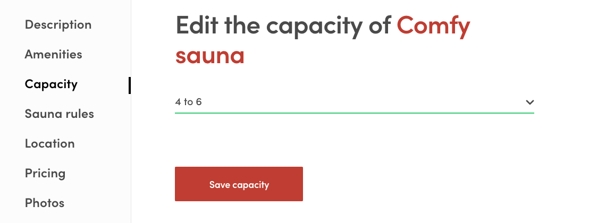
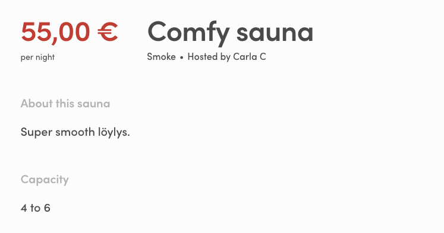

This guide walks you through the different steps required to expand the
listing data model in your marketplace. We'll have a look on how the
data is added, how it can be presented and finally how it can be used to
filter searches.

Adding new attributes to the data model relies on
[Extended data](/references/extended-data/).

Three main areas in extending the listing data model are:

- [Declare the attribute and it's possible values](#declare-the-attribute-and-its-possible-values)
- [Edit the listing wizard](#edit-the-listing-wizard)
- [Show the attribute on listing page](#show-the-attribute-on-listing-page)
- [Use the attribute as a search filter](#use-the-attribute-as-a-search-filter)

In this guide we will extend the listing data model by adding a
_capacity_ attribute.

## Add a new attribute

### Declare the attribute and its possible values

So, you have come up with a great new extension to the listing data
model, fantastic! Depending of the type of data the new attribute is
going to be used for it might make sense to define and store the
possible values for the attribute. In case the data will be free form
text there might not be use for this but in our case we want to fix the
possible values that can be used for the capacity. Also if the attribute
will be used as a search filter it helps to keep track of the possible
values somewhere.

If you want to use extended data field as a filter on search page, you
need to store the possible values for the field to
[marketplace-custom-config.js](https://github.com/sharetribe/flex-template-web/blob/master/src/marketplace-custom-config.js)
file.

```shell
└── src
    └── marketplace-custom-config.js
```

<extrainfo title="FTW-product has moved config files into a different location">

```shell
└── src
    └── config
        └── marketplace-custom-config.js
```

</extrainfo>

There we need to create a new filter config to the `filters` array:

```js
  {
    id: 'capacity',
    label: 'Capacity',
    type: 'SelectSingleFilter',
    group: 'secondary',
    queryParamNames: ['pub_capacity'],
    config: {
      // Schema type is enum for SelectSingleFilter
      schemaType: 'enum',
      options: [
        { key: '1to3', label: '1 to 3' },
        { key: '4to6', label: '4 to 6' },
        { key: '7to9', label: '7 to 9' },
        { key: '10plus', label: '10 plus' },
      ],
    },
  },
```

The exports from that file are included in the _config.js_ file and are
available as properties in `config.custom`. Search filters and some
components used to edit and present the data rely on a data model of an
array of objects that contain `key` and `label` properties.

In the configuration above, we'll define a set of values that describe
the capacity in a few ranges of how many people can fit into a given
sauna:

```js
  { key: '1to3', label: '1 to 3' },
  { key: '4to6', label: '4 to 6' },
  { key: '7to9', label: '7 to 9' },
  { key: '10plus', label: '10 plus' },
```

That list of options is relevant when we add a new public data field to
the listing through the EditListingWizard component. If you want to know
more about those other keys in that configuration (e.g. `type`, `group`,
`queryParamNames`), you should read the
[Change search filters](/cookbook-search/change-search-filters-in-ftw/)
article.

> **Note**: it's entirely possible to add extended data without creating
> search filters for it. In that case, you could just hard-code
> configurations to the EditListingWizard's form or use
> marketplace-custom-config.js with separately exported variable.

### Edit the listing wizard

Next step is to add means for modifying the attribute data in listings.
This is achieved by adding proper inputs to the **EditListingWizard**.
It could probably make sense to add the input to the _description_ tab
or modify the _amenities_ tab to also include capacity but for the sake
of clarity let's add a new tab to the wizard. The new tab will be placed
between the _amenities_ and _policy_ tabs.

First lets declare the tab in **EditListingWizardTab**:

```shell
└── src
    └── components
        └── EditListingWizard
            └── EditListingWizardTab.js
```

<extrainfo title="FTW-product has moved EditListingWizard components under EditListingPage">

```shell
└── src
    └── containers
        └── EditListingPage
            └── EditListingWizard
                └── EditListingWizardTab.js
```

</extrainfo>

```js
export const AVAILABILITY = 'availability';
export const DESCRIPTION = 'description';
export const FEATURES = 'features';
export const CAPACITY = 'capacity';
export const POLICY = 'policy';
export const LOCATION = 'location';
export const PRICING = 'pricing';
export const PHOTOS = 'photos';

// EditListingWizardTab component supports these tabs
export const SUPPORTED_TABS = [
  DESCRIPTION,
  FEATURES,
  CAPACITY,
  POLICY,
  LOCATION,
  PRICING,
  AVAILABILITY,
  PHOTOS,
];
```

<extrainfo title="FTW-product has a bit different panels in EditListingWizard">

```js
export const CAPACITY = 'capacity';
export const DETAILS = 'details';
export const DELIVERY = 'delivery';
export const PRICING = 'pricing';
export const PHOTOS = 'photos';

// EditListingWizardTab component supports these tabs
export const SUPPORTED_TABS = [
  CAPACITY,
  DETAILS,
  DELIVERY,
  PRICING,
  PHOTOS,
];
```

</extrainfo>

Now in **EditListingWizard** we can take that tab declaration into use.
_Import_ the tab name variable (_CAPACITY_) from
**EditListingWizardTab** and add it to the `TABS` array.

```js
// in EditListingWizard.js
export const TABS = [
  DESCRIPTION,
  FEATURES,
  CAPACITY,
  POLICY,
  LOCATION,
  PRICING,
  ...availabilityMaybe,
  PHOTOS,
];
```

Also remember to add a label for the tab in the `tabLabel` function:

```js
const tabLabel = (intl, tab) => {
  let key = null;
  if (tab === DESCRIPTION) {
    key = 'EditListingWizard.tabLabelDescription';
  } else if (tab === FEATURES) {
    key = 'EditListingWizard.tabLabelFeatures';
  } else if (tab === CAPACITY) {
    key = 'EditListingWizard.tabLabelCapacity';
  } else if (tab === POLICY) {
    key = 'EditListingWizard.tabLabelPolicy';
  } else if (tab === LOCATION) {
    key = 'EditListingWizard.tabLabelLocation';
  } else if (tab === PRICING) {
    key = 'EditListingWizard.tabLabelPricing';
  } else if (tab === AVAILABILITY) {
    key = 'EditListingWizard.tabLabelAvailability';
  } else if (tab === PHOTOS) {
    key = 'EditListingWizard.tabLabelPhotos';
  }

  return intl.formatMessage({ id: key });
};
```

The `tabCompleted` function keeps track of which data the user has
already provided in order to tell which tabs are completed. As we will
be storing the capacity information in the listing's _public data_
property (see the [Extended data](/references/extended-data/) reference
for more info on different extended data types) we shall look into that
property when resolving whether the capacity tab has already been
completed or not:

```js
/**
 * Check if a wizard tab is completed.
 *
 * @param tab wizard's tab
 * @param listing is contains some specific data if tab is completed
 *
 * @return true if tab / step is completed.
 */
const tabCompleted = (tab, listing) => {
  const {
    availabilityPlan,
    description,
    geolocation,
    price,
    title,
    publicData,
  } = listing.attributes;
  const images = listing.images;

  switch (tab) {
    case DESCRIPTION:
      return !!(description && title);
    case FEATURES:
      return !!(publicData && publicData.amenities);
    case CAPACITY:
      return !!(publicData && publicData.capacity);
    case POLICY:
      return !!(publicData && typeof publicData.rules !== 'undefined');
    case LOCATION:
      return !!(
        geolocation &&
        publicData &&
        publicData.location &&
        publicData.location.address
      );
    case PRICING:
      return !!price;
    case AVAILABILITY:
      return !!availabilityPlan;
    case PHOTOS:
      return images && images.length > 0;
    default:
      return false;
  }
};
```

Next task is to add form and panel components that render the capacity
tab. As for the form, let's create a **EditListingCapacityForm**
component:

```shell
└── src
    └── forms
        ├── index.js
        └── EditListingCapacityForm
            ├── EditListingCapacityForm.js
            └── EditListingCapacityForm.module.css
```

<extrainfo title="FTW-product has moved EditListingWizard components under EditListingPage">

```shell
└── src
    └── containers
        └── EditListingPage
            └── EditListingWizard
                ├── EditListingWizardTab.js
                └── EditListingCapacityPanel
                    ├── EditListingCapacityForm.js
                    └── EditListingCapacityForm.module.css
```

Also relative _imports_ need to be updated accordingly.

</extrainfo>

```jsx
import React from 'react';
import { arrayOf, bool, func, shape, string } from 'prop-types';
import { compose } from 'redux';
import { Form as FinalForm } from 'react-final-form';
import classNames from 'classnames';

// These relative imports need to point to correct directories
import {
  intlShape,
  injectIntl,
  FormattedMessage,
} from '../../util/reactIntl';
import { propTypes } from '../../util/types';
import { required } from '../../util/validators';
import { Form, Button, FieldSelect } from '../../components';

// Create this file using EditListingFeaturesForm.module.css
// as a template.
import css from './EditListingCapacityForm.module.css';

export const EditListingCapacityFormComponent = props => (
  <FinalForm
    {...props}
    render={formRenderProps => {
      const {
        className,
        disabled,
        handleSubmit,
        intl,
        invalid,
        pristine,
        saveActionMsg,
        updated,
        updateError,
        updateInProgress,
        capacityOptions,
      } = formRenderProps;

      const capacityPlaceholder = intl.formatMessage({
        id: 'EditListingCapacityForm.capacityPlaceholder',
      });

      const errorMessage = updateError ? (
        <p className={css.error}>
          <FormattedMessage id="EditListingCapacityForm.updateFailed" />
        </p>
      ) : null;

      const capacityRequired = required(
        intl.formatMessage({
          id: 'EditListingCapacityForm.capacityRequired',
        })
      );

      const classes = classNames(css.root, className);
      const submitReady = updated && pristine;
      const submitInProgress = updateInProgress;
      const submitDisabled = invalid || disabled || submitInProgress;

      return (
        <Form className={classes} onSubmit={handleSubmit}>
          {errorMessage}

          <FieldSelect
            className={css.capacity}
            name="capacity"
            id="capacity"
            validate={capacityRequired}
          >
            <option value="">{capacityPlaceholder}</option>
            {capacityOptions.map(c => (
              <option key={c.key} value={c.key}>
                {c.label}
              </option>
            ))}
          </FieldSelect>

          <Button
            className={css.submitButton}
            type="submit"
            inProgress={submitInProgress}
            disabled={submitDisabled}
            ready={submitReady}
          >
            {saveActionMsg}
          </Button>
        </Form>
      );
    }}
  />
);

EditListingCapacityFormComponent.defaultProps = {
  selectedPlace: null,
  updateError: null,
};

EditListingCapacityFormComponent.propTypes = {
  intl: intlShape.isRequired,
  onSubmit: func.isRequired,
  saveActionMsg: string.isRequired,
  updated: bool.isRequired,
  updateError: propTypes.error,
  updateInProgress: bool.isRequired,
  capacityOptions: arrayOf(
    shape({
      key: string.isRequired,
      label: string.isRequired,
    })
  ).isRequired,
};

export default compose(injectIntl)(EditListingCapacityFormComponent);
```

The form component receives `capacityOptions` as a prop which are used
to populate a **FieldSelect** component for selecting the capacity. The
**EditListingCapacityForm** is also added to the _src/forms/index.js_
file so that it can easily be referenced from other components.
(FTW-product doesn't use _src/forms/index.js_) To use the capacity
editing form we'll add a panel component which is then used in
**EditListingWizardTab** to render the wizard phase. This component
we'll call **EditListingCapacityPanel**:

```shell
└── src
    └── components
        ├── index.js
        └── EditListingCapacityPanel
            ├── EditListingCapacityPanel.js
            └── EditListingCapacityPanel.module.css
```

<extrainfo title="FTW-product has moved EditListingWizard components under EditListingPage">

```shell
└── src
    └── containers
        └── EditListingPage
            └── EditListingWizard
                ├── EditListingWizardTab.js
                └── EditListingCapacityPanel
                    ├── EditListingCapacityPanel.js
                    └── EditListingCapacityPanel.module.css
```

</extrainfo>

```jsx
import React from 'react';
import PropTypes from 'prop-types';
import classNames from 'classnames';

import config from '../../config.js';
import { FormattedMessage } from '../../util/reactIntl';
import { ensureOwnListing } from '../../util/data';
import { findOptionsForSelectFilter } from '../../util/search';

import { ListingLink } from '../../components';
import { EditListingCapacityForm } from '../../forms';

// Create this file using EditListingDescriptionPanel.module.css
// as a template.
import css from './EditListingCapacityPanel.module.css';

const EditListingCapacityPanel = props => {
  const {
    className,
    rootClassName,
    listing,
    onSubmit,
    onChange,
    submitButtonText,
    panelUpdated,
    updateInProgress,
    errors,
  } = props;

  const classes = classNames(rootClassName || css.root, className);
  const currentListing = ensureOwnListing(listing);
  const { publicData } = currentListing.attributes;

  const panelTitle = currentListing.id ? (
    <FormattedMessage
      id="EditListingCapacityPanel.title"
      values={{ listingTitle: <ListingLink listing={listing} /> }}
    />
  ) : (
    <FormattedMessage id="EditListingCapacityPanel.createListingTitle" />
  );
  const capacityOptions = findOptionsForSelectFilter(
    'amenities',
    config.custom.filters
  );

  return (
    <div className={classes}>
      <h1 className={css.title}>{panelTitle}</h1>
      <EditListingCapacityForm
        className={css.form}
        initialValues={{ capacity: publicData.capacity }}
        onSubmit={values => {
          const { capacity } = values;
          const updateValues = {
            publicData: {
              capacity,
            },
          };
          onSubmit(updateValues);
        }}
        onChange={onChange}
        saveActionMsg={submitButtonText}
        updated={panelUpdated}
        updateError={errors.updateListingError}
        updateInProgress={updateInProgress}
        capacityOptions={capacityOptions}
      />
    </div>
  );
};

const { func, object, string, bool } = PropTypes;

EditListingCapacityPanel.defaultProps = {
  className: null,
  rootClassName: null,
  listing: null,
};

EditListingCapacityPanel.propTypes = {
  className: string,
  rootClassName: string,

  // We cannot use propTypes.listing since the listing might be a draft.
  listing: object,

  onSubmit: func.isRequired,
  onChange: func.isRequired,
  submitButtonText: string.isRequired,
  panelUpdated: bool.isRequired,
  updateInProgress: bool.isRequired,
  errors: object.isRequired,
};

export default EditListingCapacityPanel;
```

<extrainfo title="FTW-product would need few modifications">

Relative imports are deeper and **EditListingCapacityForm** is in the
same directory.

```jsx
import React from 'react';
import PropTypes from 'prop-types';
import classNames from 'classnames';

import config from '../../../../config.js';
import { FormattedMessage } from '../../../../util/reactIntl';
import { ensureOwnListing } from '../../../../util/data';
import { findOptionsForSelectFilter } from '../../../../util/search';

import { ListingLink } from '../../../../components';

import EditListingCapacityForm from './EditListingCapacityForm';

// Create this file using EditListingDescriptionPanel.module.css
// as a template.
import css from './EditListingCapacityPanel.module.css';

const EditListingCapacityPanel = props => {
  const {
    className,
    rootClassName,
    listing,
    onSubmit,
    onChange,
    submitButtonText,
    panelUpdated,
    updateInProgress,
    errors,
  } = props;

  const classes = classNames(rootClassName || css.root, className);
  const currentListing = ensureOwnListing(listing);
  const { publicData } = currentListing.attributes;

  const panelTitle = currentListing.id ? (
    <FormattedMessage
      id="EditListingCapacityPanel.title"
      values={{ listingTitle: <ListingLink listing={listing} /> }}
    />
  ) : (
    <FormattedMessage id="EditListingCapacityPanel.createListingTitle" />
  );
  const capacityOptions = findOptionsForSelectFilter(
    'amenities',
    config.custom.filters
  );

  return (
    <div className={classes}>
      <h1 className={css.title}>{panelTitle}</h1>
      <EditListingCapacityForm
        className={css.form}
        initialValues={{ capacity: publicData.capacity }}
        onSubmit={values => {
          const { capacity } = values;
          const updateValues = {
            publicData: {
              capacity,
            },
          };
          onSubmit(updateValues);
        }}
        onChange={onChange}
        saveActionMsg={submitButtonText}
        updated={panelUpdated}
        updateError={errors.updateListingError}
        updateInProgress={updateInProgress}
        capacityOptions={capacityOptions}
      />
    </div>
  );
};

const { func, object, string, bool } = PropTypes;

EditListingCapacityPanel.defaultProps = {
  className: null,
  rootClassName: null,
  listing: null,
};

EditListingCapacityPanel.propTypes = {
  className: string,
  rootClassName: string,

  // We cannot use propTypes.listing since the listing might be a draft.
  listing: object,

  onSubmit: func.isRequired,
  onChange: func.isRequired,
  submitButtonText: string.isRequired,
  panelUpdated: bool.isRequired,
  updateInProgress: bool.isRequired,
  errors: object.isRequired,
};

export default EditListingCapacityPanel;
```

</extrainfo>

In the panel component, we check for an initial capacity value from the
`publicData` property of the listing. In the submit handler, the new
capacity value is stored in the same property. The updated listing
object is eventually passed to the `updateListingDraft` and
`requestUpdateListing` functions in the _EditListingPage.duck.js_ file
where the data updates are handled. In FTW-daily and FTW-hourly
templates, **EditListingCapacityPanel** needs to be exported from
_src/components/index.js_ for easier access from other files.

Now that we have the panel and the form all ready we can add the panel
to the **EditListingWizardTab** component. This is done by importing
**EditListingCapacityPanel** in the **_EditListingWizardTab.js_**:

```diff
import {
  EditListingAvailabilityPanel,
+  EditListingCapacityPanel,
  EditListingDescriptionPanel,
  EditListingFeaturesPanel,
  EditListingLocationPanel,
  EditListingPhotosPanel,
  EditListingPoliciesPanel,
  EditListingPricingPanel,
} from '../../components';
```

<extrainfo title="FTW-product would import the panels a bit differently">

```diff
// Import modules from this directory
+ import EditListingCapacityPanel from './EditListingCapacityPanel/EditListingCapacityPanel';
import EditListingDetailsPanel from './EditListingDetailsPanel/EditListingDetailsPanel';
import EditListingDeliveryPanel from './EditListingDeliveryPanel/EditListingDeliveryPanel';
import EditListingPhotosPanel from './EditListingPhotosPanel/EditListingPhotosPanel';
import EditListingPricingPanel from './EditListingPricingPanel/EditListingPricingPanel';
```

</extrainfo>

and adding a new block to the `switch` structure that handles rendering
the correct panel:

```jsx
case CAPACITY: {
  const submitButtonTranslationKey = isNewListingFlow
    ? 'EditListingWizard.saveNewCapacity'
    : 'EditListingWizard.saveEditCapacity';
  return (
    <EditListingCapacityPanel
      {...panelProps(CAPACITY)}
      submitButtonText={intl.formatMessage({ id: submitButtonTranslationKey })}
      onSubmit={values => {
        onCompleteEditListingWizardTab(tab, values);
      }}
    />
  );
}
```

There! Now we've extended the listing data model with capacity
information.



The capacity data can now be added to new and existing listings. Next
chapter describes how that data can be presented in the listing page.

## Show the attribute on listing page

Next step in adding a new attribute to the listing is to present it in
the listing page. On some cases an extension to the listing data model
can be used purely to enhance the application logic but in our case with
the capacity information we want to show the added attribute in the
listing page for potential customers.

To show the capacity attribute in the listing page, let's create a
specific component for it and place it in the **ListingPage** container.
Desired outcome could also be achieved just by editing the
**ListingPage** but extracting the capacity UI parts into a separate
component will simplify the **ListingPage** and make possible upstream
updates from the Flex web template repo easier as there's less chances
for merge conflicts. So, let's create a **SectionCapacity** component in
the _src/containers/ListingPage/_ directory:

```shell
└── src
    └── containers
        └── ListingPage
            ├── SectionCapacity.js
            ├── ListingPage.js
            └── ListingPage.module.css
```

```jsx
import React from 'react';
import { array, shape, string } from 'prop-types';
import { FormattedMessage } from 'react-intl';

import css from './ListingPage.module.css';

const SectionCapacity = props => {
  const { publicData, options } = props;

  const capacity = publicData.capacity;
  const capacityOption = options.find(
    option => option.key === capacity
  );

  return capacityOption ? (
    <div className={css.sectionCapacity}>
      <h2 className={css.capacityTitle}>
        <FormattedMessage id="ListingPage.capacityTitle" />
      </h2>
      <p className={css.capacity}>{capacityOption.label}</p>
    </div>
  ) : null;
};

SectionCapacity.propTypes = {
  options: array.isRequired,
  publicData: shape({
    capacity: string,
  }).isRequired,
};

export default SectionCapacity;
```

Remember to add corresponding css definitions to
_ListingPage.module.css_ to get the styling right. Import the component
into **ListingPage** and place it inside the
`<div className={css.mainContent}>` element:

```js
import SectionCapacity from './SectionCapacity';
```

In the render function, you need to retrieve capacity options:

```js
const capacityOptions = findOptionsForSelectFilter(
  'capacity',
  filterConfig
);
```

and use those to render the actual `SectionCapacity` component:

```jsx
<div className={css.mainContent}>
  {/* other sections */}

  <SectionCapacity publicData={publicData} options={capacityOptions} />

  {/* other sections */}
</div>
```

And voilà, we have listing capacity presented in the listing page!

<extrainfo title="Where did the filterConfig come from?">

In the snippet above, the filterConfig (containing capacity options too)
are passed to the **ListingPage** as a property, with the default
property value pulling the options from the custom config
(_marketplace-custom-config.js_). This way the listing page test can
define it's own filter configuration that are in line with test data
used in the test and custom config changes will not affect test results.

</extrainfo>



> **Note**: if there are existing listings, they don't get an update
> before their extended data is updated by a provider. (Operator can
> also do this one-by-one through Console or through Integration API.)
> So, you should assume that there are listings without these new
> extended data fields and, therefore, there should be some safeguards
> against undefined values.

## Use the attribute as a search filter

To see how the capacity attribute can be used to filter search results,
please refer to the
[Change search filters in FTW](/cookbook-search/change-search-filters-in-ftw/)
cookbook.
