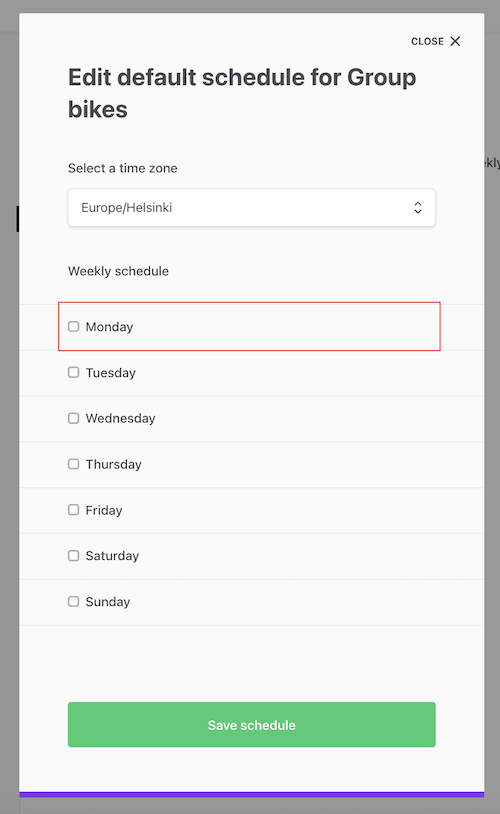

On our imaginary bike rental marketplace, some providers may have
several similar bikes to rent. Instead of needing to create separate
listings for each similar bike, we can add “seats” to a single listing.
This makes it possible for customers to book several similar bikes in
one go for the same time period.

In this guide, you will

- Update edit listing availability panel to create listings with
  multiple seats
  - Add seats handling to default availability form
  - Add seats handling to availability exceptions
- Book listings with multiple seats
  - Update booking panel for seat selection
    - Show input
    - Determine correct number of seat options to show
  - Update booking breakdown to show seat line items correctly
  - Add seats handling to line item calculation

<info>

This guide deals mainly with adding seats for **daily bookings**. Where
the hourly booking implementation differs, you will find collapsible
sections describing how and where to make the relevant changes.

</info>

## Update EditListingAvailabilityPanel to add seats to listings

Seats are a feature of a bookable listing’s availability plan. By
default, all listings are created with availability plans featuring one
seat.

To enable booking listings with multiple seats, we need to add the
ability to create listings whose availability plan contains more than
one seat. We will make these changes in EditListingAvailabilityPanel:

- For enabling seats in the default plan, we will update
  _AvailabilityPlanEntries.js_, which is a subcomponent used in
  _EditListingAvailabilityPlanForm.js_
- For managing seats in availability exceptions, we will update
  _EditListingAvailabilityExceptionForm.js_
- For saving both those changes, we will update in
  _EditListingAvailabilityPanel.js_
- For showing those changes, we will update in _WeeklyCalendar.js_

```shell
└── src
    └── containers
        └── EditListingPage
            └── EditListingWizard
                └── EditListingAvailabilityPanel
                    ├── EditListingAvailabilityExceptionForm
                    │ 	└── EditListingAvailabilityExceptionForm.js
                    │ 	└── EditListingAvailabilityExceptionForm.module.css
                    ├── EditListingAvailabilityPlanForm
                    │ 	└── AvailabilityPlanEntries.js
                    ├── WeeklyCalendar
                    │ 	└── WeeklyCalendar.js
                    └── EditListingAvailabilityPanel.js
```

### Add seats handling to default availability plan

_AvailabilityPlanEntries_ is a component that, in the
_EditListingAvailabilityPlanForm_, represents a single day’s
availability.

```shell
└── src
    └── containers
        └── EditListingPage
            └── EditListingWizard
                └── EditListingAvailabilityPanel
                    └── EditListingAvailabilityPlanForm
                        └── AvailabilityPlanEntries.js
```



The _AvailabilityPlanEntries_ component handles

- day and night availability (i.e. no time ranges)
- and hourly availability (which does have time ranges).

In this guide, we are using **day-based listings**.

#### Show seats input in AvailabilityPlanEntries

We will need to import _FieldTextInput_ from _src/components_, so let's
add it to the existing import statement.

```jsx
import {
  InlineTextButton,
  IconClose,
  FieldSelect,
  FieldCheckbox,
  FieldTextInput, // add this row
} from '../../../../../components';
```

When the user selects a day as active on a full day listing, the time
range component is hidden by default. Now that we want to allow
modifying seats for each day, however, we can add a _seats_ input to the
hidden time range component.

Replace the existing _TimeRangeHidden_ component with the following
version:

```jsx
const TimeRangeHidden = props => {
  const { name, value, onChange, intl } = props;
  return (
    <div>
      <div className={css.formRowHidden}>
        <FieldHidden name={`${name}.startTime`} />
        <FieldHidden name={`${name}.endTime`} />
      </div>
      <FieldTextInput
        name={`${name}.seats`}
        type="number"
        initialValue={value.seats}
        placeholder={intl.formatMessage({
          id: 'EditListingAvailabilityPlanForm.seatsPlaceholder',
        })}
        min="1"
        onChange={onChange}
      />
    </div>
  );
};
```

The input is numeric, and we define minimum seats as 1, because a day
with 0 seats is by default not available.

Next, we want to define the initial seat count when the day is first
selected. That happens in the _FieldCheckbox_ element’s _onChange_
function. By default, for full days, the form adds an entry to the
results array with start and end times. Let’s expand that entry with
seats, too.

In this section, replace the original _formApi.mutators.push_ statement
with this new one.

```jsx
  <FieldCheckbox
    key={checkboxName}
    id={checkboxName}
    name="activePlanDays"
    useSuccessColor
    label={intl.formatMessage({
      id: `EditListingAvailabilityPlanForm.dayOfWeek.${dayOfWeek}`,
    })}
    value={dayOfWeek}
    onChange={e => {
      const isChecked = e.target.checked;

      // 'day' and 'night' units use full days
      if (useFullDays) {
        if (isChecked) {
          // /** Replace this: **/
          formApi.mutators.push(dayOfWeek, { startTime: '00:00', endTime: '24:00' });
          // /** with this: **/
          formApi.mutators.push(dayOfWeek, {
            startTime: '00:00',
            endTime: '24:00',
            seats: 1,
          });
        } else {
          formApi.mutators.remove(dayOfWeek, 0);
        }
```

Now, we still need to give the correct props to the new
_TimeRangeHidden_ element. In addition to _name_ and _key_, we pass
_value_ and _onChange_ props, as well as intl.

The _value_ prop passed to _TimeRangeHidden_ is the entry pushed to
_formApi.mutators_ in the checkbox _onChange_ function, i.e.

```jsx
{
  startTime: '00:00',
  endTime: '24:00',
  seats: 1,
}
```

In the _onChange_ function, we determine how the current plan gets
updated with the numeric input value.

Replace the existing usage of _TimeRangeHidden_ with the following:

```jsx
    /** Replace this **/
    <TimeRangeHidden name={name} key={name} />
    /** with this **/
    <TimeRangeHidden
      name={name}
      key={name}
      intl={intl}
      value={entries[0]}
      onChange={e => {
        const { value } = e.currentTarget;
        const { values } = formApi.getState();
        const currentPlan = values[dayOfWeek][0];
        formApi.mutators.update(dayOfWeek, 0, { ...currentPlan, seats: value });
      }}
    />
```

##### Add seats for hourly availability

<extrainfo title="Click here to see how to add seats for hourly availability">

If you want to add seats for hourly availability, you can do the
following:

1. Add a numeric _FieldTextInput_ to the _TimeRangeSelects_ component:

```jsx
<FieldTextInput
  id={`${name}.seats`}
  name={`${name}.seats`}
  className={css.fieldSelect}
  type="number"
  min="1"
/>
```

2. Initialise the time range with 1 seat when the daily checkbox is
   first checked:

```diff
    } else {
      const shouldAddEntry = isChecked && !hasEntries;
      if (shouldAddEntry) {
        // The 'hour' unit is not initialized with any value,
+       // except seats,
        // because user need to pick them themselves.
-       formApi.mutators.push(dayOfWeek, { startTime: null, endTime: null });
+       formApi.mutators.push(dayOfWeek, { startTime: null, endTime: null, seats: 1 });
      } else if (!isChecked) {
        // If day of week checkbox is unchecked,
        // we'll remove all the entries for that day.
        formApi.mutators.removeBatch(dayOfWeek, entries);
      }
    }
```

3. Initialise the time range with 1 seat when adding a new time range
   within an existing day:

```diff
  {!useFullDays && fields.length > 0 ? (
    <InlineTextButton
      type="button"
      className={css.buttonAddNew}
-     onClick={() => fields.push({ startTime: null, endTime: null })}
+     onClick={() => fields.push({ startTime: null, endTime: null, seats: 1 })}
    >
      <FormattedMessage id="EditListingAvailabilityPlanForm.addAnother" />
    </InlineTextButton>
  ) : null}
```

</extrainfo>

At this point, we can add the microcopy necessary in this guide. You can
add the microcopy through Flex Console, or in _src/translations/en.js_,
if you are not using Console-based microcopy.

```json
...
"EditListingAvailabilityPlanForm.seatsPlaceholder": "Select seats...",
"EditListingAvailabilityPanel.WeeklyCalendar.available": "Available ({seats})",
"EditListingAvailabilityExceptionForm.seatsLabel": "Available seats",
"EditListingAvailabilityExceptionForm.seatsPlaceholder": "Select available seats...",
"BookingDatesForm.seatsTitle": "Choose number of seats",
"OrderBreakdown.baseUnitDaySeats": "{unitPrice} x {quantity, number} {quantity, plural, one {day} other {days}} x { seats, number } { seats, plural, one {seat} other {seats} } ",
"OrderBreakdown.baseUnitNightSeats": "{unitPrice} x {quantity, number} {quantity, plural, one {night} other {nights}} x { seats, number } { seats, plural, one {seat} other {seats}}",
"OrderBreakdown.baseUnitHourSeats": "{unitPrice} x {quantity, number} {quantity, plural, one {hour} other {hours}} x { seats, number } { seats, plural, one {seat} other {seats}}",
...
```

Now, we can add seats to selected days, indicating the number of bikes
we have available.


#### Save seats to default availability plan

When the provider clicks “Save schedule” on the default availability
plan modal, _EditListingAvailabilityPanel_ creates availability plan
entries based on the submit values.

```shell
└── src
    └── containers
        └── EditListingPage
            └── EditListingWizard
                └── EditListingAvailabilityPanel
                    └── EditListingAvailabilityPanel.js
```

To do that, it uses a function called _createEntriesFromSubmitValues_.

```jsx
// Create entries from submit values
const createEntriesFromSubmitValues = values =>
  WEEKDAYS.reduce((allEntries, dayOfWeek) => {
    const dayValues = values[dayOfWeek] || [];
    const dayEntries = dayValues.map(dayValue => {
      const { startTime, endTime } = dayValue;
      // Note: This template doesn't support seats yet.
      return startTime && endTime
        ? {
            dayOfWeek,
            seats: 1,
            startTime,
            endTime: endTime === '24:00' ? '00:00' : endTime,
          }
        : null;
    });

    return allEntries.concat(dayEntries.filter(e => !!e));
  }, []);
```

We want to modify this function to include the _seats_ value coming from
_dayValue_, instead of using the hard-coded value of 1 seat.

We also add a validation to the _seats_ value – in case the user leaves
the input empty, we pass 0 as seats for that day.

```diff
const createEntriesFromSubmitValues = values =>
  WEEKDAYS.reduce((allEntries, dayOfWeek) => {
    const dayValues = values[dayOfWeek] || [];
    const dayEntries = dayValues.map(dayValue => {
-     const { startTime, endTime } = dayValue;
+     const { startTime, endTime, seats } = dayValue;
+     const seatsValue = seats ? seats : 0;

      // Note: This template doesn't support seats yet.
      return startTime && endTime
        ? {
            dayOfWeek,
-           seats: 1,
+           seats: seatsValue,
            startTime,
            endTime: endTime === '24:00' ? '00:00' : endTime,
          }
        : null;
    });

    return allEntries.concat(dayEntries.filter(e => !!e));
  }, []);
```

Now, the value of the seats input gets saved to the listing’s
availability plan in the _listing/update_ network call.


If you now refresh the page and re-open the modal, the seats values we
just saved do not show up in the modal. We still need to update one
function in _EditListingAvailabilityPanel.js_: _createEntryDayGroups_.

The _createEntryDayGroups_ function takes the existing availability plan
and maps the existing availability entries into initial values for the
_EditListingAvailabilityPlanForm_. By default, it does not handle seats,
so we will add seats handling.

```diff
// Create initial entry mapping for form's initial values
const createEntryDayGroups = (entries = {}) => {
  // Collect info about which days are active in the availability plan form:
  let activePlanDays = [];
  return entries.reduce((groupedEntries, entry) => {
-   const { startTime, endTime: endHour, dayOfWeek } = entry;
+   const { startTime, endTime: endHour, seats, dayOfWeek } = entry;
    const dayGroup = groupedEntries[dayOfWeek] || [];
    activePlanDays = activePlanDays.includes(dayOfWeek)
      ? activePlanDays
      : [...activePlanDays, dayOfWeek];
    return {
      ...groupedEntries,
      [dayOfWeek]: [
        ...dayGroup,
        {
          startTime,
          endTime: endHour === '00:00' ? '24:00' : endHour,
+         seats,
        },
      ],
      activePlanDays,
    };
  }, {});
};
```

Now the saved values also show up after refreshing the page.

#### Show default seats in the weekly calendar

As the final step of adding seats to the default availability plan,
let’s show the number of available seats in the weekly calendar.

```shell
└── src
    └── containers
        └── EditListingPage
            └── EditListingWizard
                └── EditListingAvailabilityPanel
                    └── WeeklyCalendar
                        └── WeeklyCalendar.js
```

We have already added a microcopy string that takes a _seats_ parameter.
Now we will pass the _seats_ value to the microcopy.

Similarly to the inputs, the weekly calendar also has an element that
renders a single availability plan entry, called _PlanEntry_. For full
days, the component shows a formatted message depending on whether the
entry has any seats.

```jsx
// Component that renders an entry in the availability plan (weekly schedule)
const PlanEntry = ({ date, entry, useFullDays, isDaily, timeZone, intl, ...rest }) => {
  const isAvailable = entry.seats > 0;
  const availabilityInfo = isAvailable ? (
    <FormattedMessage id="EditListingAvailabilityPanel.WeeklyCalendar.available" />
  ) : (
    <FormattedMessage id="EditListingAvailabilityPanel.WeeklyCalendar.notAvailable" />
  );

  return (
    <div className={css.planEntry} {...rest}>
      <div
        className={classNames(css.availabilityDot, {
          [css.isAvailable]: entry.seats > 0,
        })}
      />
      {useFullDays ? (
        availabilityInfo
      ) : (
...
```

When the entry has seats, we want to pass the seat count to the
_FormattedMessage_ component to be displayed, and we can do it by
passing a _value_ prop.

```diff
  const isAvailable = entry.seats > 0;
  const availabilityInfo = isAvailable ? (
-   <FormattedMessage id="EditListingAvailabilityPanel.WeeklyCalendar.available" />
+   <FormattedMessage
+     id="EditListingAvailabilityPanel.WeeklyCalendar.available"
+     values={{ seats: entry.seats }}
+   />

  ) : (
    <FormattedMessage id="EditListingAvailabilityPanel.WeeklyCalendar.notAvailable" />
  );
```

Now, the weekly calendar shows the default seats available for each
entry.


##### Show seats for hourly availability

<extrainfo title="Click here to see how to show seats for hourly availability">

If you are working with hourly bookings, you will need to pass the
_entry.seats_ value as a new prop from _WeeklyCalendar.PlanEntry_ to
_TimeRange_, and then show the _seats_ prop in the necessary contexts in
_TimeRange_.

</extrainfo>

Next, let’s enable seat handling in availability exceptions.

### Add seats handling to EditListingAvailabilityExceptionForm

In addition to the default listing availability plan, we want to allow
users to set seats for availability exceptions.


The default behavior of the availability exception form is that for
non-available time slots, seats are set as 0, and for available time
slots, seats are set as 1. We want to allow users to create exceptions
with multiple seats.

<info>

Creating exceptions with multiple seats is a great way to manage
event-based marketplaces.

By removing all default plan entries, you can set the default plan to
always be created with 0 seats. Providers can then add availability
exceptions with a number of seats to open certain events to bookings.

This way, a service provider can use a single listing to organize
multiple rounds of a workshop, or a concert venue can host a series of
concerts, with a variable number of seats each time.

</info>

```shell
└── src
    └── containers
        └── EditListingPage
            └── EditListingWizard
                └── EditListingAvailabilityPanel
                    └── EditListingAvailabilityExceptionForm
                        └── EditListingAvailabilityExceptionForm.js
                        └── EditListingAvailabilityExceptionForm.module.css
```

First, we’ll again import the _FieldTextInput_ component for seats.

```jsx
import {
  FieldTextInput, // add this row
  Form,
  H3,
  PrimaryButton,
} from '../../../../../components';
```

We only want to show the seat selection input if the provider has
selected that the exception does have availability. We can check that
value from _formState_ in FinalForm’s _render_ function, and then show
an input component if the value is available.

```jsx
const formState = formApi.getState();
const isAvailable = formState.values.availability === 'available';

const seatsSelectionMaybe = isAvailable ? (
  <FieldTextInput
    className={css.seats}
    id="seats"
    name="seats"
    type="number"
    min="1"
    label={intl.formatMessage({
      id: 'EditListingAvailabilityExceptionForm.seatsLabel',
    })}
    placeholder={intl.formatMessage({
      id: 'EditListingAvailabilityExceptionForm.seatsPlaceholder',
    })}
  />
) : null;
```

The component uses a CSS class to add a bit of margin, and we need to
add the class to _EditListingAvailabilityExceptionForm.module.css_.

```css
.seats {
  margin-top: 24px;
}
```

Then, we need to include the component in the form.

```diff
…
          timeZone={timeZone}
          values={values}
        />
      )}
+     {seatsSelectionMaybe}
    </div>
    <div className={css.submitButton}>
…
```

Now, we can see the _seats_ input in the availability exception modal.


Now, let’s modify the _EditListingAvailabilityPanel.js_ file again to
save the seats we entered. The saving happens in the _saveException_
function.

```jsx
// Save exception click handler
const saveException = values => {
  const {
    availability,
    exceptionStartTime,
    exceptionEndTime,
    exceptionRange,
  } = values;

  // TODO: add proper seat handling
  const seats = availability === 'available' ? 1 : 0;

  // Exception date/time range is given through FieldDateRangeInput or
  // separate time fields.
  const range = useFullDays
    ? {
        start: exceptionRange?.startDate,
        end: exceptionRange?.endDate,
      }
    : {
        start: timestampToDate(exceptionStartTime),
        end: timestampToDate(exceptionEndTime),
      };

  const params = {
    listingId: listing.id,
    seats,
    ...range,
  };

  return onAddAvailabilityException(params)
    .then(() => {
      setIsEditExceptionsModalOpen(false);
    })
    .catch(e => {
      // Don't close modal if there was an error
    });
};
```

Here, we want to capture the value of seats from values. We will assign
_values.seats_ to the constant _rawSeats_, so we can keep the
availability check when setting the value of _seats_ in the function.

```js
  // Save exception click handler
  const saveException = values => {
    const {
      availability,
      exceptionStartTime,
      exceptionEndTime,
      exceptionRange,
      seats: rawSeats,
    } = values;

    const seats = availability === 'available' ? rawSeats : 0;
...
```

Now, the seats get saved when we click “Save exception” in the modal.


Finally, we want to show the number of seats for exceptions as well. We
will do that in the same _WeeklyCalendar.js_ file that we modified for
the default plan.

```shell
└── src
    └── containers
        └── EditListingPage
            └── EditListingWizard
                └── EditListingAvailabilityPanel
                    └── WeeklyCalendar
                        └── WeeklyCalendar.js
```

The component here we want to modify is _AvailableExceptionsInfo_. It
uses the same microcopy key
_EditListingAvailabilityPanel.WeeklyCalendar.available_ as the
_PlanEntry_ component.

```jsx
// Component that renders all the ExceptionEntry components that allow availability (seats > 0)
const AvailableExceptionsInfo = ({
  availableExceptions,
  useFullDays,
  isDaily,
  timeZone,
  onDeleteAvailabilityException,
}) => {
  const hasAvailableExceptions = availableExceptions.length > 0;
  return hasAvailableExceptions ? (
    <>
      <Heading as="h6" rootClassName={css.exceptionsSubtitle}>
        <FormattedMessage id="EditListingAvailabilityPanel.WeeklyCalendar.available" />
      </Heading>
      {availableExceptions.map(exception => {
        return (
          <ExceptionEntry
            key={exception.id.uuid}
            exception={exception}
            timeZone={timeZone}
            useFullDays={useFullDays}
            isDaily={isDaily}
            onDeleteAvailabilityException={
              onDeleteAvailabilityException
            }
          />
        );
      })}
    </>
  ) : null;
};
```

Since we are modifying the daily bookings, each day can only have a
single exception. Therefore, we can determine the number of seats based
on the first item in the _availableExceptions_ array. Then, we just need
to pass the value of seats to _FormattedMessage_.

```diff
// Component that renders all the ExceptionEntry components that allow availability (seats > 0)
const AvailableExceptionsInfo = ({
  availableExceptions,
  useFullDays,
  isDaily,
  timeZone,
  onDeleteAvailabilityException,
}) => {
  const hasAvailableExceptions = availableExceptions.length > 0;
+ const seats = hasAvailableExceptions ? availableExceptions[0].attributes.seats : null;

  return hasAvailableExceptions ? (
    <>
      <Heading as="h6" rootClassName={css.exceptionsSubtitle}>
-       <FormattedMessage id="EditListingAvailabilityPanel.WeeklyCalendar.available" />
+       <FormattedMessage
+         id="EditListingAvailabilityPanel.WeeklyCalendar.available"
+         values={{ seats }}
        />
      </Heading>
```

Now, you can see the number of seats on each exception, as well.


## Update listing booking flow to allow bookings with seats

We now have a listing with multiple seats available for booking! Next,
we need to add the logic for customers to book more than one seat in
that listing.

### Show seats input in order form

First, let’s add the necessary seats inputs to the listing page booking
form.

```shell
└── src
    └── components
        └── OrderPanel
            └── BookingDatesForm
                └── BookingDatesForm.js
```

First, we need to add a few helper functions to the _BookingDatesForm_.
These functions help us determine the lowest number of seats available
in the specified time range. For instance, if a customer wants to book
Monday through Sunday, and Friday already has a booking, we can only
allow the customer to book as many seats as are available for Friday.

Let's add the following import and two functions after the existing
imports in _BookingDatesForm.js_:

```jsx
import { generateMonths } from '../../../util/generators';

/**
 * Return an array of timeslots for the months between start date and end date
 * @param {*} monthlyTimeSlots
 * @param {*} startDate
 * @param {*} endDate
 * @param {*} timeZone
 * @returns
 */
const pickBookingMonthTimeSlots = (
  monthlyTimeSlots,
  startDate,
  endDate,
  timeZone
) => {
  // The generateMonths generator returns the first day of each month that is spanned
  // by the time range between start date and end date.
  const monthsInRange = generateMonths(startDate, endDate, timeZone);

  return monthsInRange.reduce((timeSlots, firstOfMonth) => {
    return [
      ...timeSlots,
      ...pickMonthlyTimeSlots(monthlyTimeSlots, firstOfMonth, timeZone),
    ];
  }, []);
};

// Get the time slot for a booking duration that has the least seats
const getMinSeatsTimeSlot = (
  monthlyTimeSlots,
  timeZone,
  startDate,
  endDate
) => {
  const timeSlots = pickBookingMonthTimeSlots(
    monthlyTimeSlots,
    startDate,
    endDate,
    timeZone
  );

  // Determine the timeslots that fall between start date and end date
  const bookingTimeslots = timeSlots.filter(ts => {
    const { start, end } = ts.attributes;
    return (
      // booking start date falls within time slot
      (start < startDate && end > startDate) ||
      // whole time slot is within booking period
      (start >= startDate && end <= endDate) ||
      // booking end date falls within time slot
      (start < endDate && end > endDate)
    );
  });

  // Return the timeslot with the least seats in the booking period
  return bookingTimeslots.reduce((minSeats, ts) => {
    if (!minSeats?.seats) {
      return ts.attributes;
    }

    return ts.attributes.seats < minSeats.seats
      ? ts.attributes
      : minSeats;
  }, {});
};
```

Next, we will modify the _handleFormSpyChange_ function to include
seats. You can replace the existing _handleFormSpyChange_ function with
the following code:

```js
const handleFormSpyChange = (
  listingId,
  isOwnListing,
  fetchLineItemsInProgress,
  onFetchTransactionLineItems
) => formValues => {
  const { seats, bookingDates } = formValues.values;

  const { startDate, endDate } = bookingDates ? bookingDates : {};

  if (startDate && endDate && !fetchLineItemsInProgress) {
    onFetchTransactionLineItems({
      orderData: {
        bookingStart: startDate,
        bookingEnd: endDate,
        seats: parseInt(seats, 10),
      },
      listingId,
      isOwnListing,
    });
  }
};
```

We first get _seats_ from the form values, and then include the value in
_orderData_.

Then, we will add a function inside the form that retrieves the
available seats. To do that, we will first need to get _formApi_ from
props:

```diff
      render={fieldRenderProps => {
        const {
          endDatePlaceholder,
          startDatePlaceholder,
          formId,
+         form: formApi,
          handleSubmit,
          intl,
          lineItemUnitType,
          values,
          monthlyTimeSlots,
          lineItems,
          fetchLineItemsError,
          onFetchTimeSlots,
        } = fieldRenderProps;
...
```

Next, add the function itself, before the return statement of the form:

```jsx
const getSeatsArray = () => {
  const formState = formApi.getState();
  const { bookingDates } = formState.values;

  if (!bookingDates) {
    return null;
  }

  const minSeatsTimeSlot = getMinSeatsTimeSlot(
    monthlyTimeSlots,
    timeZone,
    bookingDates.startDate,
    bookingDates.endDate
  );

  // Return an array of the seat options a customer
  // can pick for the time range
  return Array(minSeatsTimeSlot.seats)
    .fill()
    .map((_, i) => i + 1);
};
```

Finally, pass props for _seatsArray_ and _seatsLabel_ to
FieldDateRangeInput.

```diff
      <FieldDateRangeInput
        className={css.bookingDates}
...
        disabled={fetchLineItemsInProgress}
        onClose={event =>
          setCurrentMonth(getStartOf(event?.startDate ?? startOfToday, 'month', timeZone))
        }
+       seatsArray={getSeatsArray()}
+       seatsLabel={intl.formatMessage({ id: 'BookingDatesForm.seatsTitle' })}
      />
```

Now, we will add the corresponding handling to _FieldDateRangeInput_.

```shell
└── src
    └── components
      └── FieldDateRangeInput
      	  └── FieldDateRangeInput.js
```

First, add _FieldSelect_ to the import from components folder:

```js
import { FieldSelect, ValidationError } from '../../components';
```

Next, add the _seatsArray_ and _seatsLabel_ props to the render function
destructuring:

```diff
  render() {
    /* eslint-disable no-unused-vars */
    const {
      className,
	...
      onFocusedInputChange,
+     seatsArray,
+ 	  seatsLabel
      ...rest
    } = this.props;
```

We only want to show the seats selection if the _seatsArray_ has been
calculated and it has more than one item. The template uses this same
logic for products – quantity selection is only shown for items with 2
or more stock available. So, let’s add a conditional component for the
input.

```jsx
const seatsSelectionMaybe =
  seatsArray?.length > 1 ? (
    <FieldSelect name="seats" id="seats" label={seatsLabel}>
      {seatsArray.map(s => (
        <option value={s} key={s}>
          {s}
        </option>
      ))}
    </FieldSelect>
  ) : null;
```

Then, add the seat selector after the validation error in the returned
component

```diff
    return (
      <div className={classes}>
        {label}
        <DateRangeInput {...inputProps} />
        <ValidationError className={errorClasses} fieldMeta={meta} />
+       {seatsSelectionMaybe}
      </div>
    );
```

Now, we can see the seat selector in the order panel when both start and
end dates have been selected:


##### Add seat selection to hourly bookings

<extrainfo title="Click here to see how to add seat selection to hourly bookings">

For hourly bookings, you will need to modify _BookingTimeForm_ and
_FieldDateAndTimeInput_.

```shell
└── src
    └── components
        └── OrderPanel
            └── BookingTimeForm
                └── BookingTimeForm.js
      	        └── FieldDateAndTimeInput.js
```

The _seatsArray_ variable can be calculated in the
_FieldDateAndTimeInput_ component using the existing _selectedTimeSlot_
variable. In other words, no need to use the _getMinSeatsTimeSlot_
helper described above.

```jsx
const seatsArray =
  Array(selectedTimeSlot?.attributes.seats)
    .fill()
    .map((_, i) => i + 1) || null;

const seatsSelectionMaybe =
  seatsArray?.length > 1 ? (
    <FieldSelect name="seats" id="seats" label={seatsLabel}>
      {seatsArray.map(s => (
        <option value={s} key={s}>
          {s}
        </option>
      ))}
    </FieldSelect>
  ) : null;
```

Add _seatsSelectionMaybe_ towards the very end of the returned form:

```diff
            </FieldSelect>
          </div>
        </div>
+       {seatsSelectionMaybe}
      </div>
```

In _BookingTimeForm_, you will need to modify _handleOnChange_ to pass
seats from _formValues.values_ to _orderData_.

```diff
  handleOnChange(formValues) {
-   const { bookingStartTime, bookingEndTime } = formValues.values;
+   const { bookingStartTime, bookingEndTime, seats } = formValues.values;
    const startDate = bookingStartTime ? timestampToDate(bookingStartTime) : null;
    const endDate = bookingEndTime ? timestampToDate(bookingEndTime) : null;

    const listingId = this.props.listingId;
    const isOwnListing = this.props.isOwnListing;

    // We expect values bookingStartTime and bookingEndTime to be strings
    // which is the default case when the value has been selected through the form
    const isSameTime = bookingStartTime === bookingEndTime;

    if (bookingStartTime && bookingEndTime && !isSameTime && !this.props.fetchLineItemsInProgress) {
      this.props.onFetchTransactionLineItems({
-       orderData: { bookingStart: startDate, bookingEnd: endDate },
+       orderData: { bookingStart: startDate, bookingEnd: endDate, seats: parseInt(seats, 10) },
        listingId,
        isOwnListing,
      });
    }
  }
```

In addition, handle _seatsLabel_ similarly to how it is handled above.

</extrainfo>

If you now select more than one bike for this rental, the price
calculation will still only show the price for one bike. Since we are
already passing the seats value to the _onFetchTransactionLineItems_
function, our next step is to handle the correct number of seats in the
line item calculation.

### Calculate price with seats

To calculate the booking price with the correct number of seats, we need
to modify the line item calculation in _server/api-util/lineItems.js_.
We also need to modify _LineItemBasePriceMaybe.js_ in the
_OrderBreakdown_ component to show the line items correctly.

We will start with handling the line item calculation server-side, in
_lineItems.js_.

```shell
└── server
    └── api-util
        └── lineItems.js
```

The _lineItems.js_ file already has several helper functions for
calculating the quantity for different types or line items – days,
nights, hours, and items.

In this guide, we are adding seats for daily bookings, which by default
is managed with the helper function _getDateRangeQuantityAndLineItems_.
However, we will keep using this function to handle the default case of
a single seat per booking, so we don’t want to modify it. Instead, we
will create a similar function for handling bookings with seats.

Add this new function below _getDateRangeQuantityAndLineItems_.

```jsx
/**
 * Calculate units based on days or nights between given bookingDates. Returns units and seats.
 *
 * @param {*} orderData should contain booking dates and seats
 * @param {*} code should be either 'line-item/day' or 'line-item/night'
 */
const getDateRangeUnitsSeatsLineItems = (orderData, code) => {
  const { bookingStart, bookingEnd, seats } = orderData;

  const units =
    bookingStart && bookingEnd
      ? calculateQuantityFromDates(bookingStart, bookingEnd, code)
      : null;

  return { units, seats, extraLineItems: [] };
};
```

##### Line item calculation for hourly bookings

<extrainfo title="Click here to see how to hadnle line items for hourly bookings">

If you are working with hourly bookings, you will need to make a similar
parallel function for _getHourQuantityAndLineItems_, and add it to
`unitType: hour` handling.

```jsx
/**
 * Get quantity for arbitrary units and seats for time-based bookings.
 *
 * @param {*} orderData should contain quantity
 */
const getHourUnitsSeatsAndLineItems = orderData => {
  const { bookingStart, bookingEnd, seats } = orderData || {};
  const units =
    bookingStart && bookingEnd
      ? calculateQuantityFromHours(bookingStart, bookingEnd)
      : null;

  return { units, seats, extraLineItems: [] };
};
```

</extrainfo>

We want to use this new function whenever _orderData_ has _seats_
defined. We do that when defining the _quantityAndExtraLineItems_
constant, which is also where other similar helper functions are used.

```diff
  // Here "extra line-items" means line-items that are tied to unit type
  // E.g. by default, "shipping-fee" is tied to 'item' aka buying products.
  const quantityAndExtraLineItems =
    unitType === 'item'
      ? getItemQuantityAndLineItems(orderData, publicData, currency)
      : unitType === 'hour'
      ? getHourQuantityAndLineItems(orderData)
+     : ['day', 'night'].includes(unitType) && !!orderData.seats
+     ? getDateRangeUnitsSeatsLineItems(orderData, code)
      : ['day', 'night'].includes(unitType)
      ? getDateRangeQuantityAndLineItems(orderData, code)
      : {};
```

<info>

In Flex, line items need to have either

- a percentage,
- a quantity, or
- both units _and_ seats. <br/>For this reason, we use **quantity** to
  denote the number of days when seats are not defined, and **units** to
  denote the number of days when seats are defined.

**[Read more about line items](https://www.sharetribe.com/docs/concepts/pricing/#line-items)**.

</info>

Because we are now handling both _quantity_ and _units_, we will include
units in our error handling, and then determine which option to use in
the line item.

```diff
- 	const { quantity, extraLineItems } = quantityAndExtraLineItems;
+   const { quantity, units, seats, extraLineItems } = quantityAndExtraLineItems;

  // Throw error if there is no quantity information given
- if (!quantity) {
+ if (!quantity && !(units && seats)) {
    const message = `Error: transition should contain quantity information:
-      stockReservationQuantity, quantity, or bookingStart & bookingEnd (if "line-item/day" or "line-item/night" is used)`;
+      stockReservationQuantity, quantity, units & seats, or bookingStart & bookingEnd (if "line-item/day" or "line-item/night" is used)`;
    const error = new Error(message);
    error.status = 400;
    error.statusText = message;
    error.data = {};
    throw error;
  }

+ // A booking line item can have either quantity, or units and seats. Add the
+ // correct values depending on whether units and seats exist.
+ const quantityOrSeats = !!units && !!seats ? { units, seats } : { quantity };
```

Finally, we replace _quantity_ in the order line item with
_quantityOrSeats_.

```diff
  const order = {
    code,
    unitPrice,
- 	quantity,
+   ...quantityOrSeats,
    includeFor: ['customer', 'provider'],
  };
```

Now we have a line item that may have either _quantity_ or _units_. This
means that we need to modify our line item display component in the
template, since by default it only handles _quantity_ in line items.

```shell
└── src
    └── components
        └── OrderBreakdown
            └── LineItemBasePriceMaybe.js
```

By default, _LineItemBasePriceMaybe.js_ has a fairly simple _quantity_
handling. We will add _units_ handling to this same statement.

```jsx
/** Replace this **/
const quantity = unitPurchase ? unitPurchase.quantity.toString() : null;
/** with this **/
const quantity = unitPurchase?.units
  ? unitPurchase.units.toString()
  : unitPurchase?.quantity
  ? unitPurchase.quantity.toString()
  : null;
```

We also want to show different microcopy whenever the order has seats
defined. We will therefore set the _FormattedMessage_ component into a
variable, so we can conditionally use the version that is appropriate.

```diff
+ const message = unitPurchase?.seats > 1
+   ? (<FormattedMessage id={`${translationKey}Seats`} values={{ unitPrice, quantity, seats: unitPurchase.seats }} />)
+   : (<FormattedMessage id={translationKey} values={{ unitPrice, quantity }} />)

  return quantity && total ? (
    <div className={css.lineItem}>
      <span className={css.itemLabel}>
-       <FormattedMessage id={translationKey} values={{ unitPrice, quantity }} />
+       {message}
      </span>
      <span className={css.itemValue}>{total}</span>
    </div>
```

Now, when we select seats for our booking, we can see the selected seats
both calculated and displayed correctly in the breakdown.


### Allow bookings with multiple seats

Finally, we want to include the _seats_ value in the actual booking as
well. Now, if we click on “Request to book”, the _CheckoutPage_ does not
yet recognise any seats for the booking.


For this, we need to make changes to ListingPage and CheckoutPage. We
will start with modifying the _ListingPage.shared.js_ file to pass the
seats value to CheckoutPage.

```shell
└── src
    └── containers
        └── ListingPage.shared.js
```

Since the template has two listing page components, the functions used
in both components are in _ListingPage.shared.js_. One of those shared
functions is _handleSubmit_, which passes the order information to
_CheckoutPage_. This is the function we will modify.

In this function (and indeed, in this section) we will add seats
handling that parallels the default _quantity_ handling for purchase
items. Both _seats_ and _quantity_ may or may not be present in the
values coming in from the order panel.

First, let’s parse the raw seats value from the values parameter:

```diff
  const {
    bookingDates,
    bookingStartTime,
    bookingEndTime,
    bookingStartDate, // not relevant (omit)
    bookingEndDate, // not relevant (omit)
    quantity: quantityRaw,
+   seats: seatsRaw,
    deliveryMethod,
    ...otherOrderData
  } = values;
```

Then, we will check whether the value of seats is a number, and include
it in the _orderData_ attribute of _initialValues_ sent to
_CheckoutPage_.

```diff
  const quantity = Number.parseInt(quantityRaw, 10);
  const quantityMaybe = Number.isInteger(quantity) ? { quantity } : {};
+ const seats = Number.parseInt(seatsRaw, 10);
+ const seatsMaybe = Number.isInteger(seats) ? { seats } : {};
  const deliveryMethodMaybe = deliveryMethod ? { deliveryMethod } : {};

  const initialValues = {
    listing,
    orderData: {
      ...bookingMaybe,
      ...quantityMaybe,
+     ...seatsMaybe,
      ...deliveryMethodMaybe,
      ...otherOrderData,
    },
    confirmPaymentError: null,
  };
```

The next step is to pass seats from _orderData_ to Redux actions on the
_CheckoutPage_.

```shell
└── src
    └── containers
        └── CheckoutPage.js
```

_CheckoutPage_ makes two calls to the Redux store with _orderData_:

- fetching speculated transaction in _loadInitialData_, immediately when
  the customer lands on the page, and
- initiating order in _handlePaymentIntent_ when the customer has filled
  out the necessary information

In both of those contexts, we will add _seats_ handling. Similarly to
_ListingPage.shared.js_, we will handle _seats_ the same way we already
handle _quantity_.

```diff
  loadInitialData() {
...
      // Fetch speculated transaction for showing price in order breakdown
      // NOTE: if unit type is line-item/item, quantity needs to be added.
      // The way to pass it to checkout page is through pageData.orderData
      const quantity = pageData.orderData?.quantity;
      const quantityMaybe = quantity ? { quantity } : {};
+     const seats = pageData.orderData?.seats;
+     const seatsMaybe = seats ? { seats } : {};
      const deliveryMethod = pageData.orderData?.deliveryMethod;
      fetchSpeculatedTransaction(
        {
          listingId,
          deliveryMethod,
          ...quantityMaybe,
+         ...seatsMaybe,
          ...bookingDatesMaybe(pageData.orderData.bookingDates),
        },
        processAlias,
        transactionId,
        requestTransition,
        isPrivileged
      );
```

In _handlePaymentIntent_, the _orderData_ handling can be found towards
the very end of the function.

```diff
handlePaymentIntent(handlePaymentParams, process) {
...
    const quantity = pageData.orderData?.quantity;
    const quantityMaybe = quantity ? { quantity } : {};
+   const seats = pageData.orderData?.seats;
+   const seatsMaybe = seats ? { seats } : {};
    const deliveryMethod = pageData.orderData?.deliveryMethod;
    const deliveryMethodMaybe = deliveryMethod ? { deliveryMethod } : {};
...
    const orderParams = {
      listingId: pageData.listing.id,
      deliveryMethod,
      ...quantityMaybe,
+     ...seatsMaybe,
      ...bookingDatesMaybe(pageData.orderData.bookingDates),
      ...protectedDataMaybe,
      ...optionalPaymentParams,
    };

    return handlePaymentIntentCreation(orderParams);
```

Finally, we need to add _seats_ handling in _CheckoutPage.duck.js_ to
the Redux actions that make the actual SDK calls.

```shell
└── src
    └── containers
        └── CheckoutPage.duck.js
```

There are two actions we will need to modify:

- _speculateTransaction_ and
- _initiateOrder_

Here, too, we will benchmark our _seats_ handling on the pre-existing
_quantity_ handling.

```diff
export const speculateTransaction = (
...
- const { deliveryMethod, quantity, bookingDates, ...otherOrderParams } = orderParams;
+ const { deliveryMethod, quantity, seats, bookingDates, ...otherOrderParams } = orderParams;
  const quantityMaybe = quantity ? { stockReservationQuantity: quantity } : {};
+ const seatsMaybe = seats ? { seats } : {};
  const bookingParamsMaybe = bookingDates || {};

  // Parameters only for client app's server
  const orderData = deliveryMethod ? { deliveryMethod } : {};

  // Parameters for Marketplace API
  const transitionParams = {
    ...quantityMaybe,
+   ...seatsMaybe,
    ...bookingParamsMaybe,
    ...otherOrderParams,
    cardToken: 'CheckoutPage_speculative_card_token',
  };
```

The changes to the _initiateOrder_ function are identical:

```diff
export const initiateOrder = (
...
- const { deliveryMethod, quantity, bookingDates, ...otherOrderParams } = orderParams;
+ const { deliveryMethod, quantity, seats, bookingDates, ...otherOrderParams } = orderParams;
  const quantityMaybe = quantity ? { stockReservationQuantity: quantity } : {};
+ const seatsMaybe = seats ? { seats } : {};
  const bookingParamsMaybe = bookingDates || {};

  // Parameters only for client app's server
  const orderData = deliveryMethod ? { deliveryMethod } : {};

  // Parameters for Marketplace API
  const transitionParams = {
    ...quantityMaybe,
+   ...seatsMaybe,
    ...bookingParamsMaybe,
    ...otherOrderParams,
  };
```

Now, you can make a booking with multiple seats!


## Recap

In this guide, you made the following changes:

- Allow adding seats to a listing
  - Update default availability plan handling in
    E*ditListingAvailabilityPanel.js* and _AvailabilityPlanEntries.js_
  - Update availability exception handling in
    _EditListingAvailabilityExceptionForm.js_
  - Update seats display in _WeeklyCalendar.js_
- Show seats selection in the order panel
  - Add seats handling to _FieldDateRangeInput.js_
  - Add logic to determine minimum seats per a time range in
    _BookingDatesForm.js_
- Calculate line items with seats
  - Add units and seats handling to _lineItems.js_
  - Add units and seats handling to _LineItemBasePriceMaybe.js_
- Allow bookings with multiple seats
  - Add seats handling to _ListingPage.shared.js_, _CheckoutPage.js_ and
    _CheckoutPage.duck.js_
