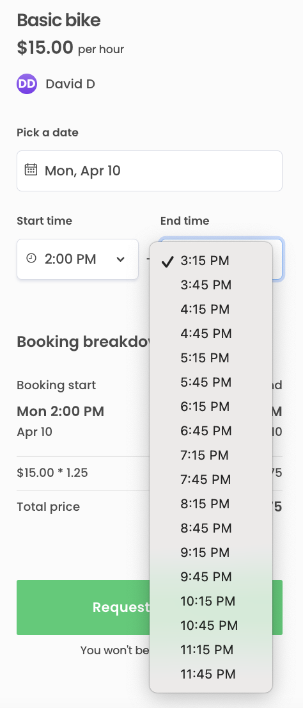

In Flex, listings can have either day-based or time-based availability.
For listings with time-based availability, the available
[time slots](https://www.sharetribe.com/api-reference/marketplace.html#time-slots)
are returned from the API as continuous stretches of time. The client
application must therefore split the availability into suitable booking
lengths.

The default behavior of the Sharetribe Web Template hourly listings is
to split the continuous availability stretch into one hour bookable
intervals. This how-to guide illustrates a handful of different cases on
modifying booking lengths.

## Set booking length to 30 minutes

The simplest use case is to create uniform 30 minute booking slots.
Start with adding a constant for the booking length in minutes.

```js
const timeSlotMinutes = 30;
```

Time slot handling is done using a few helper functions in
src/util/dates.js

```shell
└── src
    └── util
        └── dates.js
```

- _getStartHours_ and _getEndHours_ return a list of timepoints that are
  displayed as the booking's possible start and end moments,
  respectively. They both use the same helper function _getSharpHours_
- _getSharpHours_ retrieves the sharp hours that exist within the
  availability time slot. It uses the _findBookingUnitBoundaries_
  function.
- _findBookingUnitBoundaries_ is a recursive function that checks
  whether the current boundary (e.g. sharp hour) passed to it falls
  within the availability time slot.
  - If the current boundary is within the availability time slot, the
    function calls itself with the next boundary and cumulates the
    boundary results into an array.
  - If the current boundary does not fall within the availability time
    slot, the function returns the cumulated results from the previous
    iterations.
  - _findBookingUnitBoundaries_ takes a _nextBoundaryFn_ parameter that
    it uses to determine the next boundary value to pass to itself.
- the function passed as _nextBoundaryFn_ by default is
  _findNextBoundary_. The _findNextBoundary_ function increments the
  current boundary by a predefined value.

```js
export const findNextBoundary = (
  currentMomentOrDate,
  timeUnit,
  timeZone
) =>
  moment(currentMomentOrDate)
    .clone()
    .tz(timeZone)
    .add(1, timeUnit)
    .startOf(timeUnit)
    .toDate();
```

In addition to _findBookingUnitBoundaries_, the template uses
_findNextBoundary_ to handle other time increment boundaries. That is
why, instead of modifying _findNextBoundary_ directly, we will create a
similar function called _findNextCustomBoundary_ to be used in
_findBookingUnitBoundaries_, so we do not need to worry about side
effects.

### Add a custom rounding function for moment.js

The template hourly listing handling uses the
[moment-timezone](https://momentjs.com/timezone/) library to modify
times and dates and convert them between the listing's time zone and the
user's time zone.

By default, the _findNextBoundary_ function uses
_moment.startOf('hour')_ to round the booking slots to the top of each
hour. For _findNextCustomBoundary_ – since we are now dealing with
minutes – we need to create a custom rounding function to replace the
_startOf('hour')_ function call. When we add it to _moment.js_ using the
prototype exposed through _moment.fn_, we can chain it in the same place
as the default _startOf('hour')_ function.

This rounding function rounds to sharp hours when the time slot minutes
value is a factor of an hour, e.g. 15, 20 or 30 minutes. For other time
slot minutes, see
[using a time slot longer than 30 minutes](#use-a-time-slot-longer-than-30-minutes).

```js
/**
 * Rounding function for moment.js. Rounds the Moment provided by the context
 * to the start of the specified time value in the specified units.
 * @param {*} value the rounding value
 * @param {*} timeUnit time units to specify the value
 * @returns Moment rounded to the start of the specified time value
 */
moment.fn.startOfDuration = function(value, timeUnit) {
  const getMs = (val, unit) =>
    moment.duration(val, unit).asMilliseconds();
  const ms = getMs(value, timeUnit);

  // Get UTC offset to account for potential time zone difference between
  // customer and listing
  const offsetMs = this._isUTC ? 0 : getMs(this.utcOffset(), 'minute');
  return moment(Math.floor((this.valueOf() + offsetMs) / ms) * ms);
};
```

You will then need to use the new function to replace the built-in
_startOf()_ function, and pass the _timeSlotMinutes_ value as the
addition and rounding duration values.

```js
export const findNextCustomBoundary = (
  currentMomentOrDate,
  timeUnit,
  timeZone
) => {
  return moment(currentMomentOrDate)
    .clone()
    .tz(timeZone)
    .add(timeSlotMinutes, timeUnit)
    .startOfDuration(timeSlotMinutes, timeUnit)
    .toDate();
};
```

Finally, we need to use the new function in _findBookingUnitBoundaries_,
and change _timeUnit_ from _hour_ to _minutes_:

```diff
  return findBookingUnitBoundaries({
-   currentBoundary: findNextBoundary(millisecondBeforeStartTime, 'hour', timeZone),
+   currentBoundary: findNextCustomBoundary(millisecondBeforeStartTime, 'minutes', timeZone),
    startMoment: moment(startTime),
    endMoment: moment(endTime),
-   nextBoundaryFn: findNextBoundary,
+   nextBoundaryFn: findNextCustomBoundary,
    cumulatedResults: [],
    intl,
    timeZone,
-   timeUnit: 'hour',
+   timeUnit: 'minutes',
  });
```

For listings with an hourly price, the function
_calculateQuantityFromHours_ determines the correct quantity as a
decimal of full hours. However, if you want to set a price per minute,
or e.g. a price per non-hour session, you will need to modify
_calculateQuantityFromHours_ as well.


## Use an irregular time slot

If your marketplace has custom booking lengths longer than (and not
divisible by) 30 minutes, you will need to extend the previous steps to
a more complex approach to make sure the time slots show up correctly.

### Find the rounding duration

When the booking length is not a factor of a full hour, using the
_timeslotMinutes_ value might cause issues, because the start time slot
gets rounded to a multiple of the time slot in general. This means that
depending on the start time of the availability (8 AM vs 9 AM vs 10 AM),
the first time slot may show up as starting 15 minutes or half hour past
the actual desired start time.

To align the first available boundary with a sharp hour, we need to
manually set the first boundary to the specified start time, and set
rounding to a factor of a full hour.

To determine the correct rounding minute amount, we calculate the
greatest common factor of the booking length and a full hour using the
[Euclidean algorithm](https://en.wikipedia.org/wiki/Euclidean_algorithm).
For instance, when using a 45 minute time slot, the greatest common
divisor with an hour is 15 minutes.

```js
const timeSlotMinutes = 45;
const hourMinutes = 60;

/**
 * Calculate the greatest common factor (gcf) of two timeslot lengths
 * to determine rounding value using the Euclidean algorithm
 * (https://en.wikipedia.org/wiki/Euclidean_algorithm).
 */
const gcf = (a, b) => {
  return a ? gcf(b % a, a) : b;
};

/**
 * Define the rounding value.
 * If the first time slot is shorter than general time slot,
 * swap the parameters around so that the first parameter is the shorter one
 */
const rounding = gcf(timeSlotMinutes, hourMinutes);
```

### Manually set first boundary to start time

To manually set the first boundary to the start time, we need to pass an
_isFirst_ parameter to the _findNextCustomBoundary_ function. For the
first time slot, we then skip incrementing completely.

```diff
export const findNextCustomBoundary = (
  currentMomentOrDate,
  timeUnit,
- timeZone
+ timeZone,
+ isFirst = false
) => {
+ const increment = isFirst ? 0 : timeSlotMinutes;
  return moment(currentMomentOrDate)
    .clone()
    .tz(timeZone)
-   .add(timeSlotMinutes, timeUnit)
-   .startOfDuration(timeSlotMinutes, timeUnit)
+   .add(increment, timeUnit)
+   .startOfDuration(rounding, timeUnit)
    .toDate();
```

The rounding function now rounds the start time back to the rounding
boundary. However, the default start time is passed to
_findNextCustomBoundary_ as one millisecond before start time, since the
default addition of 30 minutes and the _startOfDuration(...)_ function
cancel each other out.

Since we want to set the first booking slot manually, we can pass the
start time directly. However, we will need to pass _true_ as the
_isFirst_ parameter to the very first _findBookingUnitBoundaries_
function call when calling it from _getSharpHours_.

```diff
-   const millisecondBeforeStartTime = new Date(startTime.getTime() - 1);

    return findBookingUnitBoundaries({
-     currentBoundary: findNextCustomBoundary(millisecondBeforeStartTime, 'minute', timeZone),
+     // add isFirst param to determine first time slot handling
+     currentBoundary: findNextCustomBoundary(startTime, 'minute', timeZone, true),
      startMoment: moment(startTime),
      endMoment: moment(endTime),
```

## Add separate handling for first timeslot

Sometimes, there are cases where you want to have a basic length for a
booking and then different lengths for subsequent time slots. For
instance, a listing could feature a 75 minute default bike rental with
the option to extend it for 30 minutes at a time. In those cases, you
need to create different handling for the first time slot, i.e. the
first start and end boundaries.

```js
const timeSlotMinutes = 30;
const firstSlotMinutes = 75;

/**
 * Define the rounding value.
 * If the first time slot is shorter than general time slot,
 * swap the parameters around so that the first parameter is the shorter one
 */
const rounding = gcf(timeSlotMinutes, firstSlotMinutes);
```

### Determine first time slot boundaries

In this use case, we want to determine a different behavior for the
start and end boundaries of the first time slot. For this reason, we
need to pass an _isStart_ parameter to _findNextCustomBoundary_ and use
it to determine the boundary timepoints in addition to the _isFirst_
parameter.

```diff
export const findNextCustomBoundary = (
  currentMomentOrDate,
  timeUnit,
  timeZone,
  isFirst = false,
+ isStart = false
) => {
- const increment = isFirst ? 0 : timeSlotMinutes;
+ // Use the default booking length for non-first slots
+ // Use the first booking length for first end boundary
+ // Use 0 for first start boundary
+ const increment = !isFirst
+   ? timeSlotMinutes
+   : !isStart
+   ? firstSlotMinutes
+   : 0;
  return moment(currentMomentOrDate)
    .clone()
    ...
};
```

The _getSharpHours_ function is used for both start hours and end hours,
so we need to receive it as a parameter and pass the value on to
_findNextCustomBoundary_.

```diff
- export const getSharpHours = (startTime, endTime, timeZone, intl) => {
+ export const getSharpHours = (startTime, endTime, timeZone, intl, isStart = false) => {
    if (!moment.tz.zone(timeZone)) {
...
    return findBookingUnitBoundaries({
-     currentBoundary: findNextCustomBoundary(startTime, 'minutes', timeZone, true),
+     // add isFirst and isStart params to determine first time slot handling
+     currentBoundary: findNextCustomBoundary(startTime, 'minutes', timeZone, true, isStart),
      startMoment: moment(startTime),
```

### Customize start hour and end hour list behavior

By default, _getStartHours_ and _getEndHours_ basically retrieve the
same list, but _getStartHours_ removes the last entry and _getEndHours_
removes the first entry. Since we have custom start and end handling in
_findNextCustomBoundary_, we also need to modify the start and end hour
lists.

To get correct start times, we need to first pass _true_ as the
_isStart_ parameter from _getStartHours_ to _getSharpHours_.

In addition, we need to make sure that even when selecting the last
start time, there is enough availability for the first timeslot. We do
this by removing enough entries from the end so that the first time slot
can be booked even from the last start moment.

```diff
export const getStartHours = (intl, timeZone, startTime, endTime) => {
- const hours = getSharpHours(intl, timeZone, startTime, endTime);
+ const hours = getSharpHours(intl, timeZone, startTime, endTime, true);

- return hours.length < 2 ? hours : hours.slice(0, -1);
+ // Remove enough start times so that the first slot length can successfully be
+ // booked also from the last start time
+ const removeCount = Math.ceil(firstSlotMinutes / timeSlotMinutes)
+ return hours.length < removeCount ? [] : hours.slice(0, -removeCount);
};
```

Finally, we can simplify the end hour handling. Since the first entry is
determined in the _findNextCustomBoundary_ function, we do not need to
remove it. Instead, we can just return the full list from
_getSharpHours_.

```diff
  export const getEndHours = (intl, timeZone, startTime, endTime) => {
-   const hours = getSharpHours(intl, timeZone, startTime, endTime);
-   return hours.length < 2 ? [] : hours.slice(1);
+   return getSharpHours(intl, timeZone, startTime, endTime);
  };
```

We can then see that after the first booking length of 75 minutes, the
subsequent boundaries are 30 minutes each.


