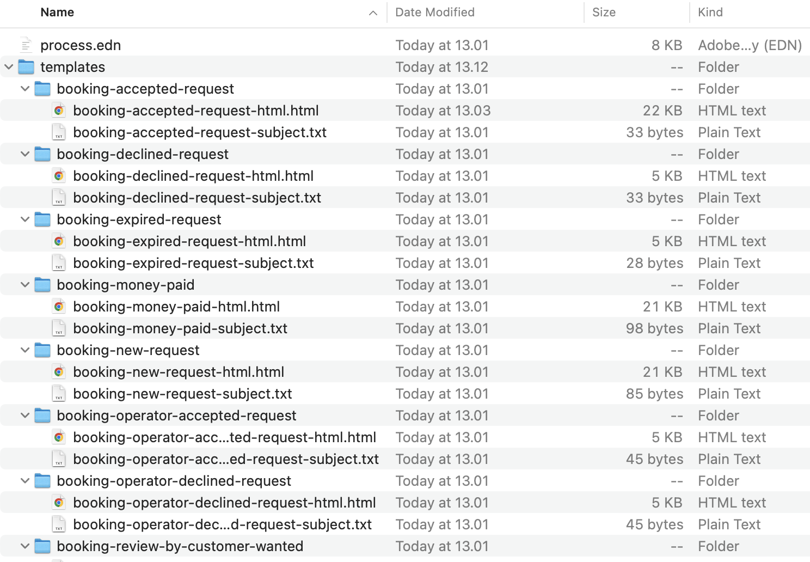
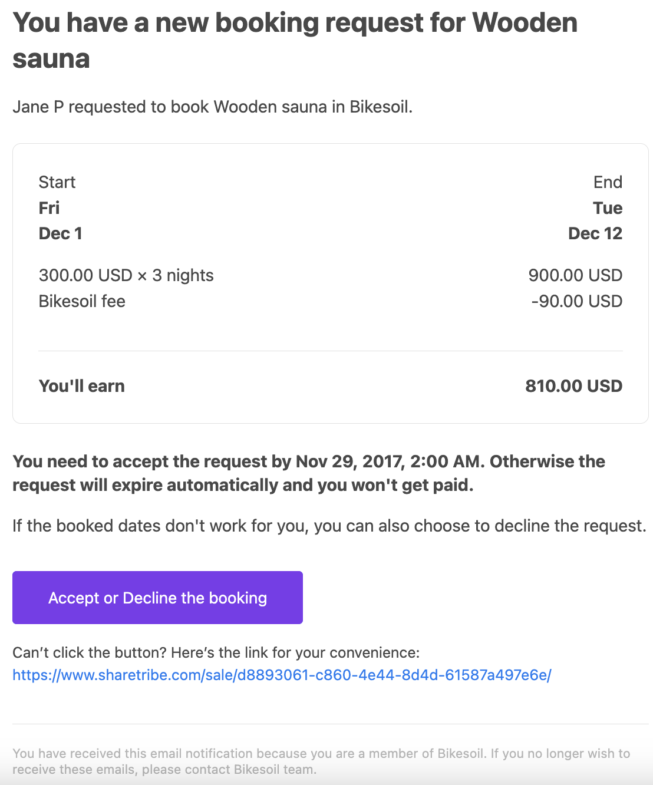
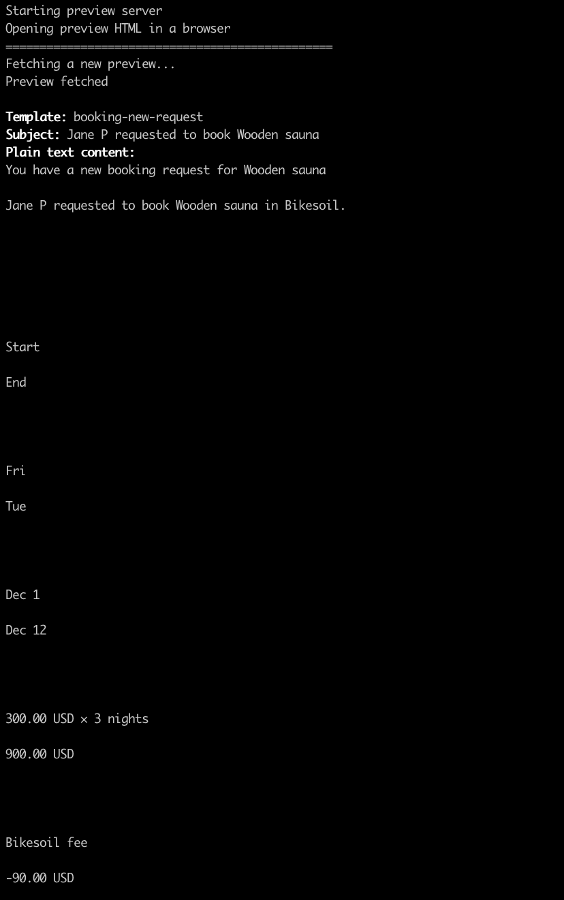
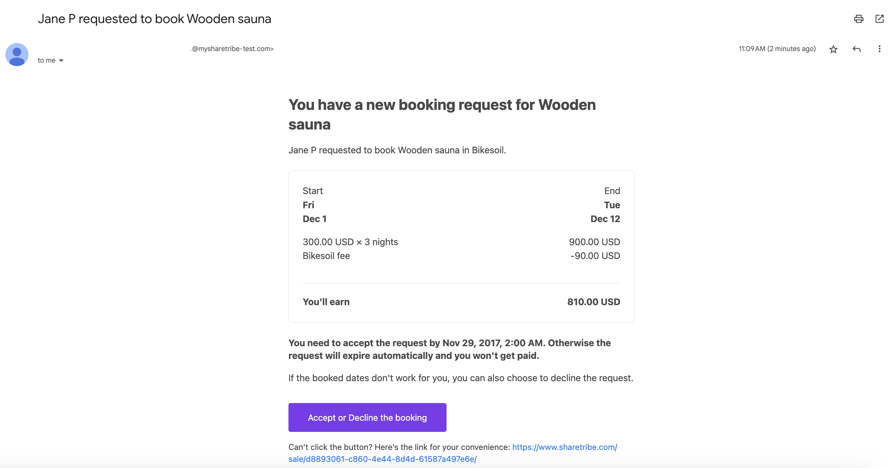
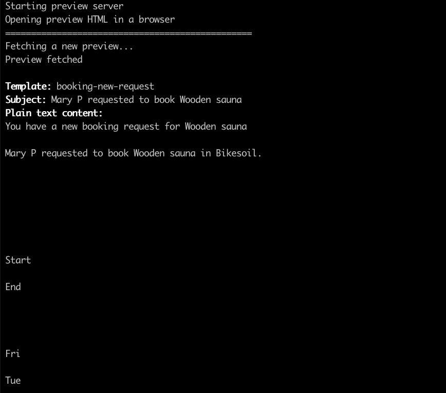

Sharetribe CLI (Command-line interface) is a tool for changing your
marketplace's advanced configurations such as transaction processes and
email templates.

<plan tier="extend" feature="Access to Sharetribe CLI"></plan>

This guide expects that you have already installed Sharetribe CLI and
are logged in with your API key. If not, it's recommended to first read
the guide
[Getting started with Sharetribe CLI](/introduction/getting-started-with-sharetribe-cli/).

We also recommend that you go through the
[Edit transaction process with Sharetribe CLI](/how-to/edit-transaction-process-with-sharetribe-cli/)
tutorial to understand process pulling, editing, pushing, and alias
handling on a general level.

In this tutorial we make a change to an email template that is used in
sending notifications to your marketplace users as part of your
transaction process. These transaction email template changes are also a
form of process change, and they create a new version of your process.
For email templates not part of your transaction process, see the
[Built-in email templates](https://console.sharetribe.com/advanced/email-templates)
page in the Build section of Console.

<info>

For content-only changes, you can use the Console transaction email
editor in Build > Content > Email texts.

</info>

## Pull existing process

To edit the transaction email templates, you need to pull an existing
process with its templates. First, let's list all the processes of our
`my-marketplace-dev` marketplace:

```bash
flex-cli process list -m my-marketplace-dev
```

The `process list` command prints out all the processes and their latest
versions. You want to pick the correct process and version from this
list. In this tutorial we will use the `default-booking` process,
version 1. You probably have different transaction processes in your
marketplace - so, you need to adjust this guide accordingly.

Let's pull that process version:

```bash
flex-cli process pull --process default-booking --version 1 --path process -m my-marketplace-dev
```

This will create a `process/` directory that has all the process files
in it:

- `process.edn` file, which describes the transaction process
- `templates` directory, which contains all the transaction email
  templates for this process

## Templates directory

Let's see what we have in the `process/` directory:



If you look at the `:notifications` key in the `process.edn` file, you
will see that the template directories and file names match the
`:template` values in the notifications:

```clojure
:notifications
 [{:name :notification/booking-new-request,
   :on :transition/confirm-payment,
   :to :actor.role/provider,
   :template :booking-new-request}
  {:name :notification/booking-accepted-request,
   :on :transition/accept,
   :to :actor.role/customer,
   :template :booking-accepted-request}
  {:name :notification/booking-operator-accepted-request-to-customer,
   :on :transition/operator-accept,
   :to :actor.role/customer,
   :template :booking-accepted-request}
...
```

A template for a notification is a directory that is named after the
`:template` value and contains two files:

- `TEMPLATE_NAME-subject.txt` - holds the mail Subject line template
- `TEMPLATE_NAME-html.html` - contains the template for the HTML version
  of the mail

Both parts are mandatory. All emails that are sent from the marketplace
contain both the HTML and plain text variants and the recipient's mail
client is free to choose which one to visualize and how. The text
version is automatically generated from the HTML template.

### Example

For example, the `:notification/booking-new-request` notification:

```clojure
{:name :notification/booking-new-request,
   :on :transition/confirm-payment,
   :to :actor.role/provider,
   :template :booking-new-request}
```

has the following template:

```
booking-new-request
├── booking-new-request-html.html
└── booking-new-request-subject.txt
```

Note that the template name (e.g. `:booking-new-request`) doesn't have
to match the notification name (e.g.
`:notification/booking-new-request`) as you can use the same template in
multiple notifications.

## Email template syntax

The templates use [Handlebars](http://handlebarsjs.com/) syntax.

Example HTML:

```handlebars
<!--
** First, set global variables for the whole file
-->
    {{set-translations (asset "content/email-texts.json")}}
    {{set-locale (asset "general/localization.json" "locale" "en_US")}}
    {{set-timezone transaction.listing.availability-plan.timezone}}
<html lang="en">
  <head>
    <meta http-equiv="Content-Type" content="text/html charset=UTF-8" />
  </head>
  <!--
  ** Define inline functions used in the file to format data
  -->
  {{~#*inline "format-money"~}}{{format-text "{amount,number,::.00} {currency}" amount=money.amount currency=money.currency}}{{~/inline~}}
  {{~#*inline "format-day"~}}{{#with transaction.listing.availability-plan}}{{format-text "{date,date,::EE}" date=date}}{{/with}}{{~/inline~}}
  {{~#*inline "format-day-before"~}}{{#with transaction.listing.availability-plan}}{{format-text "{date,date,::EE}" date=(date-transform date days=-1)}}{{/with}}{{~/inline~}}
  {{~#*inline "format-day-time"~}}{{#with transaction.listing.availability-plan}}{{format-text "{date,date,::EEhmma}" date=date}}{{/with}}{{~/inline~}}
  {{~#*inline "format-month-date"~}}{{#with transaction.listing.availability-plan}}{{format-text "{date,date,::MMMd}" date=date}}{{/with}}{{~/inline~}}
  {{~#*inline "format-month-date-day-before"~}}{{#with transaction.listing.availability-plan}}{{format-text "{date,date,::MMMd}" date=(date-transform date days=-1)}}{{/with}}{{~/inline~}}
  <!--
  ** Use the #with helper to expose the attributes of the transaction to the enclosed block
  -->
  {{#with transaction}}
  <table style="background-color:#FFF;margin:0 auto;padding:24px 12px 0;font-family:-apple-system, BlinkMacSystemFont, 'Segoe UI', 'Roboto', 'Oxygen', 'Ubuntu', 'Cantarell', 'Fira Sans', 'Droid Sans', 'Helvetica Neue', sans-serif" align="center" border="0" cellPadding="0" cellSpacing="0" role="presentation" width="100%">
    <tbody>
      <tr>
        <td>
          <table align="center" role="presentation" cellSpacing="0" cellPadding="0" border="0" width="100%" style="max-width:600px;margin:0 auto">
            <tr style="width:100%">
              <td>
                <!--
                ** The email template uses the 't' helper for rendering content:
                ** - the first parameter is the message key
                ** - the second parameter is the fallback message, if the key in the first parameter does not exist
                ** - the following parameters are the variables used in the messages and their respective values
                -->
                <h1 style="color:#484848;font-size:26px;line-height:1.3;font-weight:700">{{t "BookingNewRequest.Title" "You have a new booking request for {listingTitle}" listingTitle=listing.title}}</h1>
                <p style="font-size:16px;line-height:1.4;margin:16px 0;color:#484848">{{t "BookingNewRequest.Description" "{customerDisplayName} requested to book {listingTitle} in {marketplaceName}." customerDisplayName=customer.display-name listingTitle=listing.title marketplaceName=marketplace.name}}</p>
                ...
                <!--
                ** Omitted section renders the line items related to the transaction
                -->
                <p style="font-size:16px;line-height:1.4;margin:16px 0;color:#484848;font-weight:700">{{t "BookingNewRequest.AcceptText" "You need to accept the request by {date,date,::hmmaYYYYMMMd}. Otherwise the request will expire automatically and you won't get paid." date=delayed-transition.run-at}}</p>
                <p style="font-size:16px;line-height:1.4;margin:16px 0;color:#484848">{{t "BookingNewRequest.DeclineOptionText" "If the booked dates don't work for you, you can also choose to decline the request."}}</p>
                <table style="padding:16px 0 0" align="center" border="0" cellPadding="0" cellSpacing="0" role="presentation" width="100%">
                  <tbody>
                    <tr>
                      <td><a href="{{marketplace.url}}/sale/{{url-encode id}}/" target="_blank" style="color:#FFF;background-color:#007DF2;border-radius:4px;font-size:15px;text-decoration:none;text-align:center;display:inline-block;min-width:210px;padding:0px 0px;line-height:100%;max-width:100%"><span><!--[if mso]><i style="letter-spacing: undefinedpx;mso-font-width:-100%;mso-text-raise:0" hidden>&nbsp;</i><![endif]--></span><span style="color:#FFF;background-color:#007DF2;border-radius:4px;font-size:15px;text-decoration:none;text-align:center;display:inline-block;min-width:210px;padding:16px 32px;max-width:100%;line-height:120%;text-transform:none;mso-padding-alt:0px;mso-text-raise:0">{{t "BookingNewRequest.AcceptOrDeclineLink" "Accept or Decline the booking"}}</span><span><!--[if mso]><i style="letter-spacing: undefinedpx;mso-font-width:-100%" hidden>&nbsp;</i><![endif]--></span></a>
                        <div>
                          <p style="font-size:14px;line-height:1.5;margin:16px 0;color:#484848">{{t "TransactionEmails.AccessibleLinkText" "Can’t click the button? Here’s the link for your convenience:"}} <a target="_blank" style="color:#007DF2;text-decoration:none" href="{{marketplace.url}}/sale/{{url-encode id}}/">{{marketplace.url}}/sale/{{url-encode id}}/</a></p>
                        </div>
                      </td>
                    </tr>
                  </tbody>
                </table>
                <!--
                ** Close the 'with' block when transaction attributes are no longer needed
                -->
                {{/with}}
                <div>
                  <hr style="width:100%;border:none;border-top:1px solid #eaeaea;border-color:#E1E1E1;margin:20px 0" />
                  <p style="font-size:12px;line-height:15px;margin:0 auto;color:#b7b7b7;text-align:left;margin-bottom:50px">{{t "TransactionEmails.MembershipParagraph" "You have received this email notification because you are a member of {marketplaceName}. If you no longer wish to receive these emails, please contact {marketplaceName} team." marketplaceName=marketplace.name}}</p>
                </div>
              </td>
            </tr>
          </table>
        </td>
      </tr>
    </tbody>
  </table>
</html>
```

Variables within `{{ }}` are expanded and escaped, so that they are safe
to place inside HTML content. As seen above, some variables have nested
values, which can be accessed with dot `.` operator.

In the example above, the `#with` block helper is used to access
properties of the email context top level property `transaction`. So
`customer.display-name` within the `{{#with transaction}}` block will
refer to the value of `transaction.customer.display-name` in the email
context.

The template syntax supports conditionals, loops, helpers and other
constructs. For details on the Handlebars constructs and a full
description of the email context, see the
[Email templates](/references/email-templates/) reference.

## Change a template

Let's change the email template for new booking requests.

Open the `booking-new-request/booking-new-request-html.html` file in a
text editor. Let's change the color of the "Accept or Decline the
booking" button (line breaks added for clarity):

```diff
  <a
    href="{{marketplace.url}}/sale/{{url-encode id}}/"
    target="_blank"
    style="color:#FFF;background-color:#007DF2;border-radius:4px;font-size:15px;
    text-decoration:none;text-align:center;display:inline-block;min-width:210px;padding:0px 0px;
    line-height:100%;max-width:100%"
  >
    <span>
      <!--[if mso]>
        <i style="letter-spacing: undefinedpx;mso-font-width:-100%;mso-text-raise:0" hidden>&nbsp;</i>
      <![endif]-->
    </span>
    <span
-     style="color:#FFF;background-color:#007DF2;border-radius:4px;font-size:15px;
+     style="color:#FFF;background-color:#7C3AED;border-radius:4px;font-size:15px;
      text-decoration:none;text-align:center;display:inline-block;min-width:210px;
      padding:16px 32px;max-width:100%;line-height:120%;text-transform:none;mso-padding-alt:0px;
      mso-text-raise:0"
    >
      {{t "BookingNewRequest.AcceptOrDeclineLink" "Accept or Decline the booking"}}
    </span>
    <span>
      <!--[if mso]>
        <i style="letter-spacing: undefinedpx;mso-font-width:-100%" hidden>&nbsp;</i>
      <![endif]-->
    </span>
  </a>
```

When you've made the change, save the file.

## Preview your changes

You can test your changes and templates by previewing or sending a test
email using your local template files. To preview the change above:

```bash
flex-cli notifications preview --template process/templates/booking-new-request -m my-marketplace-dev
```

The command will render the given template using
[a sample data (context)](#sample-email-context) and open a browser tab
with the output HTML:



It will also output the rendered text version to the terminal:



You can now use your normal browser developer tooling to test changes to
the template and verify how the responsiveness of the content works.
When you make changes to the template, you can just refresh the browser
and see the updated preview.

## Sending a preview email

If you want to verify the email in an email client software, you can
also send the test preview email:

```bash
flex-cli notifications send --template process/templates/booking-new-request -m my-marketplace-dev
```

The email is sent to the email address of the admin user that was used
in logging in to the CLI:



## Sample email context

As you see from the previews above, the templates are rendered with the
fixed sample context. The `notifications preview` and
`notifications send` commands also support an optional `--context`
option that can be used to pass in a custom context JSON.

You can see the default context JSON here:
[sample-template-context.json](/sample-template-context.json)

To change the data that is used for previews, download the sample JSON
file and make edits to it:

```diff
    "customer" : {
      "id" : "ef7f40d5-da66-489a-957b-641313b68204",
      "first-name" : "Jane",
      "last-name" : "Pritchett",
-     "display-name" : "Jane P",
+     "display-name" : "Mary P",
```

You can then pass the changed context file to the preview command:

```bash
flex-cli notifications preview --template process/templates/booking-new-request --context sample-template-context.json -m my-marketplace-dev
```

Now you will see the preview with the context data that you edited:



You can use the
[sample-template-context.json](/sample-template-context.json) file as a
base and test how your templates behave with different content or custom
extended data etc.

## Push new version

Now that you have edited the email templates, you need to push a new
version of your process:

```bash
flex-cli process push --path process --process default-booking -m my-marketplace-dev
```

You can see the new version in Console or using the `process list`
command:

```bash
flex-cli process list --process default-booking -m my-marketplace-dev
```

## Update alias

As you saw from Console or from the `process list` command above, there
isn't an alias pointing to the latest process version. To allow
Sharetribe Web Template or other apps to use the new process version
through the Marketplace API, you will need an alias to point to the
version.

In our `default-booking` example process there is a `release-1` alias.
Let's update that to point to the new process version:

```bash
flex-cli process update-alias --process default-booking --alias release-1 --version 2 -m my-marketplace-dev
```

To see the updated alias, run the `process list` command again:

```bash
flex-cli process list --process default-booking -m my-marketplace-dev
```

## Summary

In this tutorial we changed an email template in an existing process. We
then pushed the changes to a new version and updated the alias to point
to that version.

This is the generic workflow to update the notification email contents
that are part of the transaction process of your marketplace.

With this and the
[Edit transaction process with Sharetribe CLI](/how-to/edit-transaction-process-with-sharetribe-cli/)
guide, you now know how to change the transaction process and its email
templates. As a next step, you might want to read the
[Transaction process format](/references/transaction-process-format/)
reference article.
