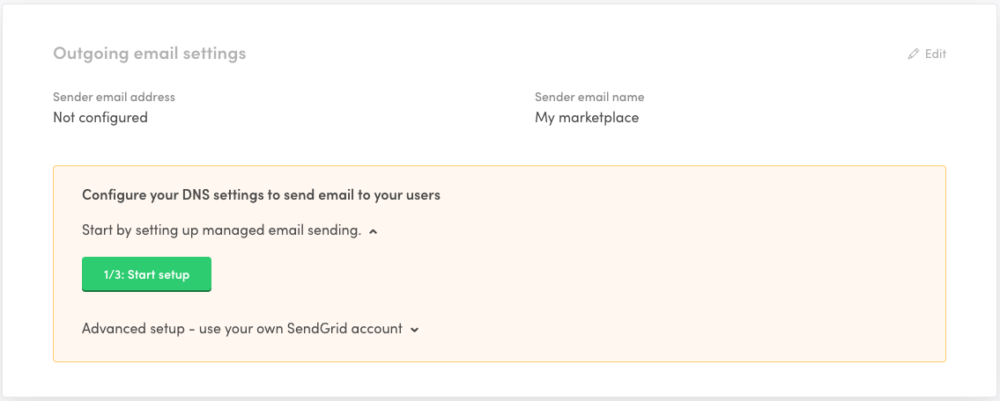
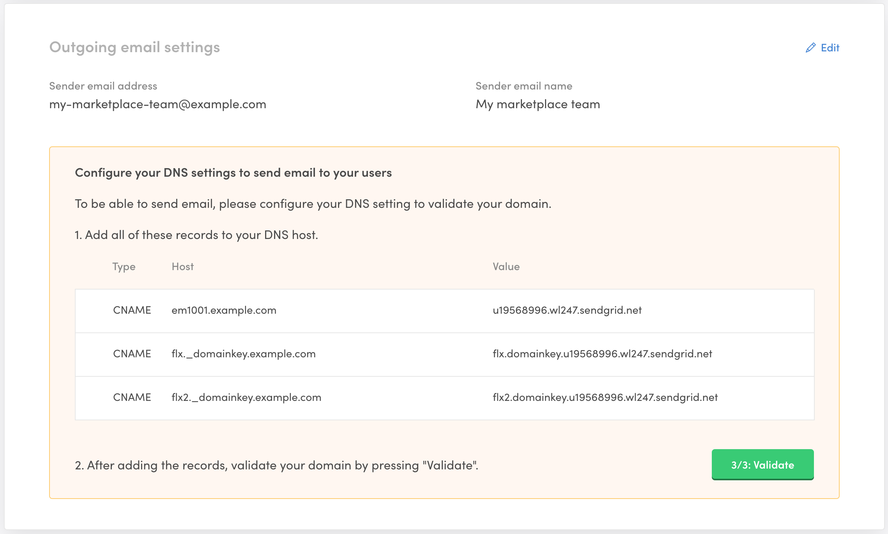
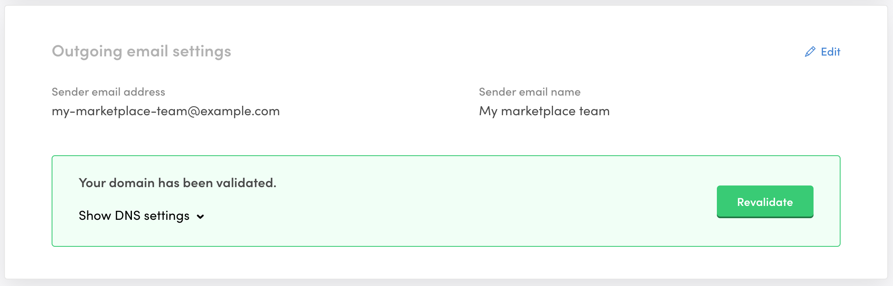
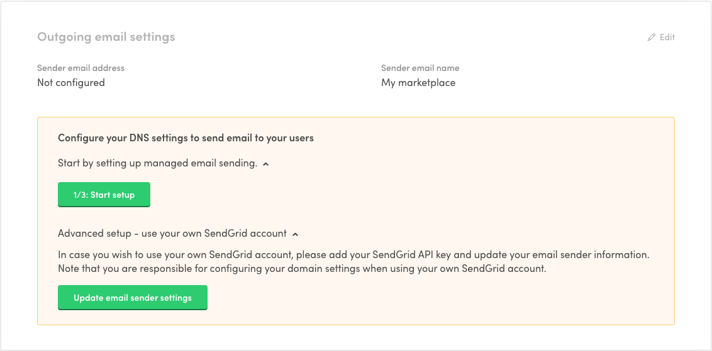
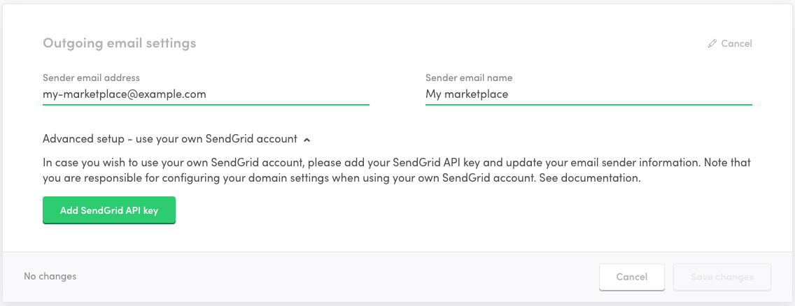

Setting up reliable email delivery is crucial for your marketplace to
work properly. It is also important to brand your email sending name and
address to look professional and polished.

We offer two ways of managing email sending from your marketplace. The
default option is to rely on a managed service offered by default in
Sharetribe. If you wish to obtain more flexibility and control over your
email sending, you can integrate Sharetribe with your own SendGrid
account.

The following sections offer an overview of the two methods and how to
configure them.

## Managed setup

Sharetribe uses [SendGrid](https://sendgrid.com/) as an email service
provider. By default, we manage your SendGrid account and settings
automatically, and the costs are included in your Sharetribe
subscription.

When you have your live environment created, you can set up and validate
the outgoing email settings if you use a custom domain. Follow the steps
below to enable email sending with a custom domain, and increase the
chances that your emails will be delivered reliably.

### 1. Add sender name and address

Make sure you select your live environment in the top navigation in
Console. Then head on to the General settings page in the Build section.
You can see the outgoing email settings below the marketplace
information:

Click on the "1/3 Start setup" button to start the setup. Follow the
instructions in the UI.

When you have added your sender email information, you will be prompted
with DNS information:

At this point, we have created a SendGrid subuser for you, stored the
information, and authenticated the given sender domain to SendGrid. This
means that you have allowed this SendGrid subuser to send emails from
this domain.

### 2. Configure DNS

Next, you need to point your DNS entries from your DNS provider to
SendGrid. This is an important step for your sender reputation and your
email deliverability. You should add all the records in the table
visible in Console.

[These DNS provider video tutorials](https://sendgrid.com/docs/ui/account-and-settings/dns-providers/)
by SendGrid might be useful if you are not sure how to configure the DNS
records for your specific DNS provider.

If you still have trouble adding the records, see the SendGrid article
on
[Troubleshooting Sender Authentication](https://sendgrid.com/docs/ui/account-and-settings/troubleshooting-sender-authentication/).

### 3. Validate DNS

When you have configured your DNS, you still need to validate the
records for your emails to work. You can do that by clicking on the "3/3
Validate" button in Console. If everything is set up correctly, you
should see a success message in Console:

Whenever you change your DNS records, you can revalidate to check that
everything is set up correctly.

### Troubleshooting failing validation

Note that when you make changes to your DNS, the changes might take a
while to propagate. SendGrid recommends that you
[give up to 48 hours](https://sendgrid.com/docs/ui/account-and-settings/troubleshooting-sender-authentication/#allow-your-dns-records-to-propagate)
to make sure your latest changes are in use. Some of the records might
propagate faster than others, so be patient.

Some DNS providers append your top-level domain automatically to your
DNS records. For example, if you are using GoDaddy, Amazon Route 53, or
Namecheap, make sure that your domain isn't duplicated in the DNS
entries. For more information see
[the tip at the end of this section](https://sendgrid.com/docs/ui/account-and-settings/how-to-set-up-domain-authentication/#before-you-begin)
in the SendGrid documentation.

For more information, see SendGrid's
[Troubleshooting Sender Authentication](https://sendgrid.com/docs/ui/account-and-settings/troubleshooting-sender-authentication/)
documentation.

### Configure a DMARC policy

Starting in February 2024,
[Google](https://blog.google/products/gmail/gmail-security-authentication-spam-protection/)
and
[Yahoo](https://blog.postmaster.yahooinc.com/post/730172167494483968/more-secure-less-spam)
are rolling out changes to bulk email sender requirements. Their aim is to
guarantee a more secure experience and a less spammy inbox for email recipients.

When following the DNS configuration instructions in this article, your domain
is already configured properly for SPF and DKIM authentication. However, setting
up a DMARC policy is recommended, especially if there is significant amount of
email sent daily for your domain. Without one, email deliverability to GMail and
Yahoo addresses from your domain may be worse.

Setting up a DMARC policy involves adding a DNS record for the name `_dmarc` in
your domain. For example, if your domain is `example.com`, then the DNS record
should be for the name `_dmarc.example.com`. The type of the record must be
`TXT`. The value of the record can be different depending on your or your
organization's requirements. If unsure, use the following value as your DMARC
policy: `v=DMARC1; p=none`. This is a minimal neutral DMARC policy.

For example, for `example.com` the record would be:

| type | name               | value            |
|------|--------------------|------------------|
| TXT  | _dmarc.example.com | v=DMARC1; p=none |

Note that depending on your DNS hosting provider, the domain name may be added
automatically to any records you create. In that case you need to use just
`_dmarc` as the record name, without the domain name. You may also need to place
the value in quotes: `"v=DMARC1; p=none"`.

#### Using a strict DMARC policy

If you prefer to set a more strict DMARC policy, you can do so. Note, however,
that Sharetribe's email integration requires that the DMARC policy specifies
"relaxed alignment" for SPF and DKIM checks. This means you should NOT configure
a policy with the values `aspf=s` (strict SPF alignment) or `adkim=s` (strict
DKIM alignment).

## Using your own SendGrid account

In addition to using the managed email sending, you have the option to
choose to use your own SendGrid account by integrating it with
Sharetribe. You might want to do this because:

- You want to see exactly what emails are sent from your marketplace and
  fix problems (like bounces) with users' email addresses.
- You want to see open rates and other statistics about the email
  notifications that were sent.
- You are also using SendGrid for your newsletters and other marketing
  emails, and want to have all your email-related data in one place.
- You want to use your own IP address for email sending and reputation.

If you'd prefer to get access to such features and statistics, this is
possible by connecting your own SendGrid account to Sharetribe. Just
remember that doing this means you'd be subject to SendGrid's standard
pricing for all outgoing emails.

Follow the steps below to set up your own SendGrid account for email
sending:

### 1. Create an API key in SendGrid

Please, refer to the SendGrid instructions on
[key management](https://sendgrid.com/docs/ui/account-and-settings/api-keys/#managing-api-keys).

You should create a key with `Restricted Access` with `Mail Send`
configured with `Full Access` permission. Make sure that your key has
the correct permission in place, otherwise email sending from Sharetribe
will not work. Make note of the key while creating it, it will be shown
only once.

Also, you need to make sure that you have configured your domain in
SendGrid by following their instructions on
[how to configure domain authentication](https://sendgrid.com/docs/ui/account-and-settings/how-to-set-up-domain-authentication/).

### 2. Enable using own SendGrid key in Sharetribe Console

Log in to your Console, and select your live environment. There are two
options for integrating SendGrid. You can do it during the initial setup
of the marketplace or later if you wish to change from managed setup to
using your own SendGrid account.

#### During initial setup

Head on to the General settings page in the Build section. You should
see a wizard prompting you to select between managed setup or advanced
setup:

Toggle the advanced setup visible:

Click the button and paste in your SendGrid API key.

#### Changing from managed to own account

Head on to the General settings page in the Build section. Click `Edit`
under `Outgoing email settings` and toggle the `Advanced setup` visible:

Click the button and paste in your SendGrid API key.

That's it! If you have configured your key and SendGrid account
correctly, you are good to go!

## Summary

In this article, we went through the setup to configure a custom email
address for your live marketplace. It is important to get all the steps
done and validated to ensure that emails are working reliably.

If you have any questions or need a more advanced setup, you can
[contact Sharetribe support](mailto:hello@sharetribe.com) and we are
happy to help you.
