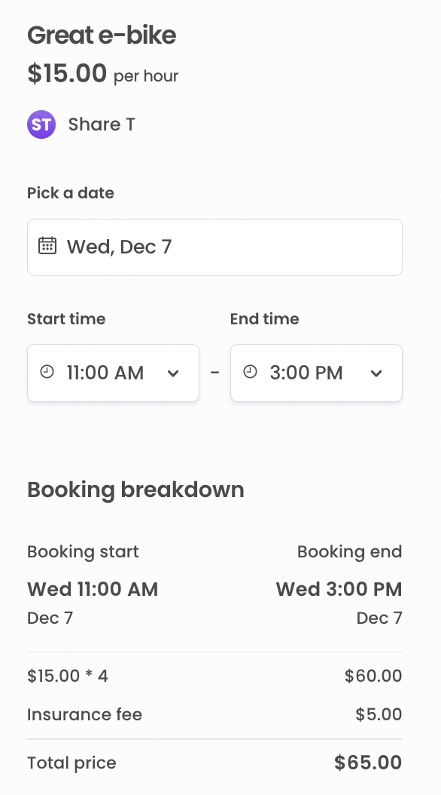
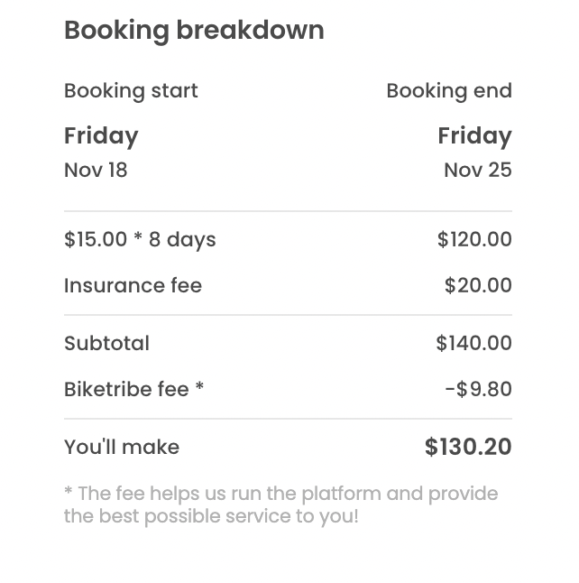

_**NOTE! In case your pricing relies on the deprecated
[set-line-items-and-total](/references/transaction-process-actions/#actionset-line-items-and-total)
action, the old pricing customization article related to that can be
found
[here](https://5ee94c280d38f10008a3bfa1--sharetribe-flex-docs-site.netlify.app/docs/background/custom-pricing/).**_

This cookbook shows you how listing pricing can be customized by using
two examples: adding a cleaning fee to a listing and changing provider
commission so that it's based on booking length. The changes we're about
to make are as follows:

1. Update listing data model by storing cleaning fee price in listing
   public data
2. Update pricing logic to add a cleaning fee line item if a listing has
   cleaning fee stored in public data
3. Update provider commission calculation to be dependent on booking
   length

For more information about pricing in Flex, see the
[Pricing background article](/concepts/pricing/).

## 1. Listing extended data

Pricing can be based on a lot of variables but one practical way to
build it is to base it on information stored as extended data in
listings. See the
[Extend listing data in FTW](/how-to/extend-listing-data-in-ftw/)
cookbook to read how to extend the listing data model with extended
data. See the aforementioned cookbook for instructions how to add inputs
for new attributes in the listing wizard. Alternatively, in order to try
out this cookbook, you can just add a hard-coded cleaning fee to the
`EditListingPricingPanel` component:

```shell
└── src
    └── components
        └── EditListingPricingPanel
            └── EditListingPricingPanel.js
```

On submit, save price and cleaningFee:

```diff
 const form = priceCurrencyValid ? (
   <EditListingPricingForm
     className={css.form}
     initialValues={{ price }}
-    onSubmit={onSubmit}
+    onSubmit={values => {
+      const { price } = values;
+      const updatedValues = {
+        price,
+        publicData: { cleaningFee: { amount: 2000, currency: 'USD' } },
+      };
+      onSubmit(updatedValues);
+    }}
     onChange={onChange}
     saveActionMsg={submitButtonText}
     disabled={disabled}
```

## 2. Transaction line item for cleaning fee

As the previous section mentions, this guide expects that the cleaning
fee price is stored in listing public data in an object with two keys:
`amount` and `currency`. The `amount` attribute holds the price in
subunits whereas `currency` holds the currency code. For example, with a
cleaning fee of \$20 the subunit amount is 2000 cents.

```js
publicData: {
  cleaningFee: { amount: 2000, currency: 'USD' }
}
```

Flex pricing uses
[privileged transitions](/concepts/privileged-transitions/)
to ensure flexible pricing models while keeping control of the pricing
logic in a secure environment. Transitioning requests of privileged
transitions are made from the server-side. Thus we'll need to update the
pricing logic in the `/server/api-util/lineItems.js` file:

```shell
└── server
    └── api-util
        └── lineItems.js
```

In the bottom of the file, add a helper function that resolves the
cleaning fee of a listing:

```js
const resolveCleaningFeePrice = listing => {
  const publicData = listing.attributes.publicData;
  const cleaningFee = publicData && publicData.cleaningFee;
  const { amount, currency } = cleaningFee;

  if (amount && currency) {
    return new Money(amount, currency);
  }

  return null;
};
```

Now the `transactionLineItems` function can be updated to also provide
the cleaning fee line item in case the listing has a cleaning fee
configured:

```diff
exports.transactionLineItems = (listing, bookingData) => {
  const unitPrice = listing.attributes.price;
  const { startDate, endDate } = bookingData;

  const booking = {
    code: 'line-item/night',
    unitPrice,
    quantity: calculateQuantityFromDates(startDate, endDate, unitType),
    includeFor: ['customer', 'provider'],
  };

+ const cleaningFeePrice = resolveCleaningFeePrice(listing);
+ const cleaningFee = cleaningFeePrice
+   ? [
+       {
+         code: 'line-item/cleaning-fee',
+         unitPrice: cleaningFeePrice,
+         quantity: 1,
+         includeFor: ['customer', 'provider'],
+       },
+     ]
+   : [];
+

  const providerCommission = {
    code: 'line-item/provider-commission',
-   unitPrice: calculateTotalFromLineItems([booking]),
+   unitPrice: calculateTotalFromLineItems([booking, ...cleaningFee]),
    percentage: PROVIDER_COMMISSION_PERCENTAGE,
    includeFor: ['provider'],
  };

- const lineItems = [booking, providerCommission];
+ const lineItems = [booking, ...cleaningFee, providerCommission];

  return lineItems;
};
```

> **Note**: When selecting a code for your custom line-item, remember
> that Flex requires the codes to be prefixed with _line-item/_ and the
> maximum length including the prefix is 64 characters. Other than that
> there are no restrictions but it's suggested that _kebab-case_ is used
> when the code consists of multiple words.

Now, if you open up a listing page and select dates in the booking panel
on the right, FTW will fetch line items and you will see a cleaning fee
row in the booking breakdown:



Note, that the booking breakdown automatically renders the cleaning fee
line item by tokenizing the line item code and capitalizing the first
letter. In case this won't suffice, you can add your own presentational
line item component to the booking breakdown. This is done by adding the
line item code (in our case `line-item/cleaning-fee`) into the
`LINE_ITEMS` array in `src/util/types.js` and creating your own
`LineItem*Maybe` component to be used in `BookingBreakdown`.

## 3. Dynamic provider commission

Now that we've updated the pricing logic based on listing extended data,
let's next update the provider commission based on the booking length.

The idea is to keep the 10% commission for bookings of 5 or less nights.
For bookings of more than 5 nights, we'll set the provider commission to
7%. Update the `transactionLineItems` function in `lineItems.js` as
follows:

```diff
 const PROVIDER_COMMISSION_PERCENTAGE = -10;
+const PROVIDER_COMMISSION_PERCENTAGE_REDUCED = -7;
```

```diff
 exports.transactionLineItems = (listing, bookingData) => {
   const unitPrice = listing.attributes.price;
   const { startDate, endDate } = bookingData;

   /**
    * If you want to use pre-defined component and translations for printing the lineItems base price for booking,
    * you should use one of the codes:
    * line-item/night, line-item/day or line-item/units (translated to persons).
    *
    * Pre-definded commission components expects line item code to be one of the following:
    * 'line-item/provider-commission', 'line-item/customer-commission'
    *
    * By default BookingBreakdown prints line items inside LineItemUnknownItemsMaybe if the lineItem code is not recognized. */

+  const quantity = calculateQuantityFromDates(startDate, endDate, unitType);

   const booking = {
     code: 'line-item/night',
     unitPrice,
-    quantity: calculateQuantityFromDates(startDate, endDate, unitType),
+    quantity,
     includeFor: ['customer', 'provider'],
   };

   const cleaningFeePrice = resolveCleaningFeePrice(listing);
   const cleaningFee = cleaningFeePrice
     ? [
         {
           code: 'line-item/cleaning-fee',
           unitPrice: cleaningFeePrice,
           quantity: 1,
           includeFor: ['customer', 'provider'],
         },
       ]
     : [];

+  const commissionPercentage =
+    quantity > 5 ? PROVIDER_COMMISSION_PERCENTAGE_REDUCED : PROVIDER_COMMISSION_PERCENTAGE;

   const providerCommission = {
     code: 'line-item/provider-commission',
     unitPrice: calculateTotalFromLineItems([booking, ...cleaningFee]),
-    percentage: PROVIDER_COMMISSION_PERCENTAGE,
+    percentage: commissionPercentage,
     includeFor: ['provider'],
   };

   const lineItems = [booking, ...cleaningFee, providerCommission];

   return lineItems;
 };
```

Now when the provider takes a look at a pricing breakdown of a booking
longer than 5 nights, the commission is calculated with 7% instead of
10%:


