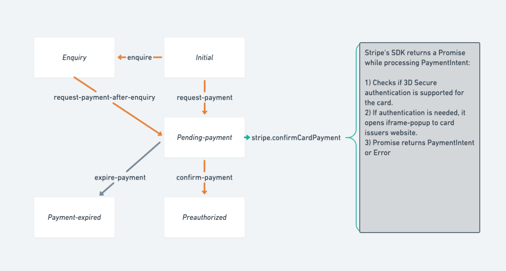
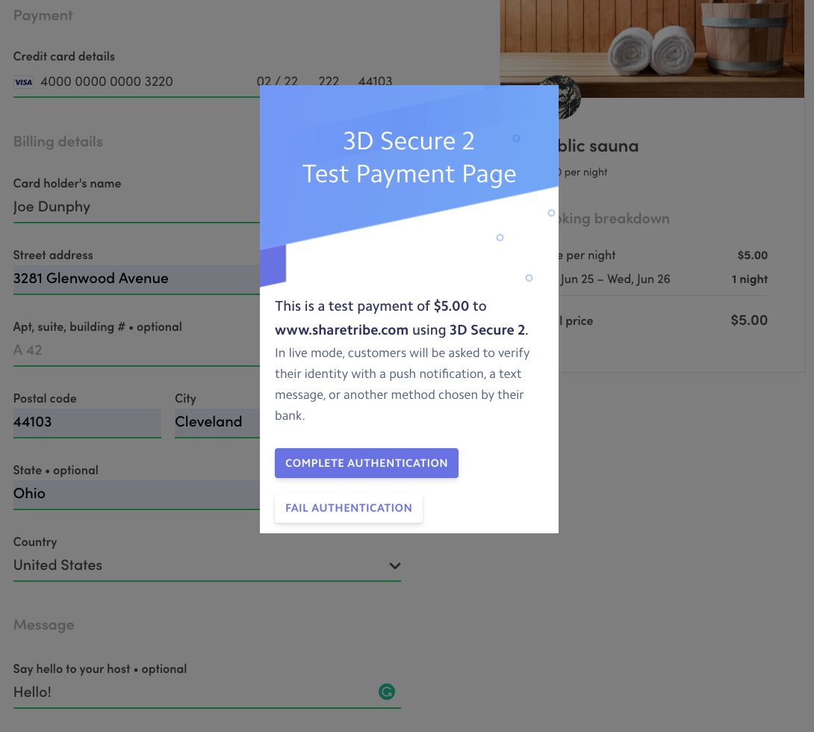

This guide walks you through the process of taking
[PaymentIntents](https://stripe.com/docs/payments/payment-intents) into
use in your custom client application. **These steps are already
implemented in Sharetribe Web Template.**

<plan tier="launch">

Online payments in the Live environment are available in the Launch plan
and above.

</plan>

This article covers how PaymentIntents can be used with card payments.
On general level, the steps are the same for other payment methods. See
[the concepts article on payment methods](/concepts/payment-methods-overview/)
and [payment intents](/concepts/payment-intents/) for more information.
Stripe's PaymentIntent is a new way to handle Strong Customer
Authentication (SCA) by using frictionless
[3D Secure 2](https://stripe.com/gb/guides/3d-secure-2) authentication.

Before starting to read this article, you probably want to get familiar
with
[Strong Customer Authentication](/concepts/strong-customer-authentication/)
and [how PaymentIntent flow works](/concepts/payment-intents/) by
reading related concepts articles.

<info>

Taking Stripe PaymentIntent flow into use is a big change for
CheckoutPage and includes process change. You should carefully check
what kind of changes are made in the legacy template release:
[v3.0.0](https://github.com/sharetribe/flex-template-web/releases/tag/v3.0.0).
Taking an update from upstream or even cherry-picking commits might make
the update easier, but you should first track your custom-code to
affected components.

</info>

## 1. Process change

Stripe's Payment Intents API is a new way to build dynamic payment
flows. Its
[automatic confirmation flow](https://stripe.com/docs/payments/payment-intents/quickstart#automatic-confirmation-flow)
helps a lot since all the authentication actions for a customer are
included in a single call: `stripe.confirmCardPayment`. When called,
Stripe's SDK checks if there's a need for Strong Customer Authentication
(SCA) and creates a popup to card issuer's website.

However, to be able to call `confirmCardPayment`, there needs to be a
new state to the transaction process. Because of this, we have split the
previous transition (Initial - request -> Preauthorized) into two:

So, after transitions (`request-payment` or
`request-payment-after-inquiry`), API returns
`stripePaymentIntentClientSecret` among the protected data of the
current transaction. This client-secret is used for the call to
`stripe.confirmCardPayment`. Then there is another transition made
against Marketplace API, so that it can confirm the PaymentIntent and
preauthorize the order. Transaction process continues normally after
that - i.e. Provider has to accept or reject the order.

Concrete steps here are changing the transaction process, then updating
`bookingProcessAlias` in `config.js` and making necessary changes to
`src/util/transaction.js` file. Remember, when transaction process is
changed, you need to go through all the files that import transitions or
utility functions from `util/transaction`. In practice, we made changes
to _InboxPage_, _TransactionPage_, _TransactionPanel_, _ActivityFeed_,
_BookingBreakdown_, _BookingDatesForm_, and _CheckoutPage_. The list
might be different if you have customized your components or process.

The default transaction process supports SCA, but if you have an older
process version without PaymentIntents, you can see our new example
processes here:

https://github.com/sharetribe/sharetribe-example-processes

All the example processes support SCA. If you need help with the
concrete steps to customize your process to support SCA, contact
Sharetribe support from the support widget in Console and we'll guide
you through the changes.

## 2. Add new thunk calls to stripe.duck.js

When using PaymentIntent flow, we don't need `stripe.createToken`
anymore, but we need to add two new thunk calls:
`stripe.confirmCardPayment` and `stripe.retrievePaymentIntent`.

`stripe.confirmCardPayment` is needed to provide SCA as mentioned
earlier. However, since customers are making several AJAX calls on
`CheckoutPage`, it is possible that there is a network error or
something else happening between those calls. Even the whole page, might
be reloaded at some point. We need to retrieve up-to-date PaymentIntent
from Stripe API and check its status to be able to continue the payment
process. This can be done with `stripe.retrievePaymentIntent`.

<info>

Previously _stripe.confirmCardPayment_ was called
_stripe.handleCardPayment_, which is now deprecated. Basically,
_handleCardPayment_ has been renamed to _confirmCardPayment_. In
addition to the rename, Stripe has slightly modified the arguments.
These changes should not affect the behavior of the method.

</info>

## 3. CheckoutPage: add new API calls and call them in sequence

The biggest change happens in CheckoutPage. When a user submits
StripePaymentForm and `handleSubmit` is called from CheckoutPage, new
data needs to be prepared (billing details: name, email, and billing
address) and then 4 thunk-calls/Promises need to be made in sequence:

### Step 1. _onInitiateOrder_

- This tells Marketplace API to create booking and PaymentIntent
  - Booking is created, so availability management blocks dates for
    conflicting bookings
  - API returns `stripePaymentIntentClientSecret` inside transaction's
    protectedData
- This combines both transitions:
  - `sdk.transitions.initate` aka `request-payment`
  - `sdk.transitions.transition` aka continue inquiry with
    `request-payment-after-inquiry`
- Automatic expiration happens in 15 minutes, if process is not
  transitioned to `'transition/confirm-payment'` before that.
- Created transaction is saved to session storage or existing inquiry tx
  is updated. (There is more about this step later.)

### Step 2. _onConfirmCardPayment_

- This is a call `stripe.confirmCardPayment`
- If the customer must perform additional steps to complete the payment,
  such as authentication, Stripe.js walks them through that process.

### Step 3. _onConfirmPayment_

- This tells Marketplace API that customer has completed the payment
  requirements. API will validate and mark the payment confirmed in
  Sharetribe.

### Step 4. _onSendMessage_

- If the customer has added an initial message to the provider, the app
  sends that message after the payment is confirmed.

<info>

The _stripe.confirmCardPayment_ action needs an instance of Stripe to be
passed from StripePaymentForm. _stripe.confirmCardPayment_ will check
card details from connected Stripe Elements input.

</info>

## 4. CheckoutPage: save updated transaction

We use session storage to buffer checkout page against page reloads and
errors - customer needs to be able to continue payment after accidental
page refresh and network errors. This is a UX issue, but more
importantly, it builds trust. Because of this need, we save booking
dates and other data there. Previously _inquiredTransaction_ was saved
there too, but that concept is now expanded a bit: any transaction can
now be saved to session storage under the key "transaction".

So, if there is an existing transaction in inquiry state and customer
books the listing, TransactionPage sends that `transaction` to
CheckoutPage. As a first step CheckoutPage saves received data to the
session store. This is pretty much the same functionality as with
previous card-token payment process - only the key is changed from
_inquiryTransaction_ to _transaction_. However, after transition
`request-payment` (or `request-payment-after-inquiry`) the updated
transaction is saved again. (the relevant new data in transaction is
`stripePaymentIntentClientSecret`.)

In addition, the handling of order breakdown with
_speculatedTransaction_ needs to be changed, because saved transaction
already contains booking in some cases and a new call to
`sdk.transactions.initiateSpeculative` would just return a conflict
error telling about an already existing booking.

## 5. StripePaymentForm: adding billing details and showing errors

Most of the visual changes happen in StripePaymentForm. Billing details
are added to the form and most of the errors of different thunk calls
are shown inside it.

The default mode for Sharetribe Web Template is to show billing address
fields. Even though it is recommended by Stripe, you might want to
remove those fields due to UX reasons. That can be made just by not
adding `StripePaymentAddress` sub-component.

<info>

If the page is reloaded after successful call to
_stripe.confirmCardPayment_, billing details should not be shown to the
user since credit card number and other billing details are already sent
to Stripe.

</info>

## 6. Test with live credit cards

Since 3D Secure authentication flow is different between different
credit card issuers, you should test at least some credit cards how they
work in a live environment.

This can be done by creating another
[live environment](/template/how-to-deploy-template-to-production/)
instance of your client app that uses

- your live Client Id for Sharetribe and
- live Stripe keys (both publishable and secret).

Then create a new Git branch that takes PaymentIntents flow into use and
adds
[Basic Authentication configuration](https://github.com/sharetribe/web-template/blob/main/.env-template#L51)
into environment variables. After that, you could deploy your
payment-intent branch into your live environment. Then you can just book
some existing listing and maybe reject it to get refund to your live
card account.
