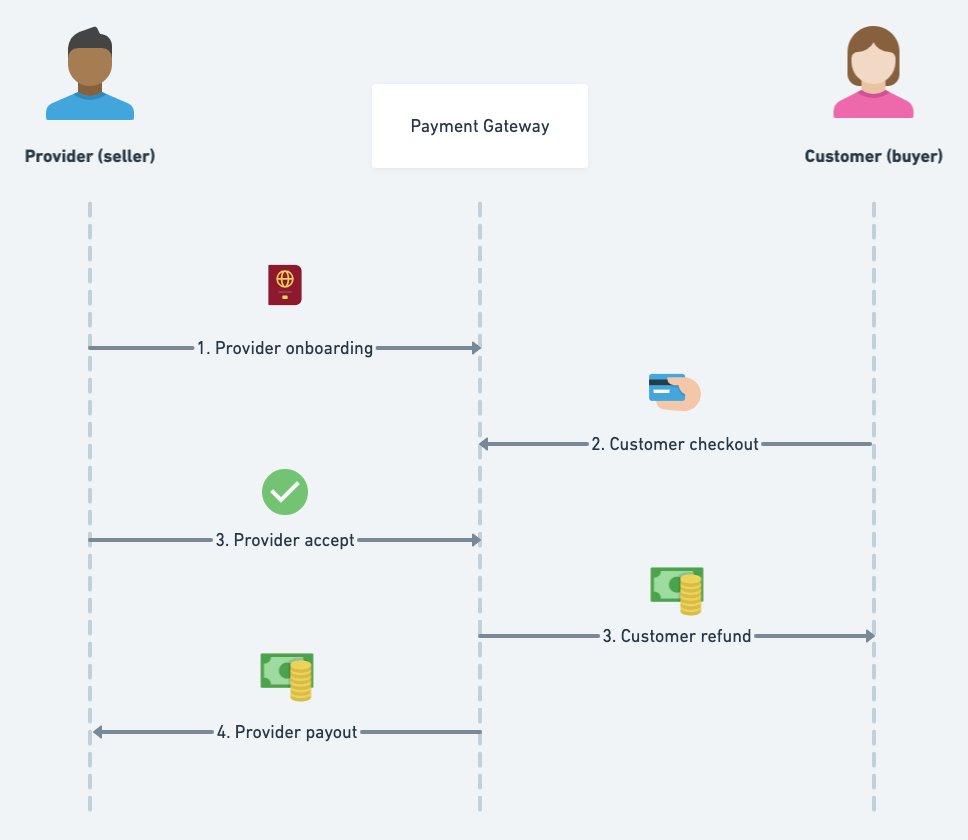
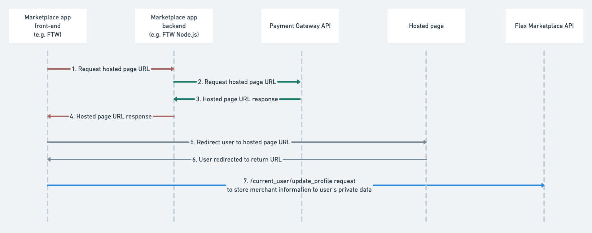
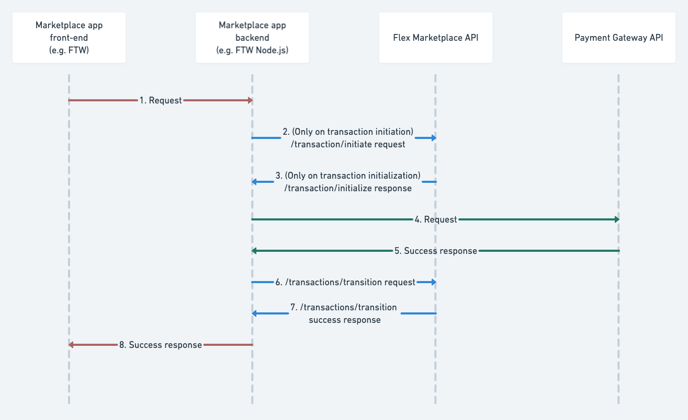
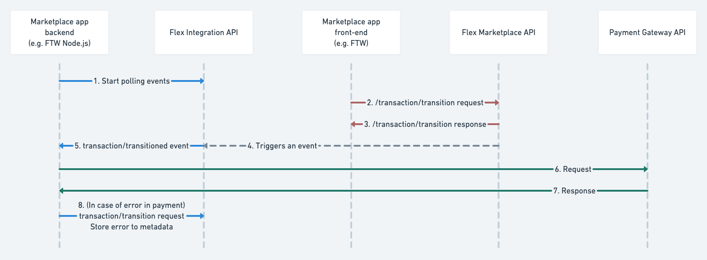
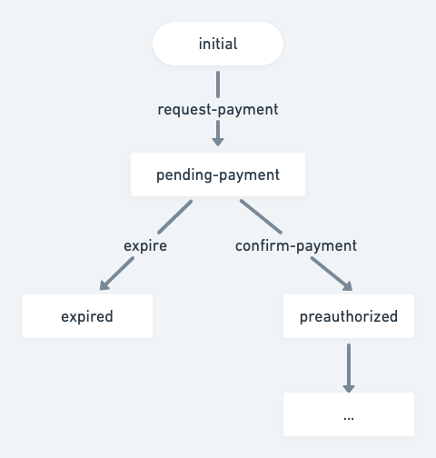

---
title:
  How to integrate a 3rd-party payment gateway with your marketplace
slug: how-to-integrate-3rd-party-payment-gateway
updated: 2023-10-24
category: how-to-payments
ingress:
  This guide describes, on a high-level, how to integrate any 3rd-party
  payment gateway with your Sharetribe-powered marketplace.
published: true
---

Sharetribe provides out-of-the-box integration with Stripe. To reach
markets not supported by Stripe, relying on another payment gateway can
be crucial. This guide describes on a high-level, without going into the
details of specific payment gateways, how to integrate any 3rd-party
payment gateway (such as [PayPal Commerce
Platform][paypal-commerce-platform], [MANGOPAY][mangopay-marketplaces],
or [Adyen for Platforms][adyen-for-platforms]) with Sharetribe.

## Prerequisites

Before reading this guide, you should be familiar with the following
Sharetribe features:

- [Privileged transitions][dev-docs-concepts-privileged-transitions]
- [Events][dev-docs-refence-events]
- [Reacting to events][dev-docs-howto-reacting-to-events]
- [Extended data][dev-docs-reference-extended-data]

## Marketplace payment flow

In this section we illustrate a marketplace payment flow in high-level
and briefly discuss each stage. Later in this article, we'll go through
how to integrate each state with your Sharetribe-powered marketplace.

In a nutshell, a payment flow in a marketplace contains five significant
steps. The following diagram illustrates a timeline of these steps:

<!--
Diagram source: https://whimsical.com/how-to-integrate-a-3rd-party-payment-gateway-PBY6qRjauyb7v5pEdXY4pS
-->

### Step 1: Provider onboarding

In this step, the provider connects their Sharetribe account with the
payment gateway. This is the step when they provide the bank details
where the money from the customers will be transferred to. In addition,
in this step, they provide the necessary information and documents for
the identity verification and _Know Your Customer (KYC)_ requirements.

### Step 2: Customer checkout

Customer checkout happens when the customer initiates a transaction. At
this stage, they also provide the payment information, such as their
credit card number. Also, the payment will be made at this point. The
payment gateway will preauthorize the money, i.e. reserve the money on
customer's credit card.

### Step 3: Provider accept

After the customer has checked out, the provider has ability to either
accept or reject the request. If the request is accepted, the payment
will be captured, and the reserved money will be transferred from
customer's credit card to the payment gateway.

Provider accept is a step that you can combine with the customer
checkout. The flow where provider accept happens instantly after
customer checkout is called "instant booking" flow.

### Step 4: Customer refund

Typically, the marketplace payment flow contains a delayed payment
period. This is the time between the money is captured from customer's
credit card and transferred to the provider's bank account. The payout
in marketplaces usually happen after the provider has successfully
provided the agreed service.

Customer refund usually happens during the delayed payment period. There
are many reasons why a refund may be necessary, for example, the
provider or customer may not be able to make it or the provided service
was not what was agreed.

### Step 5: Provider payout

If everything in the transaction went right and the customer received
the agreed service, the money from the payment gateway will be
eventually paid out to the provider.

## Can I just accept all payments to my own bank account and pay my providers manually?

You might be wondering if it would be easier for you to just accept the
entire payment to your own bank account, and handle refunds to customers
payouts to providers separately, outside the main platform
functionality.

In terms of development work required to build the integration, this is
indeed a lot easier. Any online payment service provider in the world
supports such a simple checkout flow.

However, this can lead to a myriad of issues in terms of regulation,
accounting, and liability. You could be considered as holding other
people's money, which is a heavily regulated area. In many countries,
you need to acquire an expensive license for this purpose, and holding
money without such a license is considered a crime. You might also be
considered to be responsible for providing the goods or services your
providers are selling, which is not always desirable. Finally, handling
the payouts to the providers correctly can be quite a lot of manual,
error-prone labor. You also still need to ensure the Know Your Customer
process has been done correctly for them.

Because of these challenges, we recommend you to only consider building
a flow where the entire payment goes to your account only if you're
absolutely sure that you're aware of all the consequences, and have
gotten your approach greenlighted by your accountant and a lawyer
familiar with the matter.

From now on, this article focuses on integrating with a
marketplace-specific payment solution, which handles the issues
described above for you. [Learn more about choosing the right payment
service provider][academy-payment-service-providers].

## Before you start the integration

Before you start coding the integration, we strongly advise you to
contact the payment provider's customer support team.

Keep in mind that while many payment providers give you access to their
sandbox environment, access to the live environment usually needs
contacting customer support and possibly signing a contract with them.

Contact the support and make sure that:

- They are available in the country where you operate your business
- They support a marketplace-specific payment flow, handling Know Your
  Customer process for your providers and splitting payments
- They can process the currencies of your marketplace
- They can do payouts to your providers' country/countries
- You are eligible to get access to the live environment
- You know the process of how to get access to the live environment
- You are familiar with the fees involved.

## White-label or hosted onboarding and payments

Before integrating a 3rd-party payment gateway with Sharetribe, a few
words on the different onboarding and payment experiences the payment
gateways offer. The different experiences have implications for the
integration, branding, and also the level of PCI-compliance required.

There are two main types of onboarding and payment experiences the
payment gateways offer: white-label and hosted. However, most providers
offer a mix of both.

### White-label onboarding and payments

Payment gateways such as [MANGOPAY][mangopay-marketplaces] and
[Adyen][adyen-for-platforms] offer a so-called white-label experience.
This experience is closest to the default [Stripe
Connect][stripe-connect] integration in Sharetribe.

A white-label experience means that you build the payment flow inside
your marketplace application. This way, you have control over the
user-interface and branding. The downside is that the integration
requires more coding to build, most likely requires more maintenance,
too. The regulations concerning online payments may change, which means
you'll need to update your integration accordingly.

When using white-label experience, you may also need to do some work
regarding PCI-compliance, but more on that later.

### Hosted onboarding and payments

Some payment gateways, such as PayPal, offer a hosted experience. In
this case, the seller onboarding and customer payments happen by
redirecting your user to the payment provider's website. After the
customer completes the payment, the payment gateway redirects them to
your application to the return URL you provided. This is also the case
with seller onboarding: they'll interact with the branded user interface
of the payment gateway.

With this model, you have limited control over the user-interface on the
payment provider's website. However, there is also less coding required
from you: The payment provider has already implemented the required
forms and hosts them for you. In the case of a well-known payment
gateway, their branded payment experience can also increase the
perceived security of the payment experience.

In case of regulatory changes, the payment provider updates their
user-interface to comply with the new regulation. Most likely, you also
don't need to do any work regarding PCI-compliance when using a hosted
experience.

### Hosted onboarding and white-label payments

White-label payment gateways usually offer an option to use hosted pages
in some stages of the payment flow. We offer this approach by default
with the Stripe integration in Sharetribe, where we use [hosted pages
for provider onboarding][stripe-connect-onboarding] and a white-label
experience for customer checkout.

Using hosted pages for some parts of the payment flow and white-label
experience for other parts provides a good balance between the work
required from you and the ability to customize the user experience. For
example, we've chosen to use Stripe-hosted pages for Sharetribe's
provider onboarding because in this step, compliance with the _Know Your
Customer_ (KYC) guidelines is critical and may include uploading
identity documents or utility bills. Implementing all that in a
white-label fashion would require an undesirable amount of work.

## Do you need to be PCI DSS compliant to integrate with a 3rd-party payment gateway?

PCI DSS stands for Payment Card Industry Data Security Standards. It is
a set of security standards to ensure that companies that accept credit
card payments process, store, and transfer the credit card information
securely.

Since you are operating a marketplace business that accepts payment by
credit card, you have to be PCI DSS compliant. However, there are
different levels to PCI DSS compliance. You can reduce your required
level of compliance significantly by using a payment gateway that offers
tools like hosted pages and components or client-side encryption of the
credit card information.

All of the payment gateways listed in this article
([Adyen][adyen-for-platforms], [PayPal][paypal-commerce-platform],
[MANGOPAY][mangopay-marketplaces], and [Stripe][stripe-connect]) offer
such tools.

### PCI DSS compliance levels

There are four PCI DSS compliance levels, where Level 1 is the
strictest.

Level 4 is for small-to-medium-sized businesses that process less than
20,000 transactions per year. Most early-stage marketplace entrepreneurs
start at this level.

The only requirement for becoming Level 4 PCI DSS compliant is to
perform a Self-Assessment Questionnaire (SAQ).

### Self-Assessment Questionnaire (SAQ)

The PCI Security Standards Council offers several SAQ questionnaire
documents. The one you should choose depends on your payment
integration.

If you outsource credit card information processing to a PCI-compliant
3rd-party payment gateway, the required questionnaire is
[Self-Assessment Questionnaire A (SAQ A)][pci-saq-a-pdf]. The SAQ A is
relatively short (24 yes/no questions).

Some payment gateways prefill the questionnaire for you. [This is, for
example, what Stripe does.][stripe-how-helps-pci]

### When and where do I submit the Self-Assessment Questionnaire?

Most likely, your payment gateway will contact you and ask you to upload
the Self-Assessment Questionnaire and additional documents, if
necessary.

#### Example: Stripe

- If you use [Stripe Checkout/Elements, Mobile SDK, or
  Connect][stripe-integration-security], Stripe pre-fills the SAQ A for
  you.
- Stripe monitors your transaction volume and notifies if a [growing
  transaction volume will require a change in how you validate
  compliance][stripe-how-helps-pci].

#### Example: Adyen

- If you use [Pay by Link][adyen-pay-by-link] (hosted experience), Adyen
  doesn't require you to submit SAQ A.
- If you use [Drop-in or Components][adyen-drop-in-or-components]
  (white-label), Adyen requires you to assess your compliance with SAQ A
  and submit the filled questionnaire.

### Conclusion about marketplace PCI DSS compliance

On some level, you need to be PCI DSS compliant.

However, if you are on Level 4, depending on the type of your payment
integration, becoming PCI DSS compliant requires little to no work from
you.

## Communication between the marketplace app and payment gateway

Before integrating a 3rd-party payment gateway into your marketplace,
it's good to be aware of the different methods apps can use to
communicate with a payment gateway.

The most common communication methods are:

- API calls
- Redirect URLs and Return URLs
- Webhooks.

The communication method to use depends on the onboarding and payment
experience, and the payment flow stage. For example, Redirect URLs are
only used for hosted onboarding and payment pages. API calls instead are
heavily used for white-label onboarding and payments, but they are also
needed even when using hosted payments to request the hosted page URL
where the user should be redirected.

Next, we'll go through all the different communication methods.

### API calls

The marketplace can communicate with the payment gateway by calling
their API. The marketplace needs to do this for example to request URL
for the hosted page or make a payment in a white-label fashion. Even
when using hosted experience payments, you still need to make API calls
to the payment gateway for some payment actions, such as capturing the
payment or refunding a payment.

To call the API, the payment gateways require you to use a secret key
which you should never expose to the public. Thus, the API calls to the
payment gateway need to happen from your marketplace backend, never from
the user's browser.

### Redirect URLs and Return URLs

When using hosted pages (i.e. your onboarding or payment experience is
fully hosted or combines hosted and white-label stages), your app
communicates with the payment gateway through data added in the URL.

Before redirecting your user to the hosted page, your marketplace makes
an API call to the payment gateway to request the URL to the hosted
page. At this point, your marketplace provides the payment gateway two
different return URLs: one for when a payment is completed by the user,
and one for failed or canceled payment. After receiving the hosted page
URL from the payment gateway, you redirect the user to that URL.

When the user returns from the hosted page, the payment gateway
redirects them to one of the return URLs depending on the payment
status.

<!--
Diagram source: https://whimsical.com/how-to-integrate-a-3rd-party-payment-gateway-PBY6qRjauyb7v5pEdXY4pS
-->

The payment gateway appends data about the onboarding or payment result
to the return URL query parameters. When it redirects the user to your
application, you can read this data from the URL and store it for later
use. You can use [the Marketplace API's update current user
endpoint][marketplace-api-update-user-profile] to store seller's
onboarding status to current user's private data or the [Integration API
to store payment status to transaction's
metadata][integration-api-update-transaction-metadata].

#### Example: PayPal redirect after seller onboarding

After successful seller onboarding, PayPal redirects the seller to the
return URL and [loads the URL with the following query
parameters][paypal-redirect-seller]:

- `merchantId`
- `merchantIdInPayPal`
- `permissionsGranted`
- `accountStatus`
- `consentStatus`
- `productIntentId`
- `isEmailConfirmed`
- `returnMessage`
- `riskStatus`

The marketplace should store at least the `merchantId` to current user's
private data. Later on, when a customer makes a payment to the seller,
the `merchantId` is needed in order to pay for the correct seller.

### Webhooks

Payment gateways send webhook notifications that you can listen to.

You may want to listen to these notifications in a case where customer
onboarding on a hosted page contains multiple steps or when a particular
payment action such as payout is happening without user involvement, and
you want to know the status of that action.

#### Example: PayPal onboarding

[PayPal seller onboarding][paypal-track-seller-onboarding] is complete
when the following requirements are met:

1. Seller creates a PayPal account.
2. Seller grants you permission for the
   [features][paypal-rest-endpoint-feature] you set.
3. Seller confirms the email address of the account.

The marketplace can track the onboarding status by listening to the
webhook notifications. When the marketplace knows the onboarding status,
it can be used to provide the seller a useful message in the marketplace
user-interface, should as "PayPal account created, but the email address
is not yet confirmed. Please confirm the email address in order to
complete the onboarding".

#### Backend endpoint to listen to webhook notifications

To listen to webhooks, you'll need to implement a new endpoint to your
backend and configure the payment gateway to send the notifications to
that URL. The endpoint should read the notifications and decide what to
do with them and where to store the information. If a notification is,
for example, about the user's onboarding status, you can use [the
Integration API to store the information in the user's private
data][integration-api-update-user-profile]. On the other hand, if the
notification is about a payment related to a transaction, you may want
to store the information in the [transaction's
metadata][integration-api-update-transaction-metadata] or [transition
the transaction][integration-api-transition-transaction].

If you use a Sharetribe Web Template, you can add a new endpoint by
adding it to the [API router][web-template-api-router].

We recommend securing the endpoint with Basic Authentication if the
payment gateway supports that.

## Integrating your Sharetribe marketplace with a 3rd-party payment gateway

There are two main options for integrating Sharetribe with a 3rd-party
payment gateway:

- [Privileged transitions][dev-docs-concepts-privileged-transitions]
- [Events][dev-docs-refence-events].

For some payment flow stages you can use either method to build the
integration, but for some stages using exactly one of the two is
required. In the next chapter, we'll give our recommendations on which
option to use in each step. First, a quick introduction to how each
method works in practice.

### Using privileged transitions

To use privileged transitions, you need to make a new endpoint to your
backend server. Your marketplace front-end should call this new backend
endpoint and not the Sharetribe API directly.

If you use Sharetribe Web Template, you can add a new endpoint by adding
it to the [API router][web-template-api-router].

The new server endpoint should call the payment gateway API to do the
payment action and the Sharetribe Marketplace API to transition the
transaction.

The following diagram shows the call sequence between the marketplace
and the APIs. First, a user makes a transaction request using the
marketplace front end, after which the backend calls the Sharetribe
Marketplace API to initiate the transaction. Next, the marketplace
backend calls the payment gateway's API, and finally the Sharetribe
Marketplace API is called again after the payment action is completed.

<!--
Diagram source: https://whimsical.com/how-to-integrate-a-3rd-party-payment-gateway-PBY6qRjauyb7v5pEdXY4pS
-->

Error handling in this model is simple. Because all the calls to the
Sharetribe Marketplace API and the payment gateway's API are triggered
by the request of the end-user, your marketplace front-end can
immediately return a failure response and show an error message to the
user when things go wrong.

### Using Events

You can also use Events for your payment gateway integration.

In this model, the transaction transition is done as usual. Your backend
polls the events and reacts to transaction transition events by calling
the payment gateway API.

<!--
Diagram source: https://whimsical.com/how-to-integrate-a-3rd-party-payment-gateway-PBY6qRjauyb7v5pEdXY4pS
-->

Error handling in this model needs more attention than in the privileged
transition model. If the payment action fails, the transaction is in a
state where the transaction and payment are out of sync.

**Example:** Let's imagine the customer made a transition "cancel,"
which moved the transaction to the "canceled" state, but the "refund"
payment action failed. If you don't handle this error state, the
customer gets charged without receiving the service.

There are a couple of ways you can set up Events to handle the error
case:

- Retry the payment action immediately, in case of a network error or
  error 5xx from the payment gateway.
- Send a notification to the marketplace operator. The operator can then
  manually resolve the issue (e.g., by manually refunding from the
  payment gateway's dashboard)
- Transition the transaction to an error state, e.g.,
  "canceled-but-refund-failed." The operator then needs to manually
  resolve the issue with a refund.
- Write the error in the transaction's metadata and show it to the user.
  The user can then contact the operator to resolve the situation.

## Integrating payment steps with your marketplace

In the beginning of this document we illustrated a high-level picture of
the different payment steps in a marketplace payment flow. In this
chapter we'll go through each step and how to integrate them with your
marketplace.

### Step 1: Provider onboarding

The provider onboarding step usually needs to happen before the customer
starts the transaction. Onboarding can occur during or right after
listing creation.

If you choose white-label onboarding, you need to build the necessary
forms in your marketplace to ask for the required customer details.
Also, to comply with the _Know Your Customer_ (KYC) requirements, the
customer may need to upload certain documents such as an identity
document or a utility bill to prove their identity.

If you're using a payment gateway that provides hosted onboarding, you
need to redirect the user to the onboarding page hosted by the payment
provider. When the user returns from the hosted page, you receive
information about the newly created merchant account (e.g., a merchant
ID) in the return URL. You should store this information in the user's
private data. You can use [the Marketplace API's update current user
endpoint for this][marketplace-api-update-user-profile].

**Recommendation:** Use hosted pages for onboarding if they are
available. Building the necessary forms, including the file upload
forms, can be avoided using hosted pages. Besides, the KYC requirements
tend to change over time. By using hosted pages, you avoid the need to
change your application when the requirements change. The payment
provider will keep the hosted pages up to date with the regulatory
requirements.

### Step 2: Customer checkout

Customer checkout happens during transaction initialization, and it's an
essential part of your marketplace payment flow. It's also the step that
requires the most integration work.

Before you start implementation, consider what payment methods you are
about to integrate and where your customers are located. Does the
payment method have separate authorization and capture actions, or are
the funds immediately captured during the payment? Are your customers
located in countries that require 3D Security?

In this step, your marketplace collects the customer's credit card
information. Keep in mind that you should never pass unencrypted credit
card information via your server. Use either the JavaScript
library/elements provided by the payment gateway, client-side
encryption, or hosted pages when collecting credit card information.

**Recommendation:** Use **privileged transitions** for this step.

**Recommendation:** Initiate the Sharetribe transition before payment.

If using 3D Security is required, the checkout process may contain
multiple steps where the customer may have to leave your marketplace app
and go to their bank's website to confirm the payment. This process may
take some time for the user to complete. Because of that, we recommend
that you initiate the Sharetribe transition first, before initiating the
payment. During the initialization of the transaction, you can already
make a booking and ensure availability. It would be a bad experience for
the user to pay first but then realize that the transaction
initialization failed because someone else managed to book the selected
timeslot a moment before they did.

The transaction should be in a "pending-payment" state at this point.
After the payment is successfully made, transition the transaction
forward to a "paid" state. The "pending-payment" state should have an
automatic expiration, e.g., after 15 minutes. The user may not finalize
the payment, and thus we need to expire the transaction.

The transaction process should look something like this:

<!--
Diagram source: https://whimsical.com/how-to-integrate-a-3rd-party-payment-gateway-PBY6qRjauyb7v5pEdXY4pS
-->

The steps to implement this stage are:

1. Add ([or modify existing][template-initiate-privileged]) server
   endpoint for initiating a transaction.
2. Initiate the transaction.
3. Make the payment after the transaction is initiated.
4. Ensure that the payment went through.
5. Transition the transaction forward.

### Step 3: Provider accept

Depending on the payment method, the payment may happen in one or two
steps. The two steps are:

- Authorization (payment gateway reserves the money from the buyer's
  credit card)
- Capture (payment gateway transfers the money from the buyer)

Credit card payments use these two steps, whereas some payment methods
like [giropay][giropay] or [iDEAL][ideal] have only one step where the
payment is authorized and captured in one go.

If you're using a payment method where authorization and capturing
happens in one step, you should skip the provider accept stage, and
implement a so-called "instant booking" flow. In this flow, the provider
is expected to be able to provide the service to the customer, thus, no
separate accept stage is needed. For this to happen, the providers must
keep their availability calendar up-to-date.

Even if you're using payment method with separate authorization and
capture steps, it's worth considering whether you could streamline the
transaction process by implementing an instant book flow.

In case you decide to have the provider accept state to your transaction
process, you should do the payment authorization on customer checkout
and capture the payment on provider accept. After the money is captured,
you most likely need to pay the payment gateway's processing fees, even
if the provider ends up declining the customer's request.

If the provider declines the request, or if it expires due to a lack of
answer from the provider, the payment should be voided.

**Recommendation:** Use **events** for this step. Poll the
transaction/transition events and react on accept/decline/expire
transitions. Call the payment gateway API to either capture or void the
payment.

### Step 4: Customer refund

In most marketplaces, it makes sense to have a delayed payment period.
During this period, the customer has paid, but the money is not yet paid
out to the provider. The provider is expected to provide the service
first, and payout happens after the service was successfully provided.

Customer refund usually happens during this period.

**Recommendation:** Use **events** for this step. Poll the
transaction/transition events and react on transitions where a refund is
needed by calling the payment gateway API.

### Step 5: Provider payout

At some point, it's time to release the money to the provider and do the
payout.

Depending on the provider's bank, there's usually a delay between when
the payout is issued and when the money reaches the provider's bank
account. The delay is on a scale of days, but not weeks.

**Recommendation:** Use **events** for this step. Poll the
transaction/transition events and react on transitions where the payout
is needed by calling the payment gateway API.

## Summary

In this document, we first illustrated on a high-level a typical
marketplace payment flow. After that, we went through the different
payment gateway integration experiences, white-label and hosted, and
their implications to the integration, branding, and PCI DSS compliance
requirements. We then discussed PCI DSS compliance in more detail.

We discussed the integration and what are the options to communicate
with payment gateways. After that, we laid out the two different options
to hook your payment integration code with Sharetribe: privileged
transitions and events. Finally, we went through each stage of the
marketplace payment flow and gave recommendations on how to integrate a
3rd-party payment gateway to each step.

## Further reading

- [Platforms quick start by Adyen][adyen-platforms-quick-start]
- [PayPal Commerce Platform for Marketplaces and Platforms developer
  documentation][paypal-commerce-platform-docs]
- [MANGOPAY API Documentation][mangopay-api-docs]

[academy-payment-service-providers]:
  https://www.sharetribe.com/academy/marketplace-payments/
[paypal-commerce-platform]:
  https://www.paypal.com/us/business/platforms-and-marketplaces
[paypal-commerce-platform-docs]:
  https://developer.paypal.com/docs/platforms/
[paypal-redirect-seller]:
  https://developer.paypal.com/docs/platforms/seller-onboarding/before-payment/#4-redirect-seller
[paypal-rest-endpoint-feature]:
  https://developer.paypal.com/docs/api/partner-referrals/v2/#definition-rest_endpoint_feature
[paypal-track-seller-onboarding]:
  https://developer.paypal.com/docs/platforms/seller-onboarding/before-payment/#5-track-seller-onboarding-status
[mangopay-marketplaces]: https://www.mangopay.com/marketplaces/
[mangopay-api-docs]: https://docs.mangopay.com/
[adyen-for-platforms]:
  https://www.adyen.com/our-solution/marketplaces-and-platforms
[adyen-platforms-quick-start]:
  https://docs.adyen.com/platforms/quick-start
[adyen-pay-by-link]:
  https://docs.adyen.com/development-resources/pci-dss-compliance-guide?tab=pay_by_link_1#online-payments
[adyen-drop-in-or-components]:
  https://docs.adyen.com/development-resources/pci-dss-compliance-guide?tab=drop_in_or_components_2#online-payments
[stripe-connect]: https://stripe.com/connect
[stripe-connect-onboarding]: https://stripe.com/connect/onboarding
[stripe-how-helps-pci]:
  https://stripe.com/en-fi/guides/pci-compliance#how-stripe-helps-organizations-achieve-and-maintain-pci-compliance
[stripe-integration-security]:
  https://stripe.com/docs/security/guide#validating-pci-compliance
[giropay]: https://www.giropay.de/
[ideal]: https://www.ideal.nl/en/
[dev-docs-concepts-privileged-transitions]:
  /concepts/privileged-transitions/
[dev-docs-refence-events]: /references/events/
[dev-docs-howto-reacting-to-events]: /how-to/reacting-to-events/
[dev-docs-reference-extended-data]: /references/extended-data/
[pci-saq-a-pdf]:
  https://www.pcisecuritystandards.org/documents/PCI-DSS-v3_2_1-SAQ-A.pdf
[marketplace-api-update-user-profile]:
  https://www.sharetribe.com/api-reference/marketplace.html#update-user-profile
[integration-api-update-transaction-metadata]:
  https://www.sharetribe.com/api-reference/integration.html#update-transaction-metadata
[integration-api-update-user-profile]:
  https://www.sharetribe.com/api-reference/integration.html#update-user-profile
[integration-api-transition-transaction]:
  https://www.sharetribe.com/api-reference/integration.html#transition-transaction
[web-template-api-router]:
  https://github.com/sharetribe/web-template/blob/main/server/apiRouter.js
[template-initiate-privileged]:
  https://github.com/sharetribe/web-template/blob/main/server/api/initiate-privileged.js
