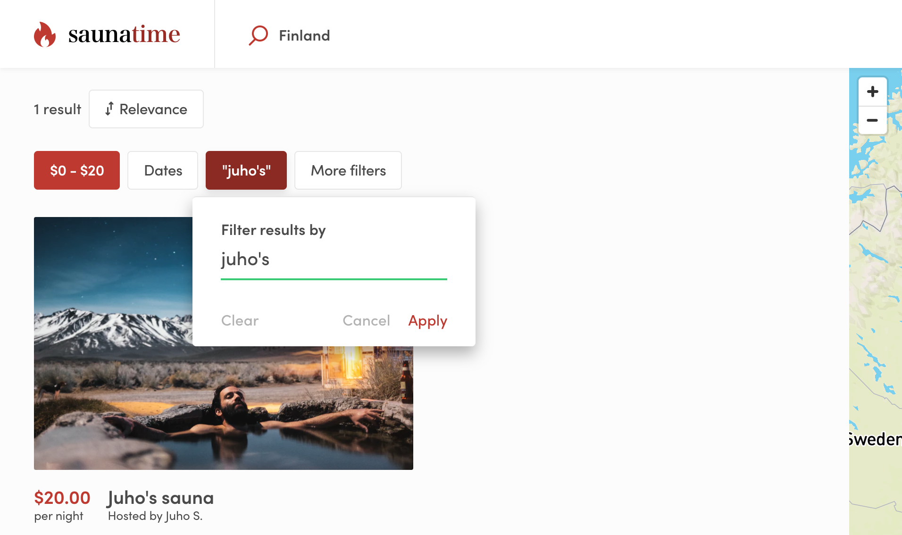

The search experience can be improved by adding search filters to narrow
down the results. The filters rely on listing's indexed data.

There are 3 different UI contexts that render filters. On the mobile
layout, all filters are rendered to a modal inside the
`SearchFiltersMobile` component. On the desktop layout, the most
important filters are in `SearchFiltersPrimary`, and extra filters are
in `SearchFiltersSecondary` panel, which opens when user clicks the
_"More filters"_ button.

## Filter types

Sharetribe Web Template has several different filter types:
_BookingDateRangeFilter_, _KeywordFilter_, _PriceFilter_,
_SelectSingleFilter_ and _SelectMultipleFilter_. Select single and
select multiple filters are generic – they can be used to filter search
results using different kinds of data. The price and date range filters,
on the other hand, are only used for filtering by price and date range.
Listings with hourly bookings can also be filtered by their availability
in a date range with an optional minimum duration. Keyword filter is a
special case - more about that later.

_SelectSingleFilter_ and _SelectMultipleFilter_ can be used with
extended data. The _SelectSingleFilter_ can be used to filter out
listings with only one string value in a related public data field. For
instance, a listing's publicData attribute could contain an attribute
`category: 'city-bikes'`. The related Marketplace API listing query
could then be made with the query parameter `pub_category=city-bikes`.

The _SelectMultipleFilter_, on the other hand, can take multiple values
for a single search parameter. In this case, a listing entity could
contain public data `accessories: ['bell', 'lights', 'lock']` and the
query parameter to retrieve that listing among other search results
could be `pub_accessories=has_any:bell,mudguard`.

We will tell you more about these filters later on in this article.

## Keyword filter

The keyword filter works a bit differently from the other filters. It
does filter search results, but it also sorts those results according to
how strongly the listing's data (title, description, and possible
extended data) correlates with the search string. Currently, there is no
decay function that would map keyword match correlation with distance to
`origin`, so the _origin_ param cannot be used at the same time as the
_keyword_ param. You can read more about how the keyword search works in
the related [concepts article](/concepts/how-the-listing-search-works/).



It is possible to remove location search from topbar and replace it with
the keyword search or use them together (without origin param). You can
configure the main search type in **src/config/configSearch.js**.

<info>

Search strings with only 1 or 2 letters have a longer timeout before the
search query is made.

</info>

## Adding a new search filter

Next we'll guide you through the steps of adding a _gears_ filter to the
marketplace.

<info>

If your marketplace is using hosted configurations defined in Sharetribe
Console, you can make the changes described in this section by adding
new listing fields and defining the correct search settings for the
field.

**[Skip to the next section](#creating-your-own-filter-types)**

</info>

First step for adding a new filter is to make sure that the data being
used for filtering is saved in the listing's `publicData` attribute. On
how to achieve this, please refer to the
[Extend listing data in Sharetribe Web Template](/how-to/extend-listing-data-in-template/)
how-to guide. Another aspect in search filters is that a
[search schema](/references/extended-data/#search-schema) needs to be
added to the data in order for API to index it for search. Adding search
schema can be done by the
[Sharetribe CLI](/introduction/getting-started-with-sharetribe-cli/).

Once a public data attribute is added to the listings and the data
attribute is indexed, the listing searches can be filtered by that
attribute by adding a query parameter that consists of a preceding
"pub\_" and the attribute name, so for the _capacity_ attribute the
parameter would be "pub_capacity". You might have guessed that "pub\_"
refers to **public data**. Similarly, "meta\_" would refer to
**metadata**, which is another type of extended data.

Further reading on public data can be found in the
[listing extended data concepts article](/concepts/listing-extended-data/)
and the
[Extend listing data in Sharetribe Web Template](/how-to/extend-listing-data-in-template/)
how-to guide.

In Sharetribe, only top-level attributes can be indexed i.e. used for
search. If you have a public data attribute with nested attributes, it
is not possible to create a search schema for those. So instead of using
a nested attribute:

```jsx
publicData: {
  instrumentProficiency: {
    // These attributes cannot be indexed for search in Sharetribe
    violin: 'professional',
    guitar: 'intermediate',
    tuba: 'beginner',
  },
}
```

you would need to set all attributes you want to query as top-level
attributes:

```js
publicData: {
  // These attributes can be indexed for search in Sharetribe
  violinProficiency: 'professional',
  guitarProficiency: 'intermediate',
  tubaProficiency: 'beginner',
}
```

### Common changes

A few common changes are required to add a select single or a select
multiple filter to desktop and mobile views.

In the default Sharetribe Web Template, listing extended data
configurations are defined in the `configListing.js` file:

```shell
└── src
    └── config
        └── configListing.js
```

There you need to add the _gears_ attribute's configurations to the
`listingFields` array:

```js
{
  key: 'gears',
  scope: 'public',
  schemaType: 'enum',
  enumOptions: [
    { option: '1' , label: 'Single speed' },
    { option: '2to3' , label: '2 to 3' },
    { option: '4to7' , label: '4 to 7' },
    { option: '8to15' , label: '8 to 15' },
    { option: '16to24' , label: '16 to 24' },
    { option: '25+' , label: 'Over 25' },
  ],
  filterConfig: {
    indexForSearch: true,
    label: 'Gears',
    group: 'secondary'
  },
  showConfig: {
    label: 'Gears',
    isDetail: true,
  },
  saveConfig: {
    label: 'Gears',
    placeholderMessage: 'Select number of gears...',
    isRequired: true,
    requiredMessage: 'You need to select number of gears',
  }
},
```

<info>

[Extend listing data in Sharetribe Web Template](/how-to/extend-listing-data-in-template/)
how-to guide explains the listing extended data configurations in more
detail.

</info>

In terms of search, the above configuration has a few relevant
attributes. The `key` attribute defines where in the listing's extended
data the values are stored. The `scope` attribute determines how the
query parameter gets formed, if the whole extended data attribute is
specified as searchable.

The `filterConfig` object defines how the attribute is displayed on the
search page. The `label` attribute is modified in configListing.js
instead of through the marketplace text file (e.g. _en.json_), because
we thought that having it here would make customizations easier.
However, you could use
`<FormattedMessage id="some.marketplace.text.key.here" />` component
instead of plain string as the value of `label` if you want.

The `schemaType` configuration is used, among other things, to determine
the default search component used on search page. The current filters
that can deal with extended data are **SelectSingleFilter** for enum
types, and **SelectMultipleFilter** for multi-enum types. However, you
can also pass `filterConfig.filterType` explicitly to use
**SelectMultipleFilter** with enum attributes.

Finally, `group` can be 'primary' or 'secondary'. On the desktop layout,
primary filters are those which are visible by default, and secondary
filters are not visible. You can open the secondary filters panel by
clicking "More filters" button.

As a summary, the new filter configuration in `listingFields` array is
enough to render a _gears_ filter on search page. That is, if you have
the correct schema added for the _gears_ attribute to the search engine
using
[Sharetribe CLI](/introduction/getting-started-with-sharetribe-cli/).

## Creating your own filter types

If you are creating new filter types, note that we are using two
different types of components: popup and plain. Popup components are
rendered as primary dropdowns in the search view in
`SearchFiltersPrimary` component. Plain components are used with
`SearchFiltersMobile` and `SearchFiltersSecondary`.
_SearchFiltersSecondary_ opens secondary filters in a distinct panel in
order to fit additional filters to the desktop search view.

To make creating new filters easier, there are two generic components:
`FilterPopup` and `FilterPlain`. These components expect that you give
form fields as child component. Check `SelectMultipleFilter` to see how
these components work.

When you have your custom filter component ready, you need to add it to
**SearchPage/FilterComponent.js**:

```shell
└── src
    └── containers
        └── SearchPage
            └── FilterComponent.js
```

<info>

Settings configured in local configurations files are overridden by any
fetched via the Asset Delivery API. You can refer to
[this article](/template/hosted-and-local-configurations/) to modify the
way your template merges local and hosted configurations.

</info>
