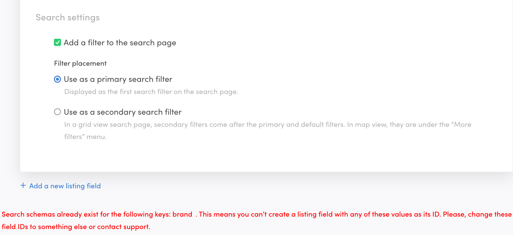

Sharetribe CLI (Command-line interface) is a tool for changing your
marketplace's advanced configurations such as transaction processes and
email templates.

<plan tier="extend" feature="Access to Sharetribe CLI"></plan>

This tutorial expects that you have already installed Sharetribe CLI and
are logged in with your API key. If not, it's recommended to first read
the tutorial
[Getting started with Sharetribe CLI](/introduction/getting-started-with-flex-cli/).

In this tutorial, we will add a data schema for the `listingType` public
data field in listings. If your marketplace uses different listing
types, you may want to create pages that only show one type of listing.

We will also see how to manage data schema for user profiles. Those
schemas are not required for Sharetribe Web Template to work, but can be
useful when building own integrations via the Flex Integration API.

## Extended data types and schema scopes

There are [various types of extended data](/references/extended-data/).
Search schema is scoped to a particular type of extended data and the
support differs depending on whether the schema is defined for listings
or user profiles. The following table summarizes the supported search
schema scopes.

| Schema for  | Supported scopes                     |
| ----------- | ------------------------------------ |
| listing     | public, metadata                     |
| userProfile | public, private, protected, metadata |

<info>

There is no API endpoint for querying users in the Marketplace API, so
`userProfile` search schema applies only to the
[/users/query endpoint in the Integration API](https://www.sharetribe.com/api-reference/integration.html#query-users).

</info>

All types of extended data are editable in Console by the operator, but
only public data and metadata can be seen by other marketplace users. To
see more details about extended data, see the
[Extended data](/references/extended-data/) reference.

You can store any JSON data in extended data, but only top-level keys of
certain type can have search schemas. If there is a mismatch between the
defined schema and what is stored to the extended data, the indexing
just skips those values.

## Schema types and cardinalities

| Type       | Cardinality | Example data                                                                                     | Example query                                                                  |
| ---------- | ----------- | ------------------------------------------------------------------------------------------------ | ------------------------------------------------------------------------------ |
| enum       | one         | `category: "electric-bikes"`                                                                     | `pub_category=electric-bikes,city-bikes`                                       |
| multi-enum | many        | `accessories: ["bell", "lights"]`                                                                | `pub_accessories=has_all:bell,lights` or `pub_accessories=has_any:bell,lights` |
| boolean    | one         | `hasPannierRack: true`                                                                           | `pub_hasPannierRack=true`                                                      |
| long       | one         | `manufactureYear: 2021`                                                                          | `pub_manufactureYear=2020,2023`                                                |
| text       | one         | `accessoriesDescription: "Pannier bags and a dog carrier (max 18 pounds) available on request."` | `keywords=bags%20dog%20carrier`                                                |

<info>

Data schema of type `text` is currently only supported for listings.

</info>

Note that the scope in the examples above is `public`. Please use the
correct prefix depending on the scope of the data (`meta_` for metadata,
`priv_` for private data, `prot_` for protected data and `pub_` for
public data). Also, it's worth noting that the query parameter with a
`text` schema is `keywords` which also targets the `title` and
`description` attributes of a listing. This query parameter is only
supported in listing queries. See
[Keyword search](/concepts/how-the-listing-search-works/#keyword-search)
for more information.

### Providing multiple query params for a single field

You can provide multiple values in the query parameter by separating
those with a comma. The matching behavior is different for different
schema types.

With the `enum` type like the category above, when you query
`pub_category=electric-bikes,city-bikes`, you will match listings with
either "electric-bikes" OR "city-bikes" as the category. With the
`multi-enum`, you can control the matching mode explicitly. The query
`pub_accessories=has_all:bell,lights` will match listings with "bell"
AND "lights" in the accessories whereas the query
`pub_accessories=has_any:bell,lights` will match listings with either
"bell" OR "lights" (or both). If you don't specify the match mode in the
query (i.e. `pub_accessories=bell,lights`), by default we use the
has_all mathing mode (AND) for multi enums.

With the `text` type, you provide a search query, so splitting values
with a comma doesn't make sense. You will just provide a string of text
as the search query, and the query will be used as described
[in the keyword search explanation](/concepts/how-the-listing-search-works/#keyword-search)
section.

With the `long` type, you can provide minimum and/or maximum values for
the filtering.

For the full query reference, see the
[/listings/query](https://www.sharetribe.com/api-reference/marketplace.html#query-listings)
endpoint API reference.

## Listing fields and search settings in Flex Console

When you add listing fields in Flex Console, and select _Include this
field in keyword search_ or _Add a filter to Search Page_, Flex
generates a search schema for the field automatically. In the Console,
the available field type options are

- free text (search schema: `text`)
- select one (search schema: `enum`)
- select multiple (search schema: `multi-enum`)

When you review your search schemas with the `flex-cli search` command,
schemas defined for listing fields in console have the following doc
string in the search schema:

```shell
A listing field defined in Console. Can not be edited with the CLI.
```

If you then try to add a search schema through Sharetribe CLI for a key
and scope that already exists in a Console-originated listing field, you
will see the following error:

```
 › API call failed. Status: 409, reason: A search schema with the same key and scope has already been defined in an asset.
```

## Adding listing search schemas

When creating a listing, the template saves the listing type in the
listing's public data. If you are using multiple listing types, you may
want to only show one type of listing at a time on the search page. We
will create a search schema for the public data attribute `listingType`
to make this kind of filtering possible.

Our marketplace has one Console-created listing field, `category`. Let's
first see how that search schema looks:

```
$ flex-cli search -m my-marketplace-dev

Schema for   Scope   Key       Type   Default value   Doc
listing      public  category  enum                   A listing field defined in Console. Can not be edited with the CLI.

```

Let's add the search schema for listing type:

```
$ flex-cli search set --key listingType --type enum --scope public -m my-marketplace-dev
```

We should now see the details for this new schema alongside our Console
created one:

```
$ flex-cli search -m my-marketplace-dev

Schema for   Scope   Key          Type   Default value   Doc
listing      public  category     enum                   A listing field defined in Console. Can not be edited with the CLI.
listing      public  listingType  enum
```

Note that `--schema-for` option is not needed when adding schema for
`listing` as `listing` is the default.

If you wish to remove a schema, you can use the `search unset` command.

<info>

If you have already defined a search schema for a key through Sharetribe
CLI, you can not create a listing field in Sharetribe Console with that
same key.



</info>

## Adding user search schema

<info>

Adding user search schemas is only supported in Sharetribe CLI versions
1.10.0 and above. Use yarn to update Sharetribe CLI by running
`yarn global upgrade flex-cli` or `npm update -g flex-cli` if you are
using npm.

</info>

User profile search schema can be useful, if you have an Integration API
application that needs to query different sets of users, depending on
some value in the user profile's extended data. For instance, if users
have `age` attribute stored in their protected data, you can use the
[/users/query endpoint in the Integration API](/references/extended-data/)
to find users of a certain age range.

Search schema for user profiles can be added as follows:

```
$ flex-cli search set --schema-for userProfile --key age --type long --scope protected -m my-marketplace-dev
```

The above adds a search schema for `userProfile` with `long` type for a
`key` named "age".

Querying the defined schemas now shows both the listing schemas added on
the previous step and the new user profile schema:

```
$ flex-cli search -m my-marketplace-dev

Schema for   Scope      Key          Type   Default value   Doc
listing      public     category     enum                   A listing field defined in Console. Can not be edited with the CLI.
listing      public     listingType  enum
userProfile  protected  age          long
```

If you wish to remove a schema, you can use the `search unset` command.

## Adding a search schema with a default value

Sometimes, you may want to query listings that do not have a certain
attibute set. For instance, you may have promoted listings on your
marketplace, labelled with a metadata attribute `isPromoted: true`. If
you only have a handful of promoted listings, you likely do not want to
tag all other listings with `isPromoted: false`.

Instead, Flex allows you to set a default value for the search schema –
all listings that do not have the attribute get returned when querying
the default value.

You can set the default value for a search schema simply by passing a
`--default` flag with the desired default value. To create the search
schema described above, the Sharetribe CLI command is as follows:

```
$ flex-cli search set --key isPromoted --type boolean --scope metadata --default false -m my-marketplace-dev
```

Now, if we query all the search schemas on the marketplace, we can see
the default value for the `isPromoted` schema in the corresponding
column.

```
$ flex-cli search -m my-marketplace-dev

Schema for   Scope      Key          Type     Default value   Doc
listing      metadata   isPromoted   boolean  false
listing      public     category     enum                     A listing field defined in Console. Can not be edited with the CLI.
listing      public     listingType  enum
userProfile  protected  age          long
```

## Summary

In this guide, we used Sharetribe CLI to define search schemas for our
marketplace. We also saw how schemas defined through Sharetribe Console
and Sharetribe CLI interact. We used the public data attributes
`category` and `listingType` as examples. In addition, we looked at
adding user search schemas for Integration API as well as adding a
listing schema with a default value.

For more information, see the following resources:

- [How the search works](/concepts/how-the-listing-search-works/)
  background article
- [Extended data reference](/references/extended-data/)
- API reference for the
  [/listings/query](https://www.sharetribe.com/api-reference/marketplace.html#query-listings)
  endpoint in the Marketplace API
- API reference for the
  [/listings/query](https://www.sharetribe.com/api-reference/integration.html#query-listings)
  endpoint in the Integration API
- API reference for the
  [/users/query](https://www.sharetribe.com/api-reference/integration.html#query-users)
  endpoint in the Integration API
- [Extend listing data in FTW](/how-to/extend-listing-data-in-ftw/)
- [Change search filters in FTW](/how-to/change-search-filters-in-ftw/)
