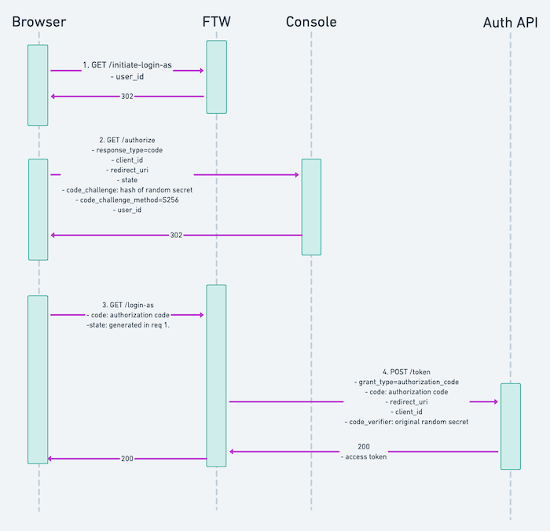

The _Login as user_ feature allows marketplace operators to log into
their marketplace as a specific user of the marketplace. This helps
operators to experience their marketplace as their users do and to find
out what is wrong when their users are reporting problems. The feature
also comes in handy when a marketplace user asks for help with managing
their data and listings. However, note that when logged in as another
user **it is not possible to modify Stripe account details, send
messages, or initiate or transition transactions**.

<info>

If you are using Sharetribe Web Template, this feature works out of the
box. If you are using one of the legacy templates where this feature is
not available by default, you can refer to our
[legacy documentation](/ftw/legacy-templates/) for implementation
instructions.

</info>

## How the Login as user feature works

As context, here's a quick description of the technical implementation
of how the Login as user works to make it easier to understand the
changes it requires. The authentication flow uses the _authorization
code_ grant type defined in the OAuth2. Console works as an
_authorization server_ that issues an authorization code for Sharetribe
Web Template. The template then uses this code to obtain an access token
from Auth API. The access token is valid for 30 minutes and it does not
come with a refresh token. The token can be used as a normal token
obtained with a password login excluding updating payment information,
sending messages, and initiating or transitioning transactions. The
image below describes the authentication flow in more detail.

<info>

Remember to make sure that the **REACT_APP_MARKETPLACE_ROOT_URL** value
configured in your marketplace website matches the marketplace URL
configured in Console. This value will be used to redirect back to your
marketplace, and the value is validated in Console when issuing an
authorization code.

When developing Sharetribe Web Template locally while testing this
feature, you need to set the Marketplace URL as **localhost:4000** and
use **yarn run dev-server** so that both your client and server run on
the same port.

</info>

## Troubleshooting

Having trouble enabling the Login as user feature? Check that you have
the following in order.

### Authentication fails with message: Failed to authorize as a user, error: <error message>

Double check that the **REACT_APP_MARKETPLACE_ROOT_URL** environment
variable of your marketplace website matches the Marketplace URL you
have configured in Console.

### Authentication fails with message: Unable to authenticate as a user

Have you updated the SDK to the latest version?

### Login session drops unexpectedly

The access token obtained with the Login as user authentication flow is
valid only for 30 minutes. If you could not finish what you had in mind
during that time you can always login as the user again.
