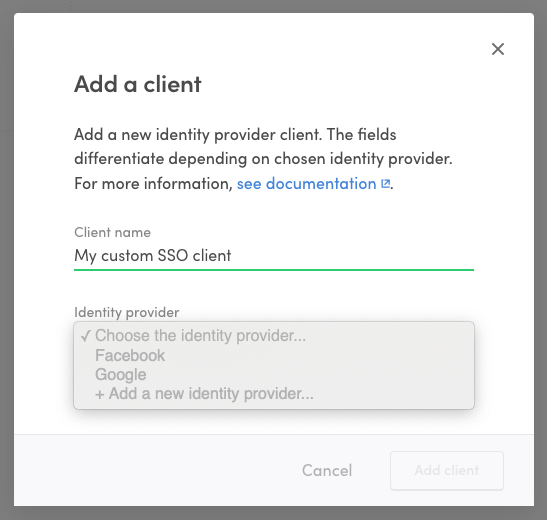
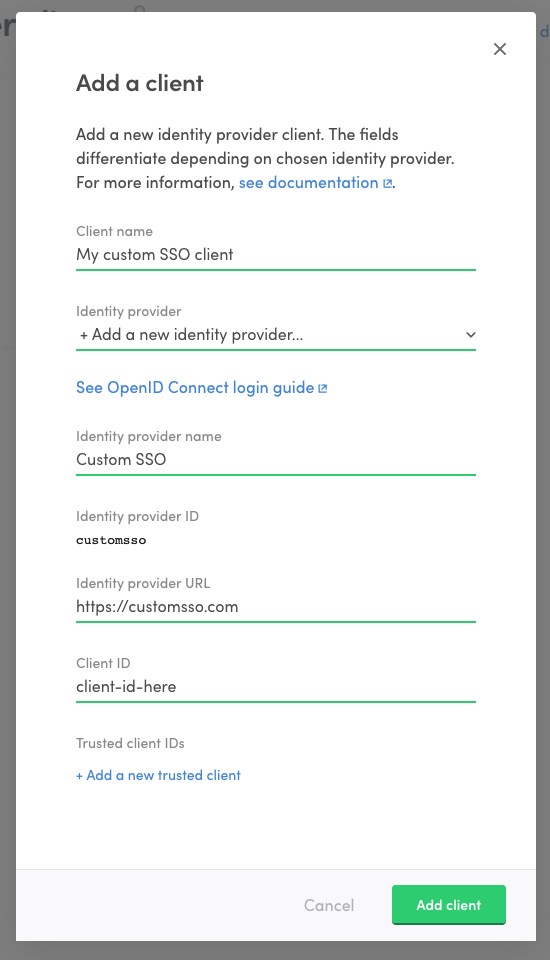

## OpenID Connect

[OpenID Connect](https://openid.net/specs/openid-connect-core-1_0.html)
is a specification built on OAuth2 that describes how a user
authenticated at an identity provider can be authorized to resources in
another service. This how-to guide assumes that you already have an
OpenID Connect solution available and intend to use that as a login
option in your Sharetribe marketplace.

## Identity provider requirements

### Discovery document and JSON Web keys

All identity providers should provide an
[OpenID Connect discovery document](https://openid.net/specs/openid-connect-discovery-1_0.html).
The document has to define a `jwks_uri` attribute which denotes the
location of public signing keys used by the identity provider. The
signing keys should be served in the `jwks_uri` location in
[JSON Web Key Set format](https://tools.ietf.org/html/draft-ietf-jose-json-web-key-41).

### Signing algorithms

Sharetribe only supports ID tokens signed with asymmetric RS256 signing
algorithm. The identity provider should provide public signing keys as
mentioned above.

### Rotating signing keys

Sharetribe relies heavily on the `kid` attribute of a JSON Web Key when
caching signing keys. We advise that every OpenID Connect identity
provider includes the `kid` attribute in signing keys and in ID token
header. Especially, when signing keys are rotated, it is critical to
have the `kid` attribute in JWKs and a corresponding `kid` header in the
ID token.

## Configure an identity provider client in Console

To take an OpenID Connect identity provider into use with Sharetribe,
you will need to configure a new identity provider and an accompanying
identity provider client in Sharetribe Console.

1. Go to the
   [Social logins & SSO](https://console.sharetribe.com/advanced/social-logins-and-sso)
   page in Console and click "+ Add new" to add a new identity provider
   client.
2. Fill in a name for the client.
3. In the identity provider dropdown, select "+ Add a new identity
   provider..."



4. Fill in information regarding your OpenID Connect identity provider.
   This is the service that your users authenticate to in order to log
   into Sharetribe.

   - **Identity provider name**: A descriptive name for the identity
     provider that helps you to distinguish it from other providers.
   - **Identity provider ID**: IdP ID that is passed as a parameter to
     Sharetribe API when authenticating using this client/IdP. It is
     generated based on the provider name
   - **Identity provider URL**: In OpenID Connect terms this is the
     _issuer location_ of the identity provider. It is used to resolve
     ID token signing keys used by the identity provider. See below
     _Discovery document and JSON Web keys_ for more details.

5. Fill in the Client ID. This is the identifier of your Sharetribe
   marketplace at you identity provider. It will be the _audience_ of
   the ID token returned from the identity provider.
6. If you have multiple clients configured at your identity provider to
   be used to log into your Sharetribe marketplace, list the additional
   client IDs as trusted client IDs. The idea is, that every client ID
   that is included as an audience (`aud` claim) in an ID token returned
   from your identity provider should be included as the client ID or
   trusted client ID in the client.



7. Click "Add client" to create the client and identity provider.

Now that you have created the identity provider, you can use it if your
login flow requires using another client or if you wish to remove the
client you added and create a new one. Just select the identity provider
from the dropdown when creating a new client.

## Add OpenID Connect login flow to Sharetribe Web Template

OpenID Connect login flow can be added to Sharetribe Web Template in
multiple ways. One good starting point is to take a look at OpenID
Connect implementations in
[the Passport.js strategies](http://www.passportjs.org). We also
recommend using the default
[facebook.js](https://github.com/sharetribe/web-template/blob/main/server/api/auth/facebook.js)
and
[google.js](https://github.com/sharetribe/web-template/blob/main/server/api/auth/google.js)
files as a basis for your modifications.

On a high level, you can follow these steps to get started with your
integration.

1. Replicate either
   [facebook.js](https://github.com/sharetribe/web-template/blob/main/server/api/auth/facebook.js)
   or
   [google.js](https://github.com/sharetribe/web-template/blob/main/server/api/auth/google.js)
   and rename to point to the identity provider you are working with.

2. Replace the
   [passport module](https://github.com/sharetribe/web-template/blob/main/server/api/auth/facebook.js#L2)
   in your new file with one that corresponds to your identity provider.
   Update the
   [strategy options](https://github.com/sharetribe/web-template/blob/main/server/api/auth/facebook.js#L22-L28)
   to correspond to the new passport module's documentation.

3. Add your identity provider credentials and Sharetribe SSO client
   credentials in your `.env` file, and then update the necessary
   credentials
   [in your new file](https://github.com/sharetribe/web-template/blob/main/server/api/auth/facebook.js#L8-L9)
   and in the
   [createWithIdp.js file](https://github.com/sharetribe/web-template/blob/main/server/api/auth/createUserWithIdp.js#L12-L16).
   Remember to update the
   [identity provider selection logic](https://github.com/sharetribe/web-template/blob/main/server/api/auth/createUserWithIdp.js#L49-L50).

4. Import your new file in
   [server/apiRouter.js](https://github.com/sharetribe/web-template/blob/main/server/apiRouter.js#L21)
   and create the
   [callback endpoints](https://github.com/sharetribe/web-template/blob/main/server/apiRouter.js#L65-L71)
   for the integration. Add the
   `[your domain]/api/auth/[service]/callback` address to your identity
   provider's allowed callback URLs.

5. Add the
   [login buttons](https://github.com/sharetribe/web-template/blob/main/src/containers/AuthenticationPage/AuthenticationPage.js#L60)
   for your service.

6. Update the
   [verifyCallback function](https://github.com/sharetribe/web-template/blob/main/server/api/auth/facebook.js#L45-L61)
   in your new file to parse the details from the parameters coming into
   the callback. This is easiest to do by logging each parameter that
   comes into the callback, renaming them accordingly, and then parsing
   the necessary details from the correct parameters. At this point, you
   need to get a hold of the ID token that is returned from the identity
   provider, so that you can pass it along to the `done` function, and
   eventually to Sharetribe's
   [`/auth/auth_with_idp`](https://www.sharetribe.com/api-reference/authentication.html#issuing-tokens-with-an-identity-provider)
   and
   [`current_user/create_with_idp`](https://www.sharetribe.com/api-reference/marketplace.html#create-user-with-an-identity-provider)
   endpoints.

## Identity provider specific information

### Apple Sign-in

Apple Sign-in has several features that resemble the OpenID Connect
specification. However, it is not explicitly stated to be OpenID Connect
compliant. To the knowledge of our team, the
[Apple Sign-in token](https://developer.apple.com/documentation/sign_in_with_apple/sign_in_with_apple_rest_api/authenticating_users_with_sign_in_with_apple#3383773)
should be compliant with the Sharetribe back-end at the time of this
writing (2024-05), but you will need to conduct your own testing to
verify this.

Apple Sign-in also requires developers to set up a
[private email relay service](https://developer.apple.com/documentation/sign_in_with_apple/sign_in_with_apple_js/communicating_using_the_private_email_relay_service)
for Apple users who do not want to share their email address with the
service. If you do integrate Apple Sign-in, it is important that you
provide Sharetribe with a valid email address even if the user requests
to keep their own address private.

### Auth0

Auth0 requires identity provider URL with a trailing slash, but
Sharetribe Console does not currently allow adding trailing slashes. If
you are adding an Auth0 integration, add the URL without the trailing
slash, and reach out to Sharetribe Support so we can manually fix the
formatting.

### LinkedIn

Sign In with LinkedIn was updated to support Open ID Connect in
August 2023. The corresponding Passport strategy has been updated to
version 3.0.0 support Open ID Connect in the
[Github repository](https://github.com/auth0/passport-linkedin-oauth2).
However, at the time of this writing, only version 2.0.0 seems to be
available through _npm_ and _yarn_ package managers. This means that to
use version 3.0.0 in your integration, you will need to install the
package directly from the Github repository:

```shell
## yarn add <git remote url>#<branch/commit/tag>
yarn add https://github.com/auth0/passport-linkedin-oauth2#v3.0.0

```
