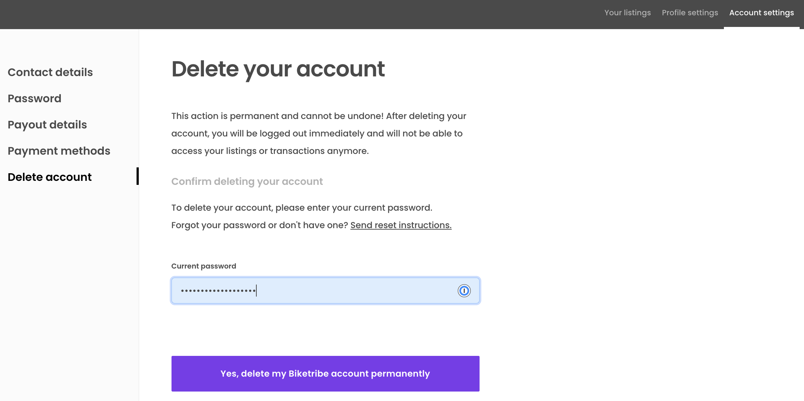
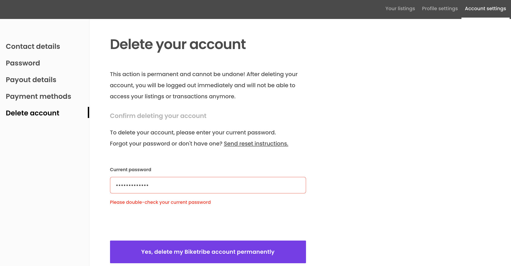

Starting from 2022-03, Sharetribe Flex Marketplace API has an endpoint
for
[deleting a user's account](https://www.sharetribe.com/api-reference/marketplace.html#delete-user).
After the user has been deleted, any transactions where they are a
participant cannot transition forward, and no payouts will be made to
the user – even if the payouts have already been scheduled.

This cookbook guides you in implementing an account deleting feature in
the FTW template "Account settings" section. When the signed-in user
navigates to the account deletion page, they need to enter their
password to confirm that they do in fact want to delete their account.
An endpoint in the FTW application's server then gets called, and that
endpoint checks whether the user has incomplete transactions.

Depending on the result the endpoint then either returns the count of
incomplete transactions, or deletes the user's account through the
`current_user/delete` endpoint. If the user cannot be deleted, the page
shows the count of unfinished transactions, and if the user is deleted,
they are immediately logged out.

This cookbook is based on the FTW-daily template and
`flex-default-process`. As you implement the cookbook, you will need to
review the transaction processes used on your marketplace to see which
transitions count as non-final transitions, i.e. ones where you do not
want to allow the user to delete their profile.


In addition to incomplete transactions, your marketplace transaction
processes may have payout considerations. If your transaction process
uses the default Stripe integration including payouts, it may take up to
7 days from `stripe-confirm-payment-intent` action until the payout is
processed by Stripe, even if `stripe-create-payout` is called and the
payout has been scheduled.

In other words, if your transaction processes create a provider payout
close to the payment intent being confirmed, you may want to prevent
users from deleting their profile before 7 days have passed from payment
intent being confirmed. Alternatively, you can of course handle payouts
manually for deleted users, if the transactions have otherwise been
completed.

## Add UI components

### Add "Delete account" tab to Account settings

First, add a new tab to the Account settings section of the template.

```shell
└── src
    └── components
         └── LayoutWrapperAccountSettingsSideNav
              └── LayoutWrapperAccountSettingsSideNav.js
          ...
```

The new page will appear as the final tab in Account Settings side
navigation.

```diff
  const tabs = [
    {
      text: <FormattedMessage id="LayoutWrapperAccountSettingsSideNav.contactDetailsTabTitle" />,
  ...
      linkProps: {
        name: 'PaymentMethodsPage',
      },
    },
+   {
+     text: <FormattedMessage id="LayoutWrapperAccountSettingsSideNav.deleteAccountTabTitle" />,
+     selected: currentTab === 'DeleteAccountPage',
+     id: 'DeleteAccountPageTab',
+     linkProps: {
+       name: 'DeleteAccountPage',
+     },
+   },
  ];
```

Next, add the actual DeleteAccountPage component. You can use the
example files directly, or modify them for your use case.

```shell
└── src
    └── containers
         └── DeleteAccountPage
              └── DeleteAccountPage.js
              └── DeleteAccountPage.duck.js
              └── DeleteAccountPage.module.css
```

- [DeleteAccountPage.js](cookbook-assets/DeleteAccountPage.js)
- [DeleteAccountPage.duck.js](cookbook-assets/DeleteAccountPage.duck.js)
- [DeleteAccountPage.module.css](cookbook-assets/DeleteAccountPage.module.css)

Once the DeleteAccountPage component and corresponding Redux store
DeleteAccountPage.duck.js exist in the project, import the Redux file
reducer to a combined reducer.

```shell
└── src
    └── containers
         └── reducers.js
```

For more info on the Redux structure, you can read about
[the Ducks modular Redux proposal](https://github.com/erikras/ducks-modular-redux),
which is the proposal of Redux usage followed in the FTW templates.

```diff
  import ContactDetailsPage from './ContactDetailsPage/ContactDetailsPage.duck';
+ import DeleteAccountPage from './DeleteAccountPage/DeleteAccountPage.duck';
  import EditListingPage from './EditListingPage/EditListingPage.duck';
  ...

  export {
    CheckoutPage,
    ContactDetailsPage,
+   DeleteAccountPage,
    EditListingPage,
```

Since DeleteAccountPage has a new route, add the component to the
application's route configuration.

```shell
└── src
    └── routeConfiguration.js
```

The "Account settings" side navigation tabs are defined in
routeConfiguration.js as well, so add DeleteAccountPage in the tab
array.

```diff
  const ContactDetailsPage = loadable(() => import(/* webpackChunkName: "ContactDetailsPage" */ './containers/ContactDetailsPage/ContactDetailsPage'));
+ const DeleteAccountPage = loadable(() => import(/* webpackChunkName: "DeleteAccountPage" */ './containers/DeleteAccountPage/DeleteAccountPage'));
  const EditListingPage = loadable(() => import(/* webpackChunkName: "EditListingPage" */ './containers/EditListingPage/EditListingPage'));
...
export const ACCOUNT_SETTINGS_PAGES = [
  'ContactDetailsPage',
  'PasswordChangePage',
  'StripePayoutPage',
  'PaymentMethodsPage',
+ 'DeleteAccountPage',
];
...
      component: PaymentMethodsPage,
      loadData: pageDataLoadingAPI.PaymentMethodsPage.loadData,
    },
+   {
+     path: '/account/delete-profile',
+     name: 'DeleteAccountPage',
+     auth: true,
+     authPage: 'LoginPage',
+     component: DeleteAccountPage,
+   },
    {
      path: '/terms-of-service',
```

Finally, add the necessary microcopy rows into en.json

```shell
└── src
    └── translations
         └── en.json
```

Feel free to modify the texts to suit your marketplace.

```diff
  "DateInput.screenReaderInputMessage": "Date input",
+ "DeleteAccountPage.details": "This action is permanent and cannot be undone! After deleting your account, you will be logged out immediately and will not be able to access your listings or transactions anymore.",
+ "DeleteAccountPage.heading": "Delete your account",
+ "DeleteAccountPage.title": "Delete your account",
+ "DeleteAccountPage.error": "Cannot delete user profile. You have {errorCause} Please contact Saunatime support or complete the unfinished issues and try again.",
  "EditListingAvailabilityForm.fetchMonthDataFailed": "Oops, couldn't load data for {month}, please try again.",
...
  "LayoutWrapperAccountSettingsSideNav.contactDetailsTabTitle": "Contact details",
+ "LayoutWrapperAccountSettingsSideNav.deleteAccountTabTitle": "Delete account",
  "LayoutWrapperAccountSettingsSideNav.passwordTabTitle": "Password",
```

If you now navigate to Account Settings, you can see the "Delete
account" tab on the left side navigation. If you click the tab, you can
see the info text.


Next, we'll implement the form component for deleting the user account.

### Add DeleteAccountForm

Next, we want to add the form that actually handles the user deletion
experience.

```shell
└── src
    └── forms
         └── DeleteAccountForm
               └── DeleteAccountForm.js
               └── DeleteAccountForm.module.css
```

- [DeleteAccountForm.js](cookbook-assets/DeleteAccountForm.js)
- [DeleteAccountForm.module.css](cookbook-assets/DeleteAccountForm.module.css)

You can either use the files directly, or use them as a template for
modification. You can, for instance, add a feedback field if you need
the user to submit some information before they can delete their
account.

When adding a new form, exporting it from `src/forms/index` simplifies
importing in other components.

```shell
└── src
    └── forms
         └── index.js
```

```diff
  export { default as ConfirmSignupForm } from './ConfirmSignupForm/ConfirmSignupForm';
+ export { default as DeleteAccountForm } from './DeleteAccountForm/DeleteAccountForm';
  export { default as EditListingAvailabilityForm } from './EditListingAvailabilityForm/EditListingAvailabilityForm';
```

Now that the DeleteAccountForm component exists, implement it into the
DeleteAccountPage template you downloaded earlier.

```shell
└── src
    └── containers
         └── DeleteAccountPage
              └── DeleteAccountPage.js
```

Set DeleteAccountPage to only show the form for authenticated users.

```diff
  } from '../../components';
+ import { DeleteAccountForm } from '../../forms';
...
+ // Show form for a valid current user
+ const showDeleteAccountForm = (currentUser && currentUser.id);
+
+ const deleteAccountForm = showDeleteAccountForm ? (
+     <DeleteAccountForm
+       className={css.form}
+       deleteAccountError={deleteAccountError}
+       currentUser={currentUser}
+       onSubmit={handleDeleteAccount}
+       onChange={onChange}
+       onResetPassword={onResetPassword}
+       resetPasswordInProgress={resetPasswordInProgress}
+       resetPasswordError={resetPasswordError}
+       inProgress={deleteAccountInProgress}
+       ready={accountDeleted}
+     />
+   ) :
+   null;
+
  return (
    <Page title={title} scrollingDisabled={scrollingDisabled}>
...
            {pageDetails}
+           {deleteAccountForm}
          </div>
...
    </Page>
  );
```

You still need to add some microcopy related to the form.

```shell
└── src
    └── translations
         └── en.json
```

The DeleteAccountForm template file has validations for password length
and requirements, so those validation error messages require microcopy
strings. The file also has the capability to send a password reset link
to the user if they have forgotten their password.

```diff
  "DateInput.screenReaderInputMessage": "Date input",
+ "DeleteAccountForm.confirmChangesInfo": "To delete your account, please enter your current password.",
+ "DeleteAccountForm.confirmChangesTitle": "Confirm deleting your account",
+ "DeleteAccountForm.conflictingData":  "Unable to delete user profile. You have {errorCause}",
+ "DeleteAccountForm.genericFailure": "Whoops, something went wrong. Please refresh the page and try again.",
+ "DeleteAccountForm.passwordFailed": "Please double-check your current password",
+ "DeleteAccountForm.passwordLabel": "Current password",
+ "DeleteAccountForm.passwordPlaceholder": "Enter your current password…",
+ "DeleteAccountForm.passwordRequired": "Current password is required",
+ "DeleteAccountForm.passwordTooLong": "The password should be at most {maxLength} characters",
+ "DeleteAccountForm.passwordTooShort": "The password should be at least {minLength} characters",
+ "DeleteAccountForm.resetPasswordInfo": "Forgot your password or don't have one? {resetPasswordLink}",
+ "DeleteAccountForm.resetPasswordLinkSent": "The instructions for resetting your password have been sent to {email}.",
+ "DeleteAccountForm.resetPasswordLinkText": "Send reset instructions.",
+ "DeleteAccountForm.resendPasswordLinkText": "Resend instructions.",
+ "DeleteAccountForm.saveChanges": "Yes, delete my Saunatime account permanently",
```

You can now see the input for the user's current password, as well as
the button for deleting the account. on the page.


<extrainfo title="Wrap DeleteAccountForm in a modal">
If you want to add a second step of confirmation, you can wrap the
DeleteAccountForm in a modal on DeleteAccountPage, and just show a
button on DeleteAccountPage to open the modal.

```shell
└── src
    └── containers
         └── DeleteAccountPage
              └── DeleteAccountPage.js
```

```diff
- import React, { useEffect } from 'react';
+ import React, { useEffect, useState } from 'react';
...
- import { isScrollingDisabled } from '../../ducks/UI.duck';
+ import { isScrollingDisabled, manageDisableScrolling } from '../../ducks/UI.duck';
...
    UserNav,
+   Button,
+   Modal
  } from '../../components';
...
    onLogout,
+   onManageDisableScrolling,
    onSubmitDeleteAccount,...
  } = props;

+ const [modalIsOpen, toggleModalOpen] = useState(false);
+
+ const handleModalOpen = () => {
+   toggleModalOpen(true);
+ }
+
+ const handleModalClose = () => {
+   toggleModalOpen(false);
+ }

  const handleDeleteAccount = (values) => {
+   handleModalClose()
    return onSubmitDeleteAccount(values).then(() => {
      onLogout();
    })
  }
...

+ const incompleteTransactions = deleteAccountError?.status === 409;
...
-             {deleteAccountForm}
+           <Button
+             onClick={handleModalOpen}
+             disabled={incompleteTransactions}
+           >
+             Delete my account
+           </Button>
+           <Modal
+             id="DeleteAccountPage.deleteAccountModal"
+             isOpen={modalIsOpen}
+             onManageDisableScrolling={onManageDisableScrolling}
+             onClose={handleModalClose}
+           >
+             {deleteAccountForm}
+           </Modal>
...
  onChange: func.isRequired,
+ onManageDisableScrolling: func.isRequired,
  onSubmitDeleteAccount: func.isRequired,
...
  onLogout: () => dispatch(logout()),
+ onManageDisableScrolling: () => dispatch(manageDisableScrolling()),
  onSubmitDeleteAccount: values => dispatch(deleteAccount(values)),
```

</extrainfo>

If you now enter the password for the account you used to log in, the
button activates when the input length is long enough to be a valid
password.



However, if you click the button now, you will get an error from
DeleteAccountPage.duck.js stating that `deleteUserAccount` is not
defined. We will add the endpoint to the Redux action next.

## Add logic to call the Flex API endpoint

The next step is to add the logic that calls the server endpoint, which
then calls the Marketplace API endpoint if the user can be deleted.

### Update SDK

First of all, to get access to the new endpoint, you will need to update
the SDK package.

```shell
  yarn upgrade sharetribe-sdk
```

After updating the SDK, you can start adding the endpoint and logic.

### Add endpoint to client side

When you click the button to delete the user account,
DeleteAccountPage.js dispatches a
[thunk](https://redux.js.org/usage/writing-logic-thunks) called
`deleteAccount`, which in turn calls endpoint `deleteUserAccount`.

First, create the endpoint in the client-side API file.

```shell
└── src
    └── util
        └── api.js
          ...
```

```diff
+  // Check if user can be deleted and then delete the user. Endpoint logic
+  // must be modified to accommodate the transaction processes used in
+  // the marketplace.
+  export const deleteUserAccount = body => {
+    return post('/api/delete-account', body);
+  }
```

Then, import the endpoint in DeleteAccountPage.duck.js.

```diff
+ import { deleteUserAccount } from '../../util/api';
```

Now, clicking the delete button should show a 404 error in the dev tools
console, since the endpoint does not yet exist on the server side. You
will also see a generic error (_"Whoops, something went wrong. Please
refresh the page and try again."_) above the delete button.

Finally, in the server endpoint, you need to check whether the user has
any transactions that have not finished and would thus prevent deleting
their account.

### Add endpoint logic

First, set up the endpoint logic. You can use the `delete-account.js`
file below as your starting point. However, you will need to modify the
logic to correspond to your own transaction processes. For convenience,
we've commented out the code that calls the SDK, so you can test the
actual flow of the user interface first, before accidentally deleting
any of your test users.

Save the file in the `server/api` folder.

```shell
└── server
    └── api
        └── delete-account.js
  ...
```

- [delete-account.js](cookbook-assets/delete-account.js)

Each transaction process has its own logic and flow. Determine the
points at which you want to prevent the user from deleting their own
profile.

```js
// The list of non-final transitions depends on the transaction processes
// being used on the marketplace. This list contains the non-final transitions
// of an unmodified flex-default-process i.e. the transitions where we do not want to allow the user
// to delete their account.
const nonFinalTransitions = [
  'transition/request-payment',
  'transition/request-payment-after-enquiry',
  'transition/confirm-payment',
  'transition/accept',
  'transition/complete',
  'transition/review-1-by-customer',
  'transition/review-1-by-provider',
];
```

<extrainfo title="Check pending payouts">
If your transaction process has other limitations related to deleting
users, e.g. payouts are often scheduled immediately after creating and
capturing a payment intent, you may want to create a logic that checks
whether the user has provider transactions where the payout transition
has been created less than seven days ago. You can use this example as a
starting point for such logic.

```diff
  sdk.transactions.query({
+   only: "sale"
  })
  .then(resp => {
...
+  // In flex-default-process, payouts are created on "transition/complete". We want to
+  // determine the transactions where this transition has been created less than 7 days ago.
+  const pendingPayouts = resp.data.data.filter(tx =>{+
+      // For the transactions where the user is the provider, check the transitions
+      // to determine whether "transition/complete" was created less than 7 days ago.
+      return tx.attributes.transitions.some(tr => {
+          const today = new Date();
+          const sevenDaysFromCreated = new Date(tr.createdAt);
+          sevenDaysFromCreated.setDate(sevenDaysFromCreated.getDate() + 7);
+          return tr.transition == 'transition/complete' && today < sevenDaysFromCreated;
+      });
+  })
+
```

</extrainfo>

Finally, add the endpoint to apiRouter in the server.

```shell
└── server
    └── apiRouter.js
  ...
```

```diff
  const transitionPrivileged = require('./api/transition-privileged');
+ const deleteAccount = require('./api/delete-account');
...
  router.post('/transition-privileged', transitionPrivileged);
+ router.post('/delete-account', deleteAccount);
```

If you want to hide the password field and delete button when the user
has unfinished transactions, you can check the `status` of
`deleteAccountError` on DeleteAccountPage.js and only show the fields
when the user has not already received a 409 Conflict error.

```diff
 // Show form for a valid current user
- const showDeleteAccountForm = (currentUser && currentUser.id);
+ const showDeleteAccountForm = (
+   currentUser
+   && currentUser.id
+   && deleteAccountError?.status !== 409
+ );
```

## Test functionality

You can now test the functionality! When you enter your password and
click the delete button, depending on the user's transaction history you
will either see an error message on the page or be logged out.


The Marketplace API endpoint also validates the user's password. If the
password they entered is not their valid current password, the endpoint
returns 403 Forbidden, and the page shows a validation error message
under the password input.



Once you are happy with the user flow without the deletion SDK call, you
can uncomment the code in `delete-account.js` that calls the SDK
endpoint. After that, you can confirm the deletion of the user in your
Flex Console.

Once a user has been deleted, their listings are also removed. However,
their transactions and messages will still show up in the inbox of the
transaction's other party.


And that's it! Depending on your marketplace needs, you can build
further steps into the process before you allow the user to delete their
own account.
