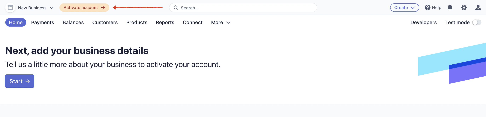

Flex Templates for Web (FTW) are marketplace web applications built on
top of the [Marketplace API](/background/concepts/#marketplace-api).
While you can create a marketplace purely using just the API, it
requires a significant amount of effort (both money and time) and we
recommened using the template as a starting point for customizations.

FTW-daily is built with [React](https://reactjs.org/),
[Redux](https://redux.js.org/), and
[CSS Modules](https://github.com/css-modules/css-modules). It also
contains a small [Node.js](https://nodejs.org/en/) server, which
provides server-side rendering (SSR) for the production site.

The purpose of this guide is to clone and configure FTW-daily to your
local development environment - and then get it up and running. This
guide also helps you to create accounts to Stripe and Mapbox. Those
services are needed to run the FTW-daily template app.

If you want to FTW-hourly or FTW-product as your starting point, you can
find the relevant options in this tutorial as well. However, if you are
intending to start working through the tutorial steps, we recommend
starting with FTW-daily, as it is the basis for the tutorials.

## Setup development environment

### Prerequisities

To get FTW up and running, you will need to download and install some
basic development tooling:

- [Git](https://git-scm.com/downloads)
- [Node.js](https://nodejs.org/)
- [Yarn](https://classic.yarnpkg.com/en/docs/install)

### Install the FTW-daily App locally

1. Open Terminal

1. [Clone](https://help.github.com/en/github/creating-cloning-and-archiving-repositories/cloning-a-repository)
   FTW-daily repository:

   ```bash
   git clone https://github.com/sharetribe/ftw-daily.git
   ```

   <extrainfo title="FTW-hourly and FTW-product">
   To clone FTW-hourly, use the command

   ```bash
   git clone https://github.com/sharetribe/ftw-hourly.git
   ```

   To clone FTW-product, use the command

   ```bash
   git clone https://github.com/sharetribe/ftw-product.git
   ```

   </extrainfo>

1. Go to the cloned directory:

   ```bash
   cd ftw-daily/
   ```

    <extrainfo title="Check how the directory structure should look like">

   After these steps you should have a directory structure that looks
   like this for FTW-daily:

   ```bash
   ├── ext
   │   └── transaction-process
   ├── node_modules
   │   └── // dependencies
   ├── public
   │   ├── static
   │   ├── 500.html
   │   ├── index.html
   │   └── robots.txt
   ├── scripts
   │   ├── audit.js
   │   ├── config.js
   │   └── translations.js
   ├── server
   │   ├── api
   │   ├── api-util
   │   ├── apiRouter.js
   │   ├── apiServer.js
   │   ├── auth.js
   │   ├── csp.js
   │   ├── dataLoader.js
   │   ├── env.js
   │   ├── importer.js
   │   ├── index.js
   │   ├── log.js
   │   ├── renderer.js
   │   └── sitemap.js
   ├── src
   │   ├── analytics
   │   ├── assets
   │   ├── components
   │   ├── containers
   │   ├── ducks
   │   ├── forms
   │   ├── styles
   │   │   ├── marketplaceDefaults.css
   │   │   └── propertySets.css
   │   ├── translations
   │   ├── util
   │   ├── Routes.js
   │   ├── app.js
   │   ├── config.js
   │   ├── currency-config.js
   │   ├── default-location-searches.js
   │   ├── examples.js
   │   ├── index.js
   │   ├── marketplace-custom-config.js
   │   ├── reducers.js
   │   ├── routeConfiguration.js
   │   ├── store.js
   │   └── stripe-config.js
   ├── CHANGELOG.md
   ├── LICENSE
   ├── README.md
   ├── app.json
   ├── package.json
   └── yarn.lock
   ```

    </extrainfo>

   <extrainfo title="FTW-hourly and FTW-product">
   If you cloned FTW-hourly:

   ```bash
   cd ftw-hourly/
   ```

   If you cloned FTW-product:

   ```bash
   cd ftw-product/
   ```

   </extrainfo>

1) Install dependency libraries:

   ```bash
   yarn install
   ```

## Mandatory Integrations

FTW templates have 3 mandatory integrations that you need to configure
before the app is fully functional. The app obviously needs to discuss
with Flex Marketplace API, but the client app also makes direct calls to
[Stripe](https://stripe.com/en-fi). Flex uses Stripe as a payment
processor. And FTW-daily saves sensitive payment information directly to
it.

The third default integration is to a map provider.
[Mapbox](https://www.mapbox.com) provides location search (geocoding)
and maps for the web app.


FTW templates just need 4 environment variables to make these
integrations work.

- **[`REACT_APP_SHARETRIBE_SDK_CLIENT_ID`](#sharetribe-flex-client-id-and-client-secret)**
- **[`SHARETRIBE_SDK_CLIENT_SECRET`](#sharetribe-flex-client-id-and-client-secret)**
- **[`REACT_APP_STRIPE_PUBLISHABLE_KEY`](#stripe-keys)**
- **[`REACT_APP_MAPBOX_ACCESS_TOKEN`](#mapbox-access-token)**

### Sharetribe Flex client ID and client secret

To use the Marketplace API, you will need a **client ID**. You can sign
up for your free Flex account at
https://www.sharetribe.com/products/flex/

When you get access, you will be able to log into Flex Console and check
the client ID.<br /> Flex Console: _Build > Applications_

In addition, FTW templates use a transaction process that includes a
privileged transition. That makes it possible to customize pricing on
the Node server that's included in the template. **Client secret** is
needed to make this secure call from the template's own server to Flex
API.


### Stripe keys

Both Flex API and your client app need to be able to discuss with Stripe
API. Stripe has two different keys:

- _Secret key_ for server-side requests
- _Publishable key_ for calls from web browser

Flex API uses Stripe secret key to make payment-related requests when
transaction moves forward. The client app needs to use Stripe
publishable key to run stripe.js script. That script has two main
functions: it has fraud detection built in, and it is also used to save
sensitive information directly to Stripe. For instance a customer's
credit card number is saved directly to Stripe.

#### 1. Create and confirm your free Stripe account

[Register to Stripe](https://dashboard.stripe.com/register). After
filling the form you will be asked the question _"How do you want to get
started with Stripe?"_. You can click _"Skip for now"_ link at the
bottom of the page to get directly to Stripe dashboard. Remember to
confirm your email address after the registration.

As you will receive money from your users via your Stripe account, you
have to provide some details such as your address and your bank account.
In the Stripe dashboard, click the _"Activate your account"_ link in the
top bar and fill in all the fields according to the instructions. The
activation form varies based on your country.



#### 2. Enable Stripe Connect in your platform

Sharetribe uses the [Stripe Connect](https://stripe.com/docs/connect)
features with
[Custom accounts](https://stripe.com/docs/connect/accounts#custom-accounts).

[Stripe Connect](https://stripe.com/docs/connect) is used to route
payments between customers, providers (sellers), and marketplace, which
is taking a commission from transactions.

[Stripe Custom accounts](https://stripe.com/docs/connect/accounts#custom-accounts)
are created to hold the provider's account information (e.g. payout
details) on Stripe's side. A Custom Stripe account is almost completely
invisible to the account holder, but marketplace operators see those on
their Stripe dashboard.

**United States**<br /> If you're based in The United States, Stripe
will need to review your platform account before you get access. See
[this article](https://help.sharetribe.com/en/articles/2815555-apply-for-stripe-connect-review)
to learn how to apply for Stripe Connect review.

**Other countries**<br /> If you're in any another country, follow these
instructions to enable Stripe Connect:

1. Click the **Connect** top menu item, and then click the **Get
   Started** button.

   

1. Once a modal opens, select **Platform or marketplace** and click
   **Continue**.

   

1. Now when you click the gear icon on the top bar to go to **Settings**
   at https://dashboard.stripe.com/settings, you will see a new
   **Connect** section. Click **Settings** in that section.

   

1. Make sure that **Custom** is enabled in the **Account types** section

   

Great! You now have to get your API keys and input them into your
marketplace.

#### 3. Get your API keys from Stripe and add them to your Sharetribe marketplace

- Click the _Developers_ top menu item and go to _Developers_ → _API
  Keys_.
- In the section _"Standard keys"_ you will see two keys:
  - Publishable key
  - Secret key

The publishable key (with prefix **pk**) is one used in frontend
application (e.g. Flex Template for Web) and secret key (with prefix
**sk**) is the one you need to add to Console. If you want to use test
data make sure the value of the key is eg. **pk_test**\<somethinghere\>
and not **pk_live**\<somethinghere\>

> **Note:** If you want to use test data in development make sure that
> _"Viewing test data"_ toggle is on. This way no real money will be
> used. In production make sure that the toggle is off.


#### 4. Add your Stripe secret API key to Console

- Log in to Console and go to _Build_ → _Payments_
- In the section _Stripe configuration_ paste your secret key to "Stripe
  secret key" field and save the changes.


> **Note**: The secret key and publishable key need to match with each
> other. You can't use a publishable key from a different Stripe account
> than the secret key - or mix test keys and live keys.

### Mapbox Access Token

[Sign up to Mapbox](https://account.mapbox.com/auth/signup/) and go to
the [account page](https://account.mapbox.com/). Then copy the _"Default
public token"_.


If you wish to create a new one, click _"+ Create a token"_ button, give
it a name and make sure all Public scopes are selected. Create the token
and copy its value.

You can make access tokens in your web applications more secure by
adding URL restrictions. When you add a URL restriction to a token, that
token will only work for requests that originate from the URLs you
specify. See the Mapbox documentation for
[domain restrictions](https://docs.mapbox.com/help/account/tokens/#domain-restrictions).

## Add Environment Variables

Start the config script:

```bash
yarn run config
```

This command will ask the three required environment variables that you
you collected in previous step.

After that, it will create `.env` file to your local repository and
guide you through setting up the required environment variables. If the
`.env` file doesn't exist the application won't start. _This `.env` file
is only created for local development environment_.

> See the
> [FTW Environment configuration variables](/ftw-configuration/ftw-env/)
> for more information on the environment variables.

## Start the server

Start the development server:

```bash
yarn run dev
```

This will automatically open `http://localhost:3000` in a browser:


> **Note:** As you browse your marketplace and create listings, you may
> notice that the search filters do not work. You can activate the
> filters by creating a
> [search schema](/flex-cli/manage-search-schemas-with-flex-cli/) that
> corresponds to your FTW template.
> [This tutorial](/tutorial-branding/customize-amenities-filter) deals
> with modifying filters and search schemas in FTW-daily.

## Summary

In this tutorial, we used FTW-daily template to make our own customized
marketplace. Here's a summary of those installation steps:

```bash
git clone https://github.com/sharetribe/ftw-daily.git
cd ftw-daily/
yarn install
yarn run config
yarn run dev
```

As you can see from `http://localhost:3000`, FTW is a fully ready and
polished marketplace application that is running on top of the
Marketplace API. Client app customization is in your control, and you
can change it to fit your marketplace needs. Check the
[tutorial](/tutorial/) to learn how to customize FTW template.
