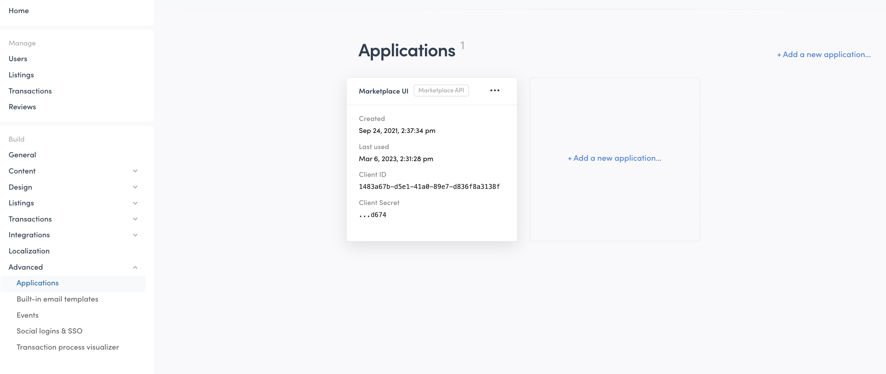
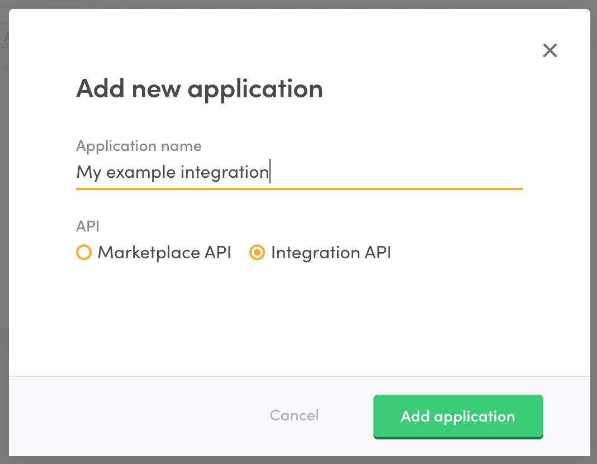
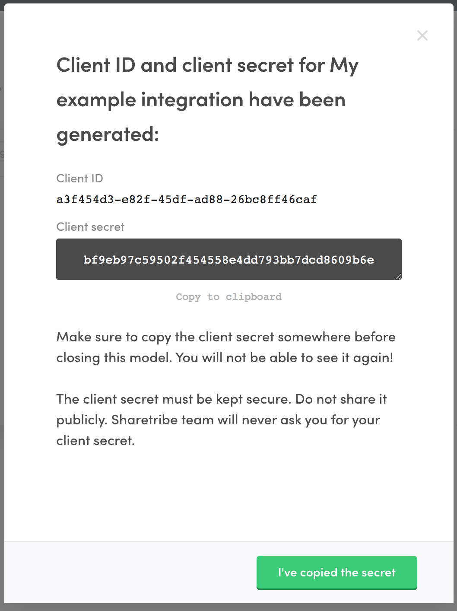

The Flex Integration API is an application programming interface that
provides full access to the marketplace's data. It can be used to build
applications that integrate different own or 3rd party systems with the
Flex marketplace. For an overview of the different APIs that Flex
provides, read
[this article](/concepts/marketplace-api-integration-api/).

In this tutorial, you will download, set up and run an
[example Integration API command line script](https://github.com/sharetribe/flex-integration-api-examples)
that will report some data about your Flex marketplace.

## Install development tooling

To get the example script up and running, you will need to download and
install some basic development tooling:

- [Git](https://git-scm.com/downloads)
- [Node.js](https://nodejs.org/)
- [Yarn](https://classic.yarnpkg.com/en/docs/install)

## Clone the examples Git repository

Clone the examples repository:

```bash
git clone https://github.com/sharetribe/flex-integration-api-examples.git
```

Go to the cloned directory:

```bash
cd flex-integration-api-examples
```

## Install the dependencies

Install all dependencies:

```bash
yarn install
```

## Create Integration API application in Flex Console

The example scripts use the Flex Integration SDK for JavaScript. In
order for the SDK to be able to authenticate to the Integration API, it
requires two values: a client ID and a client secret. You can obtain
both by creating a new
[Integration API application](/concepts/applications/) in Flex Console.

Log in to your marketplace in
[Flex Console](https://flex-console.sharetribe.com/) and navigate to
[Build > Applications](https://flex-console.sharetribe.com/applications).



Click the `Add new` link, fill in an application name (for instance "My
example integration") and choose `Integration API` as the API.



Once the application is created, you will see a screen listing your
application's client ID and client secret. Keep that screen open, as you
will need these values in the next step.



<warning>

Always keep your client secret secure. Never expose it to an untrusted
device or application, such as an end user's browser or mobile app.

</warning>

## Configuration

Copy the environment configuration template file:

```bash
cp env-template .env
```

Open the `.env` file in your favorite text editor and fill in the
`FLEX_INTEGRATION_CLIENT_ID` and `FLEX_INTEGRATION_CLIENT_SECRET`
variables with the values you obtained in the previous step.

## Run an example report

You can get a summary report for your marketplace listings, users and
transactions running the following example:

```bash
node scripts/analytics.js
```

You should see output similar to this:

```
================ My Marketplace analytics ================

Listings: 80
 - 4 draft(s)
 - 5 pending approval
 - 70 published
 - 1 closed

Users: 150
Transactions: 25

This month, starting from Sun Dec 01 2019:
 - 3 new user(s)
 - 10 new listing(s)
 - 9 new transaction(s)
```

## Next steps

- Study the examples
  [source code](https://github.com/sharetribe/flex-integration-api-examples)
  to get a better understanding on how to use the Integration SDK
- Read the
  [Integration API reference documentation](https://www.sharetribe.com/api-reference/)
- Start building your own integration. You can do so in different ways,
  depending on your needs:
  - Build your integration as a backend feature on top of your existing
    Sharetribe Web Template app
  - Fork our Integration API examples repository and build on top of
    that
  - Create a completely new application. If you use JavaScript as your
    programming language, you can make use of our Integration SDK.
    Otherwise, you will need to implement similar functionality as the
    SDK already provides in your own language of choice.
