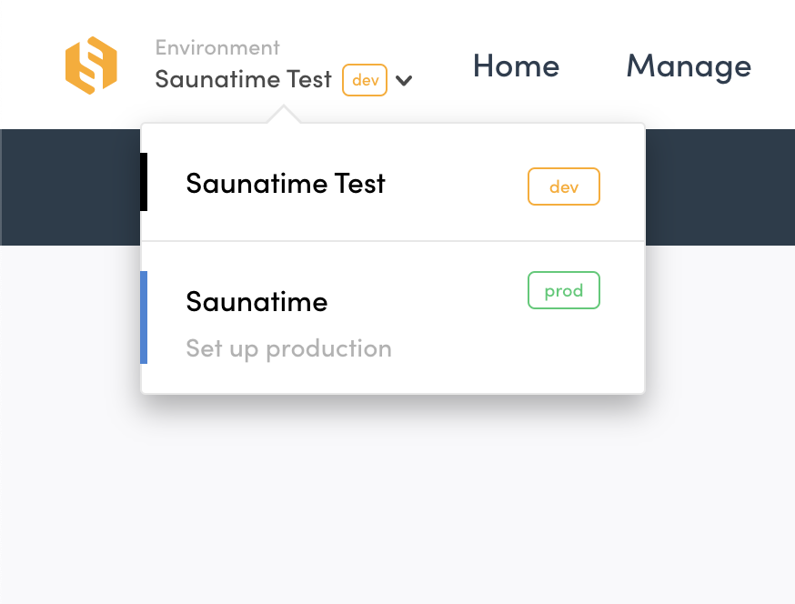

To build and launch your marketplace with Flex, you need to go through
the following stages:

1. Getting access to Flex

2. Designing your marketplace

3. Developing your marketplace

4. Going live

In this article, it is assumed that you've already read
[Introducing Flex](/introduction/introducing-flex/), which explains the
basic concepts of Flex. If you haven't done that yet, it's a good idea
to do that now.

## 1. Getting access to Flex

If you're reading this article, the chances are that you already have
access a Flex marketplace. This means that you have an account in
[Flex Console](https://flex-console.sharetribe.com) (the "admin section"
of your Flex marketplace). If you don't have an account yet, you can
create one in
[the Sharetribe website](https://www.sharetribe.com/#start-building-with-flex).

Once you log in to Console, you'll notice there's nothing there yet: you
naturally don't yet have any users, listings, or transactions.

The first step after logging in to Console is to set up a Flex Template
for Web (FTW). FTW is a fully functional example of a marketplace
website built with Flex. Currently we have three template options:

- [FTW-daily](https://github.com/sharetribe/ftw-daily) "Saunatime" - a
  fictional marketplace for renting home saunas from sauna owners.
- [FTW-hourly](https://github.com/sharetribe/ftw-hourly) "Yogatime - a
  fictional marketplace for booking yoga classes from various yoga
  teachers.
- [FTW-product](https://github.com/sharetribe/ftw-product)
  "Sneakertime" - a product marketplace with stock management

Setting up FTW should take no more than 5 minutes. The process is
technical but doable even without development experience.
[The guide for getting started with FTW](/introduction/getting-started-with-ftw-daily/)
will give you step by step instructions for doing it. If you encounter
any problems with the setup,
[contact Sharetribe support](mailto:flex-support@sharetribe.com).

Once you have FTW set up, you can create a few user accounts and test
the features: posting listings, searching them, making bookings and
payments (see how to use
[test credit card numbers provided by Stripe](/how-to/set-up-and-use-stripe/#6-test-the-stripe-account-in-flex-template-for-web)),
sending messages between users, writing reviews, and so on. You can test
them both on your desktop and on a mobile browser to see how it works on
each device. On Console, you can then see how the users, listings and
transactions you created in FTW appear there.

## 2. Designing your marketplace

Once you have the template up and running, the next step is to start
working on the design of your marketplace: how should it look like, and
what kind of user interface is required for your users to interact with
each other.

It might be that you have already worked this part out: perhaps you have
hired a designer who has already built a design document describing the
exact user interface of your platform. If this is the case, you can jump
directly to the [Development section](#3-developing-your-marketplace).

If you haven't yet done any thinking in terms of the design, it's often
a good idea to start the design work from FTW. A good approach is to
think about what changes are needed to the different pages of FTW to
make it work with your concept. For example, you might want to adjust
the booking page to allow your users to book per hour instead of per
night. You can add pages (like "FAQ" or "How it works") or remove pages
you find unnecessary (perhaps a user profile page is not needed).
Naturally you might also want to change the fonts, color scheme, and
other elements of the general look & feel to make the marketplace look
uniquely yours.

You might also come to the conclusion that the user interface of your
marketplace is so different from the example presented in FTW that it
doesn't offer a good basis for your design. Perhaps you want to build a
mobile app instead of a website, or just have some other major
differences in your approach. That's completely fine: you can also start
drafting the user interface completely from scratch. Typically, it makes
sense to start by building
[wireframes](https://en.wikipedia.org/wiki/Website_wireframe).
Wireframes offer a quick way to describe how the design works without
concentrating on the visual style. You can build wireframes by using pen
and paper, or Powerpoint. A tool designed specifically for building
wireframes, like [Whimsical](https://whimsical.co/) or
[Balsamiq](https://balsamiq.com/), can speed up this process quite a
bit.

Remember that design doesn't mean just the visual style of your
marketplace, but also about how things should work. For example: when a
customer makes a booking in your platform, you need to think about each
possible interaction step between the customer and the provider. Can
they send messages to each other? Does the provider need to approve the
booking before money is charged? Can the customer cancel the booking and
get a full refund? Can both parties review each other afterwards?

To model this "transaction flow" of your marketplace, it's often a good
idea to draw a [flowchart](https://en.wikipedia.org/wiki/Flowchart),
which describes the different steps of the flow, and different options
that are possible in each step. Doing this helps you then figure out
what kind of user interface you need to accommodate the design.

Once you have the wireframes ready and know what you want, the next step
is to build the actual visual design. If you're comfortable with using a
design tool like [Sketch](https://www.sketch.com/), you can
[download the Sketch design files of FTW](/design-toolkit/design-files/#assets)
and build your own design by adjusting these files. This approach can
dramatically speed up the design process, and it offers an easy starting
point for the developers.

Does all of this sound overwhelming to you? If you're don't want to do
the design work yourself, you can always hire a designer to do it for
you. If you don't know any designers,
[contact Sharetribe support](mailto:flex-support@sharetribe.com) and
we'll connect you to a designer who can help you out.

## 3. Developing your marketplace

In Flex, all the changes made to the user interface of your marketplace
are done by editing the software code directly. Thus, once you have the
design ready for your marketplace, it's time to start development work
to make your marketplace look and work the way your designs describe.

Typically, the development work is done by downloading the
[open source codebase of FTW](https://github.com/sharetribe/ftw-daily)
and customizing it according your needs. If you're a developer, you can
proceed to do this and
[start development right away](/ftw/how-to-customize-ftw/).

If you're not a developer yourself and don't have one in your team,
you'll need to contract or hire a developer to do this work for you. You
can work with any developer of your choice, but we highly recommend the
developers in the
[Flex Expert Network](https://www.sharetribe.com/experts/). The network
consists of experienced agencies and freelancers around the world, all
vetted by Sharetribe for their Flex skills. They will be happy to guide
you through the process of defining your exact requirements and
completing your marketplace based on them.

If you'd like to receive a quote from a Flex Expert for building your
marketplace, you can head to the
[Flex Expert Directory](https://www.sharetribe.com/experts/) and contact
some developers directly from there. If you'd like to get help choosing
the right developer or learn more about the process for hiring, you can
[book a free consultation call](https://calendly.com/welcome-to-flex)
with a Sharetribe team member, and we'll guide you through the process.

When you're hiring a developer, it helps a lot if you have already done
some work on the design, as that makes it easier for you to describe
your needs to the developer. This helps the developer in estimating how
many hours it will take to build what you need, which directly affects
the cost. Developers will typically bill you based on the number of
hours they need to spend developing your platform. Some development
companies also offer design work, and hiring such a company can be a
great idea if you don't have your own designer, as getting the design
and development done by the same team can streamline the development
process.

The development phase takes typically 1-2 months from the first lines of
code written to the launch of the first version. Depending on your exact
requirements, this period could also be shorter or longer. It should be
noted that design and development should happen in close collaboration:
while doing development, you will likely learn new things, and
constantly adjust the design based on those.

Remember: building a marketplace platform is a process, not a project. A
good rule of thumb is that the first version of your marketplace should
have only the absolute minimum features required by your users. For more
information on this, an article on
[How to build your Minimum Viable Platform](https://www.sharetribe.com/academy/how-to-build-a-minimum-viable-platform/)
is highly recommended, as well as the other articles in
[The practical guide for building an online marketplace business](https://www.sharetribe.com/academy/guide/).
\
 \
After people start using your platform, you can monitor what they're doing
and talk to them. Based on your findings you can then figure out what you
should build next. Quite often you discover that the most important thing
to build next is not what you thought before launching your marketplace.
Thus, the more features your initial Minimum Viable Platform contains, the
higher is the likelihood that you end up wasting both money and time. So
try to launch as quickly as you can, as that is where the true learning begins.

## 4. Going live

Once you've reached a point when you're ready to invite first real users
to your marketplace, it's time to go live.

// TODO Update screenshot At this point, you should subscribe to
Sharetribe Flex. You can do this from Flex Console. Open the Environment
dropdown and click the _Set up live_ item to subscribe.

This is when you start paying the Flex minimum monthly fee (see more
information about
[Flex pricing](https://www.sharetribe.com/products/flex/#pricing)). The
development phase is completely free. You only need to pay when you
start inviting your real users to your marketplace.

After you've subscribed, we will create a _live environment_ to
complement your current _development_ and _test_ environments. This
means that you can easily do development and testing of new features,
without those affecting your actual users in any way.

Naturally, development doesn't stop once you've gone live: that's just
the very beginning. It's highly likely that you want to keep improving
your platform on a weekly basis after going live, based on the feedback
from your users. The devil is in the details, and small changes can make
a big difference. Every successful marketplace out there has started
with a minimal set of features, and then continuously kept improving
over the years.

<!-- Docs to Markdown version 1.0β15 -->
