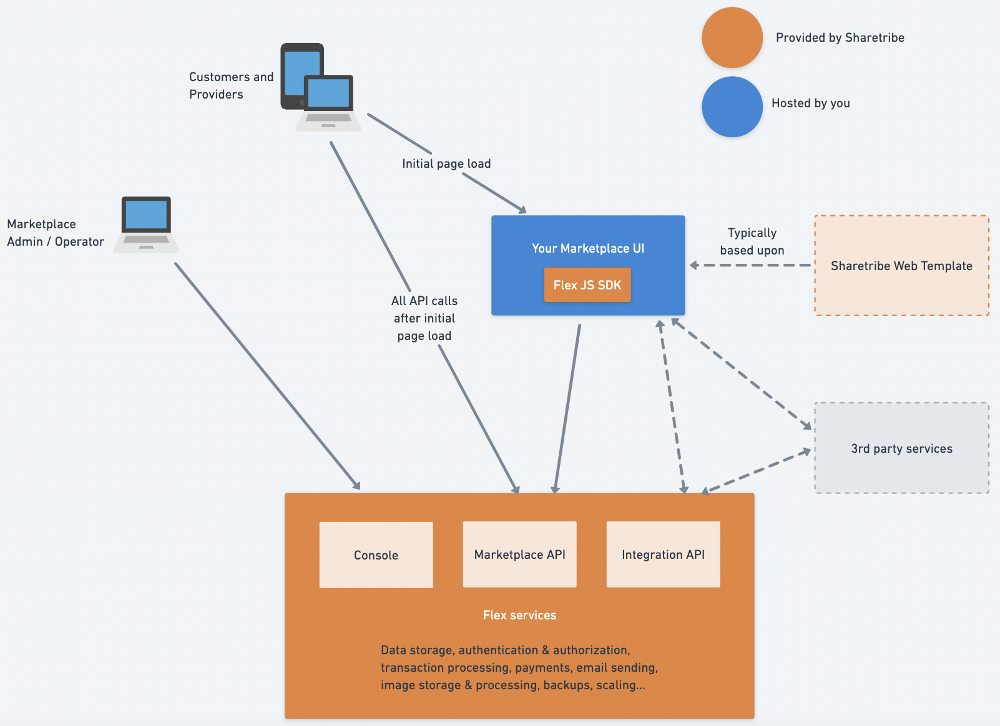

TODO FIX WORDING TO REFER E.G. TO CUSTOM DEVELOPMENT APPROACH!

## Introduction

Sharetribe is a complete solution for building a powerful online
marketplace for rentals, services, events or experiences. Sharetribe
provides you with all the necessary marketplace infrastructure out of
the box. At the same time, because of its headless architecture,
Sharetribe gives you total freedom to customize your user experience.

This makes Sharetribe the fastest and most affordable way to build a
unique platform that adapts to the entire lifecycle of your business. As
your business grows, Sharetribe takes care of running and scaling your
backend — allowing you to focus on the unique value of your platform.

## Sharetribe Components

### Your marketplace UI

Your marketplace user interface (UI), also known as the "front end", is
what your users see and interact with. They use the UI to sign up to
your platform as well as to post, find, book, and pay for listings.
Whether a web-based UI, a mobile application, or both, the user
interface is the face of your solution. That's why you have total
control over it.

You can fully choose things like which fonts and colors to use in your
user interface, what kind of pages or views there should be, and how
those should be laid out. There are no limits to what you can do in
terms of visual design.

[Sharetribe Web Template](/introduction/getting-started-with-web-template/)
is a web template that implements a full-feature marketplace experience
powered by Sharetribe. The template can be configured to three types of
marketplaces out of the box:

- a rental marketplace with daily or nightly bookings
- a service marketplace with time-based bookings
- a product marketplace with stock management

With a Sharetribe Web Template, you can get started with your
marketplace UI straight away: just download the latest version and start
customizing it for your marketplace. There are no limits to how much you
can customize the template. You can freely design the user interactions
and alter the look and feel of your marketplace. You can also integrate
any web analytics or customer service solutions directly into your UI.

Your users won't see Sharetribe mentioned anywhere. The web address is
your own domain, the email notifications get sent from your email
address, and the entire user experience is fully tailored to match your
brand.

If you prefer to start from scratch, you can build your own UI on top of
Sharetribe's Marketplace API yourself. For instance, if you want to
build a mobile application for your marketplace, you will need to build
a fully custom user interface. You can also have several UI applications
for the same marketplace, so the user can manage their listings and
transactions on a native mobile app as well as on the web.

### The Marketplace API

The Marketplace API is how your UI connects to the Sharetribe services.
It's an HTTP interface with a design influenced by the
[JSON API specification](https://jsonapi.org/) and the
[CQRS pattern](https://martinfowler.com/bliki/CQRS.html). The
Marketplace API allows you to implement all the standard marketplace
functionality that Sharetribe supports.

Sharetribe handles running and scaling the Marketplace API. To take full
advantage of this, you should design your Marketplace UI to point a
majority of the traffic directly to the Marketplace API. For example,
Sharetribe Web Template only handles the initial page load when a user
opens their browser. After that, the template lets the client
application (Single-page application) talk directly with the Marketplace
API, and the API powers all further interactions.

To learn more about the capabilities of the Marketplace API and
Sharetribe, visit the [API reference documentation](/concepts/api/).

### Sharetribe JavaScript SDK

[The Sharetribe JavaScript SDK](/concepts/js-sdk/) is a small JavaScript
library that helps you with integrating the Marketplace API. It handles
tasks like authentication and session management and makes it easy to
use correct data types with the API. Using the Sharetribe JS SDK is not
required, but if you are working with JavaScript, we strongly encourage
you to have a look.

### Console

[Console](https://console.sharetribe.com/) is where you to manage all
your marketplace data, such as users, listings and transactions. Console
also offers tools to develop your marketplace, for example, an editor
for email templates. Console is accessed via a web UI that we provide
out of the box. Think of it as an admin interface you never have to
build!

### The Integration API

The Integration API is how you can integrate third party solutions to
your Sharetribe marketplace. It provides full access to your marketplace
data and operations, so you can integrate a vast range of services to
your marketplace behind the scenes. To read more about the capabilities
of the Integration API, visit the
[API reference documentation](/concepts/api/). You can also read more
about
[integrations in Sharetribe](/concepts/integrations-introduction/).

### Sharetribe CLI

Sharetribe CLI (Command-line interface) is a tool for changing your
marketplace's advanced configurations such as transaction processes and
email templates.

See the
[Getting started with Sharetribe CLI](/introduction/getting-started-with-sharetribe-cli/)
tutorial for more information.

## Is Sharetribe the right fit for you?

Now you know roughly what Sharetribe is all about. Next, it's time to
evaluate
[whether Sharetribe is the right fit for your specific marketplace idea](/introduction/is-flex-right-for-you/).
