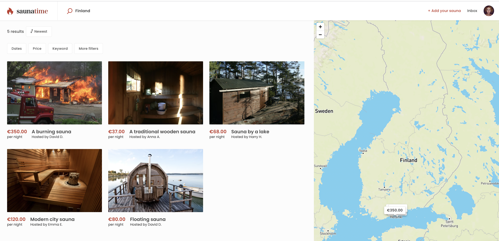
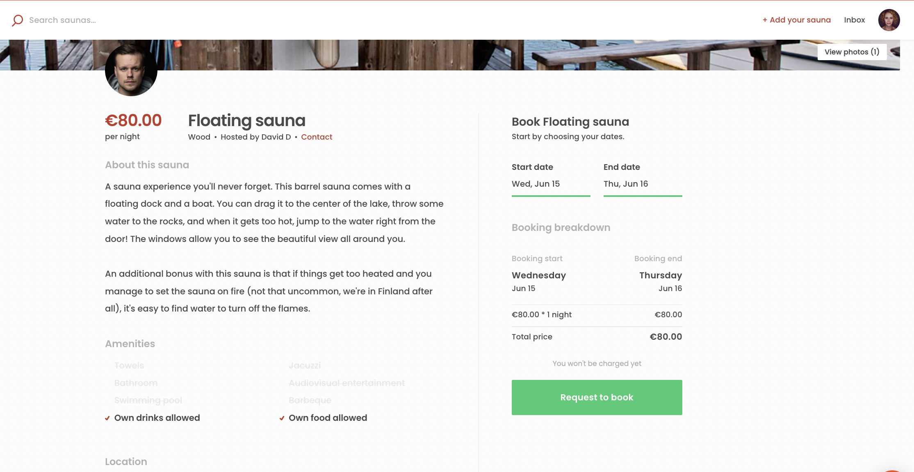

Saunatime, a.k.a. FTW-daily, is the original Flex Template for the Web.
It is a great starting point for developing rental marketplaces where
bookings are made on a daily or nightly basis. It offers basic
marketplace functionalities out of the box, and you can further
customize it to suit your specific marketplace.

## Listings

The heart of the Saunatime marketplace are listings. As a registered
user, you can create as many listings as you want, and all published
listings are visible to both registered and anonymous users. You can

The Saunatime template enables complex filtering, including based on
location, availability dates, price, and rental features. You can freely
modify both the listing attributes and the search attributes to suit
your marketplace.

## Availability

Saunatime template uses the Flex built-in availability calendar. By
default, the bookings are made nightly – in other words, the earliest
end date can be the next day from start date. However, you can easily
modify the bookings to be daily as well.

When a provider receives a request for a booking, they can accept or
decline the request. The customer's payment method will only be charged
once the provider accepts the booking.

## Messaging

Saunatime allows providers and customers to send private messages
related to listings and bookings. The messages are shown in a timeline
that also shows the different actions the participants have taken in the
transaction.

## Reviews

Once a transaction has completed, the customer and provider can both
leave reviews. In Saunatime, reviews remain hidden until either both
parties have submitted their reviews or the review period expires.

This ensures that the second participant's review is not affected by the
first review. Both reviews are published to both parties at the same
time, and after the review is published it cannot be modified anymore.

## Customizing your own marketplace

The fastest way to get started with modifying the Saunatime template is
to check out our [tutorial](/tutorial/introduction/). The tutorial starts
with the Saunatime template, and it guides you through visual and
functional modifications. You can also check out our other FTW
templates, [Yogatime](/introduction/introducing-yogatime/) and
[Sneakertime](/introduction/introducing-sneakertime/), to see
which template has features that best suit your unique marketplace idea.
