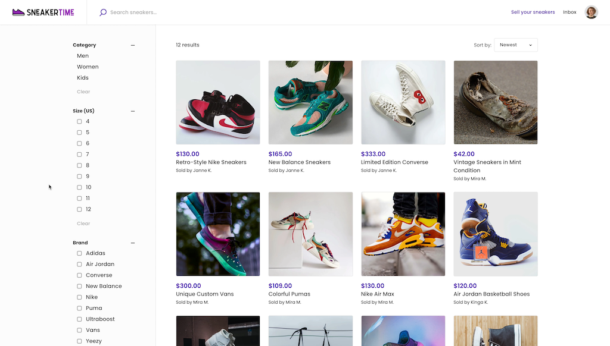
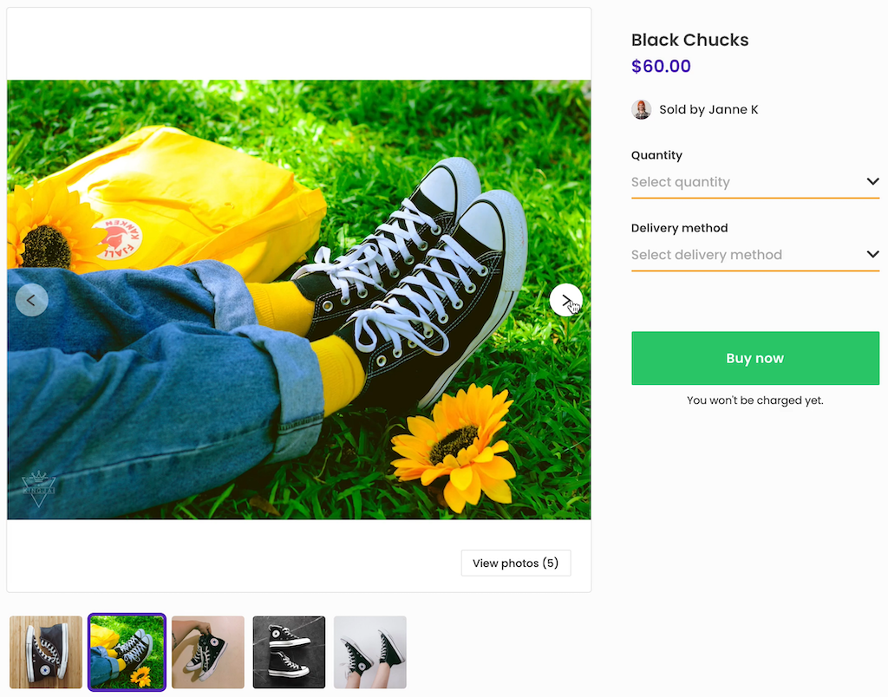
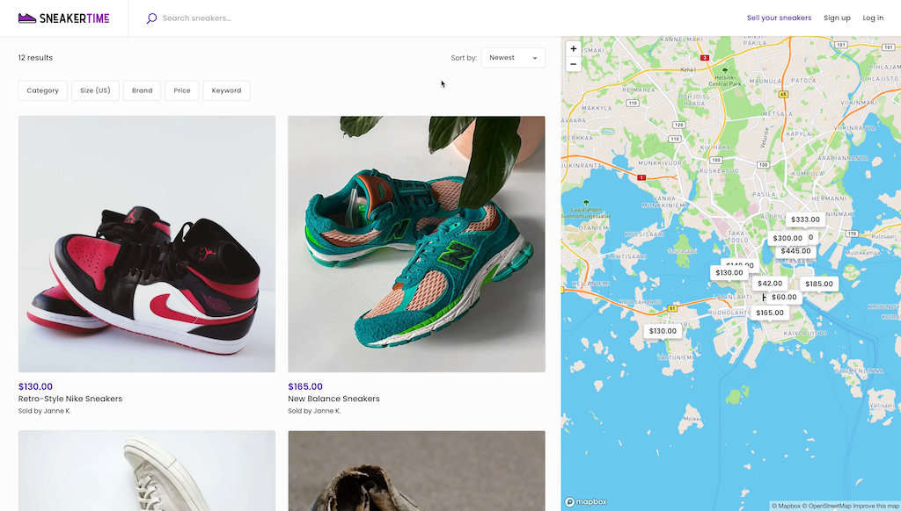

Sneakertime, aka FTW-product, is a Flex Template designed as a starting
point for the development of product marketplaces. It offers basic
product marketplace functionality out of the box and can be further
customized to fit your marketplace’s unique workflows and design.

To learn more, check out the video below or read on. For more technical
information on Sneakertime, check out
[this article](https://www.sharetribe.com/docs/ftw/ftw-product/)
in our developer documentation.

<iframe width="560" height="315" src="https://www.youtube.com/embed/XUpxn_K4Mm8" title="YouTube video player" frameborder="0" allow="accelerometer; autoplay; clipboard-write; encrypted-media; gyroscope; picture-in-picture" allowfullscreen></iframe>

## Layout

Sneakertime’s layout is designed with product marketplaces in mind. As
with our other templates, Saunatime (FTW-daily) and Yogatime
(FTW-hourly), everything can be changed to your specifications.

### Browsing and filtering

Sneakertime’s browse view consists of listing thumbnails and filters on
the left side. The filters live-update the listings that are displayed.
Potential buyers do not need to update the view separately but can
choose and change attributes in real-time.

### Listing thumbnails and images

Default listing thumbnails in Sneakertime are square-shaped. The
template code has an easy configuration to change the aspect ratio of
the thumbnails.

On the listing page, images are presented in a carousel. They also
retain their original aspect ratio.

### Location features

By default, Sneakertime does not have a location search or a map view.
If you're building a local product marketplace, these are easy to add,
as Sneakertime’s code has components to enable both the map and location
search with a simple configuration change.

## Inventory management

Inventory management is vital for product marketplaces, and Sneakertime
uses Flex’s listing stock management features to enable it. You can read
more about inventory management in Flex
[in this article](https://www.sharetribe.com/docs/concepts/inventory-management/).

In Sneakertime, the seller adds the number of items they have in stock
during listing creation. When a buyer makes a purchase, that number is
automatically reduced. The seller can manage their stock manually by
editing the listing if there are inventory changes that are not related
to transactions.

If you’re building a marketplace for used or unique items, you can
customize the template so that the default inventory for listings is
always one (1). When an item is sold, its stock will automatically go to
zero.

## Delivery options

Sneakertime allows sellers to choose a delivery method. When creating a
listing, the seller chooses pick-up, shipping, or both.

For pick-up, the seller fills out a pick-up address. For shipping, the
seller specifies a price, and a fee for any additional items, if the
buyer buys more than one. The seller is in charge of shipping and marks
the order as shipped once they’ve mailed it to the buyer.

With Flex, you have the option to integrate a third-party shipping
service. By connecting your marketplace with shipping software like
Shippo or ShippyPro, you can streamline delivery on your platform and
guarantee that your sellers use the shipping service you’ve chosen.

## Transaction process

Sneakertime has a new default transaction process. Compared to the
transaction process in Saunatime and Yogatime, the Sneakertime process
adds steps for stock management, shipping, delivery, and disputing
orders. It does not include bookings.

A transaction in Sneakertime starts on the listing page. The buyer
chooses the number of items they want to buy and the delivery method
(pick-up or shipping). After this, they move to the checkout page, fill
out their payment details and purchase the listing. Stock is reserved,
and the seller receives a notification of the order. The seller does not
need to accept the order separately.

If the buyer has chosen shipping as the delivery method, the seller will
mark the order as shipped once they’ve processed it and the package is
on its way. Similarly, once the buyer receives the item, they will mark
the order as received.

If the item does not arrive, its condition is lacking, or there is
another problem with the purchase, the buyer can dispute the order. In a
dispute, the marketplace’s administrator will investigate the situation
and settle the dispute either by refunding the buyer or marking the
order as successfully completed.

After the transaction is complete, both parties are prompted to review
each other.

With Flex, you can modify your marketplace’s transaction flow to your
specifications. For example, you could add a step for the seller to
confirm the order or only have the buyer review the purchase. Read more
about transaction processes in Flex
[here](https://www.sharetribe.com/concepts/transaction-process/).

## How to get started

With Flex, you are in control of your frontend app development.
Everything from the visual design of the template to the transaction
process, integrations, and more can be customized to fit your exact
needs.

If you’re a developer or have one in your team, head over to Github,
download the Sneakertime code, and start developing your unique product
marketplace. If you’re looking to hire a developer from Sharetribe’s
[Expert Partner Network](https://www.sharetribe.com/experts/), check out
[this article](https://www.sharetribe.com/docs/operator-guides/how-to-hire-developer/)
for more information on the process.
