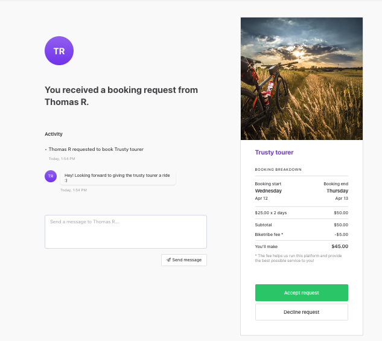

The Sharetribe Web Template is a customizable marketplace web
application built on top of the Flex APIs. It is a great starting point
for developing any type of marketplace, whether it is about rentals,
services, products, or something else. It offers basic marketplace
functionalities out of the box so that you can focus on developing
custom features.

## Development starting point

The Sharetribe Web Template lets you build a custom marketplace fast.
After downloading the open-sourced codebase and installing your tooling,
you start with a fictional marketplace called Biketribe. Biketribe is a
web app for purchasing or renting bikes.

The Sharetribe Web Template is designed to be customized. Biketribe is
an example to help you develop your own custom marketplace faster. The
codebase features modern frontend technologies, so developers familiar
with headless web development should be able to start building quickly.

Much of the Template’s initial functionality is configurable through a
few simple code changes. Core user experiences like search, listing
creation, and transactions can be set from a single file.

Overall, the development phase takes typically 1-2 months from the first
lines of code written to the launch of the first version. Depending on
your exact requirements, this period could also be shorter or longer.

The rest of this article describes some of the out of the box
functionality available in the Sharetribe Web Template.

## Listings

The heart of the Sharetribe Web Template marketplace are listings.
Listings represent what is offered on a Flex marketplace, whether it is
a product, a job, a service, rental or something else.

A few configurations make it easy to set what your listings are about.
By default, Biketribe registered users can create any number of
listings. Listings are automatically published. Published listings are
visible to registered and non-registered users.

You can learn more about how listings work in Sharetribe
[here](/concepts/listings-overview/).

### Listing thumbnails and images

Default listing thumbnails in Sharetribe Web Template are square-shaped.
The template code has an easy configuration to change the aspect ratio
of the thumbnails. The Sharetribe Web Template has two main layouts for
a listing page. One layout features a single cropped image on top of the
page, which is more geared toward rentals and services. The other layout
features a full image of the item, which is designed with product
marketplaces in mind.

### Availability

Listings can feature an availability calendar. You can configure the
availability of your listings to be nightly, daily, or hourly. With code
modifications, you can offer bookings using custom time increments (for
instance, 15-minute intervals) as well as offer multiple different
booking length options (for instance, hourly and daily booking options).

Sellers add their availability when creating their listing. Daily and
nightly availability lets them add a default weekly schedule and easily
set any exceptions to that default schedule. Hourly availability lets
providers set their exact schedule for every day up to one year in
advance.

Customers book from the provider’s availability calendar on the listing
page.

The Sharetribe Web Template has time zone support. The seller’s location
determines the timezone of the listing, and that timezone is saved into
the listing’s availability plan. Bookings can be made for multiple spots
or seats. This feature can be added easily by modifying the Template
code.

Read more about
[availability management in Flex](/docs/references/availability/).

### Inventory management

On the other hand, listings can be about products and offer inventory
management. The seller adds the number of items they have in stock
during product listing creation. When a customer makes a purchase, that
number is automatically reduced. The seller can manage their stock
manually by editing the listing if there are inventory changes that are
not related to transactions.

You can configure the Template so that the default inventory for
listings is always one (1). When an item is sold, its stock will
automatically go to zero. Listings with zero stock are filtered out by
default, and do not appear in search.

Read more about
[inventory management in Flex](/concepts/inventory-management).

## Search

### Keyword or location search

Two search options are available: search by keyword or by location.
Keyword search lets customers enter their queries via a search bar.
Customers can further refine their search using sorting and filtering
options available in a left-hand toolbar.

Location search lets customers type in a specific address, with listings
returned in order of their distance from the searched-for location. The
search page for location search includes a map; customers can scroll the
map to find new listings from different locations. Sorting and filtering
fields are available via a drop down menu near the top of the page.

Learn more about how to
[configure your search settings](/ftw/configuration/#search-configuration).

### Browsing and filtering

You can build the filtering experience of your marketplace using
configurable extended data. Simple editing of a JSON schema allows
adding, removing, or modifying what fields are added to listings. Set
the fields’ read and write permissions depending on the needed use case,
and quickly turn listing fields into corresponding filters.

Read more about how to
[configure extended data in the Sharetribe Web Template](/ftw/configuration/#listing-configuration).

## Transactions

### Booking default process

Sharetribe Web Template offers transactions with calendar bookings,
where customers book time from a provider’s availability calendar. The
price they pay equals the amount of time booked multiplied by the
booking price. Customers can book by days, nights, or hours.

Providers add their availability while creating their listings. They
configure when they are available for booking, creating a calendar that
the customer can use during search and booking.

### Product default process

You can also configure the Sharetribe Web Template to become a
marketplace for purchasing. The calendar booking is removed; purchasing
happens by selecting the number of units. Shipping is offered by
sellers, who set a fixed shipping price for the first and any subsequent
items purchased.

Units may be purchased from an available stock, which is set by the
seller. Out of stock listings cannot be purchased.

### Payments

Customers pay using credit card or debit card by entering their payment
information on the checkout page. Payments in the product default
process are captured immediately, whereas payments with the booking
default process are only captured after the provider accepts the booking
request. In either case, funds are transferred to the marketplace’s
Stripe account. The configured seller commission is paid out to the
marketplace. The remaining funds (the seller’s earnings) are paid out to
their bank account according to rules of the transaction process.

Learn more about
[how payments work in Flex](/concepts/payments-overview/).

### Messaging

Sharetribe Web Template allows sellers and customers to send private
messages back and forth. Users can start a message thread with another
user from their profile or their listing. Users access messages in their
inbox. Each message thread also includes a timeline of different actions
taken during the transaction. Messages initiate transactions, but do not
transition a transaction from one state to another.

### Reviews

Once a transaction has completed, the customer and provider can both
leave reviews. In Sharetribe Web Template, reviews remain hidden until
either both parties have submitted their reviews or the review period
expires. This ensures that the second participant's review is not
affected by the first review. Both reviews are published to both parties
at the same time, and after the review is published it cannot be
modified anymore.

## Account management

### Signup and login

The Sharetribe Web Template allows anonymous users (i.e. users without
an account) to visit content pages, search, and browse listings. Most
every other action requires users to create an account on the signup
page with their email and password. After confirming their email, signed
up users can engage in selling, buying, or both.

Users can login to their accounts using their email and password. They
can reset their password from the login screen using their email.

Every user has a user profile page where they can add a profile picture,
their first and last name, and share a bio. In their account settings,
users can change their email address, add a phone number, change their
password, add their payout details, or add their payment info (credit or
debit card) for faster checkout.

Learn more about how
[user accounts and authentication work in Flex](/concepts/users-and-authentication-in-flex/).

### Seller onboarding

Before they can publish their listings, any seller must complete an
onboarding process where they add their payout details. The onboarding
process happens through a Stripe-hosted modal, where sellers are taken
through several steps to tell your marketplace where to send their
earnings. Stripe also takes care of identity verification so that your
marketplace complies with KYC/KYB regulations.

Sellers can revisit the modal from their account settings at any point
if they need to edit their information (such as a change of address) or
provide more information to be in compliance.

Learn more about
[handing seller onboarding on your marketplace](https://www.sharetribe.com/docs/how-to/provider-onboarding-and-identity-verification/).

### Email notifications

The Sharetribe Web Template uses Flex to send email notifications. There
are two types of email notifications. Built-in email notifications
relate to user account management and are sent whenever a user is
setting up their account or changing some of its settings. Transaction
process emails, meanwhile, are sent as a result of certain actions in a
transaction, such as when a new message is received. Only users with
verified email addresses receive emails.

Learn more about
[how email notifications work in Flex](/concepts/email-notifications/).

## Design

The Sharetribe Web Template starts with a familiarly modern and sleek
marketplace design. Each component is built to suit multiple
screen-sizes, from desktop to mobile browser. Your email notifications
also include the same smooth style out of the box.

Branding the Sharetribe Web Template is easy with a refined styling
approach that lets you set the marketplace colors, logos, and favicons
quickly. You’ll also likely want to change your marketplace’s microcopy,
modify your landing page, and add essential information to your users
with Console’s Microcopy and Pages editors.

Learn more about
[how content works in Flex](/concepts/content-management/).

Self-hosting the Template code base lets you customize the starting
design as much as you want. Any custom design can be implemented on
Flex. We offer downloadable design files to help you build your custom
design. You can find the Sharetribe Web Template design files here.

## Customizing your own marketplace

The first step to take the Sharetribe Web Template into use is
downloading the codebase and installing the necessary development tools.
Then, check out our tutorial where you modify Biketribe’s visual and
functional settings to create an entirely new marketplace. 

Follow our
[getting started guide](/introduction/getting-started-with-web-template/)
for installation instructions and tutorial next steps. If you prefer to
code your own features right away, don’t hesitate to use
[our documentation](https://www.sharetribe.com/docs/) or contact
[our support team](mailto:flex-support@sharetribe.com) by email for
help. 

If you are not a developer, then you will need to hire a developer
to take Flex into use. We recommend finding a vetted developer from
Sharetribe’s
[Expert Partner Network](https://www.sharetribe.com/experts/). As a next
step, learn more about how to
[hire a developer to build your marketplace](/operator-guides/how-to-hire-developer/).
