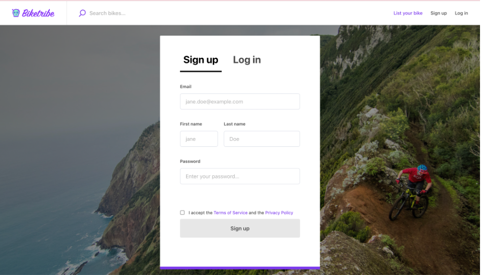

You can add all your marketplace photos, including the logo, favicon, app icon, background image, and social media images, through your console by going to Content → Branding. 

_Here’s how to ensure each photo is stunning._ 

## Logo

Your marketplace logo is shown on the top left corner of your marketplace Top bar. For the best result, we recommend using a file with a height of 48 pixels and a width of 48 – 370 pixels. The file should be a jpg or png.

The logo images are scaled to have a few image variants, such as for retina displays and normal screens. However, if the logo's aspect ratio is not inside the recommended one, the logo may look small or compressed.

## Favicon

The favicon will be visible to any visitor in their browser tab. For your favicon image, use a square image in dimension 48x48 pixels or larger. The file should be a jpg, png, or .ico. Adding your favicon as a .ico file type to ensure visibility in different browsers. In particular, Microsoft Edge seems to rely on this file type, but a .ico file should work in other browsers as well.

If the photo you upload is smaller than the recommended 48x48 px size, If the images are smaller, it will be scaled up, which caused pixelation. 

## Background image for login pages

The background image is for pages related to authentication: Login, Sign Up, Email Verification, Password Recovery, and Password Reset. It should have a 2:1 aspect ratio and a minimum size of 1200x600 pixels.

## Social media image

This image is shown on the social media card when someone shares your marketplace in a post on Facebook, Twitter, LinkedIn, or another social media service. It should have a 1.91:1 aspect ratio and a minimum size of 1200x630 pixels.

## Listing image

The listing images are the images that your providers or sellers use to showcase the products, items or services they’re putting up for sale. The listing image can be landscape, portrait or square, and the maximum listing image size is 20 MB and 3072 x 3072 pixels. You can learn more about the listing thumbnail aspect ratio here (ADD LINK TO LISTING THUMBNAIL ASPECT RATIO).

### Need to Resize or Crop Your Images?

To resize or crop your marketplace photos, you can use a basic image editor (like Paint) or an online tool like [Cropp.me](http://cropp.me/) or [Cut My Pic](http://www.cutmypic.com/).

You can also try just adding the images in their original format and see the results. Afterward, you can alter the images by cropping. 

### Do you need a logo?

A logo is a very important part of your brand identity. If you want to benefit from a professional designer, you can find one on a freelance platform like Upwork or Fiverr. However, if you’re bootstrapping and have a tight budget, you can get a good-looking logo with services like [Canva's Logo Maker](https://www.canva.com/logos/), [logogenie](https://www.logogenie.net/), or [logo.com](https://logo.com/). 