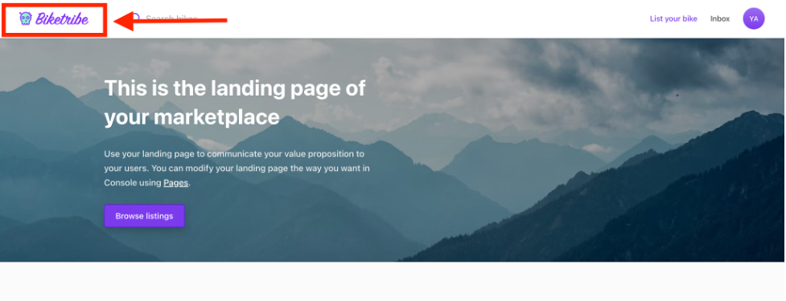
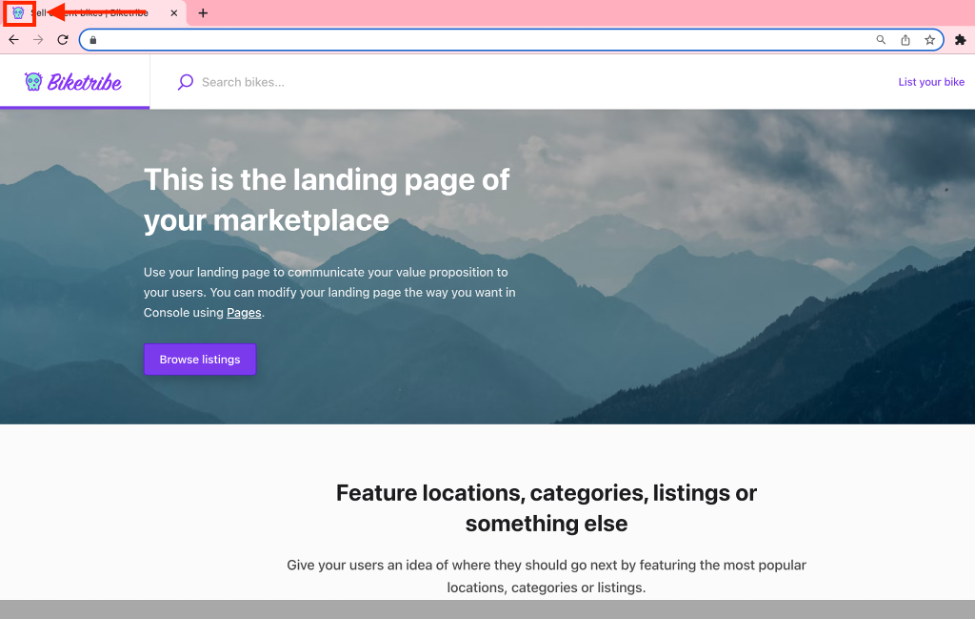
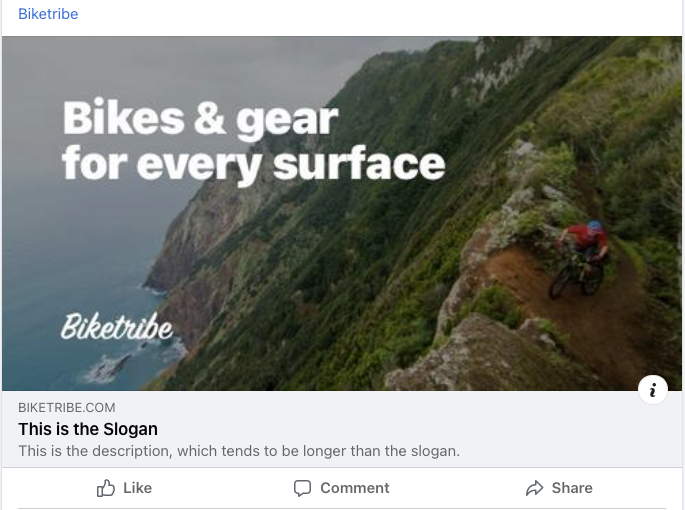
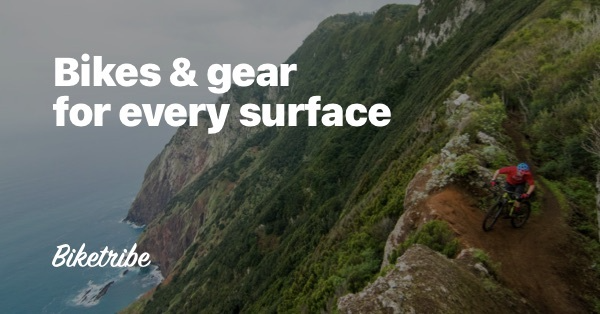

Sharetribe offers the ability to upload a variety of images and logos to
display your brand throughout your marketplace. Each type of brand
images requires a different size to properly display throughout your
marketplace. Unless otherwise stated, images should be in .png, .jpg, or
.gif format.

## Marketplace Logo

Your marketplace logo is shown on your marketplace top bar and in the
footer.

You can choose to display your logo in three different sizes:

- Small: logo dimensions are 24x640 pixels
- Medium: logo dimensions are 24x640 pixels
- Big: logo dimensions are 36x640 pixels

As you might notice, increasing your logo size increases logo height
while keeping the logo width the same. Therefore, it is important to
upload a logo that suits the size of the logo you wish to display. You
might need to create multiple logos of different heights as you
experiment with different sizes.

## Favicon

The favicon is shown on the browser's tab. If your logo has a simple
icon, you can use this icon as your favicon. It’s also known as the tab
icon. For your favicon image, use a square image in dimension 48x48
pixels or bigger.

## App icon

The app icon is similar to the favicon: it is a square icon representing
your site in different browser contexts. For example, the app icon is
used when your marketplace is bookmarked to a mobile home screen or when
viewing open tabs in Chrome browser.

Make sure that your app icon has a square aspect ratio and dimensions of
at least 512x512 pixels for best results.

## Background image for login/signup page

The background image for the login/signup page is the image that your
users see in the background when logging in. It’s also shown on other
pages related to user authentication, including Password Recovery,
Password Reset, and Email Verification.

The image should be appealing and give users a glimpse into your
marketplace, what they should look forward to. It is a great way to give
another good impression to new users. Don't be scared to use a
significant image, or even a full color block (saved as an image) if it
suits your brand. It should have a 2:1 aspect ratio and a minimum size
of 1200x600 pixels. The background image for the login pages can be a
maximum of 2400px wide. Here’s an example of how the background image
would look in the signup page:

## Social media images

The social media image is shown on the social media card when someone
shares your marketplace in a post on Facebook, Twitter, LinkedIn, or
another social media service. An engaging image might help people decide
to engage with your brand.

For the best result, your social media image should be around 1200x600
pixels. If you upload a bigger image, then the social media platform may
crop it, potentially leaving out certain information or an important
image, such as the marketplace name or slogan.

Here is the original image that was displayed above:

