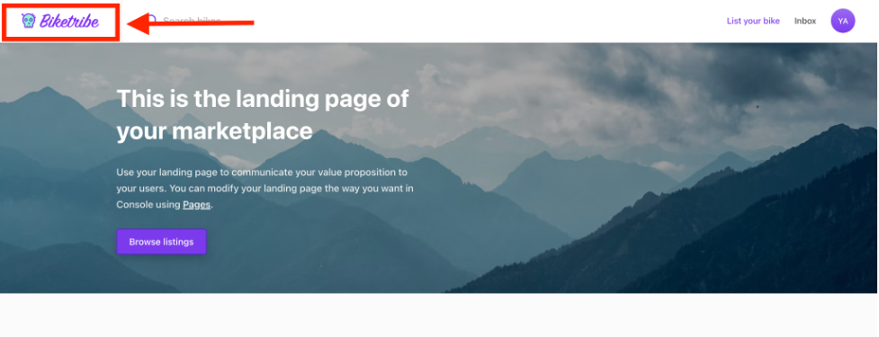
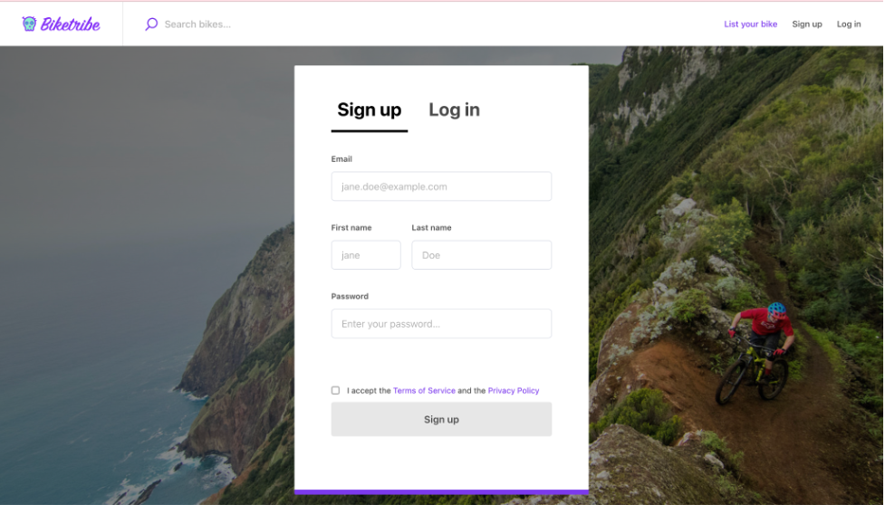

## Marketplace Logo

Your logo lets your customers instantly recognize your business and
connect with what you do and stand for. Every marketplace or business
looking to have an online presence should have a great logo that
communicates your brand identity. Check our guide to good-looking logos
here.

Your marketplace logo is shown on your marketplace Top bar. For the best
result, we recommend using a file with a height of 48 pixels and a width
of 48–370 pixels. Check this article if you want to know more about the
logo measurements (Link to the other article).

## Favicon

The favicon is shown on the browser's tab. If your logo has a simple
icon, you can use this icon as your favicon. It’s also known as the tab
icon. For your favicon image, use a square image in dimension 48x48
pixels or bigger. Here’s an example of a marketplace favicon:

## Background image for login/signup page

The background image for the login/signup page is the image that your
users see in the background when logging in. It’s also shown on other
pages related to user authentication, including Password Recovery,
Password Reset, and Email Verification.

The image should be appealing and give users a glimpse into your
marketplace, what they should look forward to, and the kind of quality
to expect when they make a listing. It should have a 2:1 aspect ratio
and a minimum size of 1200x600 pixels. The background image for the
login pages can be a maximum of 2400px wide. Here’s an example of a
background image:

## Social media images

When you or someone shares a link to your marketplace on social media,
you want the people engaging with that tweet, LinkedIn, or Facebook post
to quickly understand your marketplace.

The social media image is shown on the social media card when someone
shares your marketplace in a post on Facebook, Twitter, LinkedIn, or
another social media service.

For the best result, your social media image should exactly be 1200x600
pixels. If you upload a bigger image, then the social media platform may
crop it, potentially leaving out certain information, such as the
marketplace name or slogan.
