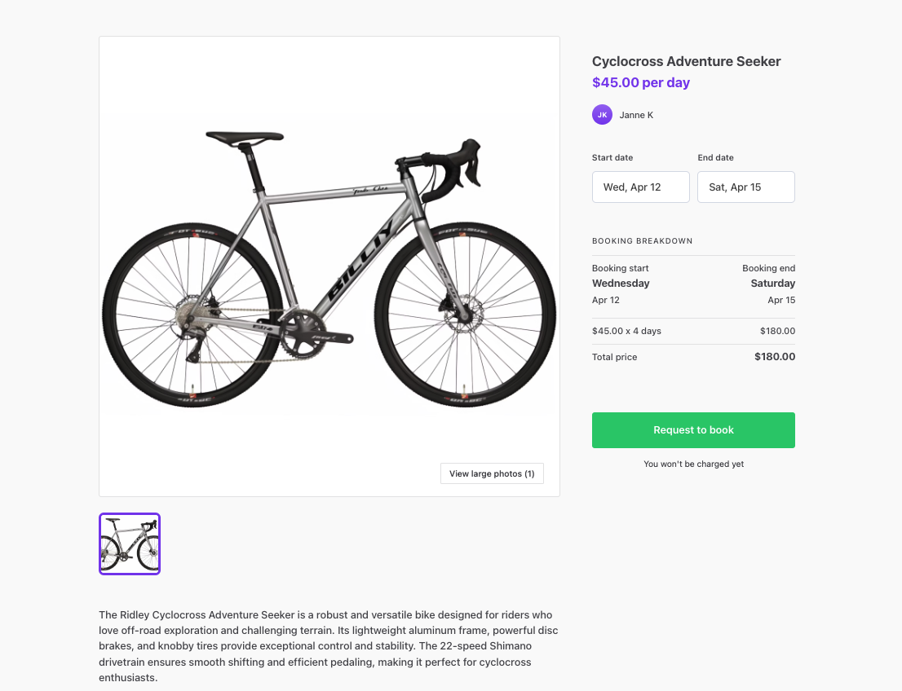

Building your marketplace with Flex typically starts by modifying Biketribe, your example marketplace. Learn more about Biketribe’s default configurations and what to modify to turn Biketribe into your marketplace. 

## What is Biketribe 

Biketribe is a fictional peer-to-peer marketplace for renting bikes in Finland. Users list their bikes for rent or book bikes for daily rentals. 

Biketribe serves as a marketplace example to help you get started building your marketplace. You will modify the Biketribe theme using no-code tools to setup your custom marketplace. Then, you can go Live or use code to fully customize your marketplace. 

This article will help you understand what Biketribe is about so that you can know what to change. If you want to learn more about Biketribe’s default features and the Template code that powers it, [then this is the article for you](https://www.sharetribe.com/docs/introduction/introducing-template/).

### Biketribe users:
Biketribe is a peer to peer marketplace. Users are usually individuals. Users can book a bike rental or offer their bikes for rent (i.e. a user can be both a customer and provider), so the signup form does not distinguish user roles. Users sign up with an email and password, and by agreeing to the marketplace terms and conditions. 

_Every Biketribe user creates a profile to list or book bikes._

### Biketribe listings: 
Providers list bikes for rent. They use a listing creation wizard to add their bike listing to the platform. The wizard asks them details about their bikes: Description, Availability (listing wizard sections). To publish their listing, providers must add information about the bank account where they want to receive earnings, if they have not done so already. 

_Biketribe customers book bikes per day starting from the listing page._

### Biketribe transactions and reviews:

Customers request to rent a bike by entering their payment details on a checkout page. Providers must respond to the request within 3 days. Once they accept, the customer’s card is charged and funds are transferred to the marketplace. After the booking period ends, funds are transferred to the provider’s bank account and paid out. Both sides can review each other. During the transaction, customers and providers can exchange messages freely. 

_After a booking is made, the customer and provider can interact directly and see details of their transaction in their Inbox._

### Biketribe content 

Biketribe content includes static pages and microcopy. Biketribe’s static pages are the Landing page, About page, Terms of use, and Privacy policy. The Landing page is the most Biketribe-specific page. Biketribe’s microcopy, which covers the words or phrases the marketplace uses in buttons, help texts, or error messages, is mostly generic, except for the term “bike.” 

_Examples of microcopy visible on the listing page._

## What to modify 

The first step to building your marketplace is modifying Biketribe default configurations that do not apply to your marketplace. You can modify these with no-code tools from [Console](https://flex-console.sharetribe.com/). Console is your operator backend for configuring your marketplace without code and viewing and managing your marketplace data, like users or listings. 

The following checklist provides an overview of every configuration in Biketribe that you should review. Certain defaults, like the marketplace name and logo, will definitely need to be changed. Others, like the transaction process, can be kept if they work for you. 

In any case, the exhaustive checklist provides an opportunity to learn more about the no-code tools at your disposal. 

### Visual appearance

Modify the default brand and style in Biketribe to match your marketplace. 
- Apply your branding by changing the default images and marketplace colours. Edit in [Console](https://flex-console.sharetribe.com/) or learn more in the [documentation](https://www.sharetribe.com/docs/operator-guides/how-to-add-good-looking-logos-and-images).
- Change the default background image and social media images. Edit in [Console](https://flex-console.sharetribe.com/) or learn more in the [documentation](https://www.sharetribe.com/docs/operator-guides/how-to-add-good-looking-logos-and-images).
- Change the logo. Edit in [Console](https://flex-console.sharetribe.com/) or learn more in the [documentation](https://www.sharetribe.com/docs/operator-guides/how-to-add-good-looking-logos-and-images).
- Generate a new favicon. Edit in [Console](https://flex-console.sharetribe.com/) or learn more in [documentation](https://www.sharetribe.com/docs/operator-guides/how-to-add-good-looking-logos-and-images).

### Content and microcopy 

Biketribe uses language about bikes. Build your own messaging in the following steps. 
- Change the microcopy in your marketplace. Edit in [Console](https://flex-console.sharetribe.com/) or learn more in the [documentation](https://www.sharetribe.com/docs/operator-guides/how-to-use-microcopy-editor).
- Change your marketplace landing page. Edit in [Console](https://flex-console.sharetribe.com/) or learn more in the [documentation](https://www.sharetribe.com/docs/operator-guides/how-to-edit-content-pages-in-console).
- Update your Terms of Service and Privacy Policy. Edit in [Console](https://flex-console.sharetribe.com/) or learn more in [the documentation](https://www.sharetribe.com/docs/operator-guides/free-templates). 
- Update the footer. Edit in [Console](https://flex-console.sharetribe.com/) or learn more in the [documentation](https://www.sharetribe.com/docs/operator-guides/how-footer-works). 
- Update your built-in emails. Edit in [Console](https://flex-console.sharetribe.com/) or learn more in the [documentation](https://www.sharetribe.com/docs/concepts/email-notifications/#built-in-email-notifications). 

### Listings 

Biketribe providers list their bikes. Update the listing page, search page, and listing wizard to suit what your providers are offering on your marketplace. 

- Change your listing fields. Configure in [Console](https://flex-console.sharetribe.com/) or learn more in the [documentation](https://www.sharetribe.com/docs/operator-guides/listing-fields).  
- Change your listing layout. Configure in [Console](https://flex-console.sharetribe.com/) or learn more in the [documentation](https://www.sharetribe.com/docs/operator-guides/listing-page-image-layouts).  
- Change your search filters. Configure in [Console](https://flex-console.sharetribe.com/) or learn more in the [documentation](https://www.sharetribe.com/docs/operator-guides/how-search-works).  
- Change your search page layout. Configure in [Console](https://flex-console.sharetribe.com/) or learn more in the [documentation](https://www.sharetribe.com/docs/operator-guides/search-page-layout-options).  

### Transactions 

Biketribe customers rent per day. If your marketplace transaction is different, then make these changes. 
- Update your listing types. Configure in [Console](https://flex-console.sharetribe.com/) or learn more in the [documentation](https://www.sharetribe.com/docs/operator-guides/what-are-listing-types).  
- Choose your transaction process. Configure in [Console](https://flex-console.sharetribe.com/) or learn more in the [documentation](https://www.sharetribe.com/docs/operator-guides/understanding-transaction-settings).  

## Go Live and customize further 

Once you have completed these changes, it's time to review your marketplace. If you are ready to launch to your first users, then you need to set up a Live environment, host your marketplace code, and configure your DNS. This process does require technical knowledge. You can learn more about how to [go Live here.](https://www.sharetribe.com/docs/operator-guides/how-to-build-launch-operate-with-sharetribe-flex) (GOLIVEHEADER)

Hosting your marketplace code lets anyone with development skills make customizations beyond what is available with the no-code tools. You can build custom features, create a custom design, integrate 3rd party software, and much more with code. Unless you are a developer, you should [hire a developer](https://www.sharetribe.com/docs/operator-guides/how-to-hire-developer/) to make these coding changes. 

