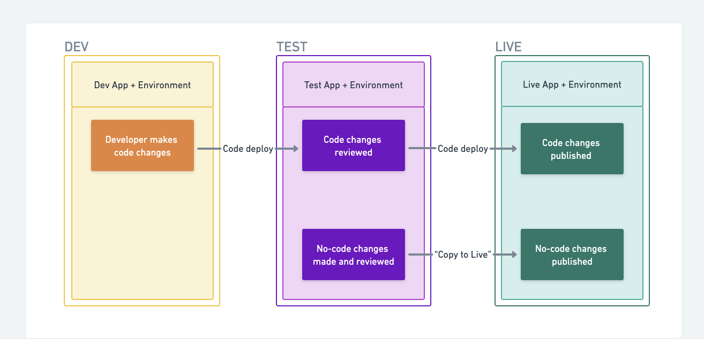

Sharetribe Flex allows you to build a completely unique custom marketplace for the fraction of a cost of building one from scratch. You can set up and configure a basic marketplace without coding, and then customize it infinitely with code to match your specific needs.

The process of building your marketplace typically starts by modifying your example marketplace: Biketribe, a peer-to-peer marketplace for bike rentals. You can easily change the configuration of this marketplace in Console to create a rental, service or product marketplace for any niche.

If you're happy with how your marketplace works after configuring Biketribe, then you can go live right away. If you need further changes before going live, you can customize more aspects of your marketplace with code. Coding changes allow you to make customizations beyond the options available via no-code tools. You can make changes with code (and no-code) tools before going live or anytime after. 

## How to configure your marketplace without coding

Building begins by changing the configurations of Biketribe, your example marketplace, in Flex Console. You can set up your marketplace essentials like branding, layout, payments, listing fields, and listing types. 

Some of these changes are must-haves: you'll likely want to change your logo and remove Biketribe branding. Others are optional: for example, if you're happy with how the Biketribe rental flow works, you don't need to adjust it

You can review [the Biketribe customization checklist](https://www.sharetribe.com/docs/operator-guides/biketribe-configuration-checklist
) to make sure you’ve covered the most important no-code modifications. 

## How to go Live

Your marketplace may be ready for its first users after you change the Biketribe theme. To bring your marketplace Live, you’ll need to start your Flex subscription and setup hosting. 

Though Sharetribe hosts your marketplace data, you must host your frontend code to launch your marketplace. Hosting your code allows you to configure a custom domain, set up live payments, and make further modifications with code. 

Hosting your own code is a technical process and [we recommend hiring a Flex Expert](https://docs.google.com/document/d/1deMWStVhrd8hloBRzw680_PsTnatCogBEDJ07NW24Cc/edit#heading=h.y7k9wiwafivw) if you have never done this before. 
You can learn more about the technical steps involved in moving to Live in [this guide.](https://www.sharetribe.com/docs/ftw/how-to-deploy-ftw-to-production/#deploying-to-production) 

## Extend infinitely with code 

You can make further customizations to your marketplace, either before or anytime after you go Live, with code. Code modifications allow you to modify almost every aspect of how your marketplace works and looks. 

The most common code customizations are modifying how transactions happen in your marketplace. Product marketplaces may want to add extra options for customers to dispute their order. Service marketplaces may want to allow booking using a custom unit, such as selling per session or per class instead of per hour or day. Or, your marketplace combines several different types, offering both services for hire and products for purchase. These customizations are possible using code.

Code tools enable you to build a fully custom marketplace with virtually any feature. The main limit you will face working with code is how much time and/or money you can invest in building the feature. Such investments must be weighed against your budget and the opportunity costs of launching, investing in marketing, and a myriad of other trade-offs inherent in running a marketplace business.

Our [custom feature knowledge base](https://www.sharetribe.com/docs/operator-guides/feature-knowledge-base/) will give you more insight into typical code customizations and what it takes to build them. 

Unless you are a developer, you should [hire a developer](https://docs.google.com/document/d/1deMWStVhrd8hloBRzw680_PsTnatCogBEDJ07NW24Cc/edit#heading=h.ixxwdm9pqfwo) to work with the code of your marketplace. 

## Your building workflow

Since you have both no-code and code tools available in Flex, there is a recommended workflow to ensure that no-code and code changes merge together smoothly. 

Making no-code changes should always happen in the Test environment. The changes you make will show up in your Test marketplace. The Test marketplace is the latest version of your marketplace. It shows every no-code modification you’ve made thus far, as well as any code modifications, if there are any. Once your marketplace is live, you can “Copy to Live” your no-code changes after checking that everything works in your Test marketplace.

If you already have a Live marketplace, then your Test marketplace should be kept as close to identical to your Live marketplace. This ensures that what works in your Test marketplace also works in your Live marketplace. 

Code changes happen in the Dev environment. First, coding changes are made to your Dev marketplace. Then, once everything works, these changes are copied or deployed to your Test and, if available, Live marketplace. 

## Building a completely custom app 

So far in this article we've described an approach where you take Biketribe, your example marketplace, as the basis for development, and customize it to achieve the results you want. From a technical standpoint, Biketribe is powered by the Sharetribe Web Template, an open-source frontend application with built-in connections to Flex APIs. You can learn more about these technical terms in our [terms glossary.](https://www.sharetribe.com/docs/operator-guides/concepts/#sharetribe-web-template)

There are certain situations where you might be better off building a completely custom marketplace application on top of Flex APIs instead of using the Sharetribe Web Template. 

An example of this is if you're looking to build a native mobile application. While you can convert a mobile website built with the Sharetribe Web Template into a mobile app, your use case may require mobile-native functionalities. You would then build a custom frontend application using native technologies such as React Native.

Another use case for a custom app is when you already have an existing software solution and you'd like to integrate Flex functionality in it. In this case, you can integrate Flex APIs directly into your existing frontend codebase. Similarly, if you want to use a different technology stack from React and Node or you have completely custom user interfaces in mind, you can build a custom client app.

Ultimately, Sharetribe Flex is a "headless" marketplace solution. You can build any type of custom frontend application, with any features, using any development technology, in web or mobile. Biketribe, which is powered by the Sharetribe Web Template, offers you a convenient starting point to save you time and money, but certain situations warrant building the frontend app from scratch. 

If you’re not sure which route to take, create an account and start a discussion with our team over email or call about your use case. We will be glad to advise how best to start your custom marketplace on Flex.

