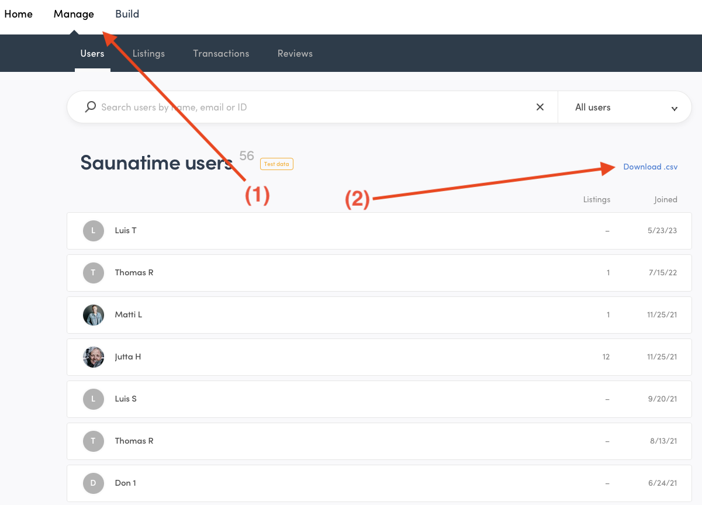
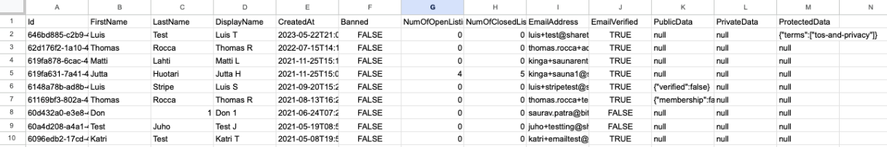
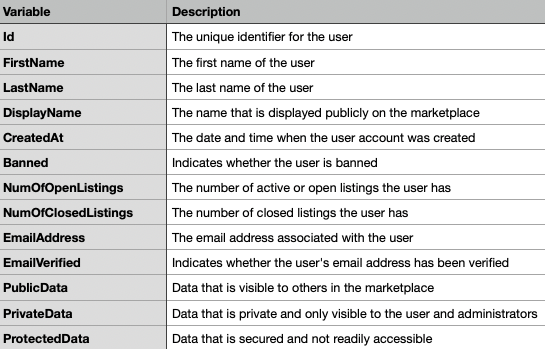
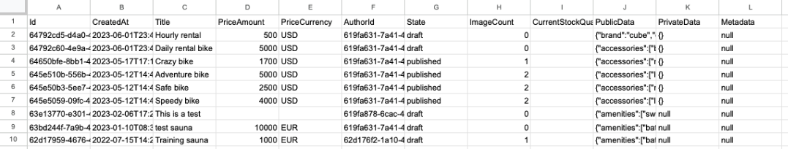
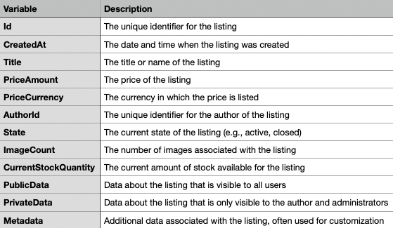
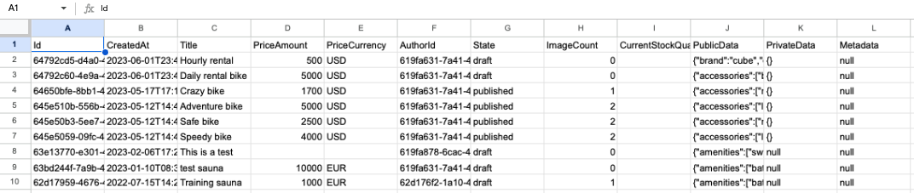
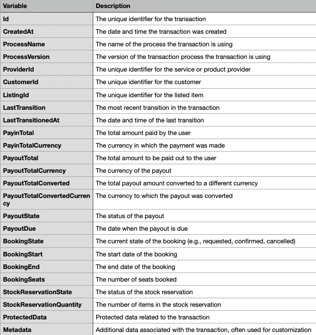
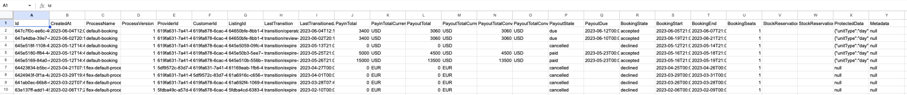
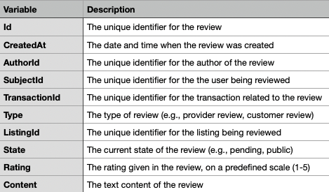

---
title:
  How to download your marketplace data as a CSV export slug: how-to-download-csv-exports
updated: 2023-06-06
category: operator-guides-concepts
ingress:
  Illustrated guide to downloading your marketplace data in CSV format.
published: true
---

CSV (Comma Separated Values) exports are a handy feature on Sharetribe
that allows you to download important marketplace data, like user
details, listings, transactions, and reviews. Use this data as a basis for your marketplace analysis for example in a program like Excel, or for manually connecting your marketplace data to other software. 

## Where to find the csv export buttons

The CSV exports are accessed from the Console. You can find the links
for downloading the CSV files from the "Manage" section of the Console
(1). For example, the link to download the user list of the marketplace
is found in the "Manage" -> "Users" section at the top right part of the
screen (2). The "Listings", "Transactions", and "Reviews" sections of
the Console have similar links.

<extrainfo title="Finding the download .csv button from the Console for downloading user data">

</extrainfo>

## How to use the different exports

### Users

This dataset includes information about each user in your marketplace.
To export it, go to the "Manage" -> Users" section in Console, and click
on the "Download .csv" button. Click below for descriptions on what data
the file contains.

<extrainfo title="What the users csv export looks like (example data, first few rows)">

</extrainfo>

<extrainfo title="Explanations for the columns in the user csv export">

</extrainfo>

### Listings

This includes information about all the listings in your marketplace.
Find this by navigating to the "Manage" -> "Listings" section in Console
section and clicking on "Download .csv". Click below for descriptions on
what data the file contains.

<extrainfo title="What the listings csv export looks like (example data, first few rows)">

</extrainfo>

<extrainfo title="Explanations for the columns in the listing csv export">

</extrainfo>

### Transactions

This dataset consists of all transactions that occurred in your
marketplace. Go to the "Manage" -> Transactions" section and click
"Download .csv". Click below for descriptions on what data the file
contains.

<extrainfo title="What the transactions csv export looks like (example data, first few rows)">

</extrainfo>

<extrainfo title="Explanations for the columns in the transaction csv export">

</extrainfo>

### Reviews

This includes all reviews left by users. Find this in the "Manage" ->
"Reviews" section and then click on "Download .csv". Click below for
descriptions on what data the file contains.

<extrainfo title="What the reviews csv export looks like (example data, first few rows)">

</extrainfo>

<extrainfo title="Explanations for the columns in the review csv export">

</extrainfo>

After clicking "Download .csv" on any of these lists, a CSV file will be
generated and downloaded. You can open this file in any spreadsheet
program (and even in a text editor, if needed).

Remember, these files contain important and sensitive data of your
users, so handle them with care. Also, exporting large amounts of data
may take some time if your marketplace has grown very large.

## What can you do with your data exports

With these data sets, you can analyze the performance of your
marketplace.You can build analyses in spreadsheet software like Excel or Google Sheets, or import the files into bespoke analytics solutions. [Lemonado](https://lemonado.io/sharetribe) is one such solution with dashboards and functionalities specific to Sharetribe marketplace.  

Here are some ideas for key metrics to track and how: 

- You can monitor your marketplace's user growth over time
based on the "users" export with the help of the 'CreatedAt' column.
- You can see which listings are the most popular by counting the ‘ListingID’ in transactions export. 
- You can track your Gross Merchandise Value (GMV) by adding up the ‘PayinTotal’ from your transactions export.  

CSV exports can also be useful if you want to manually connect your marketplace to another tool. For instance, you can use the Users export to retrieve the email addresses of your users to upload into an email marketing tool. It is possible to build such a data pipeline via Zapier in many cases or with code in all cases; however, doing this work manually might allow you to launch faster and save funds in the early stages of your marketplace. 

