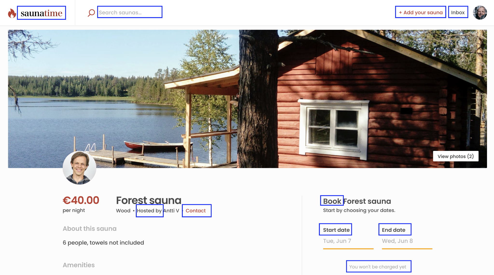
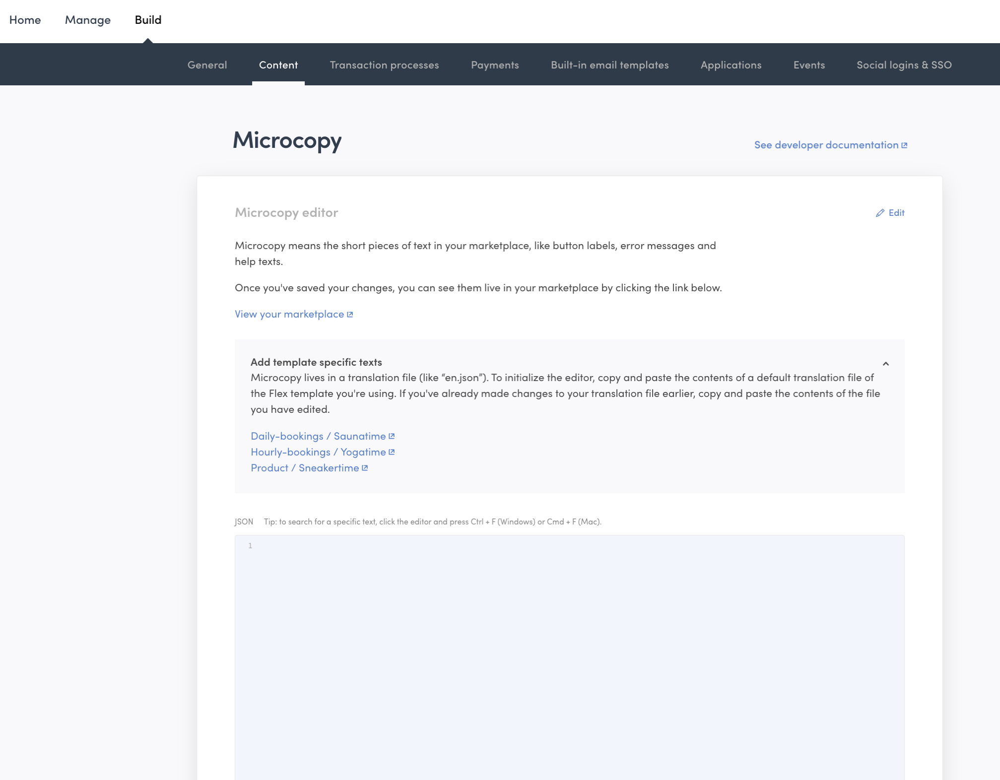
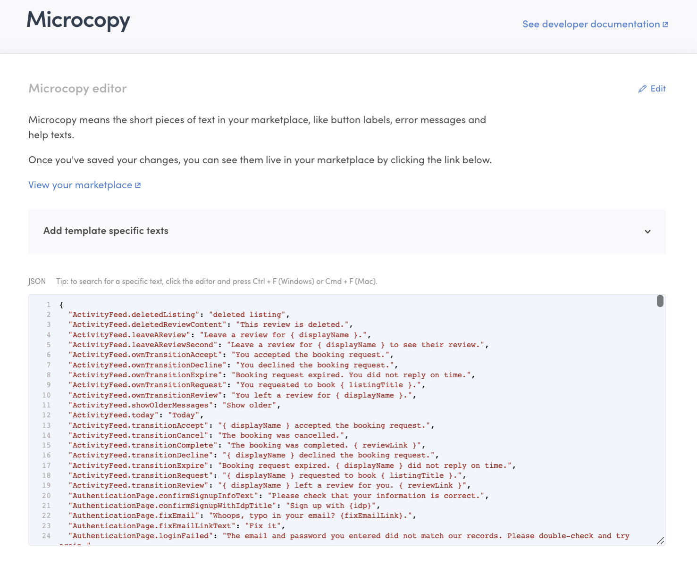
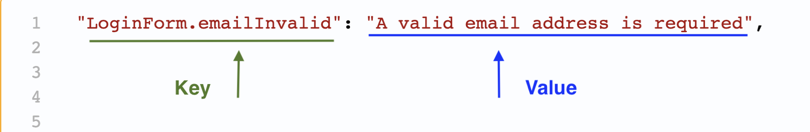

## What is microcopy

Your Flex marketplace has both content and dynamic pages. Content pages
only feature content created by you, the marketplace operator. Landing
pages, “About” pages and FAQ pages are examples of content pages.

Dynamic pages, meanwhile, feature content created by your users. The
search page displaying listings is a dynamic page. Often, dynamic pages
offer users the ability to interact with them, such as when buyers are
selecting the length of a booking from a listing or entering their
payment information into the checkout page.

In Flex, the term microcopy refers to short written texts scattered
around a dynamic page’s interface; button labels, error messages, and
help texts are all examples. They are textual, brief (a sentence or
two), and highly contextual.

_Examples of microcopy from the Saunatime listing page highlighted in
blue. Note that listing fields and search filters ("Sauna type",
"Amenities" and "Sauna rules" for example) are not editable with the
microcopy editor. An upcoming feature will introduce a dedicated feature
for editing these fields and filters in Console._

With the Microcopy editor, you can modify these texts in your Flex
Console. You can also use the Microcopy editor to translate these texts
to a new language. This article will walk you through how to set up your
Microcopy editor and make microcopy changes while building and operating
your Flex marketplace.

## Why microcopy matters

Changing your microcopy is an important part of deciding how your
marketplace works. It allows you to set the tone in which you address
your users: do you prefer to be calm and polite, warm and friendly, or
whimsical and goofy?

With microcopy, you also make key decisions about your core vocabulary.
Do you call your customers "buyers", "guests", or something else? Are
your providers perhaps called "vendors", "sellers" or "hosts"? What are
they publishing on your site – "listings", "products", "profiles",
"apartments", "bikes"? When they interact with each other on your site,
are they "booking", "buying" or "ordering"?

All these decisions affect the choices you make in your microcopy.

## How to test the Microcopy editor?

You can test the Microcopy editor in your Flex demo marketplace. After
creating a Flex account, log into
[Console](https://flex-console.sharetribe.com/). Ensure you are in the
[Test environment](/concepts/flex-environments/#test-environment).

Navigate to the Build section from your top bar, then the Content
section. The Microcopy editor is here.

_When you first start building your marketplace, the JSON field in
Microcopy is empty, and all microcopy comes from built-in microcopy
files in the Template. (We refer to these texts as microcopy, but in the
Template they are in the **translations** folder. In addition to the
default **en.json** file, there are other languages available, which is
why the folder is titled **translations**.)_

Next, load the Saunatime microcopy into the editor. You can follow
[the same steps](#2-load-your-microcopy-into-the-editor) you would
eventually use to modify your own marketplace’s microcopy.

Select the “Daily-bookings / Saunatime” link, which takes you to the
Saunatime code repository. Click “src” folder→ click “translations”
folder→ open “en.json” file→ copy content.
[Here is a direct link](https://github.com/sharetribe/web-template/blob/main/src/translations/en.json)
to the file you need.Then paste the data into the Console Microcopy
editor. You can make changes to the Saunatime demo microcopy using the
same workflow described below.

## How to modify microcopy when building your marketplace with a developer?

### 1. Setup your Sharetribe Web Template with a developer

To use the Microcopy editor on your marketplace, you will first need to
set up the Sharetribe Web Template, which serves as the basis for your custom
marketplace. Setting up the Template for customization is a
development process. If you are not a developer or do not yet have a
developer on your team, you should hire a
[Flex Expert to help you build your marketplace](https://www.sharetribe.com/experts/).

The Template has default microcopy vocabulary included, reflecting
its starting theme Biketribe. Biketribe is a marketplace for buying and renting bikes. 

Having pre-written microcopy is a significant time saver. Except for the
Biketribe theme, most of the Template's microcopy uses generic
and descriptive language suitable for most marketplaces, which means
there are many microcopy texts you do not need to formulate. The rest of
the article will guide you on how to use the Microcopy editor to change
the microcopy you wish to change in building your custom marketplace.

### 2. Load your microcopy into the editor

After you and your developer set up the Sharetribe Web Template for development, you
can use the editor to start modifying your microcopy.

First, you must load the default microcopy into the editor. You can do
this by copy and pasting the language-specific microcopy file that
contains all the microcopy in your marketplace. In the marketplace
Template, we refer to it as a “translation” file because this file is
used as the basis for translating your marketplace into another language
There is a Spanish, French, German, and English version of this file
available to start.

You should use (copy and paste) the microcopy file directly from your
marketplace’s repository, or database where your code is being modified
by a developer. If you’re unsure where your repository is or how to
navigate it, you can request that they add the correct file to the
editor for you or that they share it with you.

In your repository, you will most likely find the language-specific
microcopy file in the same place it resided in the Template. Click “src”
folder→ click “translations” folder→ open “en.json” file→ copy content.
Then paste the data into the Console Microcopy editor.

<video>
    <source src='./microcopyeditor.mp4' type='video/mp4'>
    <source src='./microcopyeditor.webm' type='video/webm'>
    <source src='./microcopyeditor.ogv' type='video/ogg'>
</video>

If the language of your choice is not available, you can take one of
these default files as a basis and translate your marketplace by
changing the contents of the file to that language. For the purposes of
this tutorial, we will use the English version (en.json) of the written
texts.

_The Microcopy editor loaded with the en.json microcopy file. We’re
ready to roll!_

Here is a brief description of the file you are looking at:

- Each line in the document is a separate piece of microcopy. Microcopy
  pieces are generally one or two sentences and highly contextual.
- Each piece of microcopy starts and ends with a quotation mark. The end
  of the microcopy piece is signaled by a comma followed by a
  line-break.
- Each piece of microcopy uses key-value format to structure the
  information contained within. Keys are on the left and values are on
  the right. They are separated by a colon.
- Keys refer to the location or situation in the marketplace app where
  the specific piece of microcopy appears. For example, the key
  “LoginForm.emailInvalid” describes the situation when an invalid email
  is used.
- Values are the pieces of microcopy used in the particular area pointed
  to by the keys. During the use of an invalid email during login
  described by “LoginForm.emailInvalid,” the default value is “A valid
  email address is required.”
- Any text, symbols, or numbers written between quotation marks are
  valid values to use for your pieces of microcopy.
- In addition to texts, you can use tools such as simple arguments,
  pluralization, and selection to build phrases. These let you
  incorporate contextual variables like a listing title or booking
  length into your copy-texts. You can learn more about these advanced
  techniques
  [here](/concepts/microcopy/#format-for-editing-microcopy-in-console).
- You can only modify values in the editor. You cannot modify keys. Keys
  must be modified by
  [modifying the code of your marketplace application](#4-how-to-add-or-remove-pieces-of-microcopy).

_An example key-value pair in the Microcopy editor. Note both the key
and value are enclosed in quotation marks. A comma marks the end of the
key-value pair, followed by a line break._

### 3. Modify frequently used pieces of microcopy

With your marketplace’s microcopy file copied into the editor, you can
use the editor to modify your marketplace’s copy-texts.

To start, we suggest going through the microcopy file in the editor.
Look at the values and see how they compare to the terminology you
decided to use in step 1. The most frequently modified pieces of
microcopy use language specific to the Template's theme "Biketribe". 

Using the search functionality in the Microcopy editor is the easiest
way to find the copy-texts that need changing. Press “CMD+F” on a Mac or
“Ctrl+F” on a Windows computer to search for specific phrases from your
marketplace in the microcopy file you are editing in the Microcopy
editor.

<video>
    <source src='./changeTexts.mp4' type='video/mp4'>
    <source src='./changeTexts.webm' type='video/webm'>
    <source src='./changeTexts.ogv' type='video/ogg'>
</video>

You can also inspect your marketplace application and learn the name and
location of its different keys. This is a more advanced technique
requiring installation of developer tooling in your browser. You can
learn more about it in
[our developer documentation](/tutorial/working-with-microcopy/#change-the-microcopy-for-topbar-component).

As you work, remember to save your changes frequently. Everytime you
save, any changed copy-texts will be uploaded to your marketplace.

There are many copy-texts in your marketplace. You will likely need
several efforts in order to modify the starting texts to your desired
terminology.

### 4. How to add or remove pieces of microcopy

So far we have changed existing microcopy, but you may also want to add
pieces of microcopy in building your marketplace. This typically happens
when you’re adding something to your Template: a new button or help
text, or even an entire new page.

Adding new microcopy happens with your developer, who must first add the
corresponding new key directly to your marketplace code. Your developer
will code the element, situation, or place where the microcopy will
exist (like a new button, for example), define its key, and then add it
to the microcopy file edited by the Microcopy editor. Once the key
exists in the microcopy file, you can copy the new key-value
pair into the Microcopy editor.

Supporting multiple languages in your marketplace is a special case of
adding microcopy. Because the Microcopy editor only works with a single
language, you cannot use it to modify multiple different languages. You
should use the editor to modify one of your supported languages. Any
additional languages supported by your marketplace need to be edited
separately and shared with your developer to deploy to your marketplace.
Note that
[enabling multiple language support requires](/ftw/how-to-change-ftw-language/#developing-the-sharetribe-web-template-into-a-multilanguage-marketplacee)
custom development to set up.

### 5. Publishing microcopy to production

Everything we have built so far with the Microcopy editor has been in
the Development environment. When your marketplace is live with real
users and transactions, you will have a Production environment Microcopy
editor as well to modify the marketplace website your users are actually
using.

Since changes made and saved in the Production environment affect your
end-users, it is a good idea to always start making modifications in the
Development environment. The sections above describe how to make these
changes.

When you first create your Production environment, the microcopy in your
Development environment gets automatically copied over to your
Production environment. After both environments are up and running, you
will need to transfer your changes from Development environment to
Production environment manually.

Copy the contents of your editor in the Development environment, then
navigate to your Production environment using the drop-down menu in the
top-left of the top bar. Navigate to the Microcopy editor in your
Production environment (Build>Content), paste the microcopy from your
Development environment into the editor, and save changes.

Note that since you are working in the Production environment, there is
a 5 minute delay between saving changes and seeing those changes in your
marketplace. This delay safeguards the reliability and speed of your
marketplace for your users.

## How to edit content on content pages

The Microcopy editor changes microcopy on your dynamic pages, which are
pages where user-generated content, such as listings, appear. To change
your content pages, like your Landing page or Terms of use,
[you should use Pages.](https://www.sharetribe.com/docs/operator-guides/how-to-edit-content-pages-in-console/)

### Digging deeper into the Microcopy editor

In this article, we learned about the Microcopy editor and the microcopy
it changes. We also learned how to use the Microcopy editor to modify
the Template microcopy while you build your Flex marketplace with a
developer. You can use the editor to change any microcopy already in the
Template, or to change any additional microcopy added during building
your site.

To learn more about microcopy in Flex through technical details, consult
[our guide](/concepts/microcopy/) on how Microcopy works in the Template
code.
