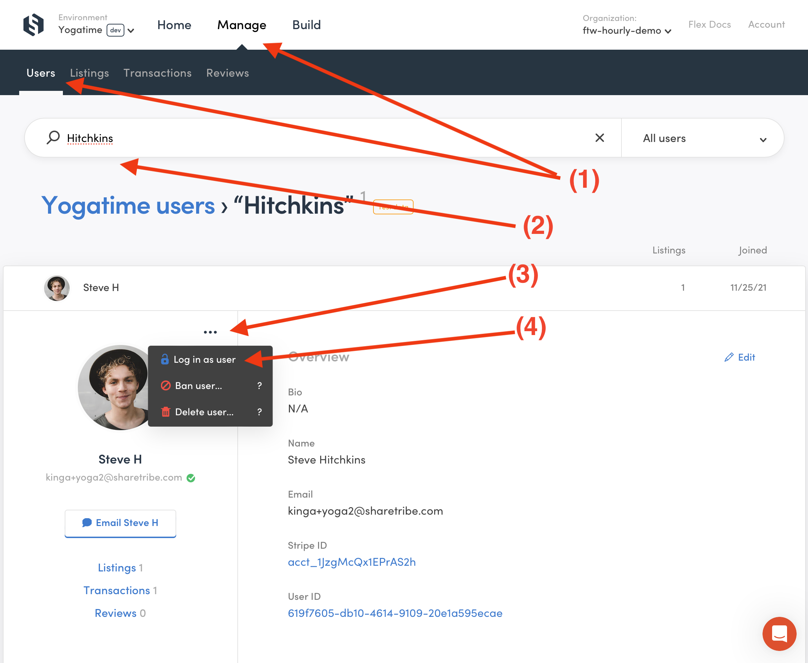

# Logging in on behalf of another user

As a marketplace operator of a Sharetribe Flex marketplace, you have the ability to login on behalf of your marketplace's users. This feature is useful for understanding the user experience, solving reported problems, and helping users manage their listings and data. However, when using this feature, you can't change the user's payment details, send messages, or do transactions on their behalf.

For those using the Sharetribe Web Template, this feature is ready to use from the get-go. If you're using older templates that don't have this feature, you can find instructions in our old documentation.

## How to use the "Login as user" feature

The way you can login as a user is through the Console. From there, you can access the user list from the "Manage" -> "Users" section (1). You can then search for the user you want to log in as (2) or select them from the user list. When you are viewing their profile card, click on the three dots near the user's profile picture (3), and from there, you can select the "Log in as user" option (4).

This takes you to the marketplace front page, logged in as the user you were viewing. You will see a banner at the top that reminds you of who you're logged in as (5), and that you have limited rights. From here, you can for instance create a listing on behalf of a user (6), enter their inbox (7), and access their profile and account settings (8). Aside from the limitations mentioned earlier, all these functions work as they would when you are logged in normally on the marketplace.

Click below for screenshots showing the two parts of the process.

<extrainfo title="Steps 1-4: Accessing the feature from the Console">

</extrainfo>

<extrainfo title="Steps 5-8: Logged in on the marketplace as another user">

</extrainfo>

