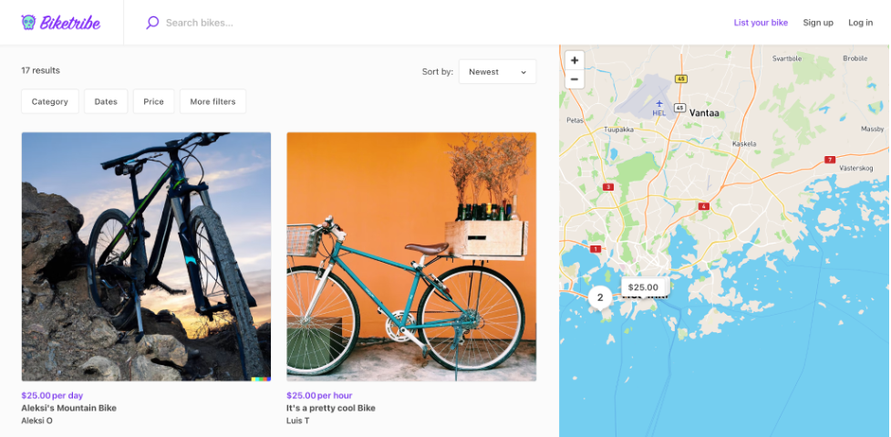

How your marketplace looks is a critical component of your user
experience. Sharetribe offers several options for how your listing and
search pages work to make sure that customers have an intuitive
experience.

## Search page options

The search page displays all listings from your marketplace. By default,
every open listing is shown with the most recent listings showing first.
Your users can discover listings using a variety of techniques,
including searches, filters, and sorting.

You can choose if your search page features a map or not.
[This guide](https://www.sharetribe.com/docs/operator-guides/search-page-layout-options/)
features more information on how to pick these options.

 _A marketplace
using the Map view layout_

You can also choose how listing images display on the search page. Learn
more about these thumbnails in
[our in-depth guide](https://www.sharetribe.com/docs/operator-guides/listing-thumbnail-aspect-ratio).

## Listing page image layouts

Users click-through from the search page into the listing page. Here,
again, you have the opportunity to align the layout of the listing page
to match the offering on the marketplace.
[Our guide](https://www.sharetribe.com/docs/operator-guides/listing-page-image-layouts/)
will help you determine the best option for your marketplace.
