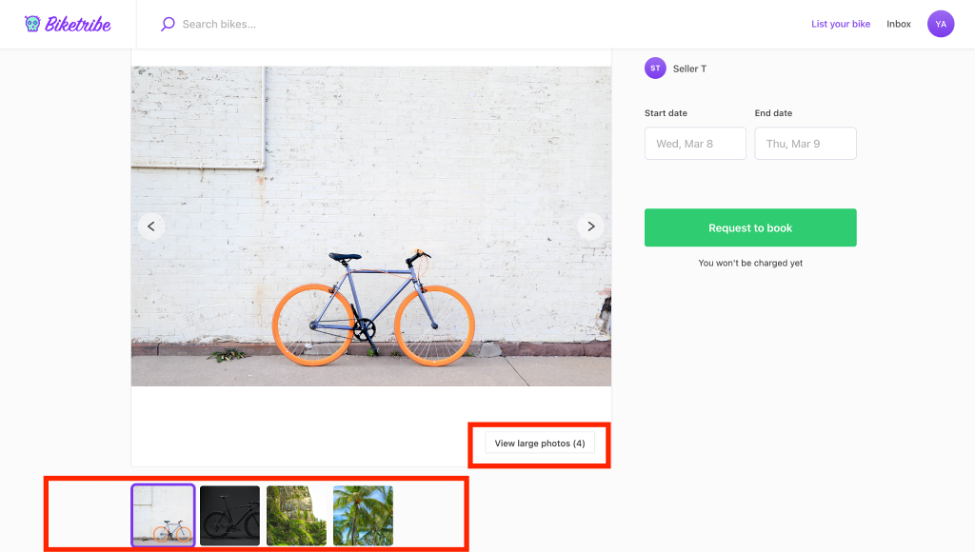
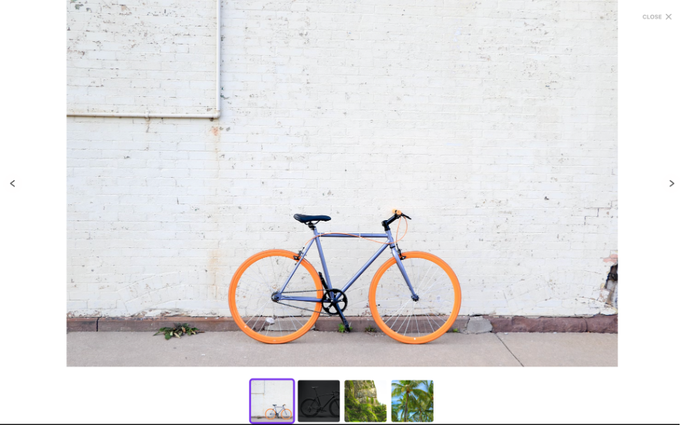
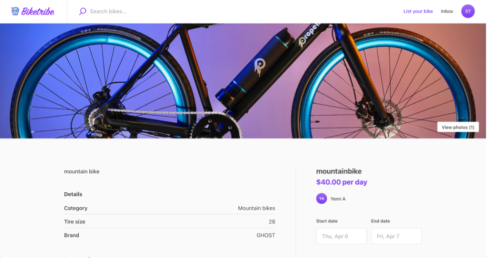

When making a listing, you can add images to the listing. It’s possible
to add JPEGs and PNGs. A primary image is displayed on the marketplace
listing or home page, but you can add as many photos as you need. All
listing images can be up to, but not more than, 20 MB and 3072x3072
pixels.

There are two options for the listing page image layout: an image
carousel with a thumbnail and a screen-wide cover photo.

## Image Carousel with thumbnails

This option displays the main image and the secondary images in a
carousel below it. The transaction action section can be found on the
right side of the image. If you have a marketplace focused on buying and
selling products that require multiple images, then the image carousels
with thumbnails may be the best for you. With this, the prospective
buyer can quickly scroll through the carousel thumbnails to see the
different images before proceeding with the transaction.

For a more detailed view, the user can enlarge the images.

Here’s what the listing page carousel with thumbnails looks like:

And here, you can see the page when you view large photos. The image
becomes full screen.

## Screen wide cover photo

This option displays the first uploaded image as the top hero section of
the listing page, filling the screen width. The screen-wide cover photo
is only one image shown by default, with a link to see the rest of the
listing images. The transaction action section can the n be found under
the screen wide photo.

Screen-wide cover photos are ideal for showing landscape photos.
Listings of rental properties or experiences commonly use this layout.

