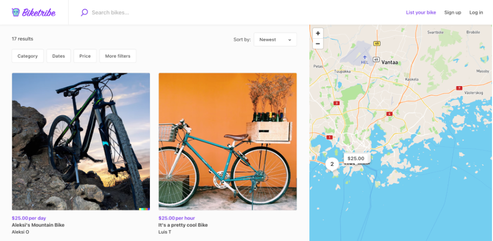

The search page displays all listings from your marketplace. Users can
find the listing that they need through keyword search or location
search, and by filtering and sorting different attributes. They can even
find a listings by dragging and exploring a map. You can define the
layout of this page from your Console account. Go to Build → Content →
Layout.

There are two different search page layouts that you can select from:
Map view and Grid view.

## Map view

The Map view of the search page displays the listings grid on the left
and the map on the right. The map highlights the locations of several
listings on your marketplace. The listing filters are displayed above
the listing grid on the left side of the page. This layout is excellent
if your marketplace products or services are location-based.

Only listings that are within the Map area that you are zooming over
will be displayed in the search page.

## Grid view

In the grid view, the whole screen showcases the listings in a grid, and
the filters are displayed on the left. If your business isn’t
location-based, you probably have no use for a map showing the locations
of the listings on your marketplace. In this case, you can use the grid
view. The filters take a bit more prominence in this view and can be
ideal for product marketplaces.

## How are listings sorted in the Search page?

By default Listings are shown in the order they were created, with the
most recent listing coming first. Users, however can always use search
parameters, filters and sorting options to alter the way listings are
ordered.
