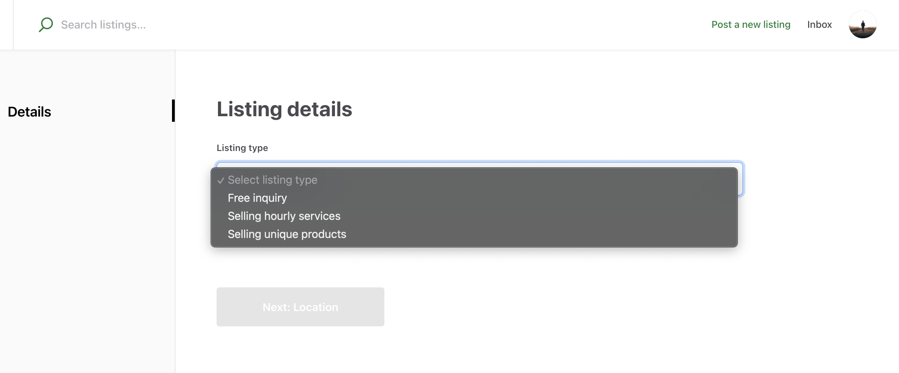
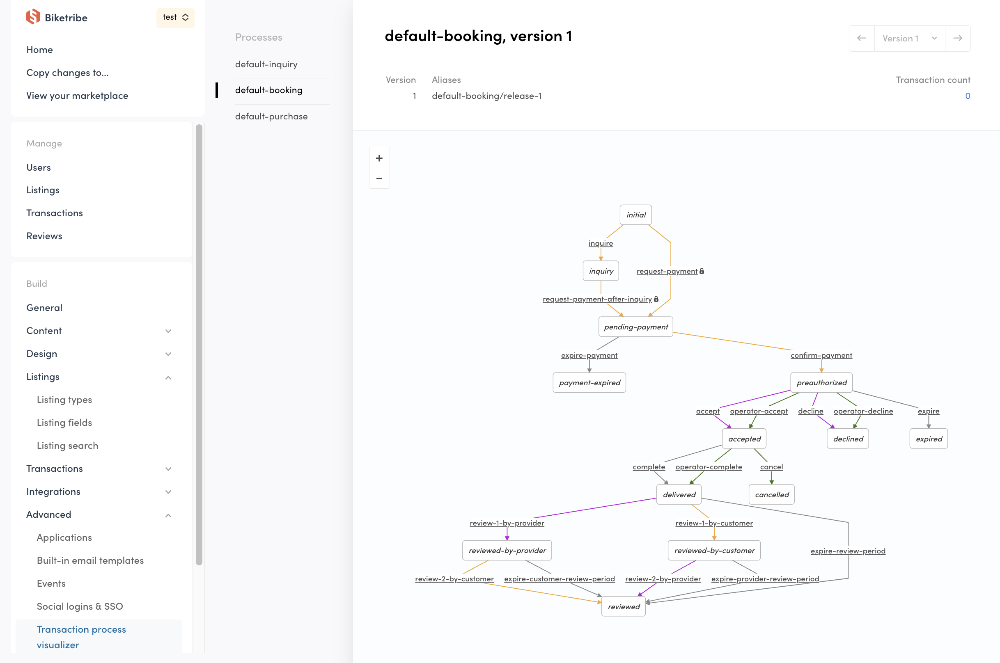
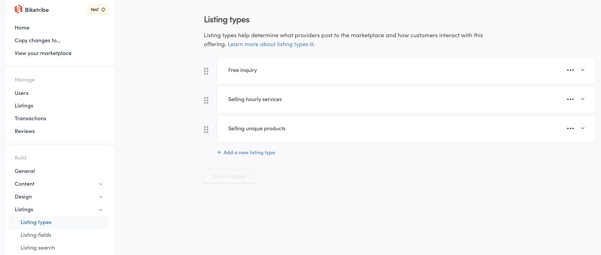

Listing types enable different ways for your buyers and providers to
transact. They determine how providers list their offering and how
buyers engage with that offering.

When picking your Listing type, consider how a transaction should happen
on your marketplace. Are buyers purchasing a physical product from an
inventory or making a calendar booking? If they are making a booking,
does it happen on an hourly or a daily basis? If they're purchasing a
product, can they buy multiple products of the same type in one go, or
is every product unique? Or, maybe buyers and providers should only send
messages back and forth?

These scenarios are covered by the default Listing types. Your
marketplace may also facilitate multiple different types of transactions
if you create multiple Listing types. You can have up to 20 different
Listing types in your marketplace.

## How Listing types work for providers

Listing types affect what information providers add to their listing
during listing creation. They also affect what options and
responsibilities they have during a transaction with a buyer.

Calendar booking is suited when your providers are offering a service or
item for rental where an availability calendar is necessary. Providers
using this Listing type will can add a calendar of availability for
their service or rental. You can learn more about how providers add and
manage their availability
[here](operator-guides/default-availability-management-options/#how-sellers-add-their-availability).
When creating their first listing, providers offering bookings will need
to add their payout details to your marketplace in order to accept the
booking and payment.

Buying and selling products is for marketplaces where items or goods are
for sale. Providers using this Listing type can choose whether an item
is available for pickup, delivery, or both. They can also add how many
items they have in stock if you enable "Multiple items" stock type. You
can learn more about how shipping, pickup, and stock management works
for providers
[here](/operator-guides/default-inventory-management-options/). When
creating their first listing, providers offering products for sale will
need to add their payout details to your marketplace in order to accept
payments.

With Free messaging, providers do not enter stock or availability. They
also do not need to add their payout details because no payment takes
place. Providers are asked to fill out the basic listing details like
the title, your custom fields, location, photos, and, if enabled, the
price.

In addition to Listing types, custom fields impact the information
collected from providers during listing creation. You can learn more
about setting up custom fields
[here](https://www.sharetribe.com/docs/operator-guides/how-to-add-and-edit-listing-fields/).

## How Listing types work for buyers

Listing types also affect how buyers start transactions.

When Calendar booking is in use, buyers start a transaction by selecting
a time from the provider's availability calendar from the listing. They
book per hour, per day, or per night depending on the booking unit of
the Listing type. The price of their booking equals the length of time
they booked times the cost of per availability unit. You can learn more
about how buyers book
[here](/operator-guides/default-availability-management-options/#how-buyers-book).

When Buying and selling products is in use, buyers purchase one or
multiple units of a listing, if multiple units are available. The price
equals the number of units they purchase multiplied by the unit price.
Buyers also select the method of delivery. Learn more about how buyers
purchase products
[here](/operator-guides/default-inventory-management-options/#buying-the-listing-as-a-buyer).

Free messaging enables buyers to send an inquiry to sellers without any
payment. Inquiries are initiated from the listing page.

## What happens during a transaction process

The transaction process stipulates how both buyers and providers
interact during a transaction. In other words, after a buyer initiates a
transaction, the transaction process determines what the provider, the
buyer, and the operator can do to bring the transaction to a successful
conclusion. The transaction process also has rules for how things
progress even for unsuccessful outcomes, such as a problem with delivery
or an expired request. You can review the steps and stages of each
transaction process for buyers, sellers, and operators in this
[comprehensive guide](operator-guides/default-transaction-process-options/).

In Console, you can see an overview of the transaction processes
available in Advanced>Transaction process visualizer

## How do marketplaces with multiple Listing types work

Having multiple Listing types means that you have different types of
listings on your marketplace. Perhaps your marketplace allows selling
products and giving them away. Or, you customers can book hourly
experiences alongside nightly stays. Or, your providers should be able
to sell and rent their items. Ultimately, you are introducing more
options for both providers and buyers.

When you have multiple Listing types, Providers decide what Listing type
to assign their listing during listing creation. Listings can only have
one Listing type, so, if a provider would like to offer a listing in
multiple different ways, they will create a listing for each offering.
For example, if a provider is renting their bike both hourly and daily,
then they will create a listing with an hourly Listing type and one with
a daily Listing type. Using descriptive Listing type titles will ensure
they pick the right one.

If you do have multiple types of transactions on your marketplace, it
probably means you have customers with different goals. Some may want to
buy a listing while others are interested in renting. When no search
criteria is applied, all open listings are visible to the buyer. Using
availability filtering then limits searches only to listings for booking
(i.e. that use the "Calendar booking" transaction setting). Buyers
filtering by Listing type is not possible yet unless you custom code
this feature.

## FAQ

### Where to create my Listing types?

Listing types are set in your Console>Listings>Listing types tab. You
can learn more about the different settings you configure
[during Listing type setup here](https://www.sharetribe.com/docs/the-new-sharetribe/what-are-listing-types/).

### What happens to existing listings when I change my Listing type settings?

If you change the Listing type settings, listings using the changed
Listing type remain open with the previous settings. To illustrate this:
imagine you have a provider who created a listing with a Listing type
using the "Free messaging" transaction setting. You change this Listing
type setting to "Buying and selling products." The provider's listing
will retain the old setting ("Free messaging") and remain open, so any
buyer who interacts with the listing will follow the "Free messaging"
transaction process.

Providers cannot update or change listing information for listings using
a changed Listing type. If they want to update this listing, they should
create a new listing. They can keep the old listing open for
transactions with the old Listing type settings, or close it so that it
is no longer available to buyers. You can also close listings from
Console from the "Listings" page in the "Manage" section of the sidebar
navigation.

Before changing an existing Listing type, consider if it would be better
to create new Listing type instead. This makes sense if you do not want
to affect existing listings and instead want introduce a new type of
listing.

### How do I update the texts my buyers and providers see for a Listing type?

You can update your marketplace texts using the Microcopy editor,
including texts like the checkout button or help information providers
and buyers see in their Inbox. Note that these texts are associated with
the transaction process in use by the Listing type, not the Listing type
itself. This means that if you change texts for Free messaging as an
example, you are changing the texts for every Listing type using this
transaction process.

### How do I update the Listing type of a listing?

Once a listing is created, you cannot update or change its Listing type.
If your provider wants to change how their listing behaves (by using a
different Listing type), then they should close or delete the listing
and create a new one.

### What happens if I delete a Listing type?

If you delete a Listing type currently in use by a listing, the listing
will continue to operate as normal. It can be found and transacted with
as before. The listing details cannot be updated, just like when an
existing Listing type's settings are changed. If you or the provider
want to disable this listing, then you should close or delete it.
