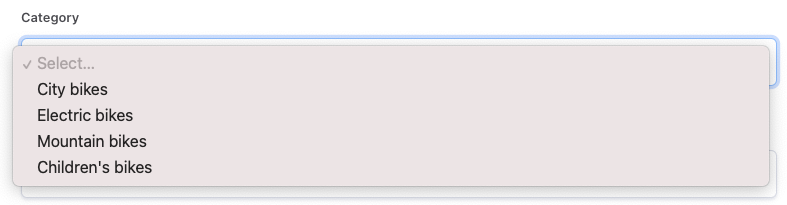
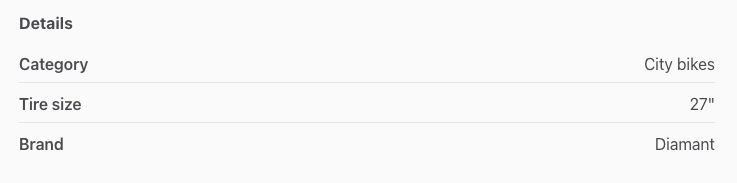
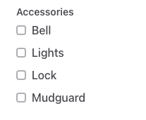

## What are listing fields?

Listing fields allow you to add information to listings to distinguis
them from one another. Listing fields determine the data that needs to
be input by a listing author during listing creation. Listing fields can
also be used for filtering and as search parameters. Most listing fields
will be shown in the listing page when a user visits.

### Types of listing fields

There are default listing fields and custom listing fields. Default
listing fields are very specifics: listing title, listing description,
price and location. These fields cannot be removed. You can, however,
modify how the default fields are named in your marketplace by using
[the microcopy editor](https://flex-console.sharetribe.com/content/microcopy).

Custom listing fields are optional and can be created, added, and
removed from your marketplace. Each custom listing field will allow you
to ask listing authors for information in the listing creation form. The
information that is provided by the listing authors will then be
displayed in the listing page for users browsing the marketplace. It can
also be used to create filters or affect the keyword search.

## Custom listing field types

There are 3 types of listing fields that can be added: "Free text",
"Select one" and "Select multiple". [Read more specific instructions on
how to add listing
fields](https://www.sharetribe.com/docs/operator-guides/how-to-add-and-edit-listing-fields/).

### Free text

Allows users to write information about the listing. This field will be
displayed as a text area in the listing creation form and as a block of
text on the listing page. It can be used for many different pieces of
information. The information requested can be short or long.

Consider using the Free text field type when the information requested
is not specific and depends a lot on the listing author. This can be
used, for example, for rental terms (rules) on rental marketplaces, or
service provider qualifications and item descriptions when they are
difficult to encompass in a specific set.

### Select one

Lets the listing author select one attribute from a list of options to
add in to their listing. When you create this field, you have to define
the options that will be available for listing authors to select. You
can add as many options as you want. This field's option will be
displayed as a dropdown in the listing creation form.

It is displayed as the single selected option on the listing page along
with other "Select one" fields, under the lising "Details" section.

This field type is ideal when there are multiple, finite, options to
choose from. You can use this field type, for example, for “Shoe size”,
“Color”, and “Category”. Bear in mind that if the options are not
finite, you might want to use a “Free text” type of field instead. For
example, if you sell shoes or bikes, and want to create a field for
"Brand", in some cases the number of brands that you will support is
finite and that would fit perfectly; in other cases, you might not be
able to encompass all the possible brands in one single list. Choose
"Free text" instead.

### Select multiple

Lets the listing author choose multiple attributes (as many as are
available) from a list of options. To create this field, you have to
define the list of options available to select. These will be displayed
as checkboxes in the listing creation form.

It will be displayed as multiple options selected on the listing page.

This field type is ideal for relatively homogeneous marketplaces, where
people are comparing options. It can be used to display a rental space’s
amenities, additional services offered or available sizes. As with
Select One, if the options cannot be confined to a specific list set,
consider adding a Free text instead (or in addition).

## Field options

Available when choosing “Select one” or “Select multiple” as Field type.
The list of field options you input, besides being the options that a
listing author can select when creating a listing, is also the potential
list of filter options on your search page. You need to add at least one
option but can add as many as you want.
[Read more about lisitng filters](https://www.sharetribe.com/docs/operator-guides/understanding-filters/).

## Search settings

Search settings are additional settings particular to the type of Field
that you are adding and can be used to find listings easier. Depending
on the type of filter that you are adding, you will have these two
search settings options:

#### Include this field in keyword search:

This option is available only to Free text type of fields. If enabled,
the contents of this field will be searched against when users use
keyword search. Keyword search returns results based on how well they
match the listing title, description, and free text field (in this order
of priority).

#### Add a filter to the search page:

This option is available only for Select one or Select multiple field
types. If enabled, a filter is added to the search page that can be used
to find specific listings on the search page. All the options for
filters are available on the search page. The filter behavior changes
depending on the type of Field.

- Filter visibility: determines whether the filter is a primary or a
  secondary filter.
  [Learn more about this option in this article about search and filtering](https://www.sharetribe.com/docs/operator-guides/understanding-filters/).
