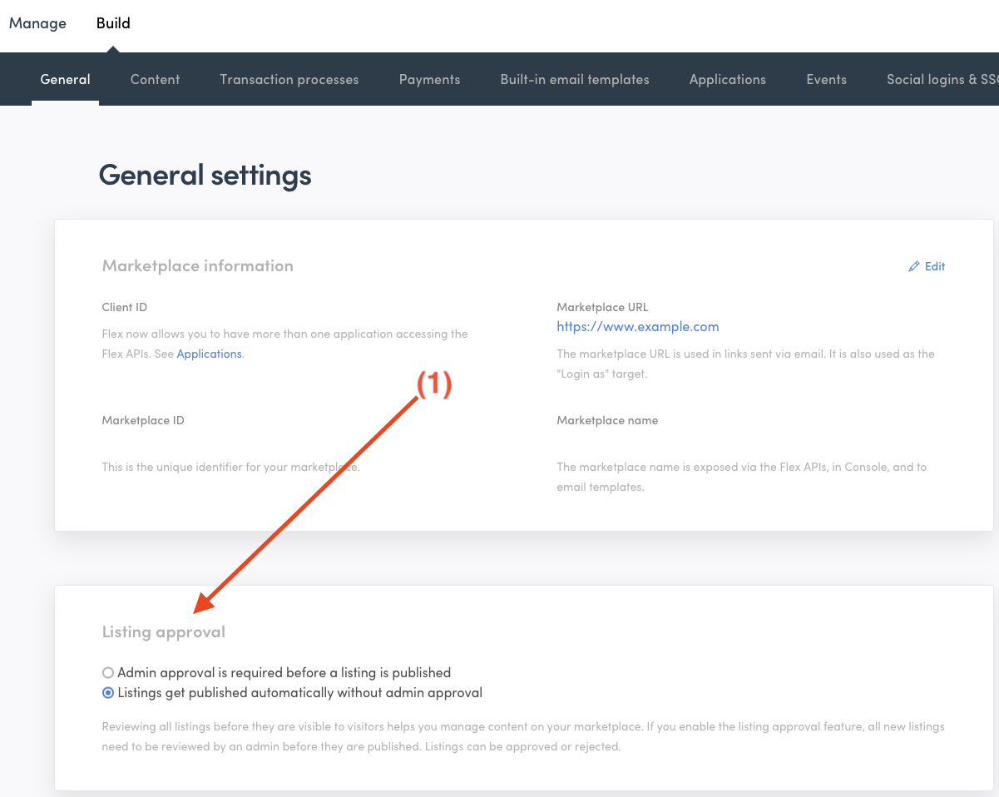
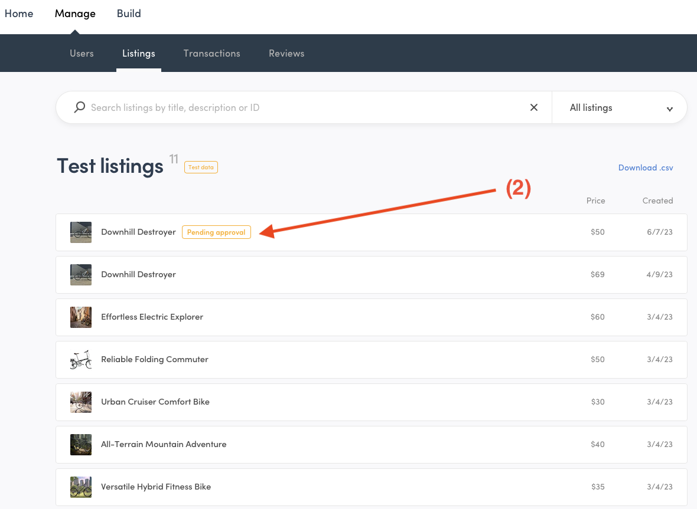
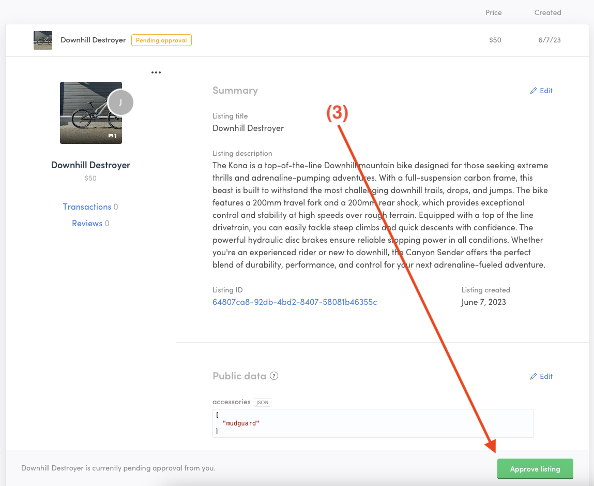
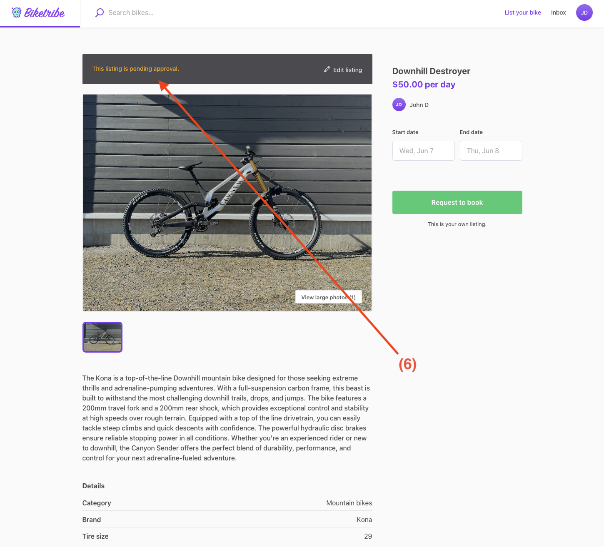

Listing approval lets you, the marketplace operator, review every new
listing in your marketplace and decide if it can be published. You can
review and approve listings directly in Console.

## Understanding the listing approval function

Normally, a new listing on Flex goes live as soon as the listing author
publishes their listing. However, you can change this so that new
listings need your approval before they go live. This means that a
listing only gets published after you've checked and approved it.

You might want to use this feature to make sure the listings are right
for your marketplace and fit its theme and the terms of use. For
example, if you've limited the number of listings a seller can post, you
can use this feature to keep an eye on the numbers.

Note that this only applies to new listings. If a seller edits a listing
that's already been approved, they won't need your approval again. Keep
this in mind if you want to review all changes to listings.

Currently, you can't "decline" a listing, though you can delete a
listing that you don't approve if you prefer. If a listing needs changes
to meet your marketplace standards, you'll need to get in touch with the
seller to suggest improvements and ask them to edit the listing.

There are no automatic email notifications to you when a new listing is
pending approval or to the seller when the listing is approved. One good
way to setup notifications for this process is to use, for example,
Zapier. You can use Zapier to connect your marketplace with an emailing
tool that sends a message when a listing changes from "pending approval"
to "published" to the seller. You can read more about Zapier from
[this guide](https://www.sharetribe.com/docs/how-to/set-up-and-use-zapier/).

## How to manage listing approval in Flex Console

You can turn on the listing approval feature in your Flex Console. Go to
"Build > General" and look down to find the right section (1). By
default, listing approval is turned off.

<extrainfo title="Step 1: Finding the listing approval toggle in the Console">

</extrainfo>

When you have listings that need approval, you can see them in the
"Listings" view of your Flex Console. Listings that need approval will
have a special badge to indicate their status (2).

<extrainfo title="Step 2: A listing with a badge indicating that it requires approval">

</extrainfo>

To approve a listing, click on it to open it. There'll be a button at
the bottom of the listing panel that lets you approve the listing (3).

<extrainfo title="Step 3: Button for approving the new listing">

</extrainfo>

## How sellers experience listing approval

Sellers create their listing normally,starting from the listing creation
button in the top bar of the marketplace (4). The difference comes after
they fill out all the fields and publish their listing (5). Before being
published, the listing will need to be approved.

<extrainfo title="Step 4: Creating a new listing">

</extrainfo>

<extrainfo title="Step 5: Publishing the listing to the awaiting approval stage">

</extrainfo>

While waiting for approval, the listing is only visible to the listing
author. It does not appear in search and cannot be used to start a new
transaction until it's been approved.

A noticeable feature will be a banner at the top of the listing page
(6). This banner signals that the listing is "pending approval."

<extrainfo title="Step 6: Banner indicating that the listing is awaiting approval">

</extrainfo>

Once you have reviewed and approved the listing, it will become visible
to all users on the marketplace, and they can start interacting with it.
Remember, there is no automatic notification when a listing is approved
and published.
