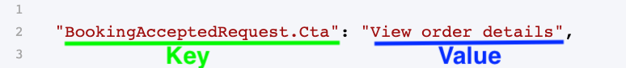
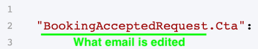
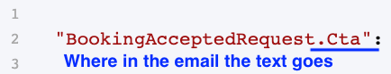
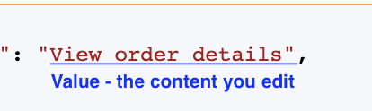

Email texts refer to the text content of every email notification sent
by your marketplace. There are two types of notifications: built-in
email notifications for account management events and transaction email
notifications for events during a transaction.

You can learn more about what you can do with this feature in this
article. The rest of this guide teaches you how to use the Email texts
editor.

Texts from both types of email notifications are found in your Email
text editor in
[Console>Build>Content>Email texts](https://flex-console.sharetribe.com/a/content/email-texts).
Here you can edit every piece of text or punctuation used in your
marketplace’s email notifications.

Best practice for editing Email texts is to identify the email you want
to edit, identify the part of the email you want to edit, and then edit
the text content of that email part. We’ll walk through how to do each
step in detail below. First, let’s understand how Email texts work.

## How Email texts work

The editor contains texts for every email that your marketplace can
send. The texts are broken down by the email being sent and the
different pieces of text in the email, like the title or call to action
button. There are multiple different texts for every email, as every
email is composed of multiple sections. We discuss the different
sections of an email below.

All the content of your notification emails exists in the Email text
file seen in the Console editor. The entire file is enclosed in a set of
curly brackets { }, an open bracket { at the beginning and a closing
bracket } at the end.

Each piece of email text is separated by a comma (,). Most take up one
line of the editor, but some are longer and take up two lines.

Each piece of Email text contains two parts: a key and a value. The
“key” points to the email and the place in the email where the text
appears. The “value” is the text that actually appears in the email and
part described by the key. Both the key and the value are enclosed by
double quotation marks (“ ”). They are separated by a colon (:).

The key and value together are an Email text. Every unique Email text is
separated by a comma (,).

Now that we know how Email texts work, let’s identify the email we want
to change.

## What email are you editing

Before looking at texts, you will want to know what email notification
you are editing. The Email texts editor does not have information about
who receives the email and under what circumstances it is sent. To
understand this context, you should:

Try out different roles and actions in your marketplace in your Test
marketplace

Review this article on how the transaction process works, which
determines how your transaction emails are sent

Consult this reference article with information on every email name,
audience, and event for sending

Remember you do not need to edit every email. Certain transaction emails
may never be sent by your marketplace if you are not using their
transaction process. Others may not be sent very frequently or their
default texts suit you fine.

To know what email and what text within the email you are editing, you
need to look at the key. The first part of the key, before the period,
points to the email you are editing. This is the unique email name.

[Visit this article](https://help.sharetribe.com/en/articles/8478373-all-email-notifications-sent-by-your-marketplace)
for a list of all the emails that your marketplace can send, which will
help you find the email you want to edit. Read below to better
understand the section of the email you are editing.

## What email section are you editing

The second part of the key (after the period) tells you what section of
that email you are editing. This maps to a specific area within the
email where the text will appear.

Most email notifications include these sections:

- Subject
- Title
- CTA
- Content
- Description
- Details

In addition, most notifications have their unique sections too. For
example, "UserJoined.Greeting" refers to the initial paragraph of the
welcome email, while "PurchaseNewOrder.MarkAsShipped" refers to a
paragraph that, by default, reminds the seller about shipping the
product the customer ordered.

Certain parts have affixes at their start or end that further
contextualize the email text. These affixes account for different
choices providers and customers make during a transaction, such as a
customer choosing if they want to pick up their order or have it
delivered during a product purchase transaction.

## How edit the content of the email

The actual text of an email notification exists in the value part of an
Email text. Whereas the key points to where the text goes, the value is
the actual text that gets populated there. Editing the value changes
what text appears in your email.

The value is always enclosed in double quotation marks (“ “). The value
is always written after the colon (:) that follows a key. A comma (,) is
placed after the quotation-mark-enclosed value, denoting the end of the
Email text piece.

To change the text, click into the editor and add, remove, or modify the
words, phrases, and punctuation to suit your goals. After making a
change, press the “Save changes” button to save the change.

In addition to text, numbers, and punctuation, you can use simple and
complex arguments in your Email texts. Arguments allow you to express
what text should appear depending on the context of the email. For
example, you can use arguments to pluralize words so that your emails
show the right texts for whatever situation occurred in your
marketplace.

You can learn more about arguments and how to use them in
[this article](https://help.sharetribe.com/en/articles/8478380-how-arguments-work-with-email-texts).

### Techniques for efficient editing

You can use the search text function (Ctrl+F on Windows and Cmd+F on
Mac) to help you find the Email text you want to edit. Make sure you are
clicked into the editor (cursor appears in the editor) to trigger a
search of all the Email texts. Press “Enter” to search for the text you
entered into the search tool.

If you are making many changes, consider using a third-party editor for
the task. Plain text editors like Notepad on Windows or TextEdit on Mac
have more advanced features like Find and Replace to speed up your work.

To edit Email texts in a third-party editor:

1. Select all the Email texts from the editor in Build>Content>Email
   texts (Ctrl + A on Windows, Cmd + A on Mac)

2. Copy (Ctrl + C on Windows, Cmd + C on Mac)

3. Paste into the third-party editor (Ctrl + P on Windows, Cmd + P on
   Mac)

4. Make edits in the editor as you need. Then, select the entire file
   there (Ctrl + A on Windows, Cmd + A on Mac)

5. Copy the texts in the third-party editor (Ctrl + C on Windows, Cmd +
   C on Mac)

6. Paste the modified texts back into your Console editor (Ctrl + P on
   Windows, Cmd + P on Mac)

7. Press “Save changes”

## FAQ

### Can I add or remove email notifications?

Yes, you can, but it requires using the Extend plan and custom coding.
You can use advanced tools like the CLI to edit your transaction
process, including adding or removing any email notification that you
want.

### Can my marketplace send marketing emails, like a newsletter, in addition to email notifications?

No. You must use another tool for sending such emails. Your marketplace
only sends email notifications by default. To send different kinds of
emails, such as a newsletter or support emails, you must use a different
email sending service. You could, for instance, use Mailchimp to send a
newsletter. There are multiple ways to integrate such tools: you can
manually populate your user data into the third-party tools, use Zapier
to send the data there automatically, or make a bespoke integration with
custom coding.

### Can I send notifications in multiple languages?

By default, you can only send email notifications in a single language
because there is only a single Email text file. This file may be in any
language you want. If you want to send email notifications in multiple
languages, then you will need to work with custom code to create email
notifications in additional languages.

### What happens if I remove an Email text from the editor?

If you remove an Email text, then the removed Email text will revert to
a hard-coded text in English. Your emails either use the Email texts you
setup in your editor, or an English default for any missing texts. This
is true even if you only remove part of a text, such as only the key or
only the value.

### Do you have a list of all the email notifications that my marketplace can send?

Yes, you can find it
[here](https://help.sharetribe.com/en/articles/8478373-all-email-notifications-sent-by-your-marketplace).
