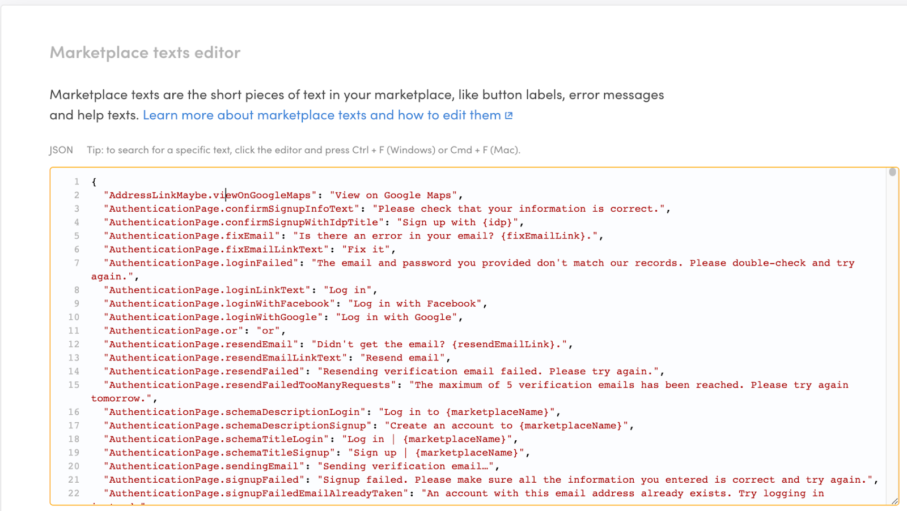
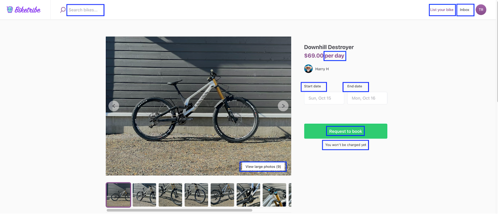
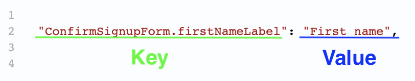
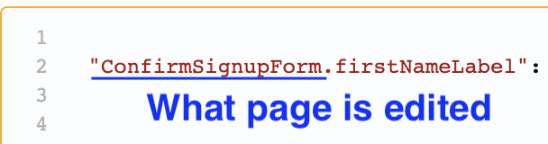
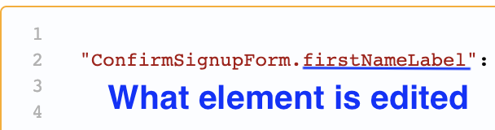
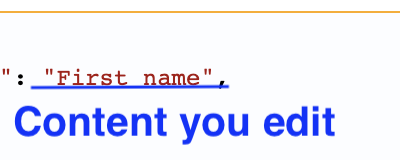
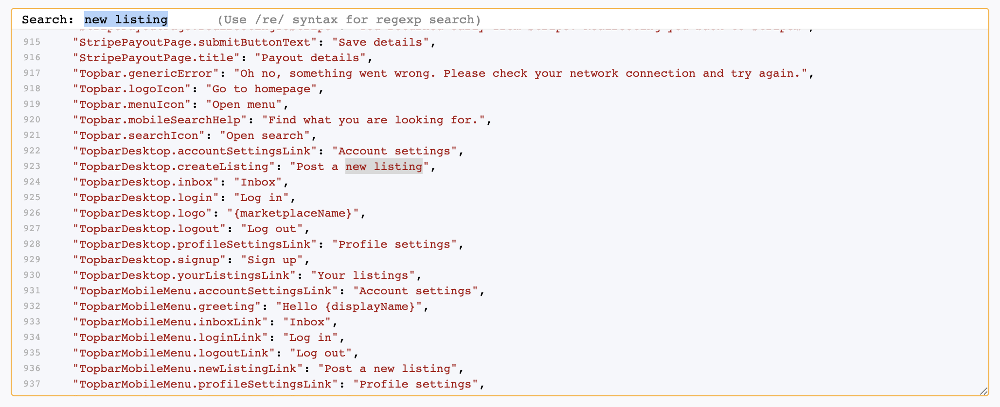

Marketplace texts are words or phrases used in your dynamic page
elements. Use them to control what your labels, buttons, and help texts
say.

You can learn more about what you can do with this feature
[in this article](/operator-guides/what-are-marketplace-texts/). The
rest of this guide teaches you how to edit Marketplace texts. To get
started, navigate to
[Console > Build > Content > Marketplace texts](https://flex-console.sharetribe.com/a/content/marketplace-texts).

## What texts are included in Marketplace texts

Your marketplace is made up of a lot of text content. Sharetribe
distinguishes between two types of text content: texts on content pages
and texts on dynamic pages. Content pages only feature content created
by you, the marketplace operator. Landing pages, “About” pages and FAQ
pages are examples of content pages.

Content pages are edited using Pages in
[Console > Build > Content > Pages](https://flex-console.sharetribe.com/a/content/pages).

Dynamic pages feature content created by your users. Listing pages are
an example of a dynamic page, as a lot of the content there is added by
your providers. Another characteristic of dynamic pages is that they
offer users the ability to interact with them, such as when buyers are
selecting the length of a booking from a listing or entering their
payment information into the checkout page.

Marketplace texts are found in dynamic pages. They are the labels,
buttons, help texts, unit markers, and other words or phrases that help
users navigate your marketplace and accomplish their goals. Here is an
example of different Marketplace texts found on a booking listing page.

## How Marketplace texts work

The editor contains all the Marketplace texts in your marketplace. Each
Marketplace text piece has information about where in your marketplace
the text appears and the actual text that appears there. Dynamic pages
will contain many text pieces, as they are composed of many editable
elements like buttons or help texts.

All your Marketplace texts are located in the file you see in the
Console editor. The entire file is enclosed in a set of curly brackets {
}, an open bracket { at the beginning and a closing bracket } at the
end.

Each line in the document is a separate piece of microcopy. Microcopy
pieces are generally one or two sentences and highly contextual.

Each piece of Marketplace text is separated by a comma (,). Most take up
one line of the editor, but some are longer and take up two lines.

Each piece of Marketplace text contains two parts: a key and a value.
The “key” points to the page and the place on that page where the text
appears. The “value” is the text that actually appears in the page place
described by the key. Both the key and the value are enclosed by double
quotation marks (“ ”). They are separated by a colon (:).

The key and value together comprise a piece of Marketplace text. Every
unique Marketplace text is separated by a comma (,).

## What dynamic page are you editing

To edit effectively, you will want to know what dynamic page and element
of the page you are editing. The key is the key (excuse the pun) for
understanding where a piece of text appears.

The first part of the key (before the period) points to the page you are
editing.

Remember that Marketplace texts only appear on dynamic pages. If you
want to edit texts on a content page, you should use the Pages editor at
[Console > Build > Content > Pages](https://flex-console.sharetribe.com/a/content/pages).

## What dynamic page element are you editing

The second part of the key (after the period) tells you what section of
that page you are editing. This maps to a specific area within the page
where the text will appear.

It will be hard to know where a text appears by looking at the key alone
at first. The best way to start is to search directly for the phrase or
word you want to edit within the editor. Identify the Marketplace text
you want to change and search for the text using the find function in
the Editor to bring you to the right place.

## How to edit the text content

The actual content exists in the value part of a Marketplace text.
Whereas the key points to where the text goes, the value is the actual
text that gets populated there. Editing the value changes what text
appears on a dynamic page.

The value is always enclosed in double quotation marks (“ “). The value
is always written after the colon (:) that follows a key. A comma (,) is
placed after the quotation-mark-enclosed value, denoting the end of the
Marketplace text piece.

In addition to text, numbers, and punctuation, you can use simple and
complex arguments in your Marketplace texts. Arguments allow you to
express what text should appear depending on the context of the page.
For example, you can use arguments to pluralize words so that your
marketplace page always shows the right texts in the right format for
the situation at hand.

## Techniques for efficient editing

You can use the search text function to help you find the Marketplace
text you want to edit. First, click the editor so that the blinking
cursor appears. Then, press Ctrl+F on Windows or Cmd+F on Mac. A search
bar appears. Type in the word you're looking for and press "Enter". The
editor automatically jumps to the first instance of your search term it
finds. If you want to find the next instance, press Ctrl+F or Cmd+F and
hit enter again.

If you are making many changes, consider using a third-party editor for
the task. Plain text editors like Notepad on Windows, TextEdit on Mac,
or Google Docs online have advanced features like Find, Replace, and
Replace all, which can speed up your work.

To edit Marketplace texts in a third-party editor:

1. Select all the Marketplace texts from the editor in Build > Content >
   Marketplace texts (Ctrl + A on Windows, Cmd + A on Mac)
1. Copy (Ctrl + C on Windows, Cmd + C on Mac)
1. Paste into the third-party editor (Ctrl + P on Windows, Cmd + P on
   Mac)
1. Make edits in the editor as you need. Then, select the entire file
   there (Ctrl + A on Windows, Cmd + A on Mac)
1. Copy the texts in the third-party editor (Ctrl + C on Windows, Cmd +
   C on Mac)
1. Paste the modified texts back into your Console editor (Ctrl + P on
   Windows, Cmd + P on Mac)
1. Press “Save changes”

## FAQ

### Can I edit or remove a key?

You shouldn't, unless you're customizing your marketplace with code. If
you edit or remove a key, your marketplace no longer finds the right
value for this key. If that happens, this value will be replaced with a
default English backup.

### Can I add a key?

You can add new keys, but doing so doesn't do anything unless you have
customized your marketplace with code so that the new keys are being
used in the marketplace user interface. The only exception to this is
when there's a new release to Sharetribe that includes new keys.
Whenever that happens, and you want to edit the values of the new keys,
you need to copy-paste the new key-value pairs to Marketplace texts.
This article teaches you how.

### Can I add a link or formatting with Marketplace texts?

Marketplace texts doesn't support adding links or formatting (bolding,
italics, etc). If you want to add links or format your text, you need to
customize your marketplace with code.
