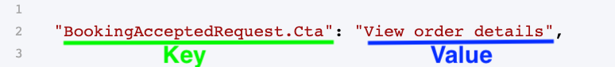

Sharetribe marketplaces automatically send email notifications to your
users. There are two categories of email notifications: built-in email
notifications, which are sent when users are managing their account, and
transaction email notifications, which are sent to customers and
providers during a transaction. An editor in Console gives you the
ability to change the text content of these emails.

## What you can do with Email texts

Email texts represent the entirety of text content across both built-in
emails and transaction notification emails sent by your marketplace. You
can change every letter, word, or punctuation in these emails with the
editor found at
[Console>Build>Content>Email texts.](https://flex-console.sharetribe.com/a/content/email-texts).

There are several possible use cases you can support with Email texts
editor. First of all, you can change the wording and phrasing of every
email to match the tone and verbiage your users will understand and
appreciate. It’s a good idea to match Email texts to your Marketplace
texts.

Secondly, you can use the Email texts editor to match your users’
preferences for how money, dates, plurals, and words should appear. For
instance, most marketplaces using the Euro should place the currency
symbol before the amount in their emails (e.g. €5); however, in certain
places in Europe, users would expect the symbol to go after (e.g. 5€).
You can adjust how currency shows in your emails to suit your locale,
alongside other locale-specific details like dates, plurals, and
spellings.

Third, you can use the Email texts editor to translate your texts into a
different language. Sharetribe comes with several languages already
translated for you, but, if your language is not on this list, you can
use Email texts (and Marketplace texts) to fully translate your
marketplace.

Of course, your marketplace emails already contain Email texts, and it
is perfectly fine to leverage these defaults.

## How Email texts work

All your Email texts are contained within a single file. Every email
your marketplace can send has texts within this file. This is the file
that you can view and edit with the Email texts editor found in
[Console>Build>Content>Email texts](https://flex-console.sharetribe.com/a/content/email-texts).

Email texts are presented in two parts: a key, which tells you where the
text content is used, and a value, which is the text content itself.

The content or “value” in your Email texts can be phrases, words, or
numbers. You can also use various arguments to better contextualize your
notification messaging to the particular transaction in question. You
can learn more about how Email texts work in
[this article.](/operator-guides/how-to-use-email-texts).

## What emails notifications are sent by your marketplace

There are two types of email notifications sent by your marketplace. The
first are built-in email notifications, which are sent during account
management actions like resetting a password or verifying an email.

The second type of email notifications sent by your marketplace are the
transaction notifications. These are sent to customers and providers
during a transaction. They include notifications about a new purchase or
booking request, updates about the progress of the transaction, and
reminders to leave a review.

You can see the full list of every email notification sent by your
marketplace and when they are sent in
[this article.](https://help.sharetribe.com/en/articles/8478373-all-email-notifications-sent-by-your-marketplace)

## How to get started with Email texts

View your Email texts in
[Console>Build>Content>Email texts](https://flex-console.sharetribe.com/a/content/email-texts).
You can start modifying the value of your email texts right away.

Prefer to learn more? Visit this
[article](/operator-guides/how-to-use-email-texts) to see how to use the
Email texts editor.
