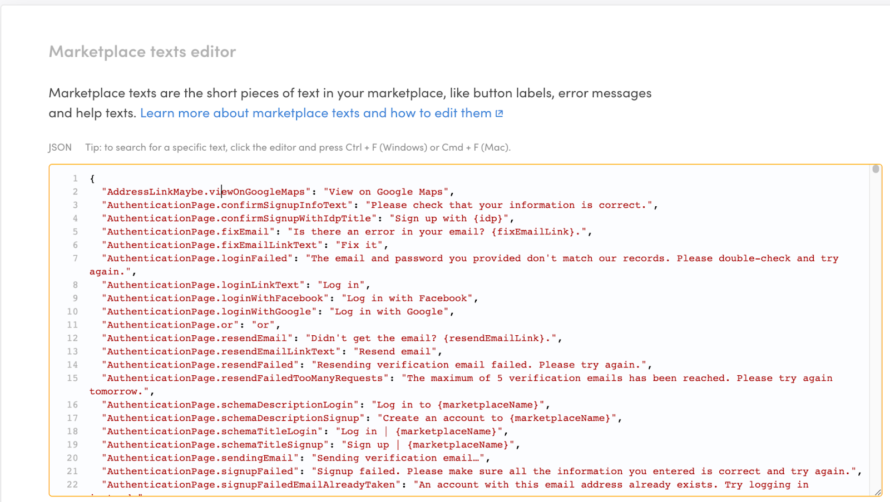
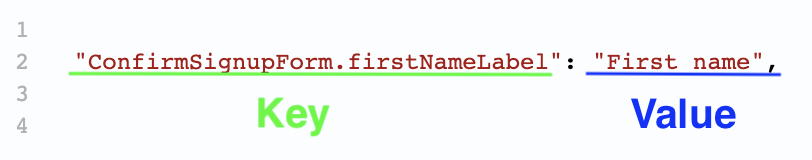

Marketplace texts are short texts used across your dynamic pages. Button
labels, error messages, and help texts are all examples. Marketplace
texts are textual, brief (a sentence or two), and highly contextual. You
can edit them in
[Console > Build > Content > Marketplace texts](https://flex-console.sharetribe.com/a/content/marketplace-texts).

## What you can do with Marketplace texts

Changing your Marketplace text is an important part of deciding how your
marketplace works. It allows you to set the tone in which you address
your users: do you prefer to be calm and polite, warm and friendly, or
whimsical and goofy?

With Marketplace texts, you also make key decisions about your core
vocabulary. Do you call your customers "buyers", "guests", or something
else? Are your providers perhaps called "vendors", "sellers" or "hosts"?
What are they publishing on your site – "listings", "products",
"profiles", "apartments", "bikes"? When they interact with each other on
your site, are they "booking", "buying" or "ordering"?

Finally, you can use the Marketplace texts editor to translate your
marketplace into another language. Sharetribe comes with several
languages already translated for you, but, if your language is not on
this list, you can use Marketplace texts (and Email texts) to fully
translate your marketplace.

Of course, you may simply leverage the defaults and not change the
Marketplace texts if they work for your marketplace.

## How Marketplace texts work

All your Marketplace texts are contained within a single file. Every
text on your marketplace’s dynamic pages exists within this file, except
for a few locale-specific texts. This is the file that you can view and
edit with the Marketplace texts editor found in
[Console > Build > Content > Marketplace texts](https://flex-console.sharetribe.com/a/content/marketplace-texts).

Marketplace texts are presented in two parts: a key, which tells you
where the text content is used, and a value, which is the text content
itself.

The content or “value” in your Marketplace texts can be phrases, words,
or numbers. You can also use various arguments to better contextualize
your notification messaging to the particular transaction in question.
You can learn more about the format of Marketplace texts in this
article.

## How to get started with Marketplace texts

View your Marketplace texts in
[Console > Build > Content > Marketplace texts](https://flex-console.sharetribe.com/a/content/marketplace-texts).
You can start modifying your content right away.

If you want to learn more about the specific format of Marketplace texts
and the best practices for editing them, check out
[this in-depth guide](/operator-guides/how-to-edit-marketplace-texts).
