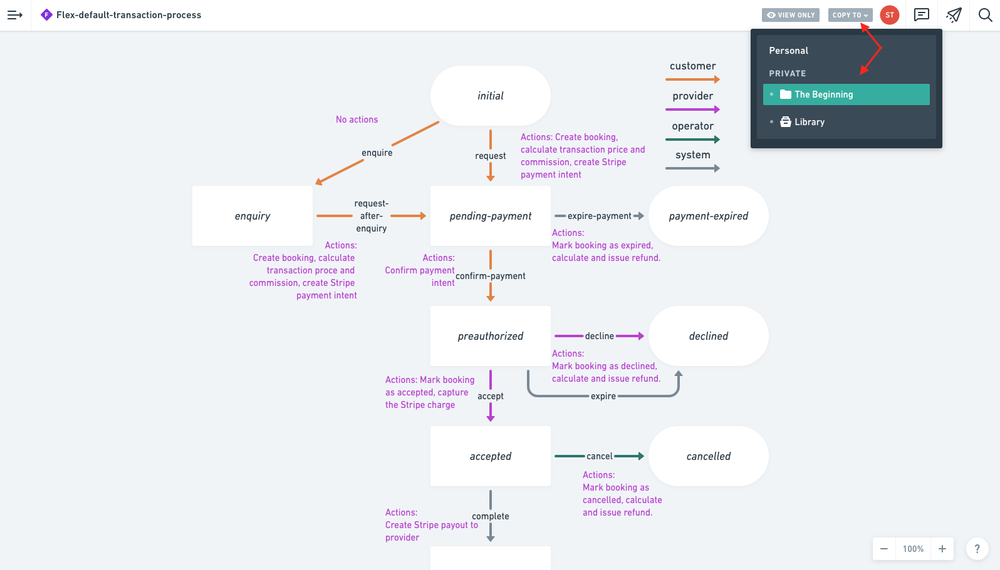

Whimsical is a intuitive and easy to use tool to communicate visually.
You can create, mindmaps, wireframes, and most importantly, flowcharts
to communicate your transaction process clearly to your developers.

We have a transaction process flowchart template that you can leverage
to design your own transaction process or processes. It is quite simple
to use and super intuitive.

Follow this steps:

1. Go
   [to this address](https://whimsical.com/flex-default-transaction-process-GDRUyuF7M5nMSte6rfwNuc)
2. Sign in to your whimsical account or create an account if you don't
   have one.
3. On the top right, click on "COPY TO" and select your private folder
4. That's it! You can now start designing your own transaction process

