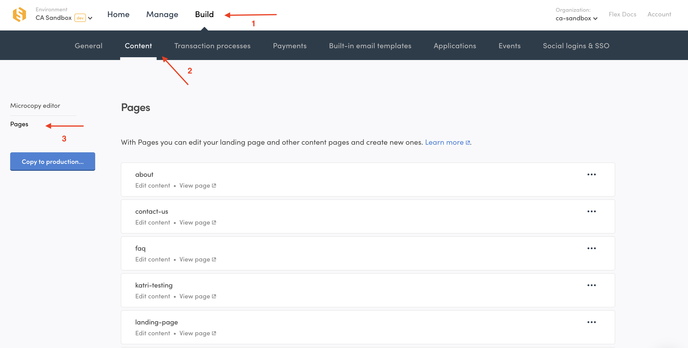

Pages allow you to build, edit, and manage your marketplace’s static content pages directly from your marketplace operator backend, or Console. Static content pages like a Landing page or About page can now be modified without developer input. Pages’ workflow lets you create and review content changes before deploying it to your live marketplace. 

PAGES VIDEO

# What you can do with Pages

Pages lets you create and edit content pages without code in Flex. On your marketplace, static content pages are pages featuring content created by you, the marketplace operator. Landing pages, “About” pages, FAQs or blog posts are all examples of static content pages.

There are various use cases for static content pages. The most obvious one is to provide informational content about how your marketplace works to your users. In addition, you might use Pages to create alternative landing pages for various user groups, for search engine optimization (SEO) or paid advertising purposes, or even create a simple blog.

Any Flex marketplace starts with 4 default pages: the About page, the Landing page, the Privacy policy page, and Terms of use page. Pages lets you edit these default pages, but they cannot be removed. In addition to the default pages, you can add and edit any number of custom content pages. 

# How Pages work

You can use Pages from Console's Build section. By default, Pages starts with four static content pages you can start editing. Or, you can build your own!

Each content page is built using a combination of sections and blocks.. Sections define the different content areas and their layout. Blocks contain the information presented in a section. Blocks are made up of multiple different types of content, like texts, Youtube videos or images.

The content you create displays in your marketplace application or marketplace frontend. It is laid out using the default design of a Flex Template. If you want your content to follow a different design, a developer can make the necessary modifications. A future release will also allow developers to add more types of sections and blocks, which will make it possible to create a wider variety of content pages. 

_An example carousel section from the starting Landing page. The default code of the marketplace application renders carousels and all content created using Pages following a standard design. Developers can change this design anytime._ 

Pages works in both your development and production environments. While you build your custom marketplace, you use the development environment to create and modify your static content pages. You can preview these changes immediately in your marketplace. When your marketplace is live and you have a production environment, you use the test environment to make changes to your published marketplace content and preview how they look in your development site. When ready, you copy finished changes from your test environment to your production environment and live marketplace application. 

# How to get started with Pages

Use Pages to create and edit your marketplace content when building your Flex marketplace. The first step to building your marketplace requires setting up a Flex Template. This is a technical task that requires coding knowledge. If you are not a developer or do not yet have a developer on your team, you should hire a Flex Expert to help you build your marketplace.

Once your own version of the Flex Template is set up, you can start building and editing your content pages in Console. Log into Console, navigate to your Development environment, pick the “Build” section from your top bar, select “Content” from the sub-menu, then select “Pages” from the left side menu. You should now see your default content pages (the About page, the Landing page, the Terms of use page, and the Policy page) ready for editing, or you can create your own page.

 
_Pages home screen shows all your marketplace’s static content pages. Pages starts with a prebuilt About page, Landing page,Terms of use page, and Privacy Policy page. We recommend editing those pages to suit your marketplace as you start building._

To start, you may want to focus on editing your Landing page. This will be the first page most of your users see, so you want it to look great and clearly articulate your value proposition. Check out our guide on how to edit your landing page here to get started (LINKLINK).

If you want to try creating a new page, consider using the How to build an FAQ tutorial to get started (LINKLINKLINK).

Not sure you’re ready to start developing yet? Then, try Pages out without any code setup using the demo marketplace Saunatime! After creating a Flex account, log into Console (LINKLINK) and follow the same steps to navigate  to Pages (Build->Content), but make sure you are in your Demo environment (LINKLINK). Marketplaces created before DATEDATEDATEDATE need to refresh their Saunatime demo by following instructions in Console.

Marketplaces built or being built on Flex before DATEDATEDATE need to modify their frontend marketplace code to take Pages into use. Developers can follow this guide to learn how to update existing marketplace codebases with Pages functionality. 

For more technical information on how Pages work and how you can change the layout and visual style of your pages with custom code, see X or Y (LINKSLINKSLINKS TO DEV DOCS)

