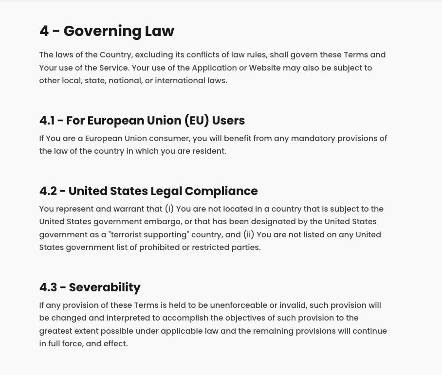
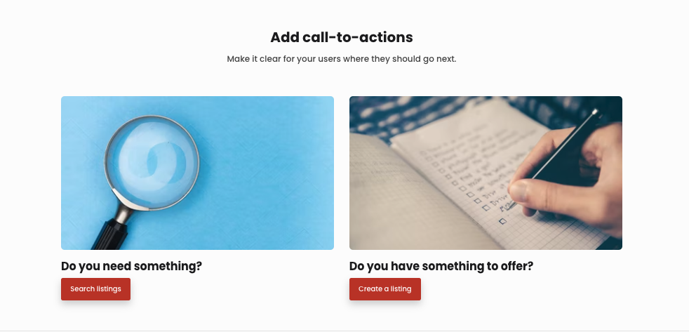
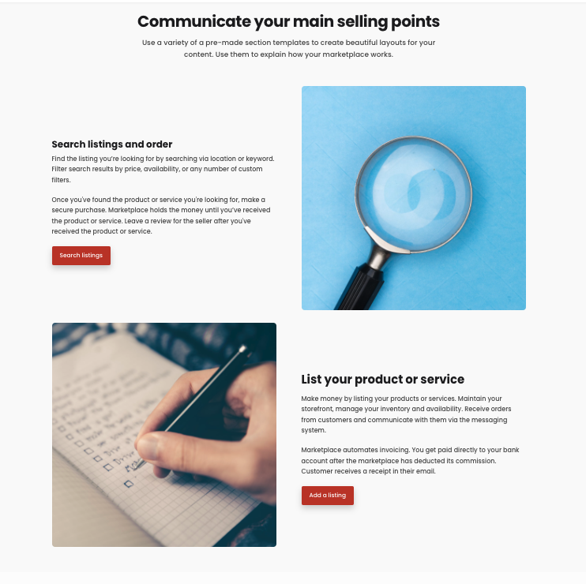
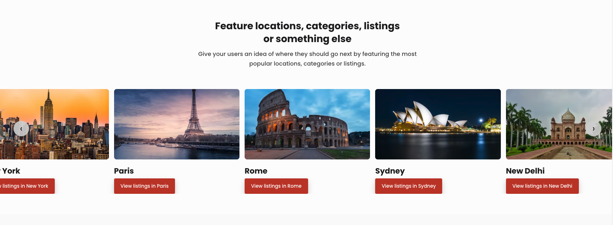

Section templates control the layout of your static page. Each block of content in your section is shown according to the rules of the chosen section template. There are four templates to choose from: Article, Columns, Features and Carousel. This guide describes the layout of these four section templates. 

If you're looking for more general information about creating content pages in your marketplace, this is the guide for you.

## Article template 

The Article template is best for long-form written information. This template emphasizes titles and content space for easier reading. It is perfect for creating content pages like Terms of use, Privacy policy, or FAQ pages. If you’re publishing blog content to your marketplace, the Article template is the best way to layout your blocks. 

### Layout 

The Article template stacks blocks one on top of another. The blocks are centered on the page. Your blocks appear in the Article layout below any Section title, ingress, or call to action button.

Each additional block added to an Articles section is stacked below the previous block. If you have a lot of written content to share, then creating new blocks for each topic lets you keep the information organized. 

_The Article template is best for written text, like a Terms of use page. Shown is a single section of a Terms page using the article layout. Each heading is a different block. Blocks are stacked one on top of the other._

## Columns template 

Columns template displays blocks side by side. It is great for breaking down a particular message in a concise and engaging manner. There are many potential use cases for using this layout, such as showcasing the locations your marketplace serves or describing your marketplace’s value proposition to your buyers (or sellers). 

### Layout 

Columns template arranges blocks side by side, starting from the left-most edge. Each new block represents one column. You may have as many as four columns per row. Each new block appears as a new column. Your blocks below any section title, ingress, or call to action button.

_Columns work best with multiple blocks. In the default landing page, this layout is used to encourage buyers to search for listings and providers to create listings. Each column is a unique block with a title, image, and call to action button._

## Features template 

Features template shows text and visual content side by side in alternating order. It is great for telling a story in a visually appealing manner. You should use it anytime you want to use visual and text content side by side. For instance, a customer testimonial page would look great using this template.

### Layout 

Features template transforms each block into a single row within the section. The block will split visual and written information, one on each side of the center. Visual content can be a Youtube-hosted video or image that you upload. 

Each new block adds a new row to this section. The ordering of visual and text information will alternate with each new block. Your blocks appear in the Features layout below any section title, ingress, or call to action button. Each new block adds a new row 

_Features sections are highly visual. This example encourages buyers to find listings and sellers to create them. Each row is a unique block. Both blocks include an image, title, text, and call to action button. This layout alternates where media and text information appear._

## Carousel template 

Carousel template creates a scrollable slideshow out of your content. It is another great option for showcasing information where visual content takes center stage. Carousels also add an interactive element by requiring a scroll to show all the information. Use this section template to showcase what is best about your marketplace, such as popular listings, categories, or providers. 

### Layout 

Unlike the features template, blocks in a carousel all show on a single row. Each block is thumbnail. The carousel features 1, 2, 3, or 4 blocks on the page. Users can scroll or swipe through them to reveal additional blocks of content. 

1 column carousels have the largest thumbnails. The more blocks that are featured, the smaller each thumbnail in the carousel. Thumbnails can be video or images and feature text.

Blocks appear in the Carousel layout below any section title, ingress, or call to action button.

_A Carousel example showcasing different locations. Each location is added as a block with a title, image, and call to action button. The call to action button takes you to the search page with the location’s search parameters inputted, which exists at a unique URL generated by making the search. The carousel is scrollable left and right using arrows or by swiping._

## Further formatting with Markdown 

Section templates determine the layout of blocks in a section. If you want to format how information looks inside your block, then you should use Markdown. Markdown is a syntax language that lets you format text inside blocks. [Our guide](https://www.sharetribe.com/docs/
operator-guides/how-to-format-your-text-in-pages/) for formatting with Markdown will get you started using it with Pages. 