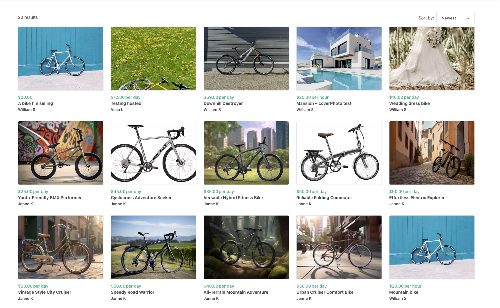
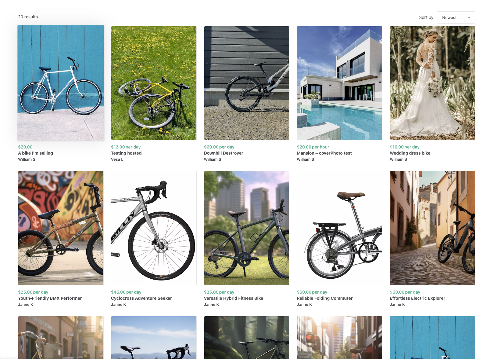
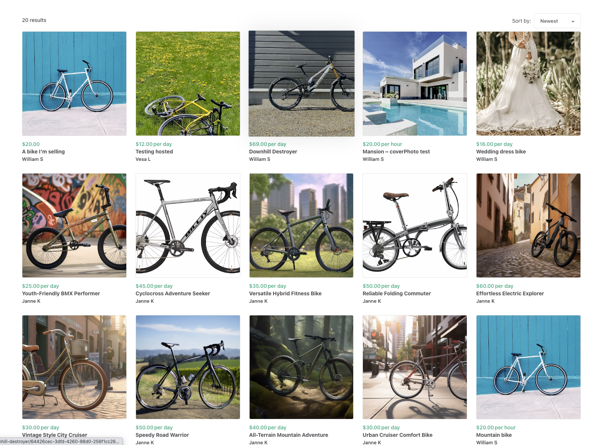

The listing thumbnail aspect ratio setting determines how the images in
your marketplace's search page will be displayed. You can define this
ratio from your Console. Within your test environment go to Build →
Content → Layout.

These images give the first impression of your offering to your
prospective buyers. You should select the aspect ratio that best
represent the actual offerings on your marketplace. For instance,
landscape ratio photos can be great to display house photos or bicycles.
A marketplace for books or clothing would probably showcase better with
Portrait style thumbnails. Marketplaces in which listings are mostly
services could benefit from square images, for example.

## Where do the thumbnails come from?

The images that are used to create the thumbnails are the same that the
provider uploads in the listing creation form. The maximum listing size
is 20 MB and 3072 x 3072 pixels. The recommended listing image file type
is jpg or png. For more information on how to ensure the best quality
photos on your marketplace, check out
[this article](https://www.sharetribe.com/docs/operator-guides/how-to-add-good-looking-logos-and-images/).

## Different ratios

### Landscape

For the landscape thumbnail, the ideal image aspect ratio should be 4:3,
for example, 1350 x 1080 pixels. This means that the image width should
be larger than the height.

### Portrait

For the portrait thumbnail, the ideal image aspect ratio should be 3:4,
for example, 1080 x 1350 pixels. This means that the image height should
be larger than the width.

_Notice how the "Wedding dress bike" listing (on the top right) looks
better with this layout_

### Square

For the square thumbnail, the ideal image aspect ratio should be 4:4,
for example, 1080 x 1080 pixels. This means that the image height and
width should be equal.

