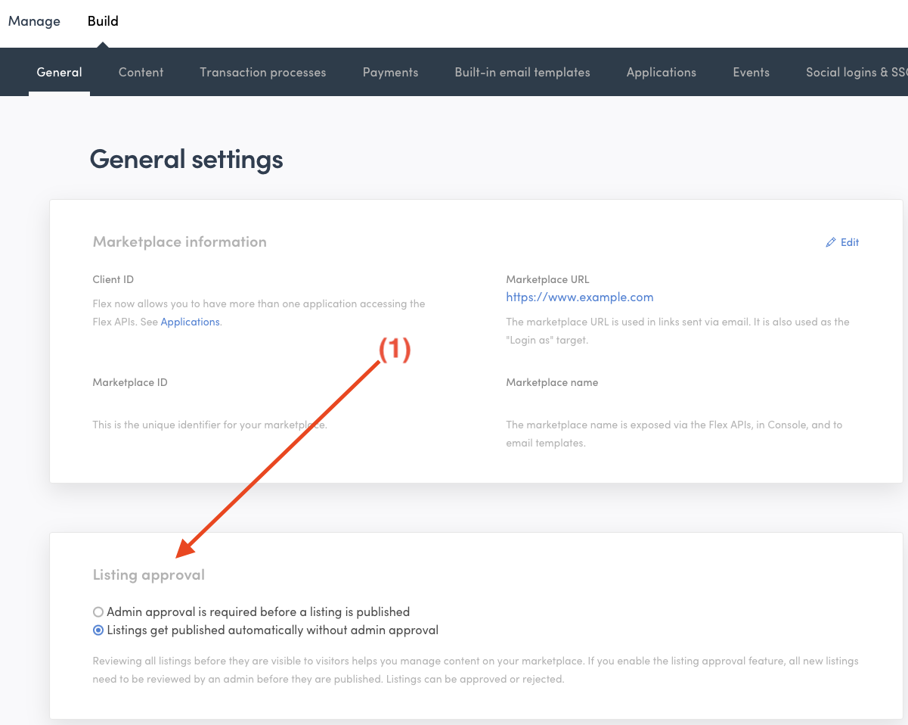

Sharetribe offers you the chance to approve new listings before they go
live. This article explains how to use this feature through the Console.

## Understanding the listing approval function

Normally, a new listing on Sharetribe goes live as soon as the person
who created it hits the "publish" button. However, you can change this
so that new listings need your approval before they go live. This means
that a listing only gets published after you've checked and approved it.

You might want to use this feature to make sure the listings are right
for your marketplace and fit its theme and the terms of use. For
example, if you've limited the number of listings a seller can post, you
can use this feature to keep an eye on the numbers.

Note that this only applies to new listings. If a seller edits a listing
that's already been approved, they won't need your approval again. Keep
this in mind if you want to review all changes to listings.

Currently, you can't "decline" a listing, though you can delete a
listing that you don't approve if you prefer. If a listing needs changes
to meet your marketplace standards, you'll need to get in touch with the
seller to suggest improvements and ask them to submit a new listing.

There isn't an automatic email notification when you approve a listing.
However, you could use something like Zapier to send a message when a
listing changes from "pending approval" to "published". You can read
more about Zapier from
[this guide](https://www.sharetribe.com/docs/how-to/set-up-and-use-zapier/).

(Non-technical version of the Zapier guide is coming up soon!)

## How to manage listing approval in Console

You can turn on the listing approval feature in your Console. Go to
"Build > General" and look down to find the right section (1). By
default, listing approval is turned off.

<extrainfo title="Step 1: Finding the listing approval toggle in the Console">

</extrainfo>

When you have listings that need approval, you can see them in the
"Listings" view of your Console. Listings that need approval will have a
special badge to indicate their status (2).

<extrainfo title="Step 2: A listing with a badge indicating that it requires approval">

</extrainfo>

To approve a listing, click on it to open it. There'll be a button at
the bottom of the listing panel that lets you approve the listing (3).

<extrainfo title="Step 3: Button for approving the new listing">

</extrainfo>

## Experience from the seller's perspective

As a seller, you can create your listing just as you normally would,
starting from the listing creation button in the top bar of the
marketplace (4). The difference comes after you fill out all the fields
and hit "Publish listing" (5). Instead of going live immediately, your
listing will wait for the marketplace operator (the admin) to review and
approve it.

<extrainfo title="Step 4: Creating a new listing">

</extrainfo>

<extrainfo title="Step 5: Publishing the listing to the awaiting approval stage">

</extrainfo>

While waiting for approval, your listing isn't visible to other users on
the marketplace. This means they won't be able to see or interact with
your listing until it's been approved.

A noticeable feature will be a banner at the top of your listing page
(6). This banner signals that your listing is "pending approval." This
message is a reminder for you, and is not visible to other users. It
simply means that your listing is in the process of being reviewed by
the admin.

<extrainfo title="Step 6: Banner indicating that the listing is awaiting approval">

</extrainfo>

Once the operator has reviewed and approved your listing, it will become
visible to all users on the marketplace, and they can start interacting
with it. Remember, there's no automatic notification for this, so you
might want to keep an eye on your listing's status.
