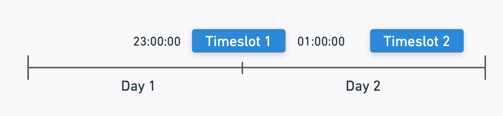

The listing availability management features of Sharetribe allow
providers to define when (and when not) their listings are available for
booking. There are three different concepts related to availability
management that together define whether a certain time or day is
available on not:

- An **availability plan** can be defined for each listing. It comprises
  of general availability rules for each day of the week. For instance
  "available on Mondays and Thursdays", or "available on Tuesday,
  Wednesday and Friday from 9 AM to 6 PM".
- An **availability exception** overrides the availability plan for a
  concrete period of time. For instance "Available on 2018-11-25 and
  2018-11-26", "not available on 2018-11-30".
- A **booking** represents a reservation (or an intention to make a
  reservation) for a concrete period of time.

The availability plan and exceptions, together with booking information
can be combined to determine if a particular time range is available for
booking or not. For instance, the
[/timeslots/query](https://www.sharetribe.com/api-reference/marketplace.html#query-time-slots)
API endpoint returns availability information for future dates, taking
into account the listing's availability plan, exceptions and bookings.

All bookings are created through transactions, governed by your
[transaction process](/concepts/transaction-process/). The transaction
process ensures that bookings are only created for available time
ranges.

## Seats

Both availability plans and availability exceptions use the concept of
_seats_ to define whether a particular time is available or not. How
many seats a booking consumes depends on the `seats` attribute of a
booking. Having 0 seats in availability means that the listing is
unavailable for bookings during that time.

## Day-based availability management

Day-based availability works with both daily and nightly bookings. For
instance, an availability plan can define that Mondays and Tuesdays are
available for booking. For daily bookings this means that dates that are
a Monday or a Tuesday can be booked. For nightly bookings, this means
that nights Monday-Tuesday and Tuesday-Wednesday can be booked.

### Interpretation of availability exceptions and bookings

For day-based availability plans, it is recommended to create
availability exceptions with timestamps having 00:00:00 time in UTC.

Creating availability exceptions with arbitrary time is allowed, but
such exceptions are subject to the following interpretation rules in the
context of a listing with day-based availability plan:

- if the availability exception covers only partially a given date in
  UTC time zone, the availability exception is interpreted as **covering
  the entire date**
- if multiple availability exceptions cover partially a given UTC date,
  the **minimum number of seats** of all these availability exceptions
  is taken as the resulting number of available seats for that date,
  prior to taking any existing bookings into account.

If your transaction process uses time-based bookings, the bookings are
also subject to the same interpretation rules.

###### **Example 1:**

An exception with start `2018-11-26T12:30:00.000+01` and end
`2018-11-27T10:25:00.000+01` is interpreted as if it were from
`2018-11-26T00:00:00.000Z` to `2018-11-28T00:00:00.000Z`

###### **Example 2:**

An exception with start `2018-11-26T00:30:00.000+01:00` and end
`2018-11-27T00:15:00.000+01:00` is interpreted as if it were from
`2018-11-25T00:00:00.000Z` to `2018-11-27T00:00:00.000Z`.

###### **Example 3:**

An exception with start `2018-11-26T00:30:00.000+01:00` and end
`2018-11-27T15:15:00.000+01:00` is interpreted as if it were from
`2018-11-25T00:00:00.000Z` to `2018-11-28T00:00:00.000Z`.

## Time-based availability management

Time-based availability can be used with time-based bookings. Time-based
availability plans can specify one or more time intervals for each day
of the week, and specify the time zone in which these times should be
interpreted. For instance, with time-based availability it is possible
to define that the listing is available on weekdays from 9 AM to 11AM
and from 1 PM to 6 PM.

### Timeslots, availability plans and exceptions

Timeslots are periods of time, which are available to be booked. E.g. if
you have set a plan with 1 available seat from 7-22 on Mondays, that
means that one person can book 5 minutes 07:00 - 07:05. Then the next
customer can only book times within the range of 07:05 - 22:00 on the
same day. So, the plan creates a weekly schedule, against which
availability exceptions and bookings are making reservations.

Exceptions can be used for restricting availability on a specific day.
E.g. if you have set availability to 07 - 22 on Mondays and you add an
exception 21-22 with seat 0 on Monday 28.10.2019, the timeslots query
returns timeslot 07-21 on that day if there are no bookings.

Exceptions can also be used for expanding the availability on a specific
day. E.g. if you have set availability to 07 - 22 on Mondays and you add
an exception 22-23 with seat 1 on Monday 28.10.2019, the timeslots query
returns timeslot 07-23 on that day if there are no bookings.

For time-based plans, both availability exceptions and bookings are
interpreted literally, i.e. covering the exact time intervals determined
by their start and end times.

### Interval based filtering

Interval based filtering allows querying timeslots by partitioning the
queried time frame (start to end) into smaller sub-intervals, and then
matching and filtering timeslots based on whether timeslots are
contained within the sub-intervals. This can be particularly useful for
checking day-by-day availability over an extended period for
fixed-duration bookings.

Interval based filtering is supported by the
[/timeslots/query](https://www.sharetribe.com/api-reference/marketplace.html#query-time-slots)
endpoint. It is controlled via four query parameters:

- `intervalDuration`: the length of each sub-interval (e.g. "PT30M",
  "P1D")
- `maxPerInterval`: the maximum number of timeslots to return per
  sub-interval
- `minDurationStartingInInterval`: minimum required duration of a
  timeslot starting in an interval, in minutes
- `intervalAlign`: optional timestamp to control where intervals start
  (defaults to start time of the query)

`intervalDuration` partitions the queried time frame into smaller
sub-intervals, which is provided as an
[ISO 8601 duration](https://en.wikipedia.org/wiki/ISO_8601#Durations).
`maxPerInterval` then limits the number of time slots matched within
each sub-interval. Only a number of results up to the defined maximum
are returned, with excess slots being excluded.

`minDurationStartingInInterval` sets a threshold (in minutes) that
determines whether a particular time slot counts toward the
`maxPerInterval` limit. The threshold value is compared to the duration
of the time slot, cut to the start of the current sub-interval.

`intervalAlign` is a timestamp anchoring the starting point of these
sub-intervals, giving control over how intervals align relative to the
query start.

Here are four examples of different scenarios illustrating how the
filtering logic works. All examples use `intervalDuration: P1D`,
`maxPerInterval: 1` and `minDurationStartingInInterval: 100`, i.e. 1
hour and 40 minutes. Therefore, any timeslot that is at least a 100
minutes long and starts within the interval should be returned

###### **Example 1:**

Only Timeslot 1 is returned by the query, as it is the first matching
timeslot within "Day 1".


###### **Example 2:**

Both timeslots are returned by the query.


###### **Example 3:**

In this example, we have Timeslot 1 that spans both sub-intervals. The
timeslot overlaps at least a 100 minutes within both sub-intervals, so
it is the first matching timeslot in both "day 1" and "day 2". Timeslot
2 is not returned, as we have specified `maxPerInterval: 1` in the query
parameters.


###### **Example 4:**

Here, both Timeslot 1 and Timeslot 2 are returned by the query. Even
though Timeslot 1 only overlaps within "Day 1" for 60 minutes, it's
total length is 2 hours, i.e. 120 minutes. As long as a timeslot starts
within an interval, it does not have to be fully contained to the
interval. The whole duration of the timeslot is compared to the
`minDurationStartingInInterval: 100` value. Timeslot 1 does not overlap
with "Day 2" for 100 minutes or over (it overlaps for 60, as the slot
ends at 01:00:00). The comparison is cut to the start of the current
sub-interval. Therefore, the first timeslot that matches the conditions
is Timeslot 2, and both timeslots are returned by the query.



## Booking states

A booking can be in one of several possible states: `pending`,
`proposed`, `accepted`, `canceled` or `declined`. Bookings change state
only through a corresponding transaction transition, using one of the
[booking-specific actions](/references/transaction-process-actions/#bookings).

All bookings in `pending` or `accepted` states count as reservation
against the listing's availability. On the other hand, bookings in the
`proposed`, `canceled` or `declined` states do not affect the
availability of the listing.

The figure below illustrates the possible booking states, transitions
between the states and the corresponding actions that you can use in
your transaction process.


In addition, the `:action/update-booking` action can be used to update a
booking's details (start or end times, seats) when the booking state is
either `proposed`, `pending` or `accepted`. The booking remains in the
same state as it was before the update.

New bookings are always created in either `pending` or `proposed` state.
As `pending` bookings reserve availability, they are useful when your
transaction process allows customers to immediately reserve their spot
(often combined with a preauthorization of a payment).

Using `proposed` bookings is useful in situations where multiple
customers should be allowed to request to book certain time range
independently of one another. The provider would be able to choose which
request(s) to accept (it may be possible to accept more than one
request, if there are enough available seats), as long as the listing
has sufficient remaining availability.

## Booking display times

Booking display times are a handy tool for managing listing
availability. You can use them by passing `bookingDisplayStart` and
`bookingDisplayEnd` attributes when creating or updating a booking. This
will set `displayStart` and `displayEnd` attributes correspondingly to
the booking that is related to the initiated transaction. The display
times can be used alongside with the regular `start` and `end`
attributes (defined by `bookingStart` and `bookingEnd` params) of a
booking and they can be used to present different start and end times to
the customer than actully is booked. See
[the booking resource format](https://www.sharetribe.com/api-reference/marketplace.html#booking-resource-format)
for a full list of booking attributes.

###### **Example:**

A provider needs 10 minutes of preparation time before each booking.
They can pass the following params regarding booking start when
initiating a transaction:

```json
bookingStart: "2018-04-20T12:20:00.000Z",
bookingDisplayStart: "2018-04-20T12:30:00.000Z"
```

The `displayStart` attribute will now indicate that the booking starts
at _12:30_ and this can be presented to the customer. However, the
listing is booked already from _12:20_, denoted by booking's `start`
attribute. Now the listing is not available for other bookings 10
minutes before this booking starts. If another customer wishes to book
this listing earlier, their booking will end at latest 10 minutes before
this booking.

## Related API endpoints

See the reference documentation for the following API endpoints for
details:

- [/own_listings/create](https://www.sharetribe.com/api-reference/marketplace.html#create-listing)
- [/own_listings/update](https://www.sharetribe.com/api-reference/marketplace.html#update-listing)
- [/availability_exceptions/\*](https://www.sharetribe.com/api-reference/marketplace.html#availability-exceptions)
- [/timeslots/query](https://www.sharetribe.com/api-reference/marketplace.html#query-time-slots)
- [/transactions/initiate](https://www.sharetribe.com/api-reference/marketplace.html#initiate-transaction)
