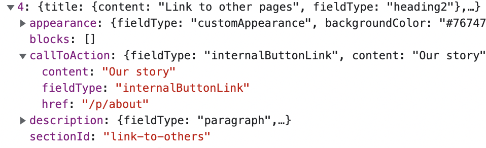

> how the data looks like after people add fields and then remove them -
> aka how the deleted data looks like in the fetched asset, as that’s
> causing work for me. - And we should probably document those somewhere
> for customizers.

// TODO do we show the \_editor attributes as well?

- The page schema is based on [JSON schema](https://json-schema.org/) –
  [learn more](https://json-schema.org/understanding-json-schema/)
- not to be confused with extended data search schema [TODO: LINK]
- or web schema

## Page Schema is divided into two parts

- properties and defs
- properties describe the structure of the page asset
- defs contain subschemas, i.e. additional attributes that can be reused
  in several properties
  - read more about
    [defs in JSON schema](https://json-schema.org/understanding-json-schema/structuring.html#defs)
  - e.g. internal button link

```json
{
  /** Section call to action */
  "callToAction": {
    "type": "object",
    "properties": {
      "fieldType": {
        /** refer to #/$defs/fieldType/ */
        "oneOf": [
          {
            "$ref": "#/$defs/fieldType/none",
            "title": "No call to action"
          },
          {
            "$ref": "#/$defs/fieldType/internalButtonLink",
            "title": "Internal link",
            "description": "Link to a page in your marketplace. Displayed as a button."
          },
          {
            "$ref": "#/$defs/fieldType/externalButtonLink",
            "title": "External link",
            "description": "Link to a page outside your marketplace. Opens in a new tab. Displayed as a button."
          }
        ]
      }
    },
    /** Section call to action additional attributes */
    "allOf": [
      {
        "if": {
          "properties": {
            "fieldType": {
              "$ref": "#/$defs/fieldType/internalButtonLink"
            }
          },
          "required": ["fieldType"]
        },
        "then": {
          "$ref": "#/$defs/internalButtonLink"
        }
      }
    ]
  }
}
```

- additional attributes defined in `$defs`
  - Field type is used in if
  - internal button link is used in then

```json
{/** Definitions used in the schema */
"$defs": {
  /** Field types */
  "fieldType": {
    "none": {
      "const": "none"
    },
    "internalButtonLink": {
      "const": "internalButtonLink"
    }
  },
  /** Internal button link */
  "internalButtonLink": {
    "properties": {
      "content": {
        "title": "Internal link text",
        "type": "string",
        "minLength": 1
      },
      "href": {
        "description": "Include only the path after your domain. For example, if you want to link to your About page, use /p/about.",
        "title": "Internal link address",
        "type": "string",
        "examples": [
          "#section-id-as-anchor",
          "/absolute/path/to/page"
        ],
        "pattern": "^(?![a-zA-Z][a-zA-Z\\+\\.\\-]*\\:)",
        "minLength": 1
      }
    },
    "required": [
      "content",
      "href"
    ]
  }
}
```

- This way, the asset data from API shows the attributes defined in the
  `$def` directly in the corresponding attribute



### Properties

- properties contains meta and sections => this is the main structure of
  the API response
- title and description match those in Flex Console => which input
  yields which data

#### Meta

- Page title
- Page description
- Social sharing
  - attributes that show up when someone shares the page in social media

#### Sections

- Sections defines the information shown on the page
- Depending on the section, these may vary

- sectionId – required
- sectionType – required
  - options: _article_, _carousel_, _columns_, _features_
- title
- description
- callToAction
- appearance
- blocks
  - blockId – required
  - blockType – required, _defaultBlock_
- numColumns – required with sectionType _columns_ or _carousel_

## Full page schema

```json
{
  "type": "object",
  "properties": {
    /**
     * Metadata contains information that is not shown directly on the page, but it is shown in SEO,
     * search engines, and e.g. browser tab.
     */
    "meta": {
      "title": "SEO & Social",
      "type": "object",
      "properties": {
        /** Meta page title */
        "pageTitle": {
          "type": "object",
          "properties": {
            "fieldType": {
              "const": "metaTitle",
              "default": "metaTitle"
            },
            "content": {
              "type": "string",
              "maxLength": 55,
              "title": "Page title",
              "description": "Displayed in browser tab and search engines."
            }
          }
        },
        "pageDescription": {
          "type": "object",
          "properties": {
            "fieldType": {
              "default": "metaDescription",
              "const": "metaDescription"
            },
            "content": {
              "type": "string",
              "title": "Page description",
              "description": "A summary of the content of the page, displayed in search engines."
            }
          }
        },
        "socialSharing": {
          "type": "object",
          "properties": {
            "fieldType": {
              "const": "openGraphData",
              "default": "openGraphData"
            },
            "title": {
              "type": "string",
              "title": "Page title for social media",
              "description": "Displayed when someone shares the page in social media."
            },
            "description": {
              "type": "string",
              "title": "Page description for social media",
              "description": "A summary of the content of the page, displayed when someone shares the page in social media."
            },
            "image": {
              "title": "Social media image",
              "type": "object",
              "description": "Displayed when someone shares the page in social media. The image should have a 1.91:1 aspect ratio and a minimum size of 1200x630 pixels.",
              "properties": {
                /** The image attribute contains a ref with an id and type. The API response contains
                 *   an  "included" attribute with the full resource.
                 */
                "_ref": {
                  "type": "object",
                  "properties": {
                    "resolver": {
                      "const": "image"
                    },
                    "target": {
                      "type": "string"
                    },
                    "params": {
                      "const": {
                        "variants": {
                          "social600": {
                            "width": 600,
                            "height": 600,
                            "fit": "scale"
                          },
                          "social1200": {
                            "width": 1200,
                            "height": 1200,
                            "fit": "scale"
                          }
                        }
                      }
                    }
                  }
                }
              }
            }
          }
        }
      }
    },
    /** The 'sections' array contains information that does get shown on the CMS page.
     */
    "sections": {
      "title": "Sections",
      "type": "array",
      "maxItems": 20,
      "items": {
        "title": "Section details",
        "type": "object",
        "properties": {
          /** Section id */
          "sectionId": {
            "description": "Section identifier. Start with a lowercase character. Use only lowercase characters, numbers, dashes (-) and underscores (_), and no spaces.",
            "type": "string",
            "title": "Section ID",
            "minLength": 1,
            "pattern": "^[a-z][a-z0-9_\\-]*$"
          },
          /** Section type */
          "sectionType": {
            "description": "Determines the layout of Content Blocks.",
            "type": "string",
            "title": "Section template",
            "oneOf": [
              {
                "const": "article",
                "title": "Article",
                "description": "Blocks on top of each other in a narrow layout optimized for reading."
              },
              {
                "const": "carousel",
                "title": "Carousel",
                "description": "Blocks side by side, 1-4 blocks visible at a time, the rest revealed by swiping or scrolling."
              },
              {
                "const": "columns",
                "title": "Columns",
                "description": "Blocks in a grid of 1, 2, 3, or 4 columns."
              },
              {
                "const": "features",
                "title": "Features",
                "description": "Blocks on top of each other, text, and media side by side in an alternating order."
              }
            ]
          },
          /** Section title */
          "title": {
            "type": "object",
            "properties": {
              "content": {
                "title": "Section title",
                "type": "string"
              },
              "fieldType": {
                "title": "Section title size",
                "type": "string",
                "default": "heading2",
                "oneOf": [
                  {
                    "$ref": "#/$defs/fieldType/heading1",
                    "title": "Page title (H1)"
                  },
                  {
                    "$ref": "#/$defs/fieldType/heading2",
                    "title": "Section title (H2)"
                  }
                ]
              }
            }
          },
          /** Section description */
          "description": {
            "type": "object",
            "properties": {
              "fieldType": {
                "title": "Section description",
                "type": "string",
                "default": "paragraph",
                "$ref": "#/$defs/fieldType/paragraph"
              },
              "content": {
                "title": "Section description",
                "type": "string"
              }
            }
          },
          /** Section call to action */
          "callToAction": {
            "type": "object",
            "properties": {
              "fieldType": {
                "title": "Section call to action",
                "type": "string",
                "default": "none",
                "description": "The action the user is prompted to take after viewing the section.",
                "oneOf": [
                  {
                    "$ref": "#/$defs/fieldType/none",
                    "title": "No call to action"
                  },
                  {
                    "$ref": "#/$defs/fieldType/internalButtonLink",
                    "title": "Internal link",
                    "description": "Link to a page in your marketplace. Displayed as a button."
                  },
                  {
                    "$ref": "#/$defs/fieldType/externalButtonLink",
                    "title": "External link",
                    "description": "Link to a page outside your marketplace. Opens in a new tab. Displayed as a button."
                  }
                ]
              }
            },
            /** Section call to action additional attributes */
            "allOf": [
              {
                "if": {
                  "properties": {
                    "fieldType": {
                      "$ref": "#/$defs/fieldType/internalButtonLink"
                    }
                  },
                  "required": ["fieldType"]
                },
                "then": {
                  "$ref": "#/$defs/internalButtonLink"
                }
              },
              {
                "if": {
                  "properties": {
                    "fieldType": {
                      "$ref": "#/$defs/fieldType/externalButtonLink"
                    }
                  },
                  "required": ["fieldType"]
                },
                "then": {
                  "$ref": "#/$defs/externalButtonLink"
                }
              }
            ]
          },
          /** Section appearance */
          "appearance": {
            "type": "object",
            "properties": {
              "fieldType": {
                "title": "Section appearance",
                "type": "string",
                "default": "defaultAppearance",
                "oneOf": [
                  {
                    "$ref": "#/$defs/fieldType/defaultAppearance",
                    "title": "Default"
                  },
                  {
                    "$ref": "#/$defs/fieldType/customAppearance",
                    "title": "Custom",
                    "description": "Customize background color, background image, and text color."
                  }
                ]
              }
            },
            /** Section custom appearance additional attributes */
            "if": {
              "properties": {
                "fieldType": {
                  "const": "customAppearance"
                }
              }
            },
            "then": {
              "properties": {
                "backgroundColor": {
                  "title": "Background color",
                  "description": "Only displayed if the section doesn’t have a background image.",
                  "type": "string",
                  "pattern": "^#[A-Fa-f0-9]{6}"
                },
                "backgroundImage": {
                  "title": "Background image",
                  "type": "object",
                  "description": "For the best result, the image should have a minimum size of 1600x1200 pixels.",
                  "properties": {
                    "_ref": {
                      "type": "object",
                      "properties": {
                        "resolver": {
                          "const": "image"
                        },
                        "target": {
                          "type": "string"
                        },
                        "params": {
                          "$ref": "#/$defs/imageParams/scaled"
                        }
                      }
                    }
                  }
                },
                "textColor": {
                  "title": "Text color",
                  "type": "string",
                  "default": "black",
                  "oneOf": [
                    {
                      "const": "black",
                      "title": "Black"
                    },
                    {
                      "const": "white",
                      "title": "White"
                    }
                  ]
                }
              }
            }
          },
          /** Section blocks */
          "blocks": {
            "title": "Content Blocks",
            "type": "array",
            "maxItems": 20,
            "items": {
              "type": "object",
              "properties": {
                "blockId": {
                  "description": "Block identifier. Start with a lowercase character. Use only lowercase characters, numbers, dashes (-) and underscores (_), and no spaces.",
                  "title": "Block ID",
                  "type": "string",
                  "pattern": "^[a-z][a-z0-9_\\-]*$"
                },
                "blockType": {
                  "title": "Block type",
                  "const": "defaultBlock",
                  "$comment": "Currently, we only have one block type but in the future there could be many"
                },
                /** Block media */
                "media": {
                  "type": "object",
                  "properties": {
                    "fieldType": {
                      "title": "Block media",
                      "type": "string",
                      "default": "none",
                      "oneOf": [
                        {
                          "$ref": "#/$defs/fieldType/none",
                          "title": "No media"
                        },
                        {
                          "$ref": "#/$defs/fieldType/image",
                          "title": "Image"
                        },
                        {
                          "$ref": "#/$defs/fieldType/youtube",
                          "title": "YouTube video"
                        }
                      ]
                    }
                  },
                  /** Block media additional attributes */
                  "allOf": [
                    /** Block image field type attributes */
                    {
                      "if": {
                        "properties": {
                          "fieldType": {
                            "$ref": "#/$defs/fieldType/image"
                          }
                        }
                      },
                      "then": {
                        "properties": {
                          "image": {
                            "title": "Image file",
                            "type": "object",
                            "description": "Most common image formats are supported",
                            "properties": {
                              "_ref": {
                                "type": "object",
                                "properties": {
                                  "resolver": {
                                    "const": "image"
                                  },
                                  "target": {
                                    "type": "string"
                                  },
                                  "params": {
                                    "type": "object"
                                  }
                                },
                                "required": ["resolver", "target"]
                              }
                            }
                          },
                          "aspectRatio": {
                            "$ref": "#/$defs/aspectRatio"
                          },
                          "alt": {
                            "description": "Short written description of an image is needed for accessibility and search engines.",
                            "title": "Image alt text",
                            "type": "string",
                            "minLength": 1
                          }
                        },
                        "required": ["alt"],
                        /** Block image aspect ratios */
                        "allOf": [
                          {
                            "if": {
                              "properties": {
                                "aspectRatio": {
                                  "const": "1/1"
                                }
                              }
                            },
                            "then": {
                              "properties": {
                                "image": {
                                  "properties": {
                                    "_ref": {
                                      "properties": {
                                        "params": {
                                          "$ref": "#/$defs/imageParams/square"
                                        }
                                      }
                                    }
                                  }
                                }
                              }
                            }
                          },
                          {
                            "if": {
                              "properties": {
                                "aspectRatio": {
                                  "const": "16/9"
                                }
                              }
                            },
                            "then": {
                              "properties": {
                                "image": {
                                  "properties": {
                                    "_ref": {
                                      "properties": {
                                        "params": {
                                          "$ref": "#/$defs/imageParams/landscape"
                                        }
                                      }
                                    }
                                  }
                                }
                              }
                            }
                          },
                          {
                            "if": {
                              "properties": {
                                "aspectRatio": {
                                  "const": "2/3"
                                }
                              }
                            },
                            "then": {
                              "properties": {
                                "image": {
                                  "properties": {
                                    "_ref": {
                                      "properties": {
                                        "params": {
                                          "$ref": "#/$defs/imageParams/portrait"
                                        }
                                      }
                                    }
                                  }
                                }
                              }
                            }
                          },
                          {
                            "if": {
                              "properties": {
                                "aspectRatio": {
                                  "const": "auto"
                                }
                              }
                            },
                            "then": {
                              "properties": {
                                "image": {
                                  "properties": {
                                    "_ref": {
                                      "properties": {
                                        "params": {
                                          "$ref": "#/$defs/imageParams/original"
                                        }
                                      }
                                    }
                                  }
                                }
                              }
                            }
                          }
                        ]
                      }
                    },
                    /** Block youtube field type properties */
                    {
                      "if": {
                        "properties": {
                          "fieldType": {
                            "$ref": "#/$defs/fieldType/youtube"
                          }
                        }
                      },
                      "then": {
                        "properties": {
                          "youtubeVideoId": {
                            "description": "The part of a YouTube link after \"watch?v=\". For example, for the video youtube.com/watch?v=UffchBUUIoI, the ID is UffchBUUIoI.",
                            "type": "string",
                            "title": "YouTube video ID",
                            "pattern": "^[0-9A-Za-z_-]+$"
                          },
                          "aspectRatio": {
                            "$ref": "#/$defs/aspectRatio"
                          }
                        },
                        "required": ["youtubeVideoId", "aspectRatio"]
                      }
                    }
                  ]
                },
                /** Block title */
                "title": {
                  "type": "object",
                  "properties": {
                    "content": {
                      "title": "Block title",
                      "type": "string"
                    },
                    "fieldType": {
                      "type": "string",
                      "title": "Block title size",
                      "default": "heading3",
                      "oneOf": [
                        {
                          "$ref": "#/$defs/fieldType/heading1",
                          "title": "Page title (H1)"
                        },
                        {
                          "$ref": "#/$defs/fieldType/heading2",
                          "title": "Section title (H2)"
                        },
                        {
                          "$ref": "#/$defs/fieldType/heading3",
                          "title": "Section subtitle (H3)"
                        }
                      ]
                    }
                  }
                },
                /** Block text */
                "text": {
                  "type": "object",
                  "properties": {
                    "fieldType": {
                      "description": "You can format text with markdown.",
                      "type": "string",
                      "title": "Text element type",
                      "default": "markdown",
                      "$ref": "#/$defs/fieldType/markdown"
                    },
                    "content": {
                      "title": "Block text",
                      "type": "string"
                    }
                  }
                },
                /** Block call to action */
                "callToAction": {
                  "type": "object",
                  "properties": {
                    "fieldType": {
                      "title": "Block call to action",
                      "type": "string",
                      "default": "none",
                      "description": "The action the user is prompted to take after viewing the block.",
                      "oneOf": [
                        {
                          "$ref": "#/$defs/fieldType/none",
                          "title": "No call to action"
                        },
                        {
                          "$ref": "#/$defs/fieldType/internalButtonLink",
                          "title": "Internal link",
                          "description": "Link to a page in your marketplace. Displayed as a button."
                        },
                        {
                          "$ref": "#/$defs/fieldType/externalButtonLink",
                          "title": "External link",
                          "description": "Link to a page outside your marketplace. Opens in a new tab. Displayed as a button."
                        }
                      ]
                    }
                  },
                  /** Block call to action additional attributes */
                  "allOf": [
                    {
                      "if": {
                        "properties": {
                          "fieldType": {
                            "$ref": "#/$defs/fieldType/internalButtonLink"
                          }
                        },
                        "required": ["fieldType"]
                      },
                      "then": {
                        "$ref": "#/$defs/internalButtonLink"
                      }
                    },
                    {
                      "if": {
                        "properties": {
                          "fieldType": {
                            "$ref": "#/$defs/fieldType/externalButtonLink"
                          }
                        },
                        "required": ["fieldType"]
                      },
                      "then": {
                        "$ref": "#/$defs/externalButtonLink"
                      }
                    }
                  ]
                }
              },
              "required": ["blockId", "blockType"]
            }
          }
        },
        /** For section types 'columns' and 'carousel', numColumns is required */
        "if": {
          "anyOf": [
            {
              "properties": {
                "sectionType": {
                  "const": "columns"
                }
              },
              "required": ["sectionType"]
            },
            {
              "properties": {
                "sectionType": {
                  "const": "carousel"
                }
              },
              "required": ["sectionType"]
            }
          ]
        },
        "then": {
          "properties": {
            "numColumns": {
              "title": "Number of columns",
              "type": "integer",
              "oneOf": [
                {
                  "const": 1,
                  "title": "1"
                },
                {
                  "const": 2,
                  "title": "2"
                },
                {
                  "const": 3,
                  "title": "3"
                },
                {
                  "const": 4,
                  "title": "4"
                }
              ]
            }
          },
          "required": ["numColumns"]
        },
        "required": ["sectionId", "sectionType"]
      }
    }
  },
  /** Definitions used in the schema */
  "$defs": {
    /** Field types */
    "fieldType": {
      "none": {
        "const": "none"
      },
      "youtube": {
        "const": "youtube"
      },
      "internalButtonLink": {
        "const": "internalButtonLink"
      },
      "heading1": {
        "const": "heading1"
      },
      "image": {
        "const": "image"
      },
      "heading3": {
        "const": "heading3"
      },
      "externalButtonLink": {
        "const": "externalButtonLink"
      },
      "heading2": {
        "const": "heading2"
      },
      "paragraph": {
        "const": "paragraph"
      },
      "markdown": {
        "const": "markdown"
      },
      "defaultAppearance": {
        "const": "defaultAppearance"
      },
      "customAppearance": {
        "const": "customAppearance"
      }
    },
    /** Internal button link */
    "internalButtonLink": {
      "properties": {
        "content": {
          "title": "Internal link text",
          "type": "string",
          "minLength": 1
        },
        "href": {
          "description": "Include only the path after your domain. For example, if you want to link to your About page, use /p/about.",
          "title": "Internal link address",
          "type": "string",
          "examples": [
            "#section-id-as-anchor",
            "/absolute/path/to/page"
          ],
          "pattern": "^(?![a-zA-Z][a-zA-Z\\+\\.\\-]*\\:)",
          "minLength": 1
        }
      },
      "required": ["content", "href"]
    },
    /** External button link */
    "externalButtonLink": {
      "properties": {
        "content": {
          "title": "External link text",
          "type": "string",
          "minLength": 1
        },
        "href": {
          "description": "External link address should begin with http(s)://.",
          "title": "External link address",
          "type": "string",
          "examples": ["http:", "https:"],
          "pattern": "^(http|https):",
          "minLength": 1
        }
      },
      "required": ["content", "href"]
    },
    /** Image params */
    "imageParams": {
      "scaled": {
        "const": {
          "variants": {
            "scaled800": {
              "width": 800,
              "height": 800,
              "fit": "scale"
            },
            "scaled1200": {
              "width": 1200,
              "height": 1200,
              "fit": "scale"
            },
            "scaled2400": {
              "width": 2400,
              "height": 2400,
              "fit": "scale"
            }
          }
        }
      },
      "square": {
        "const": {
          "variants": {
            "square400": {
              "width": 400,
              "height": 400,
              "fit": "crop"
            },
            "square800": {
              "width": 800,
              "height": 800,
              "fit": "crop"
            },
            "square1200": {
              "width": 1200,
              "height": 1200,
              "fit": "crop"
            },
            "square2400": {
              "width": 2400,
              "height": 2400,
              "fit": "crop"
            }
          }
        }
      },
      "landscape": {
        "const": {
          "variants": {
            "landscape400": {
              "width": 400,
              "height": 225,
              "fit": "crop"
            },
            "landscape800": {
              "width": 800,
              "height": 450,
              "fit": "crop"
            },
            "landscape1200": {
              "width": 1200,
              "height": 675,
              "fit": "crop"
            },
            "landscape2400": {
              "width": 2400,
              "height": 1350,
              "fit": "crop"
            }
          }
        }
      },
      "portrait": {
        "const": {
          "variants": {
            "portrait400": {
              "width": 400,
              "height": 600,
              "fit": "crop"
            },
            "portrait800": {
              "width": 800,
              "height": 1200,
              "fit": "crop"
            },
            "portrait1200": {
              "width": 1200,
              "height": 1800,
              "fit": "crop"
            },
            "portrait2400": {
              "width": 2400,
              "height": 3600,
              "fit": "crop"
            }
          }
        }
      },
      "original": {
        "const": {
          "variants": {
            "original400": {
              "width": 400,
              "height": 400,
              "fit": "scale"
            },
            "original800": {
              "width": 800,
              "height": 800,
              "fit": "scale"
            },
            "original1200": {
              "width": 1200,
              "height": 1200,
              "fit": "scale"
            },
            "original2400": {
              "width": 2400,
              "height": 2400,
              "fit": "scale"
            }
          }
        }
      }
    },
    /** Aspect ratio */
    "aspectRatio": {
      "title": "Aspect ratio",
      "type": "string",
      "default": "auto",
      "oneOf": [
        {
          "const": "1/1",
          "title": "Square (1:1)"
        },
        {
          "const": "16/9",
          "title": "Landscape (16:9)"
        },
        {
          "const": "2/3",
          "title": "Portrait (2:3)"
        },
        {
          "const": "auto",
          "title": "Original"
        }
      ]
    }
  }
}
```

### meta

### sections
