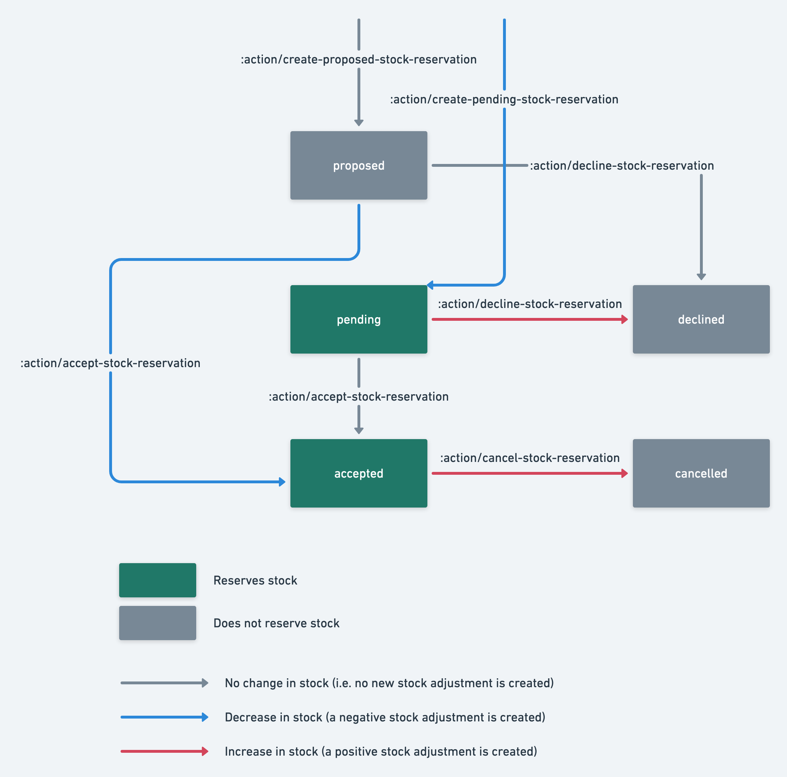

The listing stock management features of Flex allow providers to define
the quantity of available stock for purchase. There are three key
concepts related to stock management:

- **stock** represents the quantity of available units, associated with
  a listing. The units can be anything that makes sense for a given
  listing or marketplace concept, as long as the quantity is integer
  number. For instance - the number of physical items kept in inventory;
  a number of virtual items; number of available batches, when a listing
  is sold in batches rather than as individual items, etc.
- A **stock adjustment** is a record of change in the quantity of stock
  for a listing. A positive adjustment represents an increase in
  available stock, while a negative adjustment represents a decrease.
  For instance, providers add stock by recording a positive stock
  adjustment, while sales that happen through are transaction are
  recorded as negative adjustments. Stock adjustments are immutable.
- A **stock reservation** represents a reservation or purchase of
  particular quantity of stock through a transaction.

Providers and operators can manage stock for listings through the
Marketplace API and the Integration API. Stock adjustments can be
created either
[directly](https://www.sharetribe.com/api-reference/marketplace.html#create-stock-adjustment),
or through a
["compare and set" operation that sets the total available stock](https://www.sharetribe.com/api-reference/marketplace.html#compare-and-set-total-stock)
consistently, given an expected current total stock quantity for a
listing.

All stock reservations are created through transactions, governed by
your [transaction process](/background/transaction-process/). An
appropriately constructed transaction process ensures that reservations
can only be placed for available quantities of stock.

## Stock reservation states

A stock reservation can be in one of several possible states: `pending`,
`proposed`, `accepted`, `cancelled` or `declined`. Just as with
[bookings](/references/availability/#booking-states), stock reservations
change state only through a corresponding transaction transition, using
one of the
[stock reservation actions](/references/transaction-process-actions/#stock-reservations).

All stock reservations in `pending` or `accepted` states count as
reservation against the listing's available stock. On the other hand,
stock reservations in the `proposed`, `cancelled` or `declined` states
do not affect the current available stock.

It is important to note that the stock reservation's effect on stock is
explicitly recorded as individual stock adjustments as the reservation
progresses through its states. For example, if a proposed reservation is
accepted, a new stock adjustment with negative sign (decrease of stock)
is recorded. Similarly, if an `accepted` stock reservation changes state
to `cancelled`, a positive stock adjustment (increase of stock) is
recorded. On the other hand, a new stock adjustment is not recorded when
the change of states does not require one, as is the case for change
from `pending` to `accepted` state. All this ensures that the set of
stock adjustments for a particular listing represents an accurate and
detailed view of how the listing's available stock has changed over
time.

The figure below illustrates the possible stock reservation states,
transitions between the states and the corresponding actions that you
can use in your transaction process.

## Negative stock quantity

Generally, the total available stock of a listing cannot be a negative
number. However, in some rare cases, it is possible that the total stock
becomes negative. This should be considered an error case and is an
indication that at least some
[transaction transition](/background/transaction-process/) failed to
execute properly. Such a transaction transition would include some of
the actions that _release_ some reserved stock (such as
[`:action/decline-stock-reservation`](/references/transaction-process-actions/#actiondecline-stock-reservation)
or
[`:action/cancel-stock-reservation`](/references/transaction-process-actions/#actioncancel-stock-reservation)),
which would typically be present in a transition representing a
cancellation or a refund. As a mitigation, **it is recommended to always
place actions that release a stock reservation last in the sequence of
actions of a transition**.

## Further reading

- Marketplace API reference
  - [stock](https://www.sharetribe.com/api-reference/marketplace.html#stock)
  - [stockAdjustments](https://www.sharetribe.com/api-reference/marketplace.html#stock-adjustments)
  - [stockReservations](https://www.sharetribe.com/api-reference/marketplace.html#stock-reservations)
- Integration API reference
  - [stock](https://www.sharetribe.com/api-reference/integration.html#stock)
  - [stockAdjustments](https://www.sharetribe.com/api-reference/integration.html#stock-adjustments)
  - [stockReservations](https://www.sharetribe.com/api-reference/integration.html#stock-reservations)
- [Transaction process actions for stock reservations](/references/transaction-process-actions/#stock-reservations)
- [Example transaction process definition](https://github.com/sharetribe/flex-example-processes#flex-product-default-process)
  for selling products using stock
- The [FTW product](/ftw-introduction/ftw-product/) is an example
  implementation of stock management.
