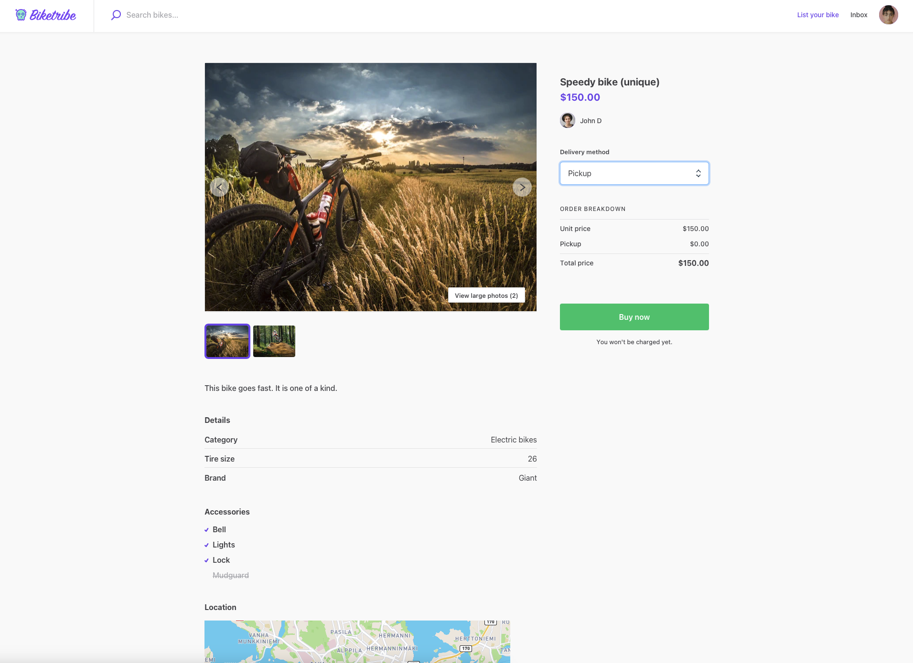
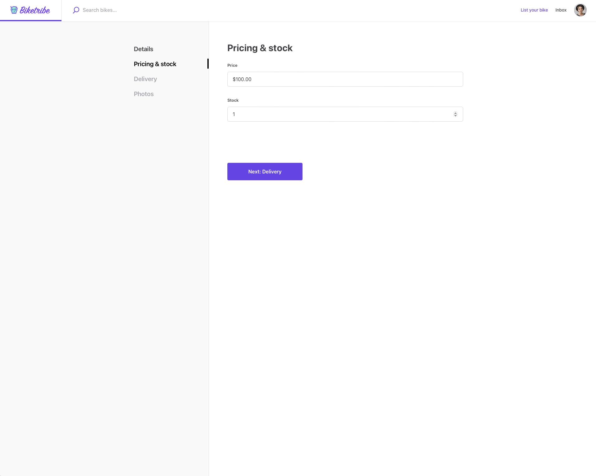
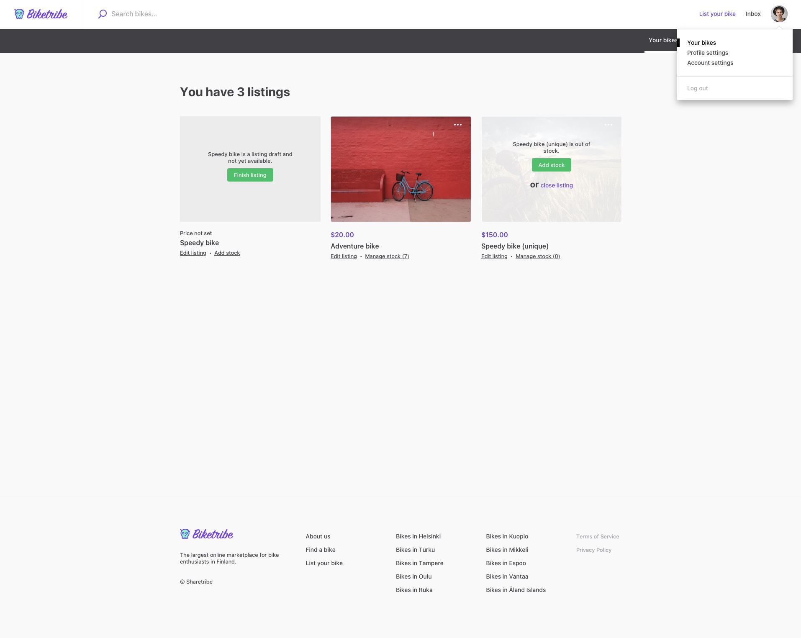
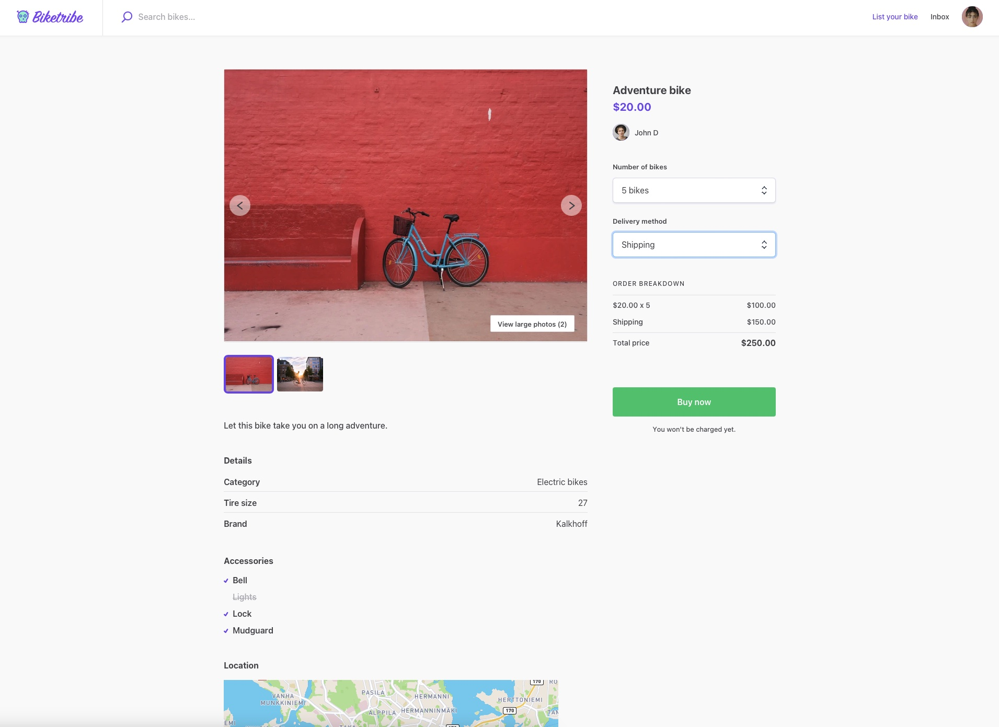

# Default Inventory Management Options

Sharetribe Flex allows sellers to manage their inventory effectively by
enabling specific listing types. When a listing is categorized under the
buying and selling products type, it automatically enables the inventory
management feature, which allows for detailed stock control.

## One item stock

### Buying the listing as a buyer

In cases where there's only one item in stock, a buyer can purchase it
instantly by clicking the "Buy Now" button after selecting the delivery
method. This single item is then added to their shopping cart, and the
buyer can proceed to checkout.

The pricing of a single item stock is determined by the seller and
displayed on the listing page. A shipping fee is added to the price if
specified by the seller. buyers can review the price before deciding to
make a purchase.

With a stock quantity of 1 in a listing, once the item has been
purchased, the listing automatically closes to prevent additional
purchases. This ensures that there are no over-sales.

<extrainfo title="See the buyer view when purchasing an item with 1 stock">

</extrainfo>

### How it works for the seller

For the seller, managing a single item stock is straightforward. When
creating the listing, the seller sets the stock to 1. Once the item is
purchased, the listing is closed and marked out of stock, and the seller
will receive a notification to prepare the item for shipment.

Depending on whether the seller wants to reuse the same listing after
stock has run out, they can go to their profile page from the top right
corner, and click on “Add stock” or “close the listing”.

<extrainfo title="See the seller view when choosing the number of items in stock">

</extrainfo>

<extrainfo title="See the page with options to close the listing or add stock">

</extrainfo>

## Multiple items in stock

### Creation and the editing of a listing with multiple items as a seller

When listing multiple items, sellers have the ability to set and adjust
the stock quantity according to their wishes. This feature gives the
seller control over their inventory, ensuring that only the available
quantity is listed for sale.

When creating or editing a listing, sellers can set the initial quantity
of stock to a number of their choosing. Additionally, sellers can adjust
the stock quantity as needed based on external sales, additional
inventory, or if an item becomes unavailable. Similarly, listings can be
closed, or stock added, after the stock runs out.

<extrainfo title="See the seller view when choosing the number of items in stock">

</extrainfo>

<extrainfo title="See the page with options to close the listing or add stock">

</extrainfo>

### Purchasing a listing as a buyer

Buyers can purchase one or multiple items at once, depending on the
available stock. The drop down menu used for choosing the purchase
quantity is limited to the available stock. If the order quantity
requested still happens to exceed the available stock, for example if
other users buy copies of the listing before the original buyer clicks
the buy button, the buyer will be notified and requested to adjust their
order.

The pricing of multiple items is set by the seller. The total cost for
the buyer will depend on the price per item and the quantity purchased.
Shipping fees are added according to the listing’s shipping price: there
is one price for shipping the first item, and a different price can be
set for shipping each additional item.

Sharetribe Flex automatically adjusts the inventory based on buyer
purchases. When a purchase is made, the quantity purchased is deducted
from the available stock. This feature ensures real-time accuracy of the
inventory, preventing over-sales and helping sellers to manage their
stock efficiently.

<extrainfo title="See the buyer view when purchasing multiple items from a listing with more than 1 stock">

</extrainfo>

## Changing default inventory management options

You may want to change these default functionalities for your
marketplace to work how you need. This is possible with Flex by
extending your marketplace with code. If you are a developer, consult
our developer documentation for more information on
[inventory management](https://www.sharetribe.com/docs/references/stock/)
works under the hood. If you are not a developer, then consider
[hiring a developer](https://www.sharetribe.com/docs/operator-guides/how-to-hire-developer/)
to help you modify how inventory works on your marketplace.
