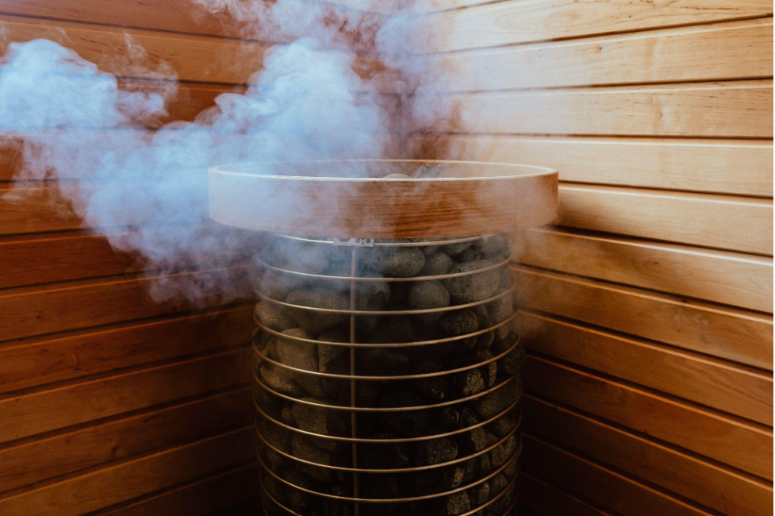

In the listing creation form, the very first time you create a listing,
you, and your users, need to complete each section before being able to
move to the Next section.

## 1. Add Listing details

Add the following details to the listings: **Listing title**: Cozy sauna
in Helsinki **Listing description**: This electric sauna is located in
Helsinki, It is a cozy sauna in the middle of the forest.

 -  **Category**:Electric Sauna 
 - **Amenities**: Select the options “Bathroom” and “Own drinks allowed” 
 - **Sauna Privacy (Optional field, if you added it)**: Public 
 - **Sauna capacity (Optional field, if you added it)**: 5

## 2. Add Location

Add a location to your sauna. Use the following address: “Bulevardi 14,
00120, Helsinki, Finland”. Leave the other field blank.

## 3. Choose pricing

Add a price per day of 50 (dollars)

## 4. Adjust availability

When adjusting availability, you first need to choose your time zone.
Select “Europe/Helsinki” as the default time zone. Check Thursday,
Friday, Saturday, and Sundays as the “Hours of Operations.” After all,
your sauna is mostly booked for weekend events. Click “Save schedule”.

Once you have saved the default schedule, you can add availability
exceptions for extraordinary dates. Let’s do that now. Add an
availability exception to make next Tuesday available. Choose next
Tuesday’s date as the “Starts” and “Ends” dates. Click Save exception.
Let’s say that you are not yet ready to put your Sauna for rent. Add an
availability exception to make this coming weekend unavailable. Choose
“Not available” and add the dates from Thursday to Friday. Click “Save
exception”. You should be able to see that the listing is Available by
default on those dates, but the Exception makes it unavailable.

## 5. Add photos.

Add this image to your listing’s photos:

Once the image uploads, click “Publish listing”

## 6. Connecting your Bank account with Stripe

The first time you create a listing as a user, a pop-up will open to ask
you to provide Payout preferences. If you have been following this
tutorial, this should be now. If you have already added your payment
information directly in the Account settings of your profile, skip this
section.

First, click on “Fill in test details” for the system to provide a test
bank account for you.

If you accidentally click something, you will need to fill out the rest
of the information. Choose Finland as your country and add
“FI2112345600000785” as the Bank account. Click “Save details”.

You will see a message about “Stripe needs more information”. Click on
“Get verified” to visit Stripe to provide your payment information.

In the test environment, you don’t need to provide your real name, date
of birth, or address; however, you have to provide a valid address, and
you should provide a real email and phone number since they will be used
for verification purposes in the future. This shouldn’t be fundamental,
but in the future, if for some reason you want to edit something, and
you didn’t provide real contact information, you might get stuck after
you provide your personal details.

Fill in the details, review it, and “Agree and Submit.” We’re then
returned to the marketplace. Click “Publish listing”

You should be able to find the listing on your search page.
